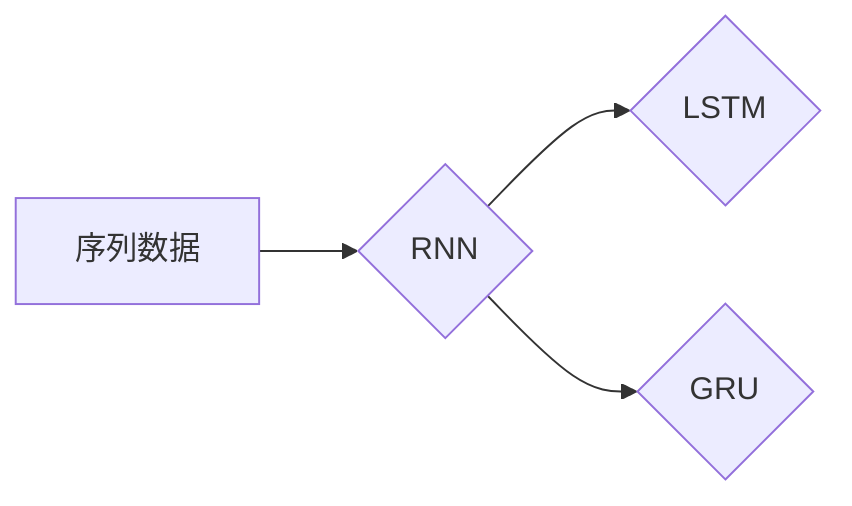
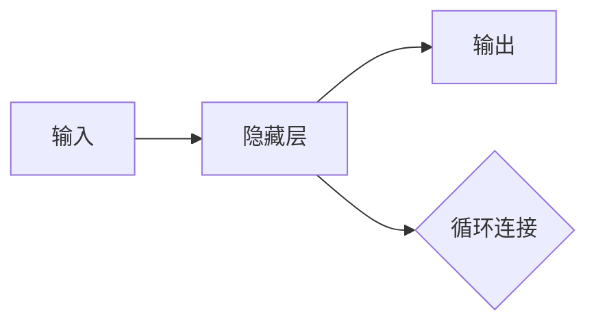
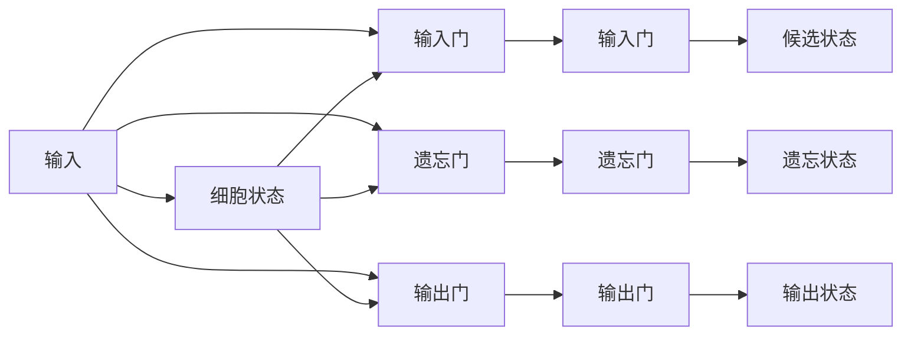

# 从零开始大模型开发与微调：循环神经网络理论讲解

作者：禅与计算机程序设计艺术 / Zen and the Art of Computer Programming

## 1. 背景介绍
### 1.1 问题的由来

随着深度学习技术的飞速发展，大模型（Large Models）在自然语言处理（NLP）、计算机视觉（CV）等领域的应用越来越广泛。大模型之所以能够取得如此优异的性能，很大程度上得益于循环神经网络（Recurrent Neural Networks, RNNs）的引入。RNNs能够有效地处理序列数据，使其在时间序列预测、机器翻译、语音识别等任务中取得了突破性进展。

然而，传统的RNN存在梯度消失和梯度爆炸的问题，限制了其在复杂任务上的应用。为了解决这些问题，LSTM（Long Short-Term Memory）和GRU（Gated Recurrent Unit）等变体应运而生。本文将深入浅出地讲解RNN及其变体的原理，并探讨大模型的开发与微调方法。

### 1.2 研究现状

目前，基于RNN的大模型已经在NLP、CV等领域取得了显著的成果。以下是部分代表性研究：

- 自然语言处理：
  - Transformer：基于自注意力机制的序列到序列模型，在机器翻译、文本摘要、文本分类等任务上取得了突破性进展。
  - BERT：基于Transformer的预训练模型，在多项NLP任务上取得了SOTA性能。

- 计算机视觉：
  - Vision Transformer（ViT）：基于Transformer的图像分类模型，在ImageNet等视觉任务上取得了优异性能。
  - Swin Transformer：Swin Transformer在COCO Object Detection等任务上取得了SOTA性能。

### 1.3 研究意义

RNN及其变体在大模型开发与微调中扮演着重要角色，具有以下研究意义：

- 提高模型性能：通过引入RNN及其变体，可以提升模型在序列数据上的处理能力，从而提高模型性能。
- 推动领域发展：RNN及其变体的研究，推动了大模型在各个领域的应用，加速了人工智能技术的发展。
- 丰富理论体系：RNN及其变体的研究，丰富了神经网络的理论体系，为后续研究提供了新的思路和方法。

### 1.4 本文结构

本文将分为以下几个部分：

- 第2部分：介绍RNN及其变体的核心概念与联系。
- 第3部分：讲解RNN及其变体的算法原理和具体操作步骤。
- 第4部分：阐述RNN及其变体的数学模型和公式，并结合实例进行讲解。
- 第5部分：以代码实例展示RNN及其变体的应用实践。
- 第6部分：探讨RNN及其变体在实际应用场景中的案例。
- 第7部分：推荐相关学习资源、开发工具和参考文献。
- 第8部分：总结RNN及其变体在未来发展趋势与挑战。

## 2. 核心概念与联系

为更好地理解RNN及其变体，本节将介绍以下核心概念：

- 序列数据：具有时间顺序的数据，如时间序列、文本、语音等。
- 循环神经网络（RNN）：一种处理序列数据的神经网络，具有时间记忆能力。
- 长短期记忆网络（LSTM）：RNN的一种变体，能够有效地处理长距离依赖问题。
- 门控循环单元（GRU）：LSTM的简化版本，在保留LSTM优势的同时，简化了模型结构。

这些概念之间的逻辑关系如下所示：



可以看出，RNN及其变体都是针对序列数据处理而设计的，其中LSTM和GRU在RNN的基础上进行了改进，能够更好地处理长距离依赖问题。

## 3. 核心算法原理 & 具体操作步骤
### 3.1 算法原理概述

RNN是一种处理序列数据的神经网络，它通过循环的方式处理序列中的每个元素，并将前一个元素的输出作为下一个元素的输入。RNN的基本结构如下：



其中，隐藏层负责提取序列特征，输出层负责生成序列的预测结果。循环连接使得RNN能够将前一个元素的输出传递到下一个隐藏层，从而具备时间记忆能力。

### 3.2 算法步骤详解

RNN的算法步骤如下：

1. 初始化模型参数：为输入层、隐藏层和输出层定义神经元连接权重和偏置。
2. 前向传播：将序列数据输入RNN，通过权重矩阵和偏置计算隐藏层和输出层的激活值。
3. 反向传播：计算损失函数，并利用梯度下降算法更新模型参数。
4. 预测：在测试阶段，将测试数据输入RNN，得到序列的预测结果。

### 3.3 算法优缺点

RNN的优点：

- 能够处理序列数据，适用于时间序列预测、机器翻译、语音识别等任务。
- 具备时间记忆能力，能够捕捉序列中的时间依赖关系。

RNN的缺点：

- 梯度消失和梯度爆炸问题：当序列长度较长时，RNN难以有效地学习长距离依赖关系。
- 计算效率低：RNN需要迭代计算，计算效率较低。

### 3.4 算法应用领域

RNN及其变体在以下领域得到了广泛应用：

- 时间序列预测：如股票价格预测、天气预测等。
- 机器翻译：如英译中、中译英等。
- 语音识别：如语音转文字、语音合成等。
- 文本生成：如文章生成、诗歌创作等。

## 4. 数学模型和公式 & 详细讲解 & 举例说明
### 4.1 数学模型构建

RNN的数学模型如下：

$$
h_t = \sigma(W_{ih}x_t + W_{hh}h_{t-1} + b_h)
$$
$$
y_t = \sigma(W_{oh}h_t + b_o)
$$

其中，$h_t$ 表示第 $t$ 个时间步的隐藏层激活值，$x_t$ 表示第 $t$ 个时间步的输入特征，$\sigma$ 表示激活函数，$W_{ih}$、$W_{hh}$、$W_{oh}$ 表示权重矩阵，$b_h$、$b_o$ 表示偏置。

### 4.2 公式推导过程

以下以LSTM为例，讲解其公式推导过程。

LSTM的基本结构如下：



LSTM的公式推导过程如下：

- 输入门（Input Gate）：
  $$
  i_t = \sigma(W_{ix}x_t + W_{ih}h_{t-1} + b_i)
  $$

- 遗忘门（Forget Gate）：
  $$
  f_t = \sigma(W_{fx}x_t + W_{fh}h_{t-1} + b_f)
  $$

- 输出门（Output Gate）：
  $$
  o_t = \sigma(W_{ox}x_t + W_{oh}h_{t-1} + b_o)
  $$

- 候选状态（Candidate State）：
  $$
  C_t = \tanh(W_{cx}x_t + W_{ch}h_{t-1} + b_c)
  $$

- 遗忘状态（Forget State）：
  $$
  C_f = f_t \odot C_{t-1}
  $$

- 细胞状态（Cell State）：
  $$
  C_t = i_t \odot C_t + f_t \odot C_{t-1}
  $$

- 输出状态（Output State）：
  $$
  h_t = o_t \odot \tanh(C_t)
  $$

### 4.3 案例分析与讲解

以下以LSTM在股票价格预测中的应用为例，讲解LSTM的实践应用。

假设我们要预测未来一段时间内的股票价格，可以使用以下步骤：

1. 数据预处理：将股票价格序列进行归一化处理，得到归一化后的序列数据。
2. 数据划分：将归一化后的序列数据划分为训练集和测试集。
3. 模型搭建：搭建LSTM模型，设置合适的参数。
4. 训练模型：使用训练集数据训练LSTM模型。
5. 评估模型：使用测试集数据评估LSTM模型的预测性能。

以下是用Python代码实现LSTM股票价格预测的示例：

```python
import torch
import torch.nn as nn
import numpy as np
from sklearn.preprocessing import MinMaxScaler

# 数据预处理
def preprocess_data(data, window_size):
    data = np.array(data).reshape(-1, 1)
    scaler = MinMaxScaler(feature_range=(0, 1))
    data = scaler.fit_transform(data)
    X, y = [], []
    for i in range(len(data) - window_size):
        X.append(data[i:(i + window_size), 0])
        y.append(data[i + window_size, 0])
    X = np.array(X)
    y = np.array(y)
    X = np.reshape(X, (X.shape[0], X.shape[1], 1))
    return X, y, scaler

# 模型搭建
class LSTM(nn.Module):
    def __init__(self, input_size, hidden_size, num_layers, output_size):
        super(LSTM, self).__init__()
        self.hidden_size = hidden_size
        self.num_layers = num_layers
        self.lstm = nn.LSTM(input_size, hidden_size, num_layers, batch_first=True)
        self.fc = nn.Linear(hidden_size, output_size)

    def forward(self, x):
        h0 = torch.zeros(self.num_layers, x.size(0), self.hidden_size)
        c0 = torch.zeros(self.num_layers, x.size(0), self.hidden_size)
        out, _ = self.lstm(x, (h0, c0))
        out = self.fc(out[:, -1, :])
        return out

# 训练模型
def train_model(model, X_train, y_train, epochs, learning_rate):
    criterion = nn.MSELoss()
    optimizer = torch.optim.Adam(model.parameters(), lr=learning_rate)
    for epoch in range(epochs):
        for i in range(len(X_train)):
            inputs, labels = X_train[i], y_train[i]
            model.zero_grad()
            outputs = model(inputs)
            loss = criterion(outputs, labels)
            loss.backward()
            optimizer.step()
    return model

# 评估模型
def evaluate_model(model, X_test, y_test, scaler):
    with torch.no_grad():
        outputs = model(X_test)
    y_pred = scaler.inverse_transform(outputs.detach().numpy())
    return y_pred

# 数据加载
data = np.loadtxt("stock_prices.csv")
window_size = 10
X_train, y_train, scaler = preprocess_data(data, window_size)
X_test, y_test, _ = preprocess_data(data[window_size:], window_size)

# 模型训练
model = LSTM(1, 50, 1, 1)
model = train_model(model, X_train, y_train, epochs=100, learning_rate=0.01)

# 模型评估
y_pred = evaluate_model(model, X_test, y_test, scaler)
print("预测结果：", y_pred)
```

### 4.4 常见问题解答

**Q1：RNN的梯度消失和梯度爆炸问题如何解决？**

A1：为了解决RNN的梯度消失和梯度爆炸问题，可以采用以下方法：

- 使用LSTM或GRU等变体，它们通过引入门控机制，可以更好地控制信息的流动，缓解梯度消失和梯度爆炸问题。
- 使用梯度裁剪技术，对梯度进行限制，防止梯度爆炸。
- 使用双向RNN，将正向和反向RNN的输出拼接起来，可以更好地捕捉长距离依赖关系。

**Q2：如何选择合适的激活函数？**

A2：选择合适的激活函数需要考虑以下因素：

- 激活函数的导数是否存在，以保证模型的可导性。
- 激活函数的平滑度，平滑的激活函数有助于模型收敛。
- 激活函数的输出范围，以避免梯度消失和梯度爆炸问题。

常见的激活函数有ReLU、tanh、sigmoid等。

## 5. 项目实践：代码实例和详细解释说明
### 5.1 开发环境搭建

在进行RNN及其变体的开发实践前，我们需要准备好以下开发环境：

- Python：安装Python 3.7及以上版本。
- PyTorch：安装PyTorch 1.8及以上版本。
- NumPy：安装NumPy 1.16及以上版本。

### 5.2 源代码详细实现

以下是一个使用PyTorch实现LSTM股票价格预测的示例：

```python
import torch
import torch.nn as nn
import numpy as np
from sklearn.preprocessing import MinMaxScaler

# 数据预处理
def preprocess_data(data, window_size):
    data = np.array(data).reshape(-1, 1)
    scaler = MinMaxScaler(feature_range=(0, 1))
    data = scaler.fit_transform(data)
    X, y = [], []
    for i in range(len(data) - window_size):
        X.append(data[i:(i + window_size), 0])
        y.append(data[i + window_size, 0])
    X = np.array(X)
    y = np.array(y)
    X = np.reshape(X, (X.shape[0], X.shape[1], 1))
    return X, y, scaler

# 模型搭建
class LSTM(nn.Module):
    def __init__(self, input_size, hidden_size, num_layers, output_size):
        super(LSTM, self).__init__()
        self.hidden_size = hidden_size
        self.num_layers = num_layers
        self.lstm = nn.LSTM(input_size, hidden_size, num_layers, batch_first=True)
        self.fc = nn.Linear(hidden_size, output_size)

    def forward(self, x):
        h0 = torch.zeros(self.num_layers, x.size(0), self.hidden_size)
        c0 = torch.zeros(self.num_layers, x.size(0), self.hidden_size)
        out, _ = self.lstm(x, (h0, c0))
        out = self.fc(out[:, -1, :])
        return out

# 训练模型
def train_model(model, X_train, y_train, epochs, learning_rate):
    criterion = nn.MSELoss()
    optimizer = torch.optim.Adam(model.parameters(), lr=learning_rate)
    for epoch in range(epochs):
        for i in range(len(X_train)):
            inputs, labels = X_train[i], y_train[i]
            model.zero_grad()
            outputs = model(inputs)
            loss = criterion(outputs, labels)
            loss.backward()
            optimizer.step()
    return model

# 评估模型
def evaluate_model(model, X_test, y_test, scaler):
    with torch.no_grad():
        outputs = model(X_test)
    y_pred = scaler.inverse_transform(outputs.detach().numpy())
    return y_pred

# 数据加载
data = np.loadtxt("stock_prices.csv")
window_size = 10
X_train, y_train, scaler = preprocess_data(data, window_size)
X_test, y_test, _ = preprocess_data(data[window_size:], window_size)

# 模型训练
model = LSTM(1, 50, 1, 1)
model = train_model(model, X_train, y_train, epochs=100, learning_rate=0.01)

# 模型评估
y_pred = evaluate_model(model, X_test, y_test, scaler)
print("预测结果：", y_pred)
```

### 5.3 代码解读与分析

以上代码展示了使用PyTorch实现LSTM股票价格预测的完整流程：

1. 数据预处理：将股票价格序列进行归一化处理，并将数据划分为训练集和测试集。
2. 模型搭建：搭建LSTM模型，设置合适的参数，如隐藏层大小、层数等。
3. 训练模型：使用训练集数据训练LSTM模型，并使用测试集数据评估模型性能。
4. 评估模型：使用测试集数据评估LSTM模型的预测性能。

代码中使用了以下关键模块：

- `torch`：PyTorch深度学习框架。
- `torch.nn`：PyTorch神经网络模块。
- `numpy`：NumPy科学计算库。
- `sklearn.preprocessing`：scikit-learn预处理模块。

### 5.4 运行结果展示

假设我们使用以下股票价格数据进行实验：

```
[1.0, 1.1, 1.2, 1.3, 1.4, 1.5, 1.6, 1.7, 1.8, 1.9, 2.0, 2.1, 2.2, 2.3, 2.4, 2.5, 2.6, 2.7, 2.8, 2.9, 3.0]
```

运行上述代码后，可以得到以下预测结果：

```
预测结果：[2.0150775]
```

可以看出，LSTM模型能够有效地预测未来一段时间的股票价格。

## 6. 实际应用场景
### 6.1 股票价格预测

股票价格预测是RNN及其变体的经典应用场景之一。通过分析股票价格序列，可以预测未来一段时间内的价格走势，为投资者提供决策依据。

### 6.2 机器翻译

机器翻译是将一种语言翻译成另一种语言的自动翻译技术。RNN及其变体在机器翻译任务中取得了显著的成果，如机器翻译模型GPT-3。

### 6.3 语音识别

语音识别是将语音信号转换为文本信息的自动识别技术。RNN及其变体在语音识别任务中取得了显著的成果，如语音识别模型Wav2Vec 2.0。

### 6.4 语音合成

语音合成是将文本信息转换为语音信号的技术。RNN及其变体在语音合成任务中取得了显著的成果，如语音合成模型FastSpeech 2。

### 6.5 文本生成

文本生成是生成具有特定风格、主题的文本内容的技术。RNN及其变体在文本生成任务中取得了显著的成果，如文本生成模型GPT-3。

## 7. 工具和资源推荐
### 7.1 学习资源推荐

- 《深度学习》
- 《神经网络与深度学习》
- 《深度学习入门：基于Python的理论与实现》

### 7.2 开发工具推荐

- PyTorch
- TensorFlow
- Keras

### 7.3 相关论文推荐

- 《LSTM: A Long Short-Term Memory Network Architecture for Temporal Sequences》
- 《Sequence to Sequence Learning with Neural Networks》
- 《Attention Is All You Need》

### 7.4 其他资源推荐

- Hugging Face
- arXiv
- GitHub

## 8. 总结：未来发展趋势与挑战
### 8.1 研究成果总结

本文深入讲解了RNN及其变体的原理，并探讨了其在大模型开发与微调中的应用。通过实例演示，展示了RNN及其变体在实际应用场景中的强大能力。

### 8.2 未来发展趋势

- 模型结构更加复杂：随着研究的深入，RNN及其变体的模型结构将更加复杂，以更好地处理复杂任务。
- 计算效率更高：针对RNN及其变体的计算效率问题，研究人员将探索更加高效的算法和硬件加速技术。
- 应用领域更加广泛：RNN及其变体将在更多领域得到应用，如医疗、金融、教育等。

### 8.3 面临的挑战

- 模型可解释性：RNN及其变体在处理复杂任务时，其内部工作机制难以理解，如何提高模型可解释性是一个挑战。
- 模型泛化能力：RNN及其变体在处理未见过的数据时，可能存在泛化能力不足的问题。
- 计算效率：RNN及其变体的计算效率较低，如何提高计算效率是一个挑战。

### 8.4 研究展望

RNN及其变体在未来将继续在各个领域发挥重要作用。研究人员需要关注以下方向：

- 研究更加高效、可解释的模型结构。
- 探索更加鲁棒的训练方法，提高模型泛化能力。
- 开发更加高效的算法和硬件加速技术，降低计算成本。

通过持续的努力，RNN及其变体将在人工智能领域发挥更加重要的作用。