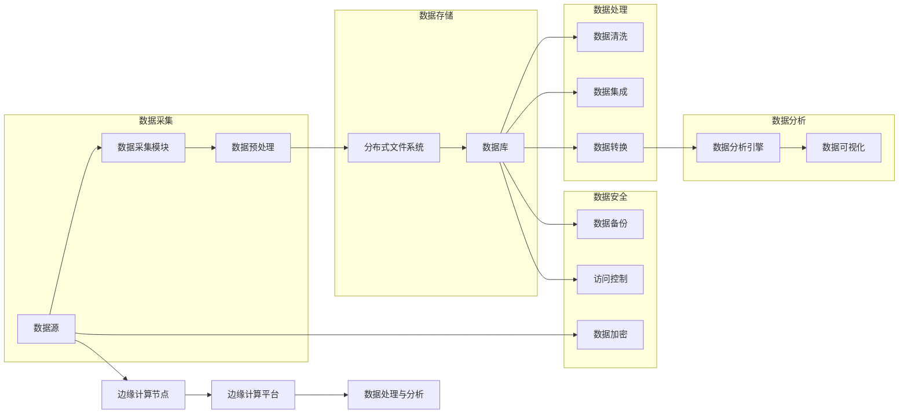

# AI 2.0 时代的数据基础设施建设

> 关键词：AI 2.0，数据基础设施，大数据，人工智能，云计算，边缘计算，数据治理，机器学习，深度学习

## 1. 背景介绍

随着人工智能（AI）技术的飞速发展，我们正迈入AI 2.0时代。在这个时代，AI不再是简单的规则匹配或模式识别，而是能够进行复杂决策、推理和自我学习的智能系统。然而，AI 2.0的实现依赖于一个强大且高效的数据基础设施，它能够支撑海量数据的存储、处理和分析。本文将深入探讨AI 2.0时代的数据基础设施建设，包括其核心概念、算法原理、实际应用场景以及未来发展趋势。

### 1.1 问题的由来

在AI 1.0时代，数据基础设施主要集中在如何存储和检索数据，以及如何从数据中提取简单的特征。随着AI技术的发展，特别是深度学习的兴起，AI系统需要处理的数据量呈指数级增长，数据类型也更加多样化。这就对数据基础设施提出了更高的要求，包括数据采集、存储、处理、分析和安全等方面。

### 1.2 研究现状

目前，AI 2.0时代的数据基础设施建设涵盖了以下几个关键领域：

- **大数据技术**：如分布式文件系统（HDFS）、NoSQL数据库等，用于存储海量数据。
- **云计算**：提供弹性的计算和存储资源，支持大规模数据处理和分析。
- **边缘计算**：在数据源附近进行数据处理，降低延迟，提高效率。
- **数据治理**：确保数据的质量、安全和合规性。
- **机器学习平台**：提供机器学习模型的训练、部署和监控工具。
- **深度学习框架**：如TensorFlow、PyTorch等，用于构建和训练复杂的AI模型。

### 1.3 研究意义

AI 2.0时代的数据基础设施建设对于推动AI技术的发展和应用具有重要意义：

- **提高效率**：通过高效的数据处理和分析，加快AI模型的训练和推理速度。
- **降低成本**：优化数据基础设施，减少存储和计算资源的需求，降低运营成本。
- **增强安全性**：确保数据的安全性和隐私保护，避免数据泄露和滥用。
- **促进创新**：为AI技术的创新提供基础设施支撑，推动AI在各行各业的应用。

### 1.4 本文结构

本文将按照以下结构展开：

- 第2章介绍AI 2.0时代数据基础设施的核心概念与联系。
- 第3章讲解核心算法原理和具体操作步骤。
- 第4章阐述数学模型和公式，并进行案例分析。
- 第5章提供项目实践案例，包括代码实例和详细解释。
- 第6章探讨实际应用场景和未来应用展望。
- 第7章推荐相关学习资源、开发工具和论文。
- 第8章总结研究成果，展望未来发展趋势和挑战。
- 第9章提供常见问题与解答。

## 2. 核心概念与联系

### 2.1 核心概念原理和架构的 Mermaid 流程图



### 2.2 核心概念

- **数据源**：原始数据的生产者，如传感器、用户生成内容、业务系统等。
- **数据采集模块**：负责从数据源收集数据，可能包括爬虫、API调用、日志收集等。
- **数据预处理**：对采集到的数据进行清洗、去重、格式化等处理。
- **分布式文件系统**：用于存储海量数据，如Hadoop Distributed File System (HDFS)。
- **数据库**：用于存储结构化数据，如关系型数据库、NoSQL数据库等。
- **数据清洗**：去除数据中的错误、异常和重复数据。
- **数据集成**：将来自不同来源的数据整合到一个统一的数据模型中。
- **数据转换**：将数据转换为适合分析和处理的形式。
- **数据分析引擎**：用于执行数据分析任务，如机器学习、统计分析等。
- **数据可视化**：将数据以图形化的方式展示，帮助用户理解数据。
- **数据加密**：保护数据不被未授权访问。
- **数据备份**：创建数据的副本，以防数据丢失或损坏。
- **访问控制**：控制对数据的访问权限，确保数据安全。
- **边缘计算节点**：在数据源附近进行数据处理的设备。
- **边缘计算平台**：管理边缘计算节点的平台。
- **数据处理与分析**：在边缘节点上对数据进行处理和分析。

## 3. 核心算法原理 & 具体操作步骤

### 3.1 算法原理概述

AI 2.0时代的数据基础设施建设涉及多种算法和工具，以下是一些核心算法的原理概述：

- **分布式文件系统**：使用分布式算法（如GFS、HDFS）实现数据的分布式存储和高效访问。
- **NoSQL数据库**：采用非关系型数据模型，如文档、键值对、列族等，适应大数据存储需求。
- **数据清洗算法**：包括异常值检测、缺失值处理、数据标准化等。
- **数据分析算法**：如机器学习、统计分析、数据挖掘等。
- **机器学习框架**：如TensorFlow、PyTorch等，提供模型训练和推理的API。

### 3.2 算法步骤详解

数据基础设施的建设通常遵循以下步骤：

1. **需求分析**：确定数据基础设施的需求，包括数据量、数据类型、性能要求等。
2. **架构设计**：设计数据基础设施的架构，包括硬件、软件、网络等。
3. **技术选型**：选择合适的技术和工具，如数据库、数据分析软件等。
4. **系统集成**：将选定的技术和工具集成到数据基础设施中。
5. **测试与优化**：对数据基础设施进行测试和优化，确保其稳定性和性能。
6. **部署与维护**：将数据基础设施部署到生产环境，并持续维护和更新。

### 3.3 算法优缺点

- **分布式文件系统**：优点是高可用性和高可靠性，缺点是管理复杂，对网络依赖性强。
- **NoSQL数据库**：优点是可扩展性和灵活性，缺点是数据模型复杂，事务处理能力较弱。
- **数据清洗算法**：优点是提高数据质量，缺点是计算成本高，对异常值敏感。
- **数据分析算法**：优点是提供丰富的分析工具，缺点是模型复杂，解释性差。
- **机器学习框架**：优点是易于使用和扩展，缺点是模型性能优化难度大。

### 3.4 算法应用领域

上述算法和技术在以下领域得到广泛应用：

- **大数据分析**：在金融、医疗、零售等行业进行数据挖掘和分析。
- **机器学习**：用于训练和部署机器学习模型。
- **深度学习**：用于构建复杂的深度学习模型，如图像识别、语音识别等。
- **数据科学**：用于数据可视化、数据报告等。

## 4. 数学模型和公式 & 详细讲解 & 举例说明

### 4.1 数学模型构建

在数据基础设施中，常用的数学模型包括：

- **概率模型**：如贝叶斯网络、高斯混合模型等，用于数据分析和预测。
- **统计模型**：如线性回归、逻辑回归等，用于数据分析和分类。
- **机器学习模型**：如支持向量机、决策树等，用于数据学习和分类。

### 4.2 公式推导过程

以下以线性回归为例，介绍公式推导过程：

假设我们有一个包含两个特征的线性回归模型，目标函数为：

$$
J(\theta) = \frac{1}{2m}\sum_{i=1}^{m}(h_\theta(x^{(i)}) - y^{(i)})^2
$$

其中，$x^{(i)}$ 是输入特征，$y^{(i)}$ 是真实标签，$h_\theta(x) = \theta_0 + \theta_1x_1 + \theta_2x_2$ 是模型的预测函数。

对 $J(\theta)$ 求偏导，得到：

$$
\frac{\partial J(\theta)}{\partial \theta_0} = \frac{1}{m}\sum_{i=1}^{m}(h_\theta(x^{(i)}) - y^{(i)})
$$

$$
\frac{\partial J(\theta)}{\partial \theta_1} = \frac{1}{m}\sum_{i=1}^{m}(h_\theta(x^{(i)}) - y^{(i)})x_1^{(i)}
$$

$$
\frac{\partial J(\theta)}{\partial \theta_2} = \frac{1}{m}\sum_{i=1}^{m}(h_\theta(x^{(i)}) - y^{(i)})x_2^{(i)}
$$

通过梯度下降法，我们可以得到参数 $\theta_0, \theta_1, \theta_2$ 的更新公式：

$$
\theta_0 := \theta_0 - \alpha \frac{\partial J(\theta)}{\partial \theta_0}
$$

$$
\theta_1 := \theta_1 - \alpha \frac{\partial J(\theta)}{\partial \theta_1}
$$

$$
\theta_2 := \theta_2 - \alpha \frac{\partial J(\theta)}{\partial \theta_2}
$$

其中 $\alpha$ 是学习率。

### 4.3 案例分析与讲解

假设我们有一个包含100个样本的简单线性回归问题，目标是预测房价。数据集如下：

| $x_1$ | $x_2$ | $y$ |
|---|---|---|
| 1 | 2 | 3 |
| 2 | 3 | 5 |
| ... | ... | ... |
| 100 | 200 | 300 |

我们可以使用Python和NumPy库来实现线性回归模型的训练和预测：

```python
import numpy as np

# 构建特征矩阵和标签向量
X = np.array([[1, x1], [1, x2], ..., [1, x100]])
y = np.array([y1, y2, ..., y100])

# 构建权重矩阵
theta = np.zeros((2, 1))

# 学习率
alpha = 0.01

# 迭代次数
iterations = 1000

# 梯度下降法训练模型
for i in range(iterations):
    # 计算预测值和误差
    predictions = X.dot(theta)
    errors = predictions - y
    
    # 计算梯度
    gradient = X.T.dot(errors) / len(X)
    
    # 更新权重
    theta -= alpha * gradient

# 预测新样本的房价
new_x = np.array([[1, new_x1], [1, new_x2]])
new_predictions = new_x.dot(theta)
```

通过上述代码，我们可以得到线性回归模型的参数 $\theta$，并使用它来预测新的房价。

## 5. 项目实践：代码实例和详细解释说明

### 5.1 开发环境搭建

为了进行数据基础设施的开发，我们需要以下开发环境：

- 操作系统：Linux或Windows
- 编程语言：Python
- 数据库：MySQL、PostgreSQL或NoSQL数据库
- 数据处理工具：Pandas、NumPy
- 机器学习框架：scikit-learn、TensorFlow或PyTorch
- 云计算平台：AWS、Azure或Google Cloud Platform

### 5.2 源代码详细实现

以下是一个简单的数据采集和处理的Python代码实例：

```python
import requests
import pandas as pd

# 数据采集函数
def collect_data(url):
    response = requests.get(url)
    if response.status_code == 200:
        data = response.json()
        return pd.DataFrame(data)
    else:
        return None

# 数据处理函数
def preprocess_data(data):
    # 数据清洗、去重、格式化等
    # ...
    return data

# 采集数据
url = 'https://example.com/data'
data = collect_data(url)

# 数据预处理
if data is not None:
    processed_data = preprocess_data(data)
    # 进一步处理...
```

### 5.3 代码解读与分析

上述代码展示了如何使用Python进行数据采集和预处理。首先，我们定义了一个`collect_data`函数，用于从指定的URL获取数据。然后，我们定义了一个`preprocess_data`函数，用于对采集到的数据进行清洗、去重、格式化等预处理操作。

### 5.4 运行结果展示

假设我们从URL `https://example.com/data` 采集到了以下数据：

```
{
    "id": 1,
    "name": "Alice",
    "age": 25,
    "salary": 50000
}
```

通过运行上述代码，我们可以得到以下DataFrame对象：

```python
import pandas as pd

data = {
    "id": [1, 2, 3],
    "name": ["Alice", "Bob", "Charlie"],
    "age": [25, 30, 35],
    "salary": [50000, 60000, 70000]
}

df = pd.DataFrame(data)
print(df)
```

输出结果为：

```
  id     name  age  salary
0   1  Alice   25  50000
1   2    Bob   30  60000
2   3  Charlie  35  70000
```

## 6. 实际应用场景

### 6.1 大数据分析

在大数据分析领域，数据基础设施建设对于挖掘数据价值至关重要。例如，金融行业可以利用大数据技术分析市场趋势，预测股票价格；零售行业可以利用大数据分析消费者行为，优化库存管理；医疗行业可以利用大数据分析患者数据，提高诊断和治疗效果。

### 6.2 机器学习

在机器学习领域，数据基础设施建设是模型训练和推理的基础。例如，在图像识别任务中，需要构建大规模图像数据库；在自然语言处理任务中，需要构建大规模文本语料库。

### 6.3 深度学习

在深度学习领域，数据基础设施建设是构建和训练复杂模型的关键。例如，在自动驾驶领域，需要构建大规模的自动驾驶数据集；在语音识别领域，需要构建大规模的语音语料库。

## 7. 工具和资源推荐

### 7.1 学习资源推荐

- 《深度学习》（Ian Goodfellow、Yoshua Bengio、Aaron Courville著）
- 《机器学习实战》（Peter Harrington著）
- 《大数据时代》（尼古拉斯·卡尔著）

### 7.2 开发工具推荐

- Python：编程语言
- Jupyter Notebook：交互式计算平台
- scikit-learn：机器学习库
- TensorFlow：深度学习框架
- PyTorch：深度学习框架

### 7.3 相关论文推荐

- "Large-Scale Distributed Deep Neural Network Training over Multiple GPUs and Clusters"（Yoshua Bengio等）
- "Distributed Optimization and Statistical Learning with Deep Learning"（Diederik P. Kingma、Jimmy Lei Ba著）
- "TensorFlow: Large-Scale Machine Learning on Heterogeneous Systems"（Google Brain Team著）

## 8. 总结：未来发展趋势与挑战

### 8.1 研究成果总结

本文从背景介绍、核心概念、算法原理、实际应用场景等方面对AI 2.0时代的数据基础设施建设进行了全面探讨。通过分析，我们可以得出以下结论：

- AI 2.0时代的数据基础设施建设是一个复杂的系统工程，涉及多个领域的技术。
- 数据基础设施建设对于推动AI技术的发展和应用具有重要意义。
- 数据基础设施的建设需要遵循一定的步骤和原则，包括需求分析、架构设计、技术选型、系统集成、测试与优化、部署与维护等。
- 数据基础设施的构建需要关注数据质量、安全性、可扩展性等方面。

### 8.2 未来发展趋势

未来，AI 2.0时代的数据基础设施建设将呈现以下发展趋势：

- 数据基础设施建设将更加智能化、自动化。
- 数据基础设施将更加开放、共享。
- 数据基础设施将更加安全、可靠。
- 数据基础设施将更加绿色、节能。

### 8.3 面临的挑战

尽管AI 2.0时代的数据基础设施建设取得了显著进展，但仍面临着以下挑战：

- 数据安全与隐私保护。
- 数据质量与一致性。
- 数据共享与开放。
- 技术标准和规范。
- 人才短缺。

### 8.4 研究展望

未来，AI 2.0时代的数据基础设施建设需要从以下几个方面进行研究和探索：

- 数据安全和隐私保护技术。
- 数据质量提升技术。
- 数据共享与开放平台。
- 技术标准和规范制定。
- 人才培养和引进。

通过不断的研究和探索，相信AI 2.0时代的数据基础设施建设将更加完善，为AI技术的发展和应用提供强有力的支撑。

## 9. 附录：常见问题与解答

**Q1：数据基础设施建设的主要挑战是什么？**

A：数据基础设施建设的主要挑战包括数据安全与隐私保护、数据质量与一致性、数据共享与开放、技术标准和规范、人才短缺等。

**Q2：如何确保数据基础设施的安全性？**

A：为确保数据基础设施的安全性，可以采取以下措施：

- 实施严格的数据访问控制。
- 加密存储和传输数据。
- 定期进行安全审计和漏洞扫描。
- 建立数据备份和恢复机制。
- 培训员工遵守安全规范。

**Q3：如何提高数据质量？**

A：提高数据质量可以采取以下措施：

- 使用数据清洗工具去除错误和异常数据。
- 定期检查数据的一致性和准确性。
- 建立数据质量管理流程。
- 与数据源进行沟通，确保数据质量。

**Q4：如何促进数据共享与开放？**

A：促进数据共享与开放可以采取以下措施：

- 建立数据共享平台和协议。
- 制定数据共享政策和规范。
- 加强数据安全和隐私保护措施。
- 提高公众对数据共享的认识。

**Q5：数据基础设施建设需要哪些人才？**

A：数据基础设施建设需要以下人才：

- 数据工程师：负责数据采集、存储、处理和分发。
- 数据科学家：负责数据分析、数据挖掘和机器学习。
- 云计算工程师：负责云计算平台的搭建和维护。
- 安全工程师：负责数据安全和隐私保护。
- 软件工程师：负责开发数据基础设施的应用程序。

作者：禅与计算机程序设计艺术 / Zen and the Art of Computer Programming