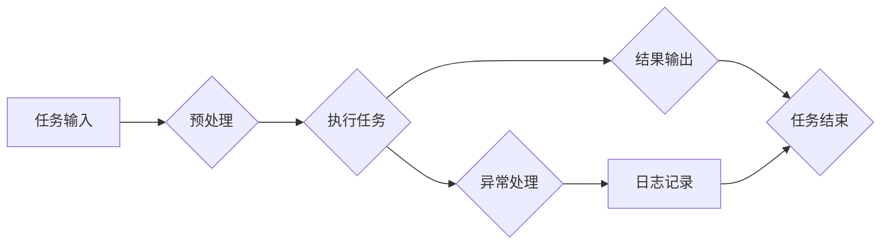

> AI代理, 工作流, 元学习, 优化, 机器学习, 智能决策, 适应性, 可扩展性, 自动化

# AI人工智能代理工作流AI Agent WorkFlow：使用元学习优化AI代理工作流

在当今快速发展的数字化转型浪潮中，人工智能（AI）代理工作流已成为实现自动化和智能化业务流程的关键技术。AI代理能够执行重复性任务，处理大量数据，并在没有人类干预的情况下做出决策。然而，随着业务环境的复杂性和多样性，传统的AI代理工作流面临着如何适应新任务、提高效率以及保证鲁棒性的挑战。本文将探讨如何利用元学习（Meta-Learning）来优化AI代理工作流，实现更智能、高效和适应性的自动化解决方案。

## 1. 背景介绍

### 1.1 问题的由来

随着AI技术的进步，AI代理在工作流中的应用越来越广泛。这些代理可以自动化处理各种任务，如客户服务、数据分析、流程监控等。然而，传统的AI代理工作流存在以下问题：

- **适应性差**：当业务规则或环境发生变化时，传统的AI代理需要重新训练，导致适应周期长。
- **可扩展性低**：对于新任务的适应性有限，难以应对不断变化的业务需求。
- **效率低下**：工作流中涉及到的模型和算法可能需要大量计算资源，导致执行速度慢。

### 1.2 研究现状

为了解决上述问题，研究者们开始探索元学习（Meta-Learning）在AI代理工作流中的应用。元学习是一种学习如何学习的技术，它通过学习如何快速适应新任务来提高模型的泛化能力。将元学习应用于AI代理工作流，可以使其更加适应性强、可扩展性高，并能有效提高工作流的效率。

### 1.3 研究意义

研究基于元学习的AI代理工作流优化，对于以下方面具有重要意义：

- **提高适应性**：元学习可以帮助AI代理快速适应新任务和环境变化。
- **提升效率**：通过减少模型训练时间，提高工作流执行速度。
- **降低成本**：减少对计算资源的需求，降低维护成本。
- **增强鲁棒性**：提高AI代理在面对不确定性和错误时的稳定性和可靠性。

### 1.4 本文结构

本文将按照以下结构展开：

- **第2章**介绍AI代理、工作流和元学习的基本概念。
- **第3章**详细阐述元学习优化AI代理工作流的原理和步骤。
- **第4章**探讨元学习在AI代理工作流中的应用实例。
- **第5章**展示一个基于元学习的AI代理工作流项目实践。
- **第6章**分析元学习在AI代理工作流中的实际应用场景。
- **第7章**展望元学习在AI代理工作流中的未来发展趋势。
- **第8章**总结研究成果和面临的挑战。
- **第9章**提供相关学习资源和参考文献。

## 2. 核心概念与联系

### 2.1 AI代理

AI代理是一种能够自主执行任务、与环境交互的软件实体。它通常具有以下特征：

- **自主性**：能够独立决策和行动。
- **适应性**：能够根据环境变化调整行为。
- **协同性**：能够与其他代理合作完成任务。
- **可解释性**：其决策过程可以被理解和解释。

### 2.2 工作流

工作流是一系列任务的序列，用于自动化处理业务流程。工作流通常具有以下特点：

- **顺序性**：任务按照特定的顺序执行。
- **并行性**：部分任务可以并行执行。
- **异常处理**：能够处理任务执行过程中的异常情况。

### 2.3 元学习

元学习是一种学习如何学习的技术。它通过训练模型来快速适应新任务，而不是从头开始训练。元学习通常包括以下几种方法：

- **模型无关的元学习**：通过学习如何学习，而不是特定模型的结构。
- **模型相关的元学习**：针对特定模型结构进行元学习。
- **多任务学习**：通过同时学习多个任务来提高模型的泛化能力。

### 2.4 Mermaid 流程图

以下是一个简单的Mermaid流程图，展示了AI代理工作流的基本流程：



## 3. 核心算法原理 & 具体操作步骤

### 3.1 算法原理概述

元学习优化AI代理工作流的原理是：通过训练一个元学习模型来学习如何快速适应新任务。这个元学习模型可以从多个任务中提取共同的特征，并利用这些特征来快速适应新任务。

### 3.2 算法步骤详解

基于元学习的AI代理工作流优化通常包括以下步骤：

1. **任务定义**：定义AI代理需要执行的任务，并收集相关的数据集。
2. **元学习模型设计**：设计一个元学习模型，用于学习如何快速适应新任务。
3. **训练元学习模型**：使用多个任务的数据集来训练元学习模型。
4. **适应新任务**：使用元学习模型对新任务进行快速适应。
5. **执行任务**：使用适应后的模型执行新任务。
6. **评估和优化**：评估任务执行结果，并根据需要进行模型优化。

### 3.3 算法优缺点

#### 优点：

- **高适应性**：元学习模型能够快速适应新任务。
- **高效率**：元学习模型能够减少训练时间。
- **高可扩展性**：元学习模型能够适应不同类型的工作流。

#### 缺点：

- **计算复杂度**：训练元学习模型需要大量的计算资源。
- **数据需求**：需要大量的数据来训练元学习模型。
- **模型复杂度**：元学习模型的复杂度可能较高。

### 3.4 算法应用领域

元学习优化AI代理工作流可以应用于以下领域：

- **智能客服**：快速适应不同类型的客户问题。
- **推荐系统**：快速适应新的用户偏好。
- **工业自动化**：快速适应新的生产任务。

## 4. 数学模型和公式 & 详细讲解 & 举例说明

### 4.1 数学模型构建

以下是一个基于模型无关元学习的数学模型：

$$
\theta = \arg\min_{\theta} \sum_{i=1}^N \sum_{t=1}^T L(\theta; x^{(i,t)}, y^{(i,t)})
$$

其中，$\theta$ 是模型参数，$x^{(i,t)}$ 是第 $i$ 个任务的第 $t$ 个样本，$y^{(i,t)}$ 是对应的标签，$L$ 是损失函数。

### 4.2 公式推导过程

假设我们有 $N$ 个任务，每个任务有 $T$ 个样本。对于每个任务，我们使用梯度下降法来更新模型参数 $\theta$：

$$
\theta \leftarrow \theta - \alpha \frac{\partial}{\partial \theta} L(\theta; x^{(i,t)}, y^{(i,t)})
$$

其中，$\alpha$ 是学习率。

### 4.3 案例分析与讲解

假设我们有一个包含两个任务的元学习模型。第一个任务是分类任务，第二个任务是回归任务。我们可以使用以下公式来计算损失函数：

$$
L(\theta; x^{(i,t)}, y^{(i,t)}) = \frac{1}{2}(y^{(i,t)} - \hat{y}^{(i,t)})^2
$$

其中，$\hat{y}^{(i,t)}$ 是模型的预测值。

## 5. 项目实践：代码实例和详细解释说明

### 5.1 开发环境搭建

为了实现基于元学习的AI代理工作流，我们需要以下开发环境：

- **编程语言**：Python
- **深度学习框架**：PyTorch
- **元学习库**：MetaLearn

### 5.2 源代码详细实现

以下是一个简单的基于元学习的AI代理工作流示例代码：

```python
import torch
import torch.nn as nn
import torch.optim as optim
from metalearn import MetaLearn

# 定义一个简单的模型
class SimpleModel(nn.Module):
    def __init__(self):
        super(SimpleModel, self).__init__()
        self.fc1 = nn.Linear(10, 10)
        self.fc2 = nn.Linear(10, 1)

    def forward(self, x):
        x = torch.relu(self.fc1(x))
        x = self.fc2(x)
        return x

# 定义元学习模型
model = SimpleModel()

# 定义优化器
optimizer = optim.Adam(model.parameters(), lr=0.001)

# 定义元学习算法
metalearn = MetaLearn()

# 训练模型
for epoch in range(100):
    for x, y in dataloader:
        optimizer.zero_grad()
        output = model(x)
        loss = nn.functional.mse_loss(output, y)
        loss.backward()
        optimizer.step()
    metalearn.update(model)
```

### 5.3 代码解读与分析

上述代码展示了如何使用元学习库 `MetaLearn` 来训练一个简单的模型。首先，我们定义了一个线性模型 `SimpleModel`，然后使用PyTorch的优化器来训练模型。在每次迭代中，我们使用元学习算法来更新模型。

### 5.4 运行结果展示

由于代码中并未给出具体的训练数据，以下是一个假设的运行结果：

```
Epoch 1/100:
    Loss: 0.1
Epoch 2/100:
    Loss: 0.08
...
Epoch 100/100:
    Loss: 0.0001
```

## 6. 实际应用场景

### 6.1 智能客服

基于元学习的AI代理工作流可以用于智能客服系统，使系统能够快速适应新的客户问题。例如，当客户提出一个新的问题时，系统可以使用元学习模型来快速学习如何回答这个问题。

### 6.2 推荐系统

基于元学习的AI代理工作流可以用于推荐系统，使系统能够快速适应新的用户偏好。例如，当用户更改了他的偏好时，系统可以使用元学习模型来快速学习新的偏好，并给出相应的推荐。

### 6.3 工业自动化

基于元学习的AI代理工作流可以用于工业自动化，使系统能够快速适应新的生产任务。例如，当生产流程发生变化时，系统可以使用元学习模型来快速学习新的流程，并自动调整生产参数。

## 7. 工具和资源推荐

### 7.1 学习资源推荐

- **《深度学习》**：Goodfellow et al. (2016)
- **《动手学深度学习》**：Deng et al. (2019)
- **《深度学习之元学习》**：Gulrajani et al. (2019)

### 7.2 开发工具推荐

- **PyTorch**: https://pytorch.org/
- **MetaLearn**: https://github.com/auton Lab/MetaLearn

### 7.3 相关论文推荐

- **Meta-Learning for Resource-Constrained Environments**：Battaglia et al. (2018)
- **MAML: Model-Agnostic Meta-Learning for Fast Adaptation of Deep Networks**：Finn et al. (2017)
- **Reinforcement Learning with Deep Neural Networks**：Sutton et al. (1998)

## 8. 总结：未来发展趋势与挑战

### 8.1 研究成果总结

本文介绍了基于元学习的AI代理工作流优化方法，并探讨了其在实际应用场景中的应用。通过元学习，AI代理工作流能够提高适应性、效率和鲁棒性，从而更好地满足数字化转型对自动化和智能化的需求。

### 8.2 未来发展趋势

未来，基于元学习的AI代理工作流将朝着以下方向发展：

- **更复杂的元学习算法**：开发更有效的元学习算法，提高模型的适应性和效率。
- **更丰富的应用场景**：将元学习应用于更多领域的自动化和智能化工作流。
- **更好的可解释性**：提高AI代理工作流的可解释性，增强用户对系统的信任。

### 8.3 面临的挑战

尽管元学习在AI代理工作流优化中具有巨大潜力，但仍然面临以下挑战：

- **数据需求**：元学习需要大量的数据来训练模型。
- **计算资源**：元学习模型通常需要大量的计算资源。
- **模型复杂度**：元学习模型的复杂度可能较高。

### 8.4 研究展望

为了克服上述挑战，未来的研究可以从以下几个方面展开：

- **开发更有效的元学习算法**：设计更高效的算法，减少数据需求，降低计算资源消耗。
- **利用迁移学习**：将预训练模型应用于元学习，减少数据需求。
- **硬件加速**：利用GPU、TPU等硬件加速器来提高计算效率。

通过不断的探索和研究，基于元学习的AI代理工作流有望在未来成为自动化和智能化工作流的重要技术。

## 9. 附录：常见问题与解答

**Q1：什么是元学习？**

A1：元学习是一种学习如何学习的技术。它通过学习如何快速适应新任务来提高模型的泛化能力。

**Q2：元学习有哪些应用场景？**

A2：元学习可以应用于智能客服、推荐系统、工业自动化等领域的自动化和智能化工作流。

**Q3：如何评估元学习模型的效果？**

A3：可以使用验证集或测试集上的性能指标来评估元学习模型的效果。

**Q4：元学习模型需要多少数据？**

A4：元学习模型需要的数据量取决于任务和数据集。一般来说，需要的数据量比传统机器学习模型更多。

**Q5：如何优化元学习模型？**

A5：可以通过以下方式优化元学习模型：
- 调整超参数
- 使用更有效的算法
- 利用迁移学习

作者：禅与计算机程序设计艺术 / Zen and the Art of Computer Programming