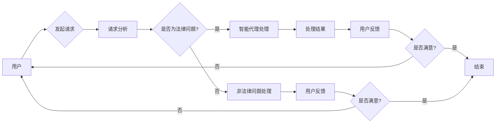

> AI代理, 工作流, 法律服务, 人工智能, 智能代理工作流, 机器学习, 自然语言处理, 法律文档分析, 智能决策支持

# AI人工智能代理工作流AI Agent WorkFlow：智能代理在法律服务系统中的应用

## 1. 背景介绍

随着人工智能技术的飞速发展，AI代理（Artificial Intelligence Agent）已经成为智能化解决方案的重要组成部分。AI代理是一种能够自主执行任务、与环境交互的软件实体，它能够模拟人类智能行为，提高工作效率和准确性。在法律服务领域，AI代理的应用正在逐渐改变传统的法律服务模式，提供更加高效、精准的服务。本文将探讨AI代理工作流（AI Agent WorkFlow）在法律服务系统中的应用，以及其带来的变革。

### 1.1 问题的由来

法律服务行业面临着诸多挑战，如案件数量激增、法律专业人才短缺、法律文档处理繁琐等。传统的法律服务模式往往依赖于律师和法务人员的专业知识和经验，效率低下且成本高昂。AI代理的出现，为法律服务行业带来了新的机遇。

### 1.2 研究现状

目前，AI代理在法律服务中的应用主要集中在以下方面：

- 法律文档自动化处理
- 案件风险评估
- 智能咨询和问答
- 合同审查和自动生成
- 诉讼案件管理

### 1.3 研究意义

AI代理工作流在法律服务系统中的应用，具有以下重要意义：

- 提高工作效率，降低人力成本
- 提升服务质量和准确性
- 实现法律服务流程的自动化
- 增强法律服务的可及性

### 1.4 本文结构

本文将按照以下结构进行阐述：

- 第2章介绍AI代理工作流的核心概念与联系。
- 第3章详细讲解AI代理工作流的核心算法原理和具体操作步骤。
- 第4章分析AI代理工作流的数学模型和公式。
- 第5章通过项目实践展示AI代理工作流的代码实例。
- 第6章探讨AI代理工作流在实际法律服务系统中的应用场景。
- 第7章推荐AI代理工作流相关的学习资源、开发工具和参考文献。
- 第8章总结AI代理工作流的未来发展趋势与挑战。
- 第9章提供AI代理工作流的常见问题与解答。

## 2. 核心概念与联系

### 2.1 核心概念

- **AI代理**：一种能够自主执行任务、与环境交互的软件实体。
- **工作流**：一组有序的、定义明确的任务序列，用于完成特定业务目标。
- **智能代理工作流**：利用AI技术实现的自动化工作流，能够模拟人类智能行为。
- **法律服务系统**：提供法律咨询、案件管理、文档处理等服务的系统。

### 2.2 架构的 Mermaid 流程图



## 3. 核心算法原理 & 具体操作步骤

### 3.1 算法原理概述

AI代理工作流的核心算法主要包括：

- **自然语言处理（NLP）**：用于理解用户请求和解析法律文档。
- **机器学习（ML）**：用于训练模型进行智能决策和预测。
- **知识图谱**：用于存储和查询法律知识和规则。

### 3.2 算法步骤详解

1. **请求分析**：分析用户请求，识别关键词和意图。
2. **智能代理处理**：根据用户请求，利用NLP技术解析法律文档，使用机器学习模型进行决策和预测。
3. **处理结果**：根据智能代理的处理结果，生成法律意见或解决方案。
4. **用户反馈**：收集用户对处理结果的反馈，用于模型优化和知识库更新。
5. **非法律问题处理**：对于非法律问题，进行相应的处理并反馈给用户。

### 3.3 算法优缺点

**优点**：

- 自动化程度高，提高工作效率。
- 准确性高，减少人为错误。
- 可扩展性强，易于集成新的功能和知识。

**缺点**：

- 模型训练成本高，需要大量标注数据。
- 模型可解释性差，难以理解其决策过程。
- 需要持续更新和维护。

### 3.4 算法应用领域

AI代理工作流在以下领域具有广泛的应用前景：

- 法律咨询
- 合同审查
- 诉讼案件管理
- 法律研究
- 法律法规查询

## 4. 数学模型和公式 & 详细讲解 & 举例说明

### 4.1 数学模型构建

AI代理工作流中的数学模型主要包括：

- **NLP模型**：如循环神经网络（RNN）、卷积神经网络（CNN）、Transformer等。
- **机器学习模型**：如支持向量机（SVM）、决策树、随机森林、神经网络等。

### 4.2 公式推导过程

以RNN模型为例，其公式推导过程如下：

$$
h_t = f(W_{ih}x_t + W_{hh}h_{t-1} + b_h)
$$

其中，$h_t$ 为隐藏状态，$x_t$ 为输入序列，$W_{ih}, W_{hh}, b_h$ 为模型参数。

### 4.3 案例分析与讲解

以下是一个使用RNN模型进行文本分类的案例：

1. **数据准备**：收集法律文档数据，并标注其类别。
2. **模型构建**：使用RNN模型对文本进行分类。
3. **模型训练**：使用标注数据进行模型训练。
4. **模型评估**：使用测试数据评估模型性能。

## 5. 项目实践：代码实例和详细解释说明

### 5.1 开发环境搭建

1. 安装Python环境。
2. 安装TensorFlow或PyTorch等深度学习框架。
3. 安装必要的依赖库，如NLP处理库（如NLTK、spaCy）和机器学习库（如scikit-learn）。

### 5.2 源代码详细实现

以下是一个使用TensorFlow实现文本分类的示例代码：

```python
import tensorflow as tf
from tensorflow.keras.preprocessing.text import Tokenizer
from tensorflow.keras.preprocessing.sequence import pad_sequences
from tensorflow.keras.models import Sequential
from tensorflow.keras.layers import Embedding, LSTM, Dense

# 数据准备
texts = ['This is a legal document.', 'That is not a legal document.']
labels = [1, 0]

# 分词和序列化
tokenizer = Tokenizer(num_words=1000)
tokenizer.fit_on_texts(texts)
sequences = tokenizer.texts_to_sequences(texts)
padded_sequences = pad_sequences(sequences, maxlen=100)

# 模型构建
model = Sequential()
model.add(Embedding(input_dim=1000, output_dim=64, input_length=100))
model.add(LSTM(64))
model.add(Dense(1, activation='sigmoid'))

# 模型编译
model.compile(optimizer='adam', loss='binary_crossentropy', metrics=['accuracy'])

# 模型训练
model.fit(padded_sequences, labels, epochs=10)

# 模型评估
test_sequences = tokenizer.texts_to_sequences(['This is a legal document.'])
test_padded_sequences = pad_sequences(test_sequences, maxlen=100)
print(model.predict(test_padded_sequences))
```

### 5.3 代码解读与分析

以上代码展示了使用TensorFlow构建和训练一个简单的文本分类模型。首先，我们使用`Tokenizer`对文本进行分词和序列化。然后，使用`Embedding`层将文本序列转换为向量表示。接着，使用`LSTM`层提取文本特征。最后，使用`Dense`层进行分类预测。

### 5.4 运行结果展示

运行上述代码，模型将输出预测结果。如果文本内容包含法律相关词汇，则预测结果为1，否则为0。

## 6. 实际应用场景

### 6.1 法律咨询

AI代理可以自动回答常见的法律问题，如合同纠纷、劳动争议、知识产权等。用户可以通过自然语言与AI代理进行交互，获取专业的法律意见。

### 6.2 合同审查

AI代理可以自动审查合同，识别潜在的法律风险，并提出修改建议。这有助于提高合同审查的效率和准确性。

### 6.3 诉讼案件管理

AI代理可以协助律师管理诉讼案件，包括案件进度跟踪、证据整理、法律文件生成等。

### 6.4 法律研究

AI代理可以自动检索法律文献，辅助律师进行法律研究。

### 6.5 法律法规查询

AI代理可以快速查询法律法规，提供相关条款的解释和案例。

## 7. 工具和资源推荐

### 7.1 学习资源推荐

- 《深度学习自然语言处理》
- 《Python机器学习》
- 《TensorFlow实战》
- 《PyTorch深度学习》

### 7.2 开发工具推荐

- TensorFlow
- PyTorch
- spaCy
- NLTK

### 7.3 相关论文推荐

- "Deep Learning for Legal Document Classification"
- "Legal Case Prediction Using Machine Learning Techniques"
- "A Survey on Legal Document Classification and Information Extraction"

## 8. 总结：未来发展趋势与挑战

### 8.1 研究成果总结

本文介绍了AI代理工作流在法律服务系统中的应用，探讨了其核心概念、算法原理、具体操作步骤、数学模型和应用场景。通过项目实践展示了AI代理工作流的代码实例。

### 8.2 未来发展趋势

- AI代理工作流将更加智能化，能够处理更加复杂的问题。
- AI代理工作流将与区块链技术结合，提高法律服务的透明度和可信度。
- AI代理工作流将与云计算技术结合，实现更加灵活的服务模式。

### 8.3 面临的挑战

- AI代理工作流的算法可解释性不足。
- AI代理工作流需要大量标注数据。
- AI代理工作流需要应对法律领域的专业性和复杂性。

### 8.4 研究展望

- 提高AI代理工作流的算法可解释性。
- 降低AI代理工作流对标注数据的依赖。
- 探索新的模型和算法，提高AI代理工作流的性能。

## 9. 附录：常见问题与解答

**Q1：AI代理工作流在法律服务中的具体应用场景有哪些？**

A: AI代理工作流在法律服务中的具体应用场景包括法律咨询、合同审查、诉讼案件管理、法律研究、法律法规查询等。

**Q2：AI代理工作流需要哪些技术支持？**

A: AI代理工作流需要自然语言处理、机器学习、知识图谱等技术支持。

**Q3：AI代理工作流在法律领域的应用前景如何？**

A: AI代理工作流在法律领域的应用前景广阔，有望提高法律服务效率和质量，降低法律服务成本。

**Q4：AI代理工作流在应用中存在哪些挑战？**

A: AI代理工作流在应用中存在算法可解释性不足、对标注数据依赖性强、应对法律领域的专业性和复杂性等方面的挑战。

**Q5：如何提高AI代理工作流的性能？**

A: 提高AI代理工作流性能的方法包括：改进算法模型、优化数据质量、引入更多先验知识、提高模型的泛化能力等。

作者：禅与计算机程序设计艺术 / Zen and the Art of Computer Programming