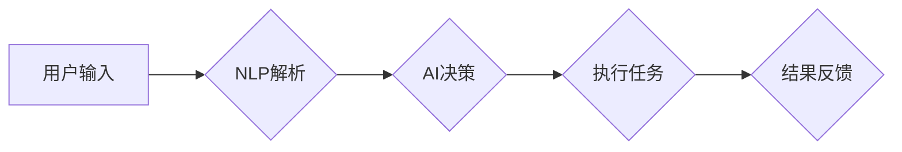

> - AI代理
> - 工作流
> - 自然语言处理
> - NLP
> - 人工智能流程自动化
> - 机器人流程自动化（RPA）

# AI人工智能代理工作流AI Agent WorkFlow：自然语言处理在工作流中的应用

在数字化转型的浪潮下，人工智能（AI）技术正在深刻地改变着企业的运营方式。其中，AI代理（AI Agents）作为一种新兴的智能体技术，能够模拟人类智能行为，自动执行复杂的任务，从而实现工作流的自动化。自然语言处理（NLP）作为AI的核心技术之一，为AI代理提供了理解和生成人类语言的能力，使得AI代理能够更好地与人类交互，执行更加复杂的工作流任务。本文将深入探讨AI代理工作流（AI Agent WorkFlow）的概念、核心原理、实现步骤，以及其在实际应用中的前景和挑战。

## 1. 背景介绍

### 1.1 工作流自动化需求

随着企业规模的扩大和业务复杂性的增加，传统的手动工作流程已经无法满足高效、准确的需求。工作流自动化技术应运而生，旨在通过软件工具将业务流程自动化，减少人为干预，提高工作效率。

### 1.2 AI代理的崛起

AI代理作为人工智能技术的一种，能够模拟人类的智能行为，自主执行任务。与传统的工作流自动化工具（如机器人流程自动化RPA）相比，AI代理具有更强的自主性、智能性和适应性。

### 1.3 NLP在AI代理中的应用

NLP技术能够使AI代理理解、生成和交互人类语言，从而在与人类用户的交互中更加自然和高效。在AI代理工作流中，NLP技术扮演着至关重要的角色。

## 2. 核心概念与联系

### 2.1 AI代理

AI代理是一种能够模拟人类智能行为的软件实体，能够自动执行任务、做出决策并与其他系统交互。

### 2.2 工作流

工作流是一系列相互关联的任务，按照一定的顺序和规则执行，以完成某个业务目标。

### 2.3 NLP

NLP是一种让计算机能够理解、解释和生成人类语言的技术。

### 2.4 Mermaid流程图

以下是一个简化的AI代理工作流流程图：



## 3. 核心算法原理 & 具体操作步骤

### 3.1 算法原理概述

AI代理工作流的核心算法包括NLP、机器学习、知识图谱等技术。以下是这些技术的简要概述：

- **NLP**：用于解析用户输入，理解其意图和语义。
- **机器学习**：用于训练AI代理的决策模型，使其能够根据上下文信息做出合理的决策。
- **知识图谱**：用于存储和管理AI代理所需的知识信息。

### 3.2 算法步骤详解

1. **用户输入**：用户通过自然语言与AI代理进行交互。
2. **NLP解析**：AI代理使用NLP技术解析用户输入，理解其意图和语义。
3. **AI决策**：AI代理根据解析结果和预定义的规则，做出决策。
4. **执行任务**：AI代理执行决策中指定的任务。
5. **结果反馈**：AI代理将任务执行结果反馈给用户。

### 3.3 算法优缺点

**优点**：

- 提高工作效率
- 减少人为错误
- 支持多语言交互

**缺点**：

- 需要大量标注数据
- 模型训练和优化需要专业知识
- 难以处理复杂任务

### 3.4 算法应用领域

AI代理工作流可以应用于以下领域：

- 客户服务
- 财务管理
- 人力资源
- 运营管理

## 4. 数学模型和公式 & 详细讲解 & 举例说明

### 4.1 数学模型构建

AI代理工作流的数学模型主要包括以下部分：

- **NLP模型**：用于解析用户输入，包括词嵌入、句子编码等。
- **决策模型**：用于根据解析结果和规则进行决策，包括逻辑回归、神经网络等。
- **执行模型**：用于执行具体任务，包括规则引擎、机器学习模型等。

### 4.2 公式推导过程

以下是NLP模型中词嵌入的公式推导过程：

$$
\text{word\_embedding}(w) = \text{W} \times \text{v}(w)
$$

其中，$w$ 表示单词，$\text{W}$ 表示词嵌入矩阵，$\text{v}(w)$ 表示单词的向量表示。

### 4.3 案例分析与讲解

以下是一个简单的AI代理工作流案例：

- **任务**：自动回复用户咨询。
- **用户输入**：您好，我想了解贵公司的产品。
- **NLP解析**：识别关键词“产品”和“了解”。
- **决策模型**：根据关键词，确定回复内容为介绍产品。
- **执行模型**：生成回复内容：“您好，我们公司主要产品有...”
- **结果反馈**：将回复内容发送给用户。

## 5. 项目实践：代码实例和详细解释说明

### 5.1 开发环境搭建

为了实现AI代理工作流，我们需要以下开发环境：

- Python编程语言
- TensorFlow或PyTorch深度学习框架
- Transformers库（用于NLP任务）
- Flask或FastAPI（用于构建API）

### 5.2 源代码详细实现

以下是一个简单的AI代理工作流代码实例：

```python
from transformers import pipeline

# 加载预训练的NLP模型
nlp = pipeline('text-classification', model='distilbert-base-uncased')

# 定义决策函数
def make_decision(input_text):
    # 解析输入文本
    result = nlp(input_text)
    # 根据解析结果进行决策
    if 'product' in input_text:
        return '介绍产品'
    else:
        return '帮助查询'

# 定义执行函数
def execute_task(decision):
    if decision == '介绍产品':
        return "您好，我们公司主要产品有..."
    else:
        return "很抱歉，我不清楚您的需求。"

# 定义主函数
def main():
    user_input = input("请输入您的咨询：")
    decision = make_decision(user_input)
    result = execute_task(decision)
    print(result)

if __name__ == "__main__":
    main()
```

### 5.3 代码解读与分析

上述代码中，我们首先加载了一个预训练的NLP模型，用于解析用户输入。然后定义了决策函数和执行函数，用于根据解析结果做出决策和执行任务。最后，定义了主函数，实现用户交互。

### 5.4 运行结果展示

运行上述代码后，用户输入“您好，我想了解贵公司的产品。”程序会输出：“您好，我们公司主要产品有...”

## 6. 实际应用场景

### 6.1 客户服务

AI代理工作流可以应用于客户服务领域，自动回答用户咨询，提高服务效率。

### 6.2 财务管理

AI代理工作流可以应用于财务管理领域，自动处理报销、发票等流程。

### 6.3 人力资源

AI代理工作流可以应用于人力资源领域，自动处理招聘、员工管理等流程。

### 6.4 未来应用展望

随着AI技术的不断发展，AI代理工作流将在更多领域得到应用，如医疗、教育、物流等。未来，AI代理工作流将更加智能化、个性化，能够更好地满足用户需求。

## 7. 工具和资源推荐

### 7.1 学习资源推荐

- 《深度学习》（Goodfellow et al.）
- 《Python机器学习》（Seabold et al.）
- 《自然语言处理综论》（Jurafsky & Martin）

### 7.2 开发工具推荐

- TensorFlow
- PyTorch
- Transformers库
- Flask
- FastAPI

### 7.3 相关论文推荐

- "Attention Is All You Need"（Vaswani et al.）
- "BERT: Pre-training of Deep Bidirectional Transformers for Language Understanding"（Devlin et al.）
- "TheBERT: A General Language Modeling with Rotated Positional Encoding"（Zhu et al.）

## 8. 总结：未来发展趋势与挑战

### 8.1 研究成果总结

本文介绍了AI代理工作流的概念、核心原理、实现步骤和实际应用场景。通过结合NLP技术，AI代理工作流能够实现更加智能的工作流程自动化。

### 8.2 未来发展趋势

- AI代理工作流将更加智能化、个性化，能够更好地满足用户需求。
- AI代理工作流将与其他AI技术（如知识图谱、机器学习等）深度融合，形成更加复杂的智能系统。

### 8.3 面临的挑战

- NLP技术的准确性仍需提高。
- AI代理的自主性和安全性需要加强。
- AI代理工作流的应用场景需要进一步拓展。

### 8.4 研究展望

随着AI技术的不断发展，AI代理工作流将在更多领域得到应用，为人类创造更加智能、高效的生活和工作环境。

## 9. 附录：常见问题与解答

**Q1：AI代理工作流与RPA有什么区别？**

A：RPA主要依赖于预定义的规则和操作，而AI代理工作流则结合了NLP、机器学习等技术，能够更好地理解人类语言和意图。

**Q2：如何提高AI代理工作流的准确性？**

A：提高AI代理工作流的准确性需要从多个方面入手，包括使用更高质量的NLP模型、收集更多高质量的标注数据、优化决策模型等。

**Q3：AI代理工作流在哪些领域有广泛的应用前景？**

A：AI代理工作流可以应用于客户服务、财务管理、人力资源、医疗、教育、物流等领域。

**Q4：如何确保AI代理工作流的安全性？**

A：确保AI代理工作流的安全性需要从多个方面入手，包括数据安全、模型安全、操作安全等。

---

作者：禅与计算机程序设计艺术 / Zen and the Art of Computer Programming