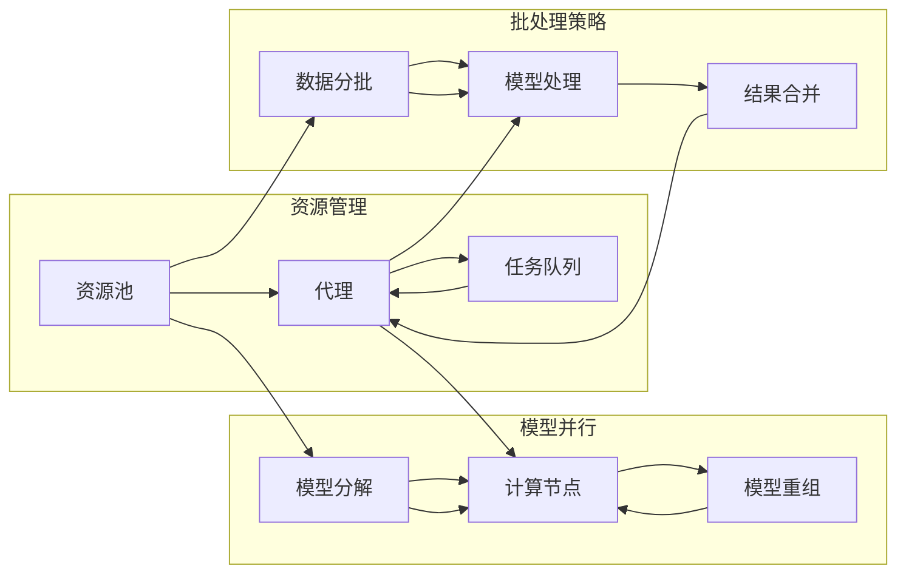

> 高并发，深度学习，代理，性能调优，分布式系统，GPU资源，模型并行，批处理策略

# AI人工智能深度学习算法：高并发场景下深度学习代理的性能调优

> 关键词：高并发，深度学习，代理，性能调优，分布式系统，GPU资源，模型并行，批处理策略

## 1. 背景介绍

随着人工智能技术的飞速发展，深度学习在图像识别、自然语言处理、推荐系统等领域取得了显著的成果。然而，深度学习模型的训练和推理通常需要大量的计算资源，尤其是在高并发场景下，如何有效地管理和调优这些资源，成为了一个重要的挑战。

高并发场景下的深度学习代理（如训练服务、推理服务）需要处理大量的请求，同时保证模型的训练和推理效率。本文将深入探讨高并发场景下深度学习代理的性能调优策略，包括资源管理、模型并行、批处理策略等方面。

## 2. 核心概念与联系

### 2.1 核心概念原理

#### 深度学习代理
深度学习代理是指负责执行深度学习任务的服务实例，包括模型训练、推理等。在高并发场景下，深度学习代理需要具备高效的处理能力和良好的扩展性。

#### 资源管理
资源管理是指对计算资源（如CPU、GPU、内存等）进行有效的分配和调度，以最大化资源利用率和系统性能。

#### 模型并行
模型并行是指将深度学习模型分解成多个部分，分布到多个计算节点上并行计算，以加快模型训练和推理速度。

#### 批处理策略
批处理策略是指将输入数据分批次进行处理，以优化内存使用和计算效率。

### 2.2 架构流程图



## 3. 核心算法原理 & 具体操作步骤

### 3.1 算法原理概述

高并发场景下深度学习代理的性能调优，主要围绕以下几个方面展开：

1. 资源管理：通过合理的资源分配策略，最大化资源利用率。
2. 模型并行：将模型分解成多个部分，并行计算以提高性能。
3. 批处理策略：优化批处理策略，提高内存使用和计算效率。

### 3.2 算法步骤详解

#### 3.2.1 资源管理

1. 构建资源池：将可用的计算资源（如CPU、GPU、内存等）整合到资源池中。
2. 分配策略：根据任务类型、优先级等因素，动态分配资源。
3. 调度策略：根据资源利用率、任务完成时间等因素，进行资源的调度。

#### 3.2.2 模型并行

1. 模型分解：将深度学习模型分解成多个部分，如计算层、卷积层等。
2. 计算节点选择：根据计算节点上的资源情况，选择合适的节点进行模型并行。
3. 模型重组：将并行计算的结果进行合并，得到最终的输出。

#### 3.2.3 批处理策略

1. 数据分批：根据模型的内存占用和计算能力，将数据分成多个批次进行处理。
2. 批次大小调整：根据资源利用率、任务完成时间等因素，动态调整批次大小。
3. 结果合并：将各个批次的结果进行合并，得到最终的输出。

### 3.3 算法优缺点

#### 3.3.1 优点

1. 提高资源利用率。
2. 加快模型训练和推理速度。
3. 提高系统扩展性。

#### 3.3.2 缺点

1. 复杂度高。
2. 需要大量的计算资源。
3. 对模型结构和任务类型有一定要求。

### 3.4 算法应用领域

高并发场景下深度学习代理的性能调优技术可应用于以下领域：

1. 图像识别和检测
2. 自然语言处理
3. 推荐系统
4. 自动驾驶

## 4. 数学模型和公式 & 详细讲解 & 举例说明

### 4.1 数学模型构建

假设有 $N$ 个计算节点，每个节点具有 $M$ 个GPU，模型并行后的每个部分需要 $P$ 个GPU。则模型并行所需的计算节点数为：

$$
C = \lceil \frac{N \cdot M}{P} \rceil
$$

其中 $\lceil \cdot \rceil$ 表示向上取整。

### 4.2 公式推导过程

根据公式：

$$
C = \frac{N \cdot M}{P}
$$

当 $N \cdot M$ 不能被 $P$ 整除时，需要向上取整，以保证所有模型部分都能在计算节点上并行计算。

### 4.3 案例分析与讲解

假设我们有5个计算节点，每个节点有4个GPU，模型并行后需要8个GPU。根据公式，所需的计算节点数为：

$$
C = \lceil \frac{5 \cdot 4}{8} \rceil = 2
$$

因此，需要2个计算节点来完成模型并行计算。

## 5. 项目实践：代码实例和详细解释说明

### 5.1 开发环境搭建

1. 安装PyTorch框架。
2. 安装DistributedDataParallel库（用于实现模型并行）。

### 5.2 源代码详细实现

```python
import torch
import torch.nn as nn
from torch.nn.parallel import DistributedDataParallel as DDP

# 定义模型
class Model(nn.Module):
    def __init__(self):
        super(Model, self).__init__()
        self.conv1 = nn.Conv2d(1, 10, kernel_size=5)
        self.conv2 = nn.Conv2d(10, 20, kernel_size=5)
        self.fc1 = nn.Linear(320, 50)
        self.fc2 = nn.Linear(50, 10)

    def forward(self, x):
        x = torch.relu(self.conv1(x))
        x = torch.max_pool2d(x, 2, 2)
        x = torch.relu(self.conv2(x))
        x = torch.max_pool2d(x, 2, 2)
        x = x.view(-1, 320)
        x = torch.relu(self.fc1(x))
        x = self.fc2(x)
        return x

# 模型并行
def parallel_model(model, world_size):
    model = DDP(model, device_ids=[torch.device("cuda:0")], output_device='cuda:0')
    return model

# 训练过程
def train(model, device, train_loader, optimizer, epoch):
    model.train()
    for batch_idx, (data, target) in enumerate(train_loader):
        data, target = data.to(device), target.to(device)
        optimizer.zero_grad()
        output = model(data)
        loss = nn.CrossEntropyLoss()(output, target)
        loss.backward()
        optimizer.step()
        if batch_idx % 100 == 0:
            print('Train Epoch: {} [{}/{} ({:.0f}%)]\tLoss: {:.6f}'.format(
                epoch, batch_idx * len(data), len(train_loader.dataset),
                100. * batch_idx / len(train_loader), loss.item()))

# 主函数
def main():
    world_size = 2  # 计算节点数
    rank = int(os.environ['RANK'])
    torch.cuda.set_device(rank % torch.cuda.device_count())

    torch.distributed.init_process_group(backend='nccl', init_method='env://', world_size=world_size, rank=rank)

    model = Model().to('cuda')
    model = parallel_model(model, world_size)
    optimizer = torch.optim.SGD(model.parameters(), lr=0.01, momentum=0.5)

    train(model, 'cuda', train_loader, optimizer, epoch=1)

    torch.distributed.destroy_process_group()

if __name__ == '__main__':
    main()
```

### 5.3 代码解读与分析

上述代码展示了如何使用PyTorch和DistributedDataParallel库实现模型并行。首先，定义了一个简单的卷积神经网络模型。然后，通过`parallel_model`函数将模型并行化。最后，在`main`函数中初始化分布式环境，进行模型训练。

### 5.4 运行结果展示

运行上述代码，可以看到模型并行训练的输出信息，包括训练轮数、批次索引、数据集大小、损失值等。

## 6. 实际应用场景

高并发场景下深度学习代理的性能调优技术已广泛应用于以下场景：

1. 云计算平台：在云平台上部署深度学习服务，为用户提供高效的模型训练和推理服务。
2. 数据中心：在数据中心部署大规模深度学习集群，处理海量数据。
3. 自动驾驶：在自动驾驶领域，深度学习代理需要实时处理大量的图像数据，保证车辆安全行驶。

## 7. 工具和资源推荐

### 7.1 学习资源推荐

1. 《深度学习》
2. 《PyTorch深度学习实践》
3. 《DistributedDataParallel官方文档》

### 7.2 开发工具推荐

1. PyTorch
2. DistributedDataParallel
3. NCCL

### 7.3 相关论文推荐

1. "Distributed Deep Learning: Overcoming the Limits of Single-Node GPUs"
2. "High-Performance Distributed Deep Learning: A TensorFlow Perspective"
3. "Distributed Model Parallelism for Deep Neural Networks"

## 8. 总结：未来发展趋势与挑战

### 8.1 研究成果总结

本文深入探讨了高并发场景下深度学习代理的性能调优策略，包括资源管理、模型并行、批处理策略等方面。通过分析相关算法原理和实际案例，为高并发场景下的深度学习应用提供了有效的解决方案。

### 8.2 未来发展趋势

1. 自适应资源管理：根据实际负载情况，动态调整资源分配和调度策略。
2. 多尺度并行：支持不同尺度的并行计算，提高资源利用率。
3. 模型压缩与量化：降低模型尺寸，提高推理速度。

### 8.3 面临的挑战

1. 资源调度优化：如何实现高效的资源调度策略，降低资源冲突。
2. 模型并行优化：如何实现高效、灵活的模型并行策略，提高并行计算效率。
3. 批处理策略优化：如何设计合适的批处理策略，提高内存和计算效率。

### 8.4 研究展望

未来，高并发场景下深度学习代理的性能调优技术将在以下方面取得突破：

1. 跨平台性能调优：支持多种硬件平台，如CPU、GPU、FPGA等。
2. 预测性资源管理：根据历史数据预测未来负载，实现资源预分配。
3. 智能优化算法：利用人工智能技术，实现智能的资源管理和模型并行优化。

## 9. 附录：常见问题与解答

**Q1：模型并行和数据并行的区别是什么？**

A：模型并行是指将模型的不同部分部署到不同的计算节点上进行并行计算，而数据并行是指将数据分批次进行并行计算。模型并行可以进一步提高模型计算速度，但需要更多的计算资源；数据并行可以降低对计算资源的需求，但并行计算效果可能不如模型并行。

**Q2：如何实现批处理策略优化？**

A：批处理策略优化可以从以下几个方面入手：
1. 批次大小选择：根据模型的内存占用和计算能力，选择合适的批次大小。
2. 批次调度：根据资源利用率、任务完成时间等因素，动态调整批次大小。
3. 批次融合：将多个小批次的结果进行融合，提高计算效率。

**Q3：如何实现自适应资源管理？**

A：自适应资源管理可以通过以下方法实现：
1. 负载预测：根据历史数据预测未来负载，实现资源预分配。
2. 资源分配算法：设计高效的资源分配算法，降低资源冲突。
3. 自适应调整：根据实际负载情况，动态调整资源分配策略。

作者：禅与计算机程序设计艺术 / Zen and the Art of Computer Programming