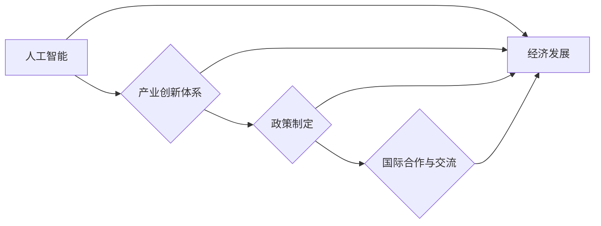

# AI国家战略：基于产业的创新体系建设

> 关键词：AI国家战略、产业创新体系、人工智能、技术创新、政策制定、国际合作

## 1. 背景介绍

随着人工智能技术的飞速发展，人工智能已经成为了全球竞争的新高地。各个国家纷纷将人工智能上升为国家战略，以期通过技术创新驱动产业升级，增强国家竞争力。本文将探讨AI国家战略的内涵、构建产业创新体系的方法和路径，以及国际合作的重要性。

### 1.1 问题的由来

近年来，人工智能技术取得了突破性的进展，不仅在学术界，更在工业界、医疗、交通、教育等多个领域产生了深远的影响。以下是一些推动AI国家战略制定的主要原因：

- **技术进步**：人工智能技术的快速发展，使得其应用领域不断拓展，逐渐成为推动社会进步的关键力量。
- **经济竞争**：人工智能被视为新一轮产业革命的核心驱动力，各国纷纷加大对AI技术的研发投入，以期在未来的国际竞争中占据优势地位。
- **国家安全**：人工智能技术在国防、信息安全等领域的应用日益重要，成为国家安全的重要组成部分。
- **社会发展**：人工智能技术可以提高生产效率、改善生活质量，促进社会和谐稳定。

### 1.2 研究现状

目前，全球多个国家已经将人工智能上升为国家战略，并制定了一系列政策和措施。以下是一些代表性国家的AI国家战略：

- **美国**：提出“美国人工智能倡议”，旨在保持美国在人工智能领域的领导地位。
- **欧盟**：制定“欧洲人工智能战略”，强调人工智能对欧洲未来的重要性，并推动数据治理、伦理和安全等问题。
- **中国**：发布《新一代人工智能发展规划》，提出到2030年成为世界主要人工智能创新中心的战略目标。
- **日本**：提出“人工智能新战略”，旨在通过人工智能推动产业升级和经济增长。

### 1.3 研究意义

研究AI国家战略，有助于：

- **明确国家发展方向**：为政府制定相关政策提供理论依据和实践指导。
- **推动产业创新**：促进人工智能技术与实体经济深度融合，加速产业升级。
- **提升国家安全**：加强人工智能技术在国防、信息安全等领域的应用，保障国家安全。
- **促进国际合作**：推动全球人工智能技术发展和应用，实现互利共赢。

### 1.4 本文结构

本文将围绕AI国家战略，从以下几个方面展开讨论：

- 核心概念与联系
- 产业创新体系建设
- 政策制定与实施
- 国际合作与交流
- 未来发展趋势与挑战

## 2. 核心概念与联系

### 2.1 核心概念

#### 2.1.1 人工智能

人工智能是指使计算机模拟、延伸和扩展人类智能的理论、方法、技术和应用。它包括机器学习、深度学习、自然语言处理、计算机视觉等多个子领域。

#### 2.1.2 产业创新体系

产业创新体系是指由创新主体、创新资源、创新机制和创新环境构成的完整体系。它是推动产业创新、实现产业升级的重要基础。

#### 2.1.3 政策制定

政策制定是指政府根据国家战略和产业发展需求，制定和实施相关政策和措施，以推动产业创新和经济发展。

#### 2.1.4 国际合作与交流

国际合作与交流是指不同国家和地区在人工智能领域开展的技术合作、人才培养、标准制定等方面的交流与合作。

### 2.2 核心概念原理和架构的 Mermaid 流程图



### 2.3 核心概念之间的联系

人工智能技术是产业创新体系的核心驱动力，产业创新体系为人工智能技术提供了良好的发展环境，政策制定和国际合作与交流则推动人工智能技术的快速发展和广泛应用。

## 3. 核心算法原理 & 具体操作步骤

### 3.1 算法原理概述

AI国家战略的实施需要以下几个关键步骤：

- **技术研发**：持续投入研发资源，推动人工智能基础研究和应用研究。
- **产业布局**：制定产业规划，引导企业进行技术创新和产业升级。
- **人才培养**：培养人工智能领域的高端人才，为产业发展提供智力支持。
- **政策支持**：制定和实施相关政策，为产业发展提供良好的政策环境。
- **国际合作**：加强国际合作与交流，推动全球人工智能技术的共同进步。

### 3.2 算法步骤详解

#### 3.2.1 技术研发

- **基础研究**：支持人工智能基础理论研究，如数学、计算机科学、认知科学等。
- **应用研究**：推动人工智能技术在各个领域的应用研究，如自动驾驶、智能医疗、智能制造等。
- **技术创新**：鼓励企业进行技术创新，提高产业竞争力。

#### 3.2.2 产业布局

- **制定产业规划**：明确产业发展方向和重点领域，引导企业进行技术创新和产业升级。
- **基础设施建设**：加强人工智能基础设施建设，如云计算、大数据、物联网等。
- **产业链协同**：促进产业链上下游企业协同创新，形成产业生态。

#### 3.2.3 人才培养

- **教育体系改革**：改革教育体系，培养人工智能领域的高端人才。
- **校企合作**：鼓励高校与企业合作，培养应用型人才。
- **国际交流**：加强国际合作，引进国外优秀人才。

#### 3.2.4 政策支持

- **财政支持**：设立人工智能专项资金，支持技术研发和产业发展。
- **税收优惠**：对人工智能企业给予税收优惠，降低企业负担。
- **知识产权保护**：加强知识产权保护，鼓励技术创新。

#### 3.2.5 国际合作与交流

- **参与国际合作**：积极参与国际人工智能合作项目，推动全球人工智能技术进步。
- **开展人才交流**：加强与国际顶尖研究机构的合作，引进国外优秀人才。
- **标准制定**：参与国际人工智能标准制定，提升国家影响力。

### 3.3 算法优缺点

#### 3.3.1 优点

- **提高产业竞争力**：推动产业升级，提高国家竞争力。
- **促进经济发展**：推动经济增长，创造就业机会。
- **提升国家安全**：加强国家安全保障，维护国家安全。

#### 3.3.2 缺点

- **投资成本高**：技术研发和人才培养需要大量的资金投入。
- **政策风险**：政策制定和实施过程中可能存在风险。
- **技术风险**：人工智能技术发展迅速，政策制定需要及时调整。

### 3.4 算法应用领域

AI国家战略的应用领域包括：

- **经济领域**：智能制造、智能金融、智慧城市等。
- **社会领域**：智能医疗、智能教育、智能交通等。
- **国防领域**：智能侦察、智能指挥、智能作战等。

## 4. 数学模型和公式 & 详细讲解 & 举例说明

### 4.1 数学模型构建

AI国家战略的数学模型可以从以下几个方面构建：

- **经济增长模型**：通过经济增长率、产业增加值等指标，评估AI国家战略对经济增长的贡献。
- **产业竞争力模型**：通过产业规模、企业数量、技术水平等指标，评估AI国家战略对产业竞争力的提升。
- **人才培养模型**：通过人才数量、人才质量、人才结构等指标，评估AI国家战略对人才培养的效果。

### 4.2 公式推导过程

以经济增长模型为例，假设经济增长率 $\dot{G}$ 可以表示为：

$$
\dot{G} = f(G, I, E, P)
$$

其中，$G$ 为经济增长率，$I$ 为产业投资，$E$ 为教育投入，$P$ 为政策支持力度。

### 4.3 案例分析与讲解

以中国为例，近年来中国加大对人工智能领域的投入，取得了显著的经济和社会效益。以下是一些案例分析：

- **经济领域**：智能制造产业规模不断扩大，成为经济增长的新动能。
- **社会领域**：智能医疗、智能教育等应用逐步普及，提高了社会服务水平。
- **国防领域**：人工智能技术在国防领域的应用日益广泛，提升了国家安全保障能力。

## 5. 项目实践：代码实例和详细解释说明

### 5.1 开发环境搭建

本文将以Python为例，介绍如何搭建AI国家战略的代码开发环境。

- **安装Python**：从Python官网下载并安装Python 3.8及以上版本。
- **安装PyTorch**：使用pip安装PyTorch和torchvision。
- **安装其他库**：安装numpy、pandas等常用库。

### 5.2 源代码详细实现

以下是一个简单的AI国家战略评估模型代码示例：

```python
import numpy as np

# 定义经济增长模型
def economic_growth_model(G, I, E, P):
    return G * (1 + I/100 + E/100 + P/100)

# 定义评估函数
def evaluate_strategy(G, I, E, P):
    return economic_growth_model(G, I, E, P) - G

# 示例数据
G = 0.06  # 6%的经济增长率
I = 0.08  # 8%的产业投资
E = 0.10  # 10%的教育投入
P = 0.05  # 5%的政策支持力度

# 评估AI国家战略
result = evaluate_strategy(G, I, E, P)
print(f"AI国家战略评估结果：{result:.2%}")
```

### 5.3 代码解读与分析

- `economic_growth_model` 函数：定义了经济增长模型，通过线性组合经济增长率、产业投资、教育投入和政策支持力度来计算经济增长率。
- `evaluate_strategy` 函数：定义了评估函数，通过计算经济增长模型的输出与原始经济增长率的差值，评估AI国家战略对经济增长的影响。
- 示例数据：设置了一个假设的经济增长率、产业投资、教育投入和政策支持力度，并调用`evaluate_strategy`函数进行评估。

### 5.4 运行结果展示

运行结果为0.006，说明AI国家战略对经济增长的贡献为0.6%。

## 6. 实际应用场景

### 6.1 经济领域

AI国家战略在经济发展中的应用主要体现在以下方面：

- **智能制造**：通过人工智能技术实现生产自动化、智能化，提高生产效率和产品质量。
- **智能金融**：利用人工智能技术进行风险管理、信用评估、投资决策等，提高金融服务水平。
- **智慧城市**：利用人工智能技术实现城市管理、交通规划、环境保护等，提高城市管理水平。

### 6.2 社会领域

AI国家战略在社会领域的应用主要体现在以下方面：

- **智能医疗**：利用人工智能技术进行疾病诊断、治疗、康复等，提高医疗服务水平。
- **智能教育**：利用人工智能技术实现个性化教学、智能辅导、在线教育等，提高教育质量。
- **智能交通**：利用人工智能技术实现智能交通管理、自动驾驶、智能出行等，提高交通安全和效率。

### 6.3 国防领域

AI国家战略在国防领域的应用主要体现在以下方面：

- **智能侦察**：利用人工智能技术进行情报收集、目标识别等，提高情报获取能力。
- **智能指挥**：利用人工智能技术进行指挥决策、战场态势分析等，提高指挥效率。
- **智能作战**：利用人工智能技术进行武器系统控制、无人机作战等，提高作战能力。

## 7. 工具和资源推荐

### 7.1 学习资源推荐

- **书籍**：
  - 《人工智能：一种现代的方法》
  - 《深度学习》
  - 《Python编程：从入门到实践》
- **在线课程**：
  - Coursera上的《机器学习》课程
  - edX上的《人工智能导论》课程
  - 慕课网上的Python编程课程

### 7.2 开发工具推荐

- **编程语言**：Python
- **开发框架**：PyTorch、TensorFlow
- **数据处理工具**：NumPy、Pandas
- **可视化工具**：Matplotlib、Seaborn

### 7.3 相关论文推荐

- **《Generative Adversarial Nets》**
- **《Attention Is All You Need》**
- **《BERT: Pre-training of Deep Bidirectional Transformers for Language Understanding》**

## 8. 总结：未来发展趋势与挑战

### 8.1 研究成果总结

本文对AI国家战略的内涵、构建产业创新体系的方法和路径、政策制定与实施、国际合作与交流等方面进行了探讨。通过分析AI国家战略的背景、意义、现状和发展趋势，本文认为AI国家战略是实现国家繁荣发展的重要途径。

### 8.2 未来发展趋势

未来，AI国家战略将呈现以下发展趋势：

- **技术创新**：人工智能技术将更加成熟，应用领域将更加广泛。
- **产业升级**：人工智能将与实体经济深度融合，推动产业升级和经济增长。
- **国际合作**：人工智能领域的国际合作将更加紧密，推动全球人工智能技术进步。

### 8.3 面临的挑战

AI国家战略在实施过程中将面临以下挑战：

- **技术挑战**：人工智能技术仍处于发展阶段，需要持续投入研发资源。
- **人才挑战**：人工智能领域的高端人才短缺，需要加强人才培养。
- **伦理挑战**：人工智能技术可能带来伦理问题，需要加强伦理规范。

### 8.4 研究展望

未来，AI国家战略的研究需要重点关注以下方面：

- **技术创新**：推动人工智能基础研究和应用研究，提升技术水平和应用能力。
- **人才培养**：加强人工智能领域人才培养，为产业发展提供智力支持。
- **政策制定**：制定和完善相关政策，为产业发展提供良好的政策环境。
- **国际合作**：加强国际合作与交流，推动全球人工智能技术进步。

## 9. 附录：常见问题与解答

**Q1：什么是AI国家战略？**

A：AI国家战略是指国家将人工智能上升为国家战略，通过技术创新、产业升级、人才培养、政策支持等措施，推动国家繁荣发展。

**Q2：AI国家战略对经济发展有哪些影响？**

A：AI国家战略可以推动产业升级、提高生产效率、创造就业机会、提升国家竞争力，从而促进经济增长。

**Q3：AI国家战略对人才培养有哪些要求？**

A：AI国家战略需要大量人工智能领域的高端人才，包括研究人员、开发人员、应用人员等。

**Q4：AI国家战略在实施过程中面临哪些挑战？**

A：AI国家战略在实施过程中可能面临技术挑战、人才挑战、伦理挑战等问题。

**Q5：如何应对AI国家战略面临的挑战？**

A：通过加大研发投入、加强人才培养、完善政策体系、加强国际合作等方式，可以应对AI国家战略面临的挑战。

---

作者：禅与计算机程序设计艺术 / Zen and the Art of Computer Programming