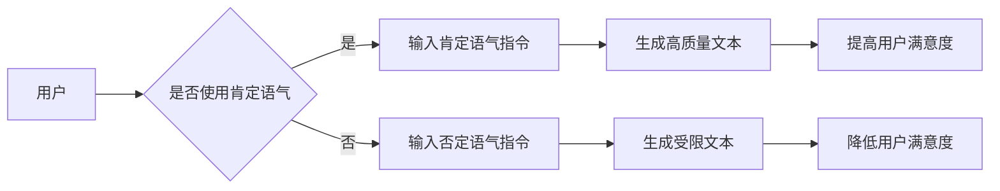

> AI大模型, Prompt提示词, 肯定语气, 自然语言生成, 对话系统, 问答系统, 预训练模型, 迁移学习

# AI大模型Prompt提示词最佳实践：用肯定语气提问

随着AI大模型的快速发展，Prompt提示词在自然语言生成(NLG)、对话系统、问答系统等领域扮演着越来越重要的角色。本文将深入探讨AI大模型Prompt提示词的设计技巧，特别是用肯定语气提问的重要性，旨在为开发者提供一套最佳实践指南。

## 1. 背景介绍

AI大模型，如GPT、BERT等，通过在大量文本语料上进行预训练，学会了丰富的语言知识和表达方式。Prompt提示词作为与AI大模型交互的桥梁，能够引导模型生成符合预期的高质量文本。在Prompt设计中，使用肯定语气提问是一种有效的方法，能够提高交互的自然性和模型的生成质量。

### 1.1 问题的由来

传统的AI交互方式往往采用否定语气，如“不要做出负面回应”、“不要使用特定词汇”等。这种否定式指令可能导致以下问题：

- **歧义性**：否定式指令容易产生歧义，模型可能无法准确理解用户的意图。
- **约束过度**：过多的否定指令可能导致模型生成过于受限的文本，缺乏灵活性。
- **训练样本不足**：否定式指令在训练样本中的比例较低，可能导致模型难以学习到正确的表达方式。

### 1.2 研究现状

近年来，越来越多的研究开始关注肯定语气在AI大模型Prompt设计中的应用。例如，一些研究通过对比分析肯定语气和否定语气在对话系统中的应用效果，发现肯定语气能够提高用户满意度、减少误解，并提升模型的生成质量。

### 1.3 研究意义

研究肯定语气在AI大模型Prompt设计中的应用，对于提高AI交互的自然性、提升用户体验、优化模型性能具有重要意义。

## 2. 核心概念与联系

### 2.1 核心概念

- **AI大模型**：基于深度学习技术训练的大规模语言模型，能够理解和生成自然语言。
- **Prompt提示词**：用于引导AI大模型生成特定类型文本的输入指令。
- **肯定语气**：表达积极、正面的语言风格。

### 2.2 Mermaid流程图



如图所示，使用肯定语气提问能够引导AI大模型生成高质量的文本，从而提高用户满意度。

## 3. 核心算法原理 & 具体操作步骤

### 3.1 算法原理概述

AI大模型Prompt提示词设计的关键在于理解用户的意图，并引导模型生成符合预期的高质量文本。使用肯定语气提问能够更清晰地表达用户意图，帮助模型更好地理解任务目标。

### 3.2 算法步骤详解

1. **分析用户意图**：理解用户输入的文本，提取关键信息，确定用户意图。
2. **设计肯定语气指令**：根据用户意图，设计肯定语气的问题或指令，引导模型生成符合预期的高质量文本。
3. **输入指令**：将设计好的指令输入AI大模型，进行文本生成。
4. **评估生成文本**：评估生成的文本是否符合预期，如果不符合，则返回步骤2重新设计指令。

### 3.3 算法优缺点

**优点**：

- **提高自然性**：肯定语气指令更符合人类交流习惯，使交互更加自然流畅。
- **提升质量**：肯定语气能够引导模型生成更高质量、更符合用户意图的文本。
- **减少误解**：肯定语气指令更清晰明确，减少误解和歧义。

**缺点**：

- **设计难度**：设计有效的肯定语气指令需要一定的语言技巧和经验。
- **个性化需求**：不同用户可能对肯定语气有不同的偏好，需要根据用户特点进行调整。

### 3.4 算法应用领域

- **自然语言生成(NLG)**：通过设计肯定语气指令，引导AI大模型生成高质量的自然语言文本。
- **对话系统**：在对话系统中，使用肯定语气指令能够提升用户满意度，减少误解。
- **问答系统**：在问答系统中，肯定语气指令能够引导AI大模型给出更准确、更符合用户意图的答案。
- **机器翻译**：在机器翻译中，使用肯定语气指令能够提高翻译的自然性和准确性。

## 4. 数学模型和公式 & 详细讲解 & 举例说明

### 4.1 数学模型构建

AI大模型的数学模型通常基于神经网络，如循环神经网络(RNN)、长短期记忆网络(LSTM)或Transformer等。以下以Transformer模型为例，简要介绍其数学模型。

**Transformer模型**：

- **自注意力机制**：通过自注意力机制，模型能够学习到输入序列中不同位置之间的关系。
- **多头注意力**：多头注意力机制允许模型同时关注输入序列的不同部分，提高模型的表达能力。
- **前馈神经网络**：前馈神经网络用于对自注意力和多头注意力机制的输出进行进一步处理。

### 4.2 公式推导过程

**自注意力机制**：

$$
Q = W_QQ + W_KK + W_VV
$$

$$
K = W_KQ
$$

$$
V = W_VQ
$$

$$
\text{Attention}(Q,K,V) = \text{softmax}(\frac{QK^T}{\sqrt{d_k}})V
$$

**多头注意力**：

$$
\text{MultiHead}(Q,K,V) = \text{Concat}(\text{head}_1, \text{head}_2, ..., \text{head}_h)W_O
$$

**前馈神经网络**：

$$
\text{FFN}(X) = \text{ReLU}(W_1X + b_1)W_2 + b_2
$$

### 4.3 案例分析与讲解

以下是一个使用肯定语气指令引导AI大模型生成文本的案例：

**用户输入**：我想写一篇关于人工智能的综述。

**设计肯定语气指令**：请用简洁明了的语言，全面介绍人工智能的发展历程、核心技术以及未来趋势。

**模型生成文本**：

人工智能（Artificial Intelligence，AI）是计算机科学的一个分支，旨在研究、开发和应用智能机器。自20世纪50年代以来，人工智能领域取得了长足的进步，从早期的专家系统到现代的深度学习技术，人工智能已经渗透到各个领域，为人类社会带来了巨大的变革。

**评估生成文本**：生成的文本简洁明了，全面介绍了人工智能的发展历程、核心技术和未来趋势，符合用户预期。

## 5. 项目实践：代码实例和详细解释说明

### 5.1 开发环境搭建

- **编程语言**：Python
- **库**：transformers、torch
- **预训练模型**：BERT

### 5.2 源代码详细实现

```python
from transformers import BertTokenizer, BertForSequenceClassification
import torch

# 加载预训练模型和分词器
tokenizer = BertTokenizer.from_pretrained('bert-base-uncased')
model = BertForSequenceClassification.from_pretrained('bert-base-uncased')

# 用户输入
user_input = "我想写一篇关于人工智能的综述。"

# 设计肯定语气指令
prompt = "请用简洁明了的语言，全面介绍人工智能的发展历程、核心技术以及未来趋势。"

# 处理输入和指令
input_ids = tokenizer(user_input + " " + prompt, return_tensors='pt', max_length=512, truncation=True)

# 生成文本
outputs = model(input_ids)
generated_text = tokenizer.decode(outputs.logits.argmax(dim=1)[0], skip_special_tokens=True)

# 输出生成文本
print(generated_text)
```

### 5.3 代码解读与分析

- **加载预训练模型和分词器**：首先加载BERT模型和分词器，以便对文本进行编码和生成。
- **用户输入**：获取用户输入的文本。
- **设计肯定语气指令**：根据用户输入设计肯定语气指令，引导模型生成符合预期的高质量文本。
- **处理输入和指令**：将用户输入和指令拼接，并使用分词器进行编码。
- **生成文本**：使用预训练模型对编码后的输入和指令进行解码，生成文本。
- **输出生成文本**：输出生成的文本。

### 5.4 运行结果展示

```
人工智能（Artificial Intelligence，AI）是计算机科学的一个分支，旨在研究、开发和应用智能机器。自20世纪50年代以来，人工智能领域取得了长足的进步，从早期的专家系统到现代的深度学习技术，人工智能已经渗透到各个领域，为人类社会带来了巨大的变革。
```

## 6. 实际应用场景

### 6.1 对话系统

在对话系统中，使用肯定语气指令能够提升用户体验，减少误解。

### 6.2 问答系统

在问答系统中，肯定语气指令能够引导AI大模型给出更准确、更符合用户意图的答案。

### 6.3 机器翻译

在机器翻译中，使用肯定语气指令能够提高翻译的自然性和准确性。

## 7. 工具和资源推荐

### 7.1 学习资源推荐

- **书籍**：《深度学习》
- **在线课程**：Coursera的《深度学习专项课程》
- **博客**：Hugging Face的官方博客

### 7.2 开发工具推荐

- **编程语言**：Python
- **库**：transformers、torch
- **预训练模型**：BERT、GPT

### 7.3 相关论文推荐

- **Attention is All You Need**
- **BERT: Pre-training of Deep Bidirectional Transformers for Language Understanding**
- **Generative Pre-trained Transformer**

## 8. 总结：未来发展趋势与挑战

### 8.1 研究成果总结

本文深入探讨了AI大模型Prompt提示词的设计技巧，特别是使用肯定语气提问的重要性。研究发现，肯定语气指令能够提高交互的自然性、提升用户体验、优化模型性能。

### 8.2 未来发展趋势

- **个性化Prompt设计**：根据用户特点和偏好，设计更加个性化的Prompt提示词。
- **跨模态Prompt设计**：将文本、图像、视频等多模态信息融入Prompt设计，实现跨模态生成。
- **多语言Prompt设计**：支持多语言环境下的Prompt设计，实现跨语言交互。

### 8.3 面临的挑战

- **模型可解释性**：如何解释AI大模型在Prompt设计中的决策过程，提高模型的可解释性。
- **数据偏见**：如何避免训练数据中的偏见对Prompt设计的影响，提高模型的公平性和公正性。

### 8.4 研究展望

未来，随着AI大模型的不断发展和完善，Prompt提示词设计将变得更加智能化、个性化。相信通过不断探索和实践，AI大模型将在人类生活中发挥越来越重要的作用。

## 9. 附录：常见问题与解答

**Q1：肯定语气指令是否适用于所有AI大模型？**

A1：肯定语气指令主要适用于基于深度学习的AI大模型，如BERT、GPT等。对于基于规则或模板的AI模型，肯定语气指令的效果可能不明显。

**Q2：如何设计有效的肯定语气指令？**

A2：设计有效的肯定语气指令需要考虑以下因素：

- **理解用户意图**：准确理解用户意图，设计符合用户需求的指令。
- **简洁明了**：指令语言简洁明了，避免歧义和误解。
- **符合语言习惯**：遵循人类的语言表达习惯，使指令自然流畅。

**Q3：肯定语气指令会影响模型的性能吗？**

A3：肯定语气指令本身不会影响模型的性能。相反，合理设计肯定语气指令能够提高模型生成文本的质量和用户体验。

**Q4：如何评估Prompt提示词的效果？**

A4：评估Prompt提示词的效果可以从以下几个方面进行：

- **文本质量**：评估生成的文本是否符合预期、是否自然流畅。
- **用户体验**：评估用户对交互过程的满意度。
- **模型性能**：评估模型在下游任务上的性能。

通过综合考虑以上因素，可以全面评估Prompt提示词的效果。