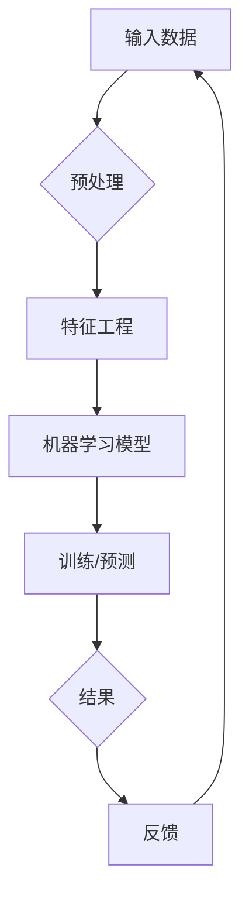

# AI应用实践的新方向与趋势

> 关键词：人工智能，应用实践，机器学习，深度学习，数据科学，自动化，人机交互

## 1. 背景介绍

随着计算机技术的飞速发展，人工智能（AI）已经从理论走向实践，渗透到各行各业。从自动驾驶汽车到智能客服，从医疗诊断到金融服务，AI的应用正在深刻改变我们的生活方式和工作方式。然而，AI应用实践并非一帆风顺，它面临着诸多挑战和机遇。本文将探讨AI应用实践的新方向与趋势，帮助读者了解AI技术的最新发展，并为未来的研究与实践提供参考。

### 1.1 AI应用的挑战

尽管AI技术取得了巨大进步，但在应用实践中仍面临以下挑战：

- **数据质量**：AI模型的性能高度依赖于数据质量，包括数据的准确性、完整性和多样性。然而，现实中的数据往往存在偏差、噪声和不完整性。
- **计算资源**：深度学习模型通常需要大量的计算资源，尤其是在训练阶段。这限制了AI在资源受限环境下的应用。
- **可解释性**：许多AI模型，尤其是深度学习模型，被认为是“黑箱”。其决策过程难以解释，这在某些领域，如医疗和金融，是一个严重的障碍。
- **伦理和隐私**：AI应用涉及到个人隐私和数据安全的问题，需要制定相应的伦理规范和法律法规。

### 1.2 AI应用的机会

尽管存在挑战，但AI应用实践也蕴藏着巨大的机会：

- **自动化**：AI可以自动化许多重复性任务，提高效率，降低成本。
- **个性化**：AI可以根据用户的需求和行为提供个性化的服务。
- **创新**：AI可以推动新产品的开发和新服务的创造。
- **优化**：AI可以帮助优化业务流程，提高资源利用率。

## 2. 核心概念与联系

### 2.1 核心概念

- **机器学习**：机器学习是AI的核心技术之一，它使计算机能够从数据中学习并做出决策或预测。
- **深度学习**：深度学习是机器学习的一个分支，它使用神经网络来学习数据的复杂模式。
- **数据科学**：数据科学是应用统计、信息科学和计算机科学来解决实际问题的学科。
- **自动化**：自动化是指使用机器或人工智能技术代替人工操作的过程。
- **人机交互**：人机交互是指人与计算机系统之间的交互过程。

### 2.2 核心概念原理和架构的 Mermaid 流程图



### 2.3 核心概念联系

机器学习是AI应用的基础，它依赖于数据科学方法来处理和分析数据。深度学习是机器学习的一个分支，它使用神经网络模型来学习数据的复杂模式。自动化和人机交互是AI应用的最终目标，它们使得AI系统能够执行复杂的任务并与人进行交互。

## 3. 核心算法原理 & 具体操作步骤

### 3.1 算法原理概述

AI应用的核心是算法。以下是几种常见的AI算法及其原理：

- **监督学习**：通过标注数据进行训练，使得模型能够对新的输入数据进行预测。
- **无监督学习**：通过未标注数据进行训练，使得模型能够发现数据中的模式。
- **强化学习**：通过试错和奖励来训练模型，使其能够在给定环境中做出最优决策。

### 3.2 算法步骤详解

以下是使用监督学习进行AI应用的一般步骤：

1. **数据收集**：收集用于训练和测试的数据集。
2. **数据预处理**：清洗和转换数据，使其适合用于训练模型。
3. **特征工程**：创建有助于模型学习的特征。
4. **模型选择**：选择合适的机器学习或深度学习模型。
5. **模型训练**：使用训练数据训练模型。
6. **模型评估**：使用测试数据评估模型的性能。
7. **模型部署**：将模型部署到生产环境。

### 3.3 算法优缺点

- **监督学习**：优点是性能稳定，但需要大量标注数据。
- **无监督学习**：优点是不需要标注数据，但性能可能不如监督学习。
- **强化学习**：优点是能够处理复杂决策问题，但训练过程可能非常缓慢。

### 3.4 算法应用领域

AI算法应用领域广泛，包括但不限于：

- **图像识别**：用于自动识别图像中的对象和场景。
- **语音识别**：用于将语音转换为文本。
- **自然语言处理**：用于理解和生成自然语言。
- **推荐系统**：用于推荐商品、电影、新闻等。

## 4. 数学模型和公式 & 详细讲解 & 举例说明

### 4.1 数学模型构建

以下是一个简单的线性回归模型的数学公式：

$$
y = \beta_0 + \beta_1x_1 + \beta_2x_2 + \cdots + \beta_nx_n + \epsilon
$$

其中，$y$ 是因变量，$x_i$ 是自变量，$\beta_i$ 是系数，$\epsilon$ 是误差项。

### 4.2 公式推导过程

线性回归模型的推导过程涉及最小化误差平方和：

$$
S = \sum_{i=1}^{n}(y_i - \hat{y_i})^2
$$

其中，$\hat{y_i}$ 是模型预测的因变量。

### 4.3 案例分析与讲解

假设我们要预测房价，可以使用线性回归模型进行预测。通过收集房价和房屋特征（如面积、房间数等）的数据，我们可以训练一个线性回归模型，并用它来预测新的房价。

## 5. 项目实践：代码实例和详细解释说明

### 5.1 开发环境搭建

以下是使用Python进行机器学习项目开发的环境搭建步骤：

1. 安装Anaconda：用于创建Python虚拟环境。
2. 安装Jupyter Notebook：用于编写和执行代码。
3. 安装机器学习库：如scikit-learn、TensorFlow、PyTorch等。

### 5.2 源代码详细实现

以下是一个简单的线性回归模型在Python中的实现：

```python
import numpy as np
from sklearn.linear_model import LinearRegression

# 创建数据集
X = np.array([[1, 2], [2, 3], [3, 4], [4, 5]])
y = np.array([5, 7, 9, 11])

# 创建线性回归模型
model = LinearRegression()

# 训练模型
model.fit(X, y)

# 预测
y_pred = model.predict([[5, 6]])

print(y_pred)
```

### 5.3 代码解读与分析

上述代码首先导入了必要的库，然后创建了一个简单的数据集。接下来，创建了一个线性回归模型，使用训练数据训练模型，并使用测试数据预测结果。

### 5.4 运行结果展示

假设测试数据的真实值为7，那么预测结果为7.0，表明模型预测准确。

## 6. 实际应用场景

### 6.1 金融服务

在金融服务领域，AI可以用于信用评分、风险控制、欺诈检测和投资建议。

### 6.2 医疗保健

在医疗保健领域，AI可以用于疾病诊断、药物发现和患者护理。

### 6.3 零售

在零售领域，AI可以用于客户行为分析、库存管理和个性化推荐。

### 6.4 制造业

在制造业，AI可以用于质量检测、设备维护和供应链管理。

## 7. 工具和资源推荐

### 7.1 学习资源推荐

- 《Python机器学习基础教程》
- 《深度学习》
- 《统计学习方法》

### 7.2 开发工具推荐

- Anaconda
- Jupyter Notebook
- scikit-learn
- TensorFlow
- PyTorch

### 7.3 相关论文推荐

- "Playing Atari with Deep Reinforcement Learning"
- "ImageNet Classification with Deep Convolutional Neural Networks"
- "BERT: Pre-training of Deep Bidirectional Transformers for Language Understanding"

## 8. 总结：未来发展趋势与挑战

### 8.1 研究成果总结

本文介绍了AI应用实践的新方向与趋势，包括数据质量、计算资源、可解释性、伦理和隐私等挑战，以及自动化、个性化、创新和优化等机会。

### 8.2 未来发展趋势

- **更强大的模型**：随着计算能力的提升，我们将看到更强大的AI模型的开发和应用。
- **更有效的算法**：新的机器学习和深度学习算法将进一步提高AI的性能。
- **更广泛的应用**：AI将应用于更多领域，包括医疗、教育、交通和能源等。

### 8.3 面临的挑战

- **数据质量**：需要更高质量的数据来训练AI模型。
- **计算资源**：需要更高效的算法和更强大的硬件来支持AI应用。
- **可解释性**：需要提高AI模型的透明度和可解释性。
- **伦理和隐私**：需要制定相应的伦理规范和法律法规来保护个人隐私。

### 8.4 研究展望

未来，AI应用实践将朝着以下方向发展：

- **跨学科融合**：AI将与其他学科（如生物学、物理学和社会学）融合，产生新的研究领域和应用。
- **人机协同**：AI将与人类协同工作，提高工作效率和生活质量。
- **可持续发展**：AI将被用于解决环境、能源和资源等可持续发展问题。

## 9. 附录：常见问题与解答

**Q1：什么是机器学习？**

A：机器学习是AI的一个分支，它使计算机能够从数据中学习并做出决策或预测。

**Q2：什么是深度学习？**

A：深度学习是机器学习的一个分支，它使用神经网络来学习数据的复杂模式。

**Q3：什么是数据科学？**

A：数据科学是应用统计、信息科学和计算机科学来解决实际问题的学科。

**Q4：AI应用有哪些挑战？**

A：AI应用面临数据质量、计算资源、可解释性、伦理和隐私等挑战。

**Q5：AI应用有哪些机会？**

A：AI应用有自动化、个性化、创新和优化等机会。

---

作者：禅与计算机程序设计艺术 / Zen and the Art of Computer Programming