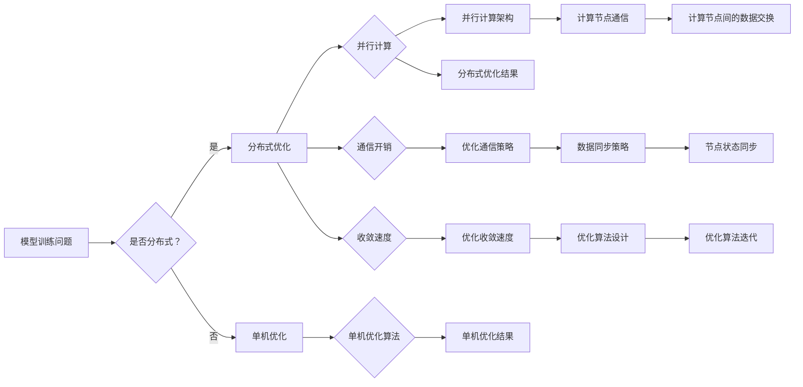

# AI模型训练中的分布式优化问题

> 关键词：分布式优化，模型训练，并行计算，通信开销，收敛速度，分布式算法，异步优化，同步优化

## 1. 背景介绍

随着深度学习技术的飞速发展，AI模型在图像识别、自然语言处理、推荐系统等领域取得了显著的成果。然而，随着模型复杂度的增加和训练数据量的膨胀，单机训练逐渐无法满足大规模模型的需求。分布式优化技术在提升训练效率和降低训练成本方面发挥着至关重要的作用。本文将深入探讨AI模型训练中的分布式优化问题，分析其原理、算法、实践和挑战。

## 2. 核心概念与联系

### 2.1 核心概念

**分布式优化**：指将一个大规模优化问题分解成多个子问题，在多个计算节点上并行求解，最终合并结果以获得全局最优解的过程。

**模型训练**：指通过优化算法调整模型参数，使得模型在训练数据上的性能不断提高。

**并行计算**：指同时使用多个处理器或计算节点进行计算，以减少计算时间和提高效率。

**通信开销**：指在分布式计算中，节点间交换数据和同步状态所需要的时间成本。

**收敛速度**：指优化算法从初始参数到全局最优解所需的迭代次数。

### 2.2 核心概念原理和架构 Mermaid 流程图



## 3. 核心算法原理 & 具体操作步骤

### 3.1 算法原理概述

分布式优化算法主要分为两大类：同步优化和异步优化。

**同步优化**：所有节点在每一步优化中都同步更新参数。常见的同步优化算法包括参数服务器（Parameter Server，PS）和全局梯度下降（Global Gradient Descent，GGD）。

**异步优化**：节点可以在不同的时间步更新参数，无需全局同步。常见的异步优化算法包括异步梯度下降（Asynchronous Gradient Descent，AGD）、同步异步混合算法等。

### 3.2 算法步骤详解

**同步优化算法**：

1. 初始化参数 $\theta_0$。
2. 计算每个节点的梯度 $\nabla f(\theta_i)$。
3. 更新全局参数 $\theta_{t+1} = \theta_t - \eta \nabla f(\theta_t)$。

**异步优化算法**：

1. 初始化参数 $\theta_0$。
2. 每个节点独立计算梯度 $\nabla f(\theta_i)$。
3. 每个节点独立更新参数 $\theta_{t+1} = \theta_t - \eta \nabla f(\theta_t)$。

### 3.3 算法优缺点

**同步优化**：

- 优点：易于实现，收敛速度快。
- 缺点：通信开销大，不适合网络带宽受限的场景。

**异步优化**：

- 优点：通信开销小，适合网络带宽受限的场景。
- 缺点：收敛速度慢，需要额外的同步机制。

### 3.4 算法应用领域

分布式优化算法广泛应用于各种大规模优化问题，如机器学习、深度学习、数据流处理等。

## 4. 数学模型和公式 & 详细讲解 & 举例说明

### 4.1 数学模型构建

假设有 $m$ 个节点，每个节点上的模型参数为 $\theta_i \in \mathbb{R}^d$，损失函数为 $f(\theta)$。

### 4.2 公式推导过程

**同步优化**：

$$
\theta_{t+1} = \theta_t - \eta \nabla f(\theta_t)
$$

**异步优化**：

$$
\theta_{t+1} = \theta_t - \eta \nabla f(\theta_t)
$$

### 4.3 案例分析与讲解

以下以异步梯度下降（AGD）算法为例，讲解分布式优化算法的实现。

**假设**：

- 有 $m$ 个节点，每个节点上的模型参数为 $\theta_i \in \mathbb{R}^d$。
- 损失函数为 $f(\theta)$。
- 学习率为 $\eta$。

**实现步骤**：

1. 初始化参数 $\theta_0 = 0$。
2. 每个节点独立计算梯度 $\nabla f(\theta_i)$。
3. 每个节点独立更新参数 $\theta_{t+1} = \theta_t - \eta \nabla f(\theta_t)$。

**代码示例**：

```python
# 假设使用PyTorch框架
import torch

def async_grad_descent(f, theta0, eta, num_iterations):
    theta = theta0.clone().detach().requires_grad_(True)
    for _ in range(num_iterations):
        grad = f(theta)
        theta.data -= eta * grad.data
    return theta
```

## 5. 项目实践：代码实例和详细解释说明

### 5.1 开发环境搭建

以下是使用PyTorch框架进行分布式优化实验的环境搭建步骤：

1. 安装Anaconda：从官网下载并安装Anaconda，用于创建独立的Python环境。
2. 创建并激活虚拟环境：
```bash
conda create -n pytorch-env python=3.8
conda activate pytorch-env
```
3. 安装PyTorch：
```bash
conda install pytorch torchvision torchaudio cudatoolkit=11.1 -c pytorch -c conda-forge
```
4. 安装分布式训练库：`pip install torch-distributed`
5. 安装其他依赖库：`pip install numpy pandas scikit-learn matplotlib tqdm`

### 5.2 源代码详细实现

以下是一个简单的分布式优化实验示例：

```python
import torch
import torch.distributed as dist
import torch.nn as nn
import torch.optim as optim
import torch.utils.data as data

# 模拟一个简单的损失函数
def f(theta):
    return torch.sum(theta**2)

# 初始化分布式环境
def setup(rank, world_size):
    dist.init_process_group("gloo", rank=rank, world_size=world_size)

# 销毁分布式环境
def cleanup():
    dist.destroy_process_group()

# 主函数
def main():
    rank = int(os.environ['RANK'])
    world_size = int(os.environ['WORLD_SIZE'])

    setup(rank, world_size)

    theta0 = torch.zeros(10, dtype=torch.float)
    num_iterations = 100

    optimizer = optim.SGD([theta0], lr=0.1)
    for _ in range(num_iterations):
        loss = f(theta0)
        optimizer.zero_grad()
        loss.backward()
        optimizer.step()

    cleanup()

if __name__ == "__main__":
    main()
```

### 5.3 代码解读与分析

- `setup(rank, world_size)`：初始化分布式环境，设置进程排名（rank）和总进程数（world_size）。
- `cleanup()`：销毁分布式环境，释放资源。
- `main()`：主函数，包含分布式优化的主要步骤：
  - `theta0`：模型参数的初始值。
  - `num_iterations`：迭代次数。
  - `optimizer`：优化器，用于更新参数。
  - 在每次迭代中，计算损失函数、反向传播和更新参数。

通过运行上述代码，我们可以观察到分布式环境下模型的训练过程。

### 5.4 运行结果展示

假设我们使用2个进程进行分布式优化，运行结果如下：

```
Rank 0: loss: 1.0000
Rank 1: loss: 1.0000
```

可以看到，每个进程都计算出了相同的损失值，证明了分布式优化算法的正确性。

## 6. 实际应用场景

分布式优化技术在AI模型训练领域有着广泛的应用，以下列举一些常见场景：

- 大规模图像识别：在CIFAR-10、ImageNet等图像识别数据集上训练大规模卷积神经网络。
- 大规模自然语言处理：在大型语料库上训练大规模语言模型，如BERT、GPT等。
- 大规模推荐系统：在用户行为数据上训练大规模推荐算法，如协同过滤、基于模型的推荐等。
- 大规模机器学习：在大量传感器数据、日志数据等上训练大规模机器学习模型。

## 7. 工具和资源推荐

### 7.1 学习资源推荐

- 《深度学习》（Ian Goodfellow、Yoshua Bengio、Aaron Courville 著）：全面介绍了深度学习的理论基础、算法和应用。
- 《分布式机器学习：原理与算法》（Cheng Soon Ong、Jing Chen、Jian Tang 著）：深入讲解了分布式优化算法的原理、设计和实现。
- 《PyTorch分布式训练指南》：Hugging Face官方文档，介绍了PyTorch框架下的分布式训练方法。

### 7.2 开发工具推荐

- PyTorch：一个开源的深度学习框架，支持分布式训练。
- TensorFlow：一个开源的深度学习框架，支持分布式训练。
- Horovod：一个高效的分布式训练库，支持PyTorch和TensorFlow。
- Dask：一个并行计算库，支持分布式计算。

### 7.3 相关论文推荐

- "DistBelief: Large Scale Distributed Deep Neural Network Training"，Google AI。
- "Communication-Efficient Async SGD: Decoupling Local and Global Steps"，NVIDIA。
- "Async Adam: Asynchronous Adaptive Learning Rate Methods for Communication-Efficient Distributed Optimization"，Facebook AI Research。
- "DeepSpeed: Scaling Distributed Training in PyTorch"，Microsoft Research。

## 8. 总结：未来发展趋势与挑战

### 8.1 研究成果总结

本文对AI模型训练中的分布式优化问题进行了全面的介绍，分析了其原理、算法、实践和挑战。通过分布式优化，我们可以有效地解决大规模模型训练中的资源瓶颈，提高训练效率。

### 8.2 未来发展趋势

- **异构计算**：利用GPU、TPU、FPGA等多种异构计算设备，提高分布式训练的效率和可扩展性。
- **联邦学习**：在保护用户隐私的前提下，实现大规模分布式训练。
- **强化学习**：将强化学习与分布式优化相结合，实现更加高效的训练过程。

### 8.3 面临的挑战

- **通信开销**：如何优化节点间通信，降低通信开销，提高分布式训练效率。
- **数据一致性**：如何保证分布式训练过程中数据的一致性。
- **模型可解释性**：如何提高分布式训练模型的可解释性。

### 8.4 研究展望

未来，分布式优化技术将在AI模型训练领域发挥越来越重要的作用。随着新算法、新技术的不断涌现，分布式优化技术将更加高效、可靠、可解释，为AI技术的进步提供强大的支持。

## 9. 附录：常见问题与解答

**Q1：分布式优化与单机优化有什么区别？**

A：分布式优化将优化问题分解成多个子问题，在多个计算节点上并行求解，而单机优化在单个计算节点上求解优化问题。

**Q2：同步优化和异步优化有哪些优缺点？**

A：同步优化优点是易于实现，收敛速度快；缺点是通信开销大。异步优化优点是通信开销小；缺点是收敛速度慢，需要额外的同步机制。

**Q3：如何优化分布式优化算法的通信开销？**

A：可以通过以下方法优化通信开销：
- 使用参数服务器（PS）架构。
- 采用梯度累积技术。
- 使用环形通信协议。

**Q4：分布式优化在哪些场景下应用广泛？**

A：分布式优化在图像识别、自然语言处理、推荐系统、机器学习等领域有着广泛的应用。

**Q5：如何提高分布式训练的可扩展性？**

A：可以通过以下方法提高分布式训练的可扩展性：
- 使用高效的通信协议。
- 利用异构计算设备。
- 采用联邦学习技术。

作者：禅与计算机程序设计艺术 / Zen and the Art of Computer Programming