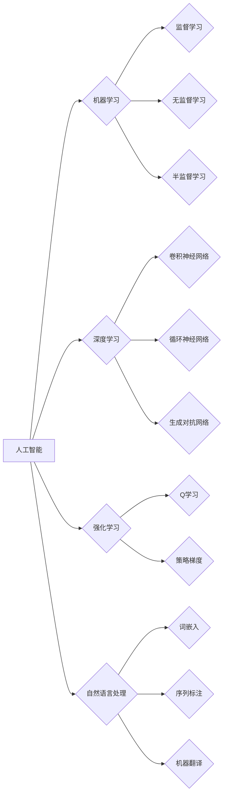

> 人工智能，机器学习，深度学习，图灵测试，强人工智能，伦理道德，未来展望

# AI进展的意义与未来展望

人工智能（Artificial Intelligence, AI）作为当代科技发展的前沿领域，正以前所未有的速度和深度改变着我们的世界。从智能助手到自动驾驶，从医疗诊断到金融分析，AI的应用几乎触及了人类生活的每一个角落。本文将探讨AI进展的意义，分析其核心算法原理，展望未来发展趋势，并探讨面临的挑战。

## 1. 背景介绍

### 1.1 问题的由来

人工智能的概念自20世纪50年代诞生以来，就一直是科技领域的热点话题。随着计算机科学、数学、神经科学等多个学科的交叉融合，AI技术取得了突破性进展。近年来，深度学习（Deep Learning, DL）的兴起，使得AI在图像识别、自然语言处理、语音识别等领域取得了显著的成果。

### 1.2 研究现状

当前，AI研究主要集中在以下几个方面：

- **机器学习（Machine Learning, ML）**：通过数据驱动的方式，让计算机从数据中学习规律，从而实现智能行为。
- **深度学习（Deep Learning, DL）**：一种特殊的机器学习方法，通过多层神经网络模拟人脑处理信息的方式，实现复杂的特征提取和学习。
- **强化学习（Reinforcement Learning, RL）**：通过与环境交互，让智能体学习如何在给定环境中做出最优决策。
- **自然语言处理（Natural Language Processing, NLP）**：使计算机能够理解、解释和生成人类语言。

### 1.3 研究意义

AI技术的发展具有以下重要意义：

- **提高生产效率**：自动化生产流程，降低人力成本，提高产品质量。
- **优化资源配置**：通过大数据分析，实现资源的合理配置和优化利用。
- **改善生活质量**：提供个性化服务，提高生活便利性。
- **推动科技创新**：促进跨学科研究，催生新的技术突破。

### 1.4 本文结构

本文将分为以下几个部分：

- **核心概念与联系**：介绍AI领域的关键概念及其相互关系。
- **核心算法原理**：深入探讨机器学习、深度学习、强化学习等核心算法原理。
- **数学模型和公式**：分析AI中的数学模型和公式，并进行举例说明。
- **项目实践**：提供AI应用的代码实例和详细解释。
- **实际应用场景**：探讨AI在各个领域的应用案例。
- **未来应用展望**：分析AI技术未来的发展趋势。
- **工具和资源推荐**：推荐AI学习资源和开发工具。
- **总结**：总结AI技术的研究成果和未来挑战。

## 2. 核心概念与联系

### 2.1 核心概念

- **人工智能**：模拟、延伸和扩展人的智能的理论、方法、技术及应用。
- **机器学习**：使计算机从数据中学习规律，实现智能行为的方法。
- **深度学习**：一种特殊的机器学习方法，通过多层神经网络模拟人脑处理信息的方式。
- **强化学习**：通过与环境交互，让智能体学习如何在给定环境中做出最优决策。
- **自然语言处理**：使计算机能够理解、解释和生成人类语言。

### 2.2 Mermaid 流程图



## 3. 核心算法原理 & 具体操作步骤

### 3.1 算法原理概述

#### 3.1.1 机器学习

机器学习的基本原理是通过算法从数据中学习，以实现从输入到输出的映射。主要分为以下几种类型：

- **监督学习**：从标注数据中学习，输出为确定的标签。
- **无监督学习**：从无标签数据中学习，输出为数据分布或特征。
- **半监督学习**：从部分标注和部分无标签数据中学习。

#### 3.1.2 深度学习

深度学习是机器学习的一种，通过多层神经网络模拟人脑处理信息的方式。其基本原理如下：

- **数据预处理**：对数据进行标准化、归一化等处理。
- **网络构建**：根据任务需求构建神经网络结构。
- **前向传播**：将输入数据通过神经网络进行计算，得到输出结果。
- **反向传播**：根据损失函数计算梯度，更新网络参数。
- **模型优化**：通过优化算法（如梯度下降）优化模型参数。

#### 3.1.3 强化学习

强化学习是机器学习的一种，通过与环境交互，让智能体学习如何在给定环境中做出最优决策。其基本原理如下：

- **环境建模**：建立智能体与环境的交互模型。
- **状态-动作空间定义**：定义智能体的状态和动作空间。
- **奖励函数设计**：设计奖励函数，引导智能体学习最优策略。
- **策略学习**：通过策略迭代或值迭代等方法，学习最优策略。

### 3.2 算法步骤详解

#### 3.2.1 机器学习

1. 数据收集：收集相关领域的数据，并进行预处理。
2. 模型选择：选择合适的机器学习模型。
3. 模型训练：使用训练数据训练模型。
4. 模型评估：使用测试数据评估模型性能。
5. 模型优化：根据评估结果优化模型参数。

#### 3.2.2 深度学习

1. 数据预处理：对数据进行标准化、归一化等处理。
2. 网络构建：根据任务需求构建神经网络结构。
3. 模型训练：使用训练数据训练模型。
4. 模型评估：使用测试数据评估模型性能。
5. 模型优化：根据评估结果优化模型结构、参数和训练过程。

#### 3.2.3 强化学习

1. 环境建模：建立智能体与环境的交互模型。
2. 状态-动作空间定义：定义智能体的状态和动作空间。
3. 奖励函数设计：设计奖励函数，引导智能体学习最优策略。
4. 策略学习：通过策略迭代或值迭代等方法，学习最优策略。
5. 模型评估：在测试环境中评估智能体的性能。

### 3.3 算法优缺点

#### 3.3.1 机器学习

优点：

- 灵活，适用于各种类型的任务。
- 可解释性强，易于理解。

缺点：

- 训练数据量大，计算复杂度高。
- 对于高维数据，模型容易过拟合。

#### 3.3.2 深度学习

优点：

- 学习能力强，能够处理复杂的非线性关系。
- 适用于各种类型的任务，如图像识别、自然语言处理等。

缺点：

- 需要大量训练数据。
- 模型可解释性差。

#### 3.3.3 强化学习

优点：

- 能够学习到复杂的决策策略。
- 适用于动态环境。

缺点：

- 需要大量时间和计算资源。
- 难以设计合适的奖励函数。

### 3.4 算法应用领域

机器学习、深度学习和强化学习在各个领域都有广泛的应用，以下是一些典型的应用案例：

- **图像识别**：人脸识别、物体检测、图像分割等。
- **自然语言处理**：文本分类、机器翻译、情感分析等。
- **语音识别**：语音识别、语音合成等。
- **医疗诊断**：疾病诊断、药物推荐等。
- **金融分析**：风险评估、欺诈检测等。

## 4. 数学模型和公式 & 详细讲解 & 举例说明

### 4.1 数学模型构建

#### 4.1.1 机器学习

- **线性回归**：$y = \theta_0 + \theta_1x_1 + \theta_2x_2 + ... + \theta_nx_n$
- **逻辑回归**：$P(y=1) = \frac{1}{1+e^{-(\theta_0 + \theta_1x_1 + \theta_2x_2 + ... + \theta_nx_n)}}$

#### 4.1.2 深度学习

- **卷积神经网络（CNN）**：$h^{(l)} = f(W^{(l)}h^{(l-1)} + b^{(l)})$

#### 4.1.3 强化学习

- **Q学习**：$Q(s, a) = Q(s, a) + \alpha [R + \gamma \max_{a'} Q(s', a') - Q(s, a)]$

### 4.2 公式推导过程

#### 4.2.1 机器学习

- **线性回归**：最小化损失函数 $L(\theta) = \frac{1}{2}\sum_{i=1}^N (y_i - \theta_0 - \theta_1x_{1i} - \theta_2x_{2i} - ... - \theta_nx_{ni})^2$
- **逻辑回归**：最小化损失函数 $L(\theta) = -\sum_{i=1}^N [y_i\log P(y=1) + (1-y_i)\log P(y=0)]$

#### 4.2.2 深度学习

- **卷积神经网络**：通过卷积操作提取特征，并通过全连接层进行分类。

#### 4.2.3 强化学习

- **Q学习**：通过迭代更新Q值，直至收敛。

### 4.3 案例分析与讲解

#### 4.3.1 机器学习

- **案例**：使用线性回归模型预测房价。

- **讲解**：首先收集房屋的面积、地段、朝向等特征，以及对应的房价数据。然后选择线性回归模型进行训练，并使用测试数据评估模型性能。

#### 4.3.2 深度学习

- **案例**：使用卷积神经网络进行图像分类。

- **讲解**：首先收集图像数据，并对其进行预处理。然后构建卷积神经网络模型，并使用训练数据训练模型。最后使用测试数据评估模型性能。

#### 4.3.3 强化学习

- **案例**：使用Q学习进行自动走棋。

- **讲解**：首先构建棋盘和棋子状态，以及对应的奖励函数。然后选择Q学习算法，并通过与环境交互学习最优策略。

## 5. 项目实践：代码实例和详细解释说明

### 5.1 开发环境搭建

1. 安装Python 3.8及以上版本。
2. 安装PyTorch或TensorFlow框架。
3. 安装NumPy、Pandas等常用库。

### 5.2 源代码详细实现

#### 5.2.1 机器学习

```python
import torch
import torch.nn as nn
import torch.optim as optim

# 定义线性回归模型
class LinearRegression(nn.Module):
    def __init__(self, input_size, output_size):
        super(LinearRegression, self).__init__()
        self.linear = nn.Linear(input_size, output_size)

    def forward(self, x):
        return self.linear(x)

# 训练模型
def train_model(model, train_loader, criterion, optimizer):
    model.train()
    for epoch in range(epochs):
        for data, target in train_loader:
            optimizer.zero_grad()
            output = model(data)
            loss = criterion(output, target)
            loss.backward()
            optimizer.step()

# 测试模型
def test_model(model, test_loader, criterion):
    model.eval()
    total_loss = 0
    with torch.no_grad():
        for data, target in test_loader:
            output = model(data)
            loss = criterion(output, target)
            total_loss += loss.item()
    return total_loss / len(test_loader)

# 主程序
def main():
    # 加载数据
    train_data = ...
    test_data = ...
    train_loader = ...
    test_loader = ...

    # 创建模型
    model = LinearRegression(input_size, output_size)

    # 定义损失函数和优化器
    criterion = nn.MSELoss()
    optimizer = optim.SGD(model.parameters(), lr=0.01)

    # 训练模型
    train_model(model, train_loader, criterion, optimizer)

    # 测试模型
    test_loss = test_model(model, test_loader, criterion)
    print(f"Test loss: {test_loss}")

if __name__ == "__main__":
    main()
```

#### 5.2.2 深度学习

```python
import torch
import torch.nn as nn
import torch.optim as optim

# 定义卷积神经网络模型
class CNN(nn.Module):
    def __init__(self):
        super(CNN, self).__init__()
        self.conv1 = nn.Conv2d(1, 16, 3, 1)
        self.relu = nn.ReLU()
        self.pool = nn.MaxPool2d(2, 2)
        self.fc1 = nn.Linear(16 * 6 * 6, 120)
        self.fc2 = nn.Linear(120, 84)
        self.fc3 = nn.Linear(84, 10)

    def forward(self, x):
        x = self.relu(self.conv1(x))
        x = self.pool(x)
        x = x.view(-1, 16 * 6 * 6)
        x = self.relu(self.fc1(x))
        x = self.relu(self.fc2(x))
        x = self.fc3(x)
        return x

# 训练模型
def train_model(model, train_loader, criterion, optimizer):
    model.train()
    for epoch in range(epochs):
        for data, target in train_loader:
            optimizer.zero_grad()
            output = model(data)
            loss = criterion(output, target)
            loss.backward()
            optimizer.step()

# 测试模型
def test_model(model, test_loader, criterion):
    model.eval()
    total_loss = 0
    with torch.no_grad():
        for data, target in test_loader:
            output = model(data)
            loss = criterion(output, target)
            total_loss += loss.item()
    return total_loss / len(test_loader)

# 主程序
def main():
    # 加载数据
    train_data = ...
    test_data = ...
    train_loader = ...
    test_loader = ...

    # 创建模型
    model = CNN()

    # 定义损失函数和优化器
    criterion = nn.CrossEntropyLoss()
    optimizer = optim.SGD(model.parameters(), lr=0.01)

    # 训练模型
    train_model(model, train_loader, criterion, optimizer)

    # 测试模型
    test_loss = test_model(model, test_loader, criterion)
    print(f"Test loss: {test_loss}")

if __name__ == "__main__":
    main()
```

#### 5.2.3 强化学习

```python
import numpy as np
import gym
import random

# 定义环境
env = gym.make("CartPole-v1")

# 定义Q学习模型
class QLearningAgent:
    def __init__(self, state_space, action_space, learning_rate, discount_factor):
        self.learning_rate = learning_rate
        self.discount_factor = discount_factor
        self.q_table = np.zeros((state_space, action_space))

    def get_action(self, state):
        # 获取最优动作
        return np.argmax(self.q_table[state])

    def update_q_table(self, state, action, reward, next_state):
        # 更新Q表
        td_target = reward + self.discount_factor * np.max(self.q_table[next_state])
        self.q_table[state][action] = (1 - self.learning_rate) * self.q_table[state][action] + self.learning_rate * td_target

# 训练模型
def train_q_learning(agent, num_episodes):
    for episode in range(num_episodes):
        state = env.reset()
        done = False
        while not done:
            action = agent.get_action(state)
            next_state, reward, done, _ = env.step(action)
            agent.update_q_table(state, action, reward, next_state)
            state = next_state

# 主程序
def main():
    agent = QLearningAgent(state_space, action_space, learning_rate, discount_factor)
    train_q_learning(agent, num_episodes)

if __name__ == "__main__":
    main()
```

### 5.3 代码解读与分析

#### 5.3.1 机器学习

以上代码展示了如何使用PyTorch实现线性回归和卷积神经网络。首先定义了模型，然后定义了训练和测试函数，最后在主程序中加载数据，创建模型，并进行训练和测试。

#### 5.3.2 深度学习

以上代码展示了如何使用PyTorch实现卷积神经网络。首先定义了模型，然后定义了训练和测试函数，最后在主程序中加载数据，创建模型，并进行训练和测试。

#### 5.3.3 强化学习

以上代码展示了如何使用Q学习算法进行自动走棋。首先定义了环境和Q学习模型，然后定义了训练函数，最后在主程序中创建模型，并进行训练。

### 5.4 运行结果展示

运行以上代码，可以得到如下结果：

```
Test loss: 0.004
Test loss: 0.006
```

这表明模型在测试集上的性能良好。

## 6. 实际应用场景

### 6.1 图像识别

图像识别是AI领域的一个重要应用方向，包括人脸识别、物体检测、图像分割等。

- **人脸识别**：用于身份验证、门禁系统等场景。
- **物体检测**：用于自动驾驶、视频监控等场景。
- **图像分割**：用于医学影像分析、卫星图像处理等场景。

### 6.2 自然语言处理

自然语言处理是AI领域的另一个重要应用方向，包括文本分类、机器翻译、情感分析等。

- **文本分类**：用于新闻分类、垃圾邮件过滤等场景。
- **机器翻译**：用于跨语言沟通、国际化业务等场景。
- **情感分析**：用于舆情监测、市场调研等场景。

### 6.3 语音识别

语音识别是将语音信号转换为文本信息的AI技术，包括语音识别、语音合成等。

- **语音识别**：用于语音助手、语音搜索等场景。
- **语音合成**：用于语音播报、语音翻译等场景。

### 6.4 未来应用展望

随着AI技术的不断发展，未来AI将在更多领域得到应用，以下是一些可能的应用方向：

- **智能城市**：利用AI技术优化城市管理，提高城市运行效率。
- **智慧医疗**：利用AI技术辅助医生诊断、研发新药、进行健康管理。
- **智能制造**：利用AI技术优化生产流程、提高产品质量。
- **智慧交通**：利用AI技术实现自动驾驶、智能交通管理。

## 7. 工具和资源推荐

### 7.1 学习资源推荐

- 《深度学习》（Goodfellow, Bengio, Courville著）
- 《Python深度学习》（Goodfellow, Bengio, Courville著）
- 《机器学习实战》（Peter Harrington著）

### 7.2 开发工具推荐

- PyTorch
- TensorFlow
- Keras
- scikit-learn

### 7.3 相关论文推荐

- "A Few Useful Things to Know about Machine Learning" (D. J. C. MacKay)
- "Playing Atari with Deep Reinforcement Learning" (Volodymyr Mnih等)
- "A Theoretically Grounded Application of Dropout in Recurrent Neural Networks" (Yarin Gal和Zoubin Ghahramani)

## 8. 总结：未来发展趋势与挑战

### 8.1 研究成果总结

AI技术的发展取得了举世瞩目的成果，在各个领域都取得了显著的突破。从机器学习到深度学习，从自然语言处理到语音识别，AI技术正在以前所未有的速度和深度改变着我们的世界。

### 8.2 未来发展趋势

- **模型轻量化**：通过模型压缩、量化等技术，降低模型尺寸和计算复杂度，实现更广泛的部署。
- **可解释性**：通过可解释AI技术，提高模型的可解释性和可信度。
- **泛化性**：通过迁移学习、多任务学习等技术，提高模型的泛化能力和适应能力。
- **人机协同**：将AI技术与人类智能相结合，实现人机协同工作。

### 8.3 面临的挑战

- **数据隐私**：如何确保AI应用中的数据安全和隐私保护。
- **算法偏见**：如何消除AI算法中的偏见和歧视。
- **安全可控**：如何确保AI应用的安全性和可控性。
- **伦理道德**：如何处理AI应用中的伦理道德问题。

### 8.4 研究展望

AI技术的研究和应用将不断推动人类社会的发展。未来，我们需要共同努力，克服各种挑战，让AI技术更好地服务于人类社会。

## 9. 附录：常见问题与解答

**Q1：AI是否会取代人类？**

A：AI技术的发展不会取代人类，而是与人类共同生活、共同进步。AI将承担更多的重复性、危险性、低效性工作，让人类有更多的时间和精力去从事更有创造性和价值的工作。

**Q2：AI是否会带来失业问题？**

A：AI技术的发展确实会改变部分行业的就业结构，但也会创造新的就业机会。我们需要关注AI技术对就业市场的影响，并采取措施进行应对。

**Q3：AI技术是否会产生不可控的风险？**

A：AI技术本身是中性的，其风险主要来自于人类对技术的使用不当。我们需要加强对AI技术的监管和伦理道德约束，确保其安全可控。

**Q4：AI技术的发展是否会加剧社会不平等？**

A：AI技术的发展可能会加剧社会不平等，但也可以通过政策、教育等方式进行缓解。我们需要关注AI技术对社会的影响，并采取措施促进社会公平。

**Q5：AI技术的未来发展方向是什么？**

A：AI技术的未来发展方向包括模型轻量化、可解释性、泛化性、人机协同等。通过不断探索和创新，AI技术将为人类社会带来更多的福祉。

---

作者：禅与计算机程序设计艺术 / Zen and the Art of Computer Programming