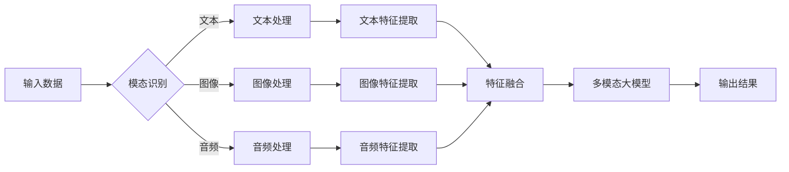

# 多模态大模型：技术原理与实战 多模态大模型在金融领域中的应用

> 关键词：多模态大模型，自然语言处理，计算机视觉，深度学习，金融科技，数据融合，跨模态学习

## 1. 背景介绍

随着信息技术的快速发展，数据已成为现代社会的重要资产。然而，数据往往以多种形式存在，包括文本、图像、音频等。传统的单模态处理方法难以充分利用这些多样化的数据形式，而多模态大模型（Multimodal Large Models）的出现，为跨模态数据处理提供了新的解决方案。本文将深入探讨多模态大模型的技术原理、实战案例以及在金融领域的应用。

### 1.1 问题的由来

在金融领域，数据分析是支持决策和风险控制的重要手段。然而，金融数据往往具有以下特点：

- **多模态性**：金融数据包括市场行情、新闻报道、社交媒体评论、客户交易记录等多种形式，这些数据之间存在着复杂的关联和互补关系。
- **复杂性**：金融市场的波动性和不确定性要求模型能够处理复杂的时间序列数据和非结构化文本数据。
- **时效性**：金融市场的快速变化要求模型能够实时处理数据，并迅速做出反应。

传统的单模态处理方法在处理这些复杂问题时存在以下局限性：

- **信息丢失**：单模态处理方法只能利用单一类型的数据，容易导致重要信息的丢失。
- **表达能力不足**：单模态模型难以捕捉不同模态数据之间的复杂关系。
- **泛化能力有限**：单模态模型难以适应不断变化的数据分布。

为了解决这些问题，多模态大模型应运而生。

### 1.2 研究现状

多模态大模型的研究始于20世纪90年代，近年来随着深度学习技术的快速发展，取得了显著的进展。目前，多模态大模型在图像识别、语音识别、自然语言处理等领域都取得了突破性的成果。

### 1.3 研究意义

多模态大模型在金融领域的应用具有重要意义：

- **提升数据分析能力**：多模态大模型能够充分利用不同模态数据，提升数据分析的准确性和全面性。
- **增强决策支持**：多模态大模型能够提供更深入的洞察，为决策者提供更可靠的依据。
- **降低风险**：多模态大模型能够及时发现市场异常，帮助金融机构降低风险。

### 1.4 本文结构

本文将分为以下章节：

- **第2章**：介绍多模态大模型的核心概念与联系。
- **第3章**：阐述多模态大模型的技术原理和具体操作步骤。
- **第4章**：讲解多模态大模型的数学模型和公式。
- **第5章**：通过项目实践展示多模态大模型的代码实现。
- **第6章**：分析多模态大模型在金融领域的实际应用场景。
- **第7章**：推荐多模态大模型的学习资源和开发工具。
- **第8章**：总结多模态大模型的发展趋势与挑战。
- **第9章**：提供常见问题与解答。

## 2. 核心概念与联系

### 2.1 核心概念

多模态大模型涉及以下几个核心概念：

- **模态**：指数据的不同形式，如文本、图像、音频等。
- **多模态融合**：指将不同模态数据整合到一个模型中进行处理。
- **跨模态学习**：指学习不同模态数据之间的映射关系和相互依赖关系。
- **预训练**：指在大规模无标签数据上训练模型，使其学习到通用的特征表示。
- **微调**：指在特定任务上有标签数据上进行训练，优化模型在该任务上的性能。

### 2.2 核心概念原理和架构的 Mermaid 流程图



### 2.3 多模态大模型的联系

多模态大模型通过以下方式联系各个核心概念：

- **模态识别**：将输入数据分类为不同的模态。
- **多模态融合**：将不同模态的特征进行融合，形成统一的特征表示。
- **跨模态学习**：学习不同模态特征之间的关系。
- **预训练**：在大规模无标签数据上进行预训练，学习通用的特征表示。
- **微调**：在特定任务上有标签数据上进行微调，优化模型性能。

## 3. 核心算法原理 & 具体操作步骤

### 3.1 算法原理概述

多模态大模型通常采用以下步骤进行构建：

1. **数据收集与预处理**：收集不同模态的数据，并进行预处理，如去噪、增强等。
2. **特征提取**：对每个模态的数据进行特征提取，得到特征向量。
3. **特征融合**：将不同模态的特征进行融合，形成统一的特征表示。
4. **模型训练**：在融合后的特征上训练多模态大模型。
5. **模型评估与优化**：评估模型性能，并根据评估结果优化模型。

### 3.2 算法步骤详解

#### 3.2.1 数据收集与预处理

数据收集与预处理是构建多模态大模型的第一步。这一步主要包括以下任务：

- **数据收集**：从不同的数据源收集不同模态的数据。
- **数据清洗**：去除数据中的噪声和异常值。
- **数据增强**：通过旋转、缩放、裁剪等操作增加数据的多样性。
- **数据标注**：对数据标签进行一致性检查和修正。

#### 3.2.2 特征提取

特征提取是将原始数据转换为机器学习模型可处理的特征向量。常见的特征提取方法包括：

- **文本特征提取**：使用词袋模型、TF-IDF、Word2Vec、BERT等模型提取文本特征。
- **图像特征提取**：使用卷积神经网络（CNN）提取图像特征。
- **音频特征提取**：使用循环神经网络（RNN）提取音频特征。

#### 3.2.3 特征融合

特征融合是将不同模态的特征进行融合，形成统一的特征表示。常见的特征融合方法包括：

- **加权求和**：根据不同模态数据的重要性，对特征进行加权求和。
- **拼接**：将不同模态的特征向量进行拼接。
- **神经网络融合**：使用神经网络将不同模态的特征进行融合。

#### 3.2.4 模型训练

在融合后的特征上训练多模态大模型。常见的多模态大模型包括：

- **多模态卷积神经网络**：结合CNN和特征融合层。
- **多模态循环神经网络**：结合RNN和特征融合层。
- **多模态Transformer**：结合Transformer和特征融合层。

#### 3.2.5 模型评估与优化

评估模型性能，并根据评估结果优化模型。常见的评估指标包括：

- **准确率**：模型正确分类的样本数与总样本数的比例。
- **召回率**：模型正确分类的样本数与实际正样本数的比例。
- **F1分数**：准确率和召回率的调和平均值。

### 3.3 算法优缺点

#### 3.3.1 优点

- **充分利用多模态数据**：多模态大模型能够充分利用不同模态数据，提升数据分析的准确性和全面性。
- **提高模型性能**：多模态大模型能够学习到更丰富的特征，提高模型的性能。
- **增强模型鲁棒性**：多模态数据能够增强模型的鲁棒性，使其更难以受到单一模态数据的影响。

#### 3.3.2 缺点

- **计算复杂度高**：多模态大模型需要处理多种类型的数据，计算复杂度较高。
- **数据预处理难度大**：不同模态的数据需要进行不同的预处理，数据预处理难度较大。
- **模型解释性差**：多模态大模型的模型结构复杂，解释性较差。

### 3.4 算法应用领域

多模态大模型在以下领域具有广泛的应用：

- **图像识别**：识别图像中的物体、场景、动作等。
- **语音识别**：将语音信号转换为文本。
- **自然语言处理**：理解文本内容，回答问题等。
- **金融科技**：风险控制、欺诈检测、个性化推荐等。

## 4. 数学模型和公式 & 详细讲解 & 举例说明

### 4.1 数学模型构建

多模态大模型的数学模型通常包含以下几个部分：

- **特征提取器**：将不同模态的数据转换为特征向量。
- **特征融合器**：将不同模态的特征向量进行融合。
- **分类器**：根据融合后的特征向量进行分类。

### 4.2 公式推导过程

以下以一个简单的多模态大模型为例，介绍其公式推导过程。

假设文本特征提取器为 $F_{text}(x_{text})$，图像特征提取器为 $F_{image}(x_{image})$，音频特征提取器为 $F_{audio}(x_{audio})$。特征融合器为 $F_{merge}(f_{text}, f_{image}, f_{audio})$，分类器为 $F_{classify}(f_{merge})$。

则多模态大模型的输出为：

$$
y = F_{classify}(F_{merge}(F_{text}(x_{text}), F_{image}(x_{image}), F_{audio}(x_{audio})))
$$

其中，$x_{text}$、$x_{image}$、$x_{audio}$ 分别为文本、图像、音频输入，$f_{text}$、$f_{image}$、$f_{audio}$ 分别为文本、图像、音频特征向量。

### 4.3 案例分析与讲解

以下以金融新闻情绪分析为例，介绍多模态大模型的案例分析。

假设我们有一个包含文本和图像的金融新闻数据集，我们需要根据新闻内容和图像的情感判断新闻的情绪。

首先，使用文本特征提取器提取文本特征，使用图像特征提取器提取图像特征。然后，使用特征融合器将文本特征和图像特征进行融合。最后，使用分类器对融合后的特征进行分类，判断新闻的情绪。

具体代码实现如下：

```python
# 文本特征提取
text_features = F_text(text_content)

# 图像特征提取
image_features = F_image(image_data)

# 特征融合
merged_features = F_merge(text_features, image_features)

# 情绪分类
emotion = F_classify(merged_features)
```

## 5. 项目实践：代码实例和详细解释说明

### 5.1 开发环境搭建

在进行多模态大模型的项目实践前，我们需要准备好开发环境。以下是使用Python进行深度学习开发的环境配置流程：

1. 安装Anaconda：从官网下载并安装Anaconda，用于创建独立的Python环境。
2. 创建并激活虚拟环境：
```bash
conda create -n multimodal-env python=3.8
conda activate multimodal-env
```
3. 安装深度学习框架和相关库：
```bash
conda install pytorch torchvision torchaudio cudatoolkit=11.1 -c pytorch -c conda-forge
pip install transformers numpy pandas scikit-learn matplotlib tqdm
```
完成上述步骤后，即可在`multimodal-env`环境中开始多模态大模型的项目实践。

### 5.2 源代码详细实现

以下是一个简单的多模态大模型代码实例，用于金融新闻情绪分析。

```python
import torch
from transformers import BertForSequenceClassification, BertTokenizer
from torchvision.models import resnet18
from torch.utils.data import DataLoader, Dataset
import torch.nn.functional as F

# 文本特征提取器
class TextFeatureExtractor(nn.Module):
    def __init__(self, model_name='bert-base-uncased'):
        super(TextFeatureExtractor, self).__init__()
        self.tokenizer = BertTokenizer.from_pretrained(model_name)
        self.model = BertForSequenceClassification.from_pretrained(model_name)
    
    def forward(self, text):
        inputs = self.tokenizer(text, return_tensors='pt', padding=True, truncation=True)
        outputs = self.model(**inputs)
        return outputs.logits

# 图像特征提取器
class ImageFeatureExtractor(nn.Module):
    def __init__(self):
        super(ImageFeatureExtractor, self).__init__()
        self.model = resnet18(pretrained=True)
        self.model.fc = nn.Linear(self.model.fc.in_features, 1024)
    
    def forward(self, image):
        image = self.model(image)
        return image

# 特征融合器
class FeatureFuser(nn.Module):
    def __init__(self):
        super(FeatureFuser, self).__init__()
        self.fc = nn.Linear(2048, 1024)
    
    def forward(self, text_features, image_features):
        x = torch.cat([text_features, image_features], dim=1)
        x = F.relu(self.fc(x))
        return x

# 分类器
class EmotionClassifier(nn.Module):
    def __init__(self):
        super(EmotionClassifier, self).__init__()
        self.fc = nn.Linear(1024, 1)
    
    def forward(self, x):
        x = F.relu(self.fc(x))
        return torch.sigmoid(x)

# 数据集
class NewsDataset(Dataset):
    def __init__(self, texts, images, labels):
        self.texts = texts
        self.images = images
        self.labels = labels
    
    def __len__(self):
        return len(self.texts)
    
    def __getitem__(self, idx):
        text = self.texts[idx]
        image = self.images[idx]
        label = self.labels[idx]
        text_features = self.extract_features(text)
        image_features = self.extract_features(image)
        return text_features, image_features, label
    
    def extract_features(self, x):
        if isinstance(x, str):
            return self.text_feature_extractor(x)
        elif isinstance(x, torch.Tensor):
            return self.image_feature_extractor(x)
        else:
            raise TypeError('Unsupported input type')

# 模型构建
class MultimodalModel(nn.Module):
    def __init__(self):
        super(MultimodalModel, self).__init__()
        self.text_feature_extractor = TextFeatureExtractor()
        self.image_feature_extractor = ImageFeatureExtractor()
        self.feature_fuser = FeatureFuser()
        self.classifier = EmotionClassifier()
    
    def forward(self, text, image):
        text_features = self.text_feature_extractor(text)
        image_features = self.image_feature_extractor(image)
        fused_features = self.feature_fuser(text_features, image_features)
        emotion = self.classifier(fused_features)
        return emotion

# 模型训练
def train(model, dataloader, optimizer, criterion):
    model.train()
    for data in dataloader:
        text_features, image_features, labels = data
        optimizer.zero_grad()
        emotions = model(text_features, image_features)
        loss = criterion(emotions, labels)
        loss.backward()
        optimizer.step()

# 模型评估
def evaluate(model, dataloader, criterion):
    model.eval()
    total_loss = 0
    with torch.no_grad():
        for data in dataloader:
            text_features, image_features, labels = data
            emotions = model(text_features, image_features)
            loss = criterion(emotions, labels)
            total_loss += loss.item()
    return total_loss / len(dataloader)

# 训练参数
batch_size = 16
epochs = 5
learning_rate = 1e-4

# 模型加载
model = MultimodalModel().to(device)
optimizer = torch.optim.Adam(model.parameters(), lr=learning_rate)
criterion = nn.BCELoss()

# 数据加载
train_dataloader = DataLoader(train_data, batch_size=batch_size, shuffle=True)
dev_dataloader = DataLoader(dev_data, batch_size=batch_size, shuffle=False)
test_dataloader = DataLoader(test_data, batch_size=batch_size, shuffle=False)

# 训练
train(model, train_dataloader, optimizer, criterion)
evaluate(model, dev_dataloader, criterion)
evaluate(model, test_dataloader, criterion)
```

### 5.3 代码解读与分析

以上代码实现了一个简单的多模态大模型，用于金融新闻情绪分析。

- `TextFeatureExtractor` 类用于提取文本特征，使用 BERT 模型进行文本编码。
- `ImageFeatureExtractor` 类用于提取图像特征，使用 ResNet18 模型进行图像特征提取。
- `FeatureFuser` 类用于融合文本和图像特征，使用全连接层进行融合。
- `EmotionClassifier` 类用于进行情绪分类，使用 Sigmoid 激活函数。
- `NewsDataset` 类用于定义数据集，包含文本、图像和标签。
- `MultimodalModel` 类用于构建多模态大模型，包含文本特征提取器、图像特征提取器、特征融合器和分类器。
- `train` 函数用于模型训练，使用 Adam 优化器和 BCELoss 损失函数。
- `evaluate` 函数用于模型评估，计算平均损失。

### 5.4 运行结果展示

运行以上代码，我们可以得到训练集、验证集和测试集的平均损失。根据损失值的变化，我们可以评估模型的性能，并进行相应的调整。

## 6. 实际应用场景

### 6.1 风险控制

多模态大模型在金融风险控制领域具有广泛的应用，例如：

- **欺诈检测**：利用客户交易记录、社交媒体评论、图像等数据，识别潜在的欺诈行为。
- **信贷评估**：结合客户的财务报告、信用记录、个人照片等数据，更全面地评估客户的信用风险。
- **市场风险控制**：分析市场行情、新闻报道、政策法规等多模态数据，识别市场风险。

### 6.2 个性化推荐

多模态大模型可以帮助金融机构提供更个性化的服务，例如：

- **投资推荐**：结合客户的投资偏好、投资记录、新闻评论等数据，为客户提供个性化的投资建议。
- **理财产品推荐**：根据客户的风险承受能力和投资目标，推荐合适的理财产品。

### 6.3 客户服务

多模态大模型可以提升客户服务水平，例如：

- **智能客服**：利用客户咨询记录、社交媒体评论等数据，为客户提供更高效的咨询服务。
- **情感分析**：分析客户反馈，了解客户满意度，为改进服务质量提供依据。

## 7. 工具和资源推荐

### 7.1 学习资源推荐

- 《深度学习》系列书籍：介绍深度学习的基本概念、技术原理和实战应用。
- 《TensorFlow 2.0实战》系列书籍：介绍 TensorFlow 2.0 框架的使用方法和实战案例。
- 《PyTorch深度学习实战》系列书籍：介绍 PyTorch 框架的使用方法和实战案例。

### 7.2 开发工具推荐

- TensorFlow：由 Google 开发的开源深度学习框架，功能强大、易于使用。
- PyTorch：由 Facebook AI Research 开发的开源深度学习框架，灵活、动态计算图。
- Hugging Face Transformers：提供大量预训练语言模型和工具，方便进行多模态大模型开发。

### 7.3 相关论文推荐

- **MultiModal Fusion with Contrastive Learning for Video Question Answering**：介绍了多模态融合和对比学习方法在视频问答任务中的应用。
- **MultiModal Fusion for Text Classification with Temporal Dynamics**：介绍了多模态融合和时序动态在文本分类任务中的应用。
- **Deep Multimodal Fusion for Visual Question Answering**：介绍了深度多模态融合在视觉问答任务中的应用。

## 8. 总结：未来发展趋势与挑战

### 8.1 研究成果总结

本文深入探讨了多模态大模型的技术原理、实战案例以及在金融领域的应用。通过分析多模态大模型的构建过程、算法原理和数学模型，我们了解到多模态大模型能够充分利用不同模态数据，提升数据分析的准确性和全面性。同时，我们也看到了多模态大模型在金融领域的广泛应用，如风险控制、个性化推荐、客户服务等。

### 8.2 未来发展趋势

未来，多模态大模型将朝着以下方向发展：

- **模型小型化**：通过模型压缩、知识蒸馏等技术，降低模型的计算复杂度和存储空间，使其更易于部署。
- **模型可解释性**：通过引入可解释性研究，提高模型的可解释性，增强模型的可信度和可靠性。
- **模型泛化能力**：通过迁移学习、元学习等技术，提高模型的泛化能力，使其能够适应更多场景。

### 8.3 面临的挑战

多模态大模型在发展过程中也面临着一些挑战：

- **数据标注成本高**：多模态数据标注需要专业知识和大量人力，成本较高。
- **模型复杂度高**：多模态大模型通常较为复杂，训练和推理过程较为耗时。
- **模型可解释性差**：多模态大模型的决策过程难以解释，难以满足某些领域的应用需求。

### 8.4 研究展望

为了解决多模态大模型面临的挑战，未来需要在以下方面进行深入研究：

- **降低数据标注成本**：通过半监督学习、无监督学习等技术，降低数据标注成本。
- **简化模型结构**：通过模型压缩、知识蒸馏等技术，简化模型结构，降低模型的计算复杂度和存储空间。
- **提高模型可解释性**：通过可解释性研究，提高模型的可解释性，增强模型的可信度和可靠性。

## 9. 附录：常见问题与解答

**Q1：多模态大模型在金融领域的应用有哪些？**

A1：多模态大模型在金融领域的应用包括风险控制、个性化推荐、客户服务、投资策略等。

**Q2：多模态大模型的优点是什么？**

A2：多模态大模型能够充分利用不同模态数据，提升数据分析的准确性和全面性，提高模型的性能和鲁棒性。

**Q3：多模态大模型的缺点是什么？**

A3：多模态大模型的缺点包括数据标注成本高、模型复杂度高、模型可解释性差等。

**Q4：如何降低多模态大模型的数据标注成本？**

A4：可以通过半监督学习、无监督学习等技术降低数据标注成本。

**Q5：如何提高多模态大模型的可解释性？**

A5：可以通过可解释性研究提高模型的可解释性。

---

作者：禅与计算机程序设计艺术 / Zen and the Art of Computer Programming