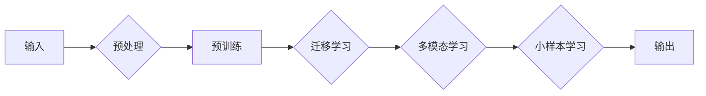

# 大模型的市场需求与技术发展

> 关键词：大模型，市场需求，技术发展，人工智能，深度学习，预训练，迁移学习，应用场景

## 1. 背景介绍

随着计算能力的提升和数据量的爆炸式增长，人工智能（AI）技术在过去几十年取得了惊人的进展。特别是深度学习在图像识别、语音识别、自然语言处理（NLP）等领域取得了显著的成果。近年来，大模型（Large Models）的概念逐渐兴起，成为AI技术发展的重要方向。本文将探讨大模型的市场需求、技术发展以及未来趋势。

### 1.1 问题的由来

传统的小型模型在特定任务上能够取得很好的效果，但它们通常缺乏泛化能力，难以适应不同的应用场景。大模型通过在大量数据上进行预训练，学习到丰富的知识，能够更好地泛化到新的任务上。因此，大模型在各个领域的应用需求日益增长。

### 1.2 研究现状

大模型的研究主要集中在以下几个方面：

- **预训练**：在大量无标注数据上训练模型，使其学习到丰富的语言、视觉、语音等知识。
- **迁移学习**：将预训练模型应用于新的任务，通过少量标注数据进一步优化模型。
- **多模态学习**：结合不同模态的数据，如文本、图像和语音，以提升模型的泛化能力。
- **小样本学习**：在少量标注数据上训练模型，使其能够泛化到新的任务。

### 1.3 研究意义

大模型的研究对于AI技术的发展具有重要意义：

- **提高模型泛化能力**：大模型能够在各种不同的任务上取得良好的效果，减少对标注数据的依赖。
- **推动AI技术产业化**：大模型的应用可以帮助企业降低研发成本，提高产品竞争力。
- **促进AI技术普及**：大模型的应用可以降低AI技术的使用门槛，让更多开发者能够使用AI技术。

## 2. 核心概念与联系

### 2.1 核心概念

- **大模型（Large Models）**：具有数十亿甚至千亿参数规模的深度学习模型。
- **预训练（Pre-training）**：在大量无标注数据上训练模型，使其学习到丰富的知识。
- **迁移学习（Transfer Learning）**：将预训练模型应用于新的任务，通过少量标注数据进一步优化模型。
- **多模态学习（Multimodal Learning）**：结合不同模态的数据，如文本、图像和语音，以提升模型的泛化能力。
- **小样本学习（Few-shot Learning）**：在少量标注数据上训练模型，使其能够泛化到新的任务。

### 2.2 Mermaid 流程图



## 3. 核心算法原理 & 具体操作步骤

### 3.1 算法原理概述

大模型的算法原理主要基于深度学习和迁移学习。深度学习通过多层神经网络学习数据中的特征和模式，迁移学习则利用预训练模型在特定任务上的知识来快速适应新任务。

### 3.2 算法步骤详解

1. **数据收集与预处理**：收集大量无标注数据，进行数据清洗、去重等预处理操作。
2. **预训练**：在预处理后的数据上训练模型，使其学习到丰富的知识。
3. **迁移学习**：将预训练模型应用于新的任务，通过少量标注数据进一步优化模型。
4. **多模态学习**：结合不同模态的数据，如文本、图像和语音，以提升模型的泛化能力。
5. **小样本学习**：在少量标注数据上训练模型，使其能够泛化到新的任务。

### 3.3 算法优缺点

**优点**：

- **泛化能力强**：大模型能够在各种不同的任务上取得良好的效果。
- **降低标注数据需求**：大模型在少量标注数据上也能取得不错的效果。
- **提高效率**：大模型的应用可以降低研发成本，提高产品竞争力。

**缺点**：

- **计算资源消耗大**：大模型需要大量的计算资源进行训练和推理。
- **数据需求量大**：大模型的训练需要大量的无标注数据。
- **模型可解释性差**：大模型的决策过程难以解释。

### 3.4 算法应用领域

大模型在以下领域得到了广泛的应用：

- **自然语言处理（NLP）**：文本分类、机器翻译、问答系统等。
- **计算机视觉**：图像识别、目标检测、图像生成等。
- **语音识别**：语音合成、语音识别、语音转文本等。

## 4. 数学模型和公式 & 详细讲解 & 举例说明

### 4.1 数学模型构建

大模型的数学模型通常基于深度学习模型，如卷积神经网络（CNN）和循环神经网络（RNN）。以下以CNN为例进行说明：

$$
\mathbf{h}^{(l)} = f(\mathbf{W}^{(l)}\mathbf{h}^{(l-1)} + \mathbf{b}^{(l)}) 
$$

其中，$\mathbf{h}^{(l)}$ 表示第 $l$ 层的输出，$\mathbf{W}^{(l)}$ 表示第 $l$ 层的权重，$\mathbf{b}^{(l)}$ 表示第 $l$ 层的偏置，$f$ 表示激活函数。

### 4.2 公式推导过程

CNN的公式推导过程涉及到卷积操作、激活函数和池化操作。以下以卷积操作为例进行说明：

$$
\mathbf{C} = \mathbf{F} * \mathbf{H} 
$$

其中，$\mathbf{C}$ 表示卷积结果，$\mathbf{F}$ 表示卷积核，$\mathbf{H}$ 表示输入数据。

### 4.3 案例分析与讲解

以下以BERT模型为例，讲解大模型在NLP领域的应用。

BERT（Bidirectional Encoder Representations from Transformers）是一种基于Transformer的大模型，用于预训练语言表示。BERT的模型结构如下：

- **输入层**：将文本输入转换为token ids。
- **Transformer编码器**：使用多层Transformer结构对文本进行编码，学习到丰富的语言表示。
- **输出层**：根据编码后的文本表示，输出相应的预测结果。

BERT在多项NLP任务上取得了SOTA性能，如文本分类、命名实体识别、情感分析等。

## 5. 项目实践：代码实例和详细解释说明

### 5.1 开发环境搭建

以下以使用PyTorch实现BERT模型为例，讲解大模型的项目实践。

```bash
# 安装PyTorch和Transformers库
pip install torch transformers

# 下载预训练的BERT模型
transformers-cli download-models-batch "bert-base-cased"
```

### 5.2 源代码详细实现

以下是一个简单的BERT文本分类示例：

```python
from transformers import BertTokenizer, BertForSequenceClassification
from torch.utils.data import DataLoader, Dataset

# 加载预训练的BERT模型和分词器
tokenizer = BertTokenizer.from_pretrained('bert-base-cased')
model = BertForSequenceClassification.from_pretrained('bert-base-cased')

# 定义数据集
class TextDataset(Dataset):
    def __init__(self, texts, labels):
        self.texts = texts
        self.labels = labels

    def __len__(self):
        return len(self.texts)

    def __getitem__(self, item):
        return tokenizer(self.texts[item], padding=True, truncation=True, return_tensors='pt')

# 加载数据集
train_dataset = TextDataset(train_texts, train_labels)
test_dataset = TextDataset(test_texts, test_labels)

# 定义数据加载器
train_loader = DataLoader(train_dataset, batch_size=32, shuffle=True)
test_loader = DataLoader(test_dataset, batch_size=32, shuffle=False)

# 训练模型
model.train()
for epoch in range(3):
    for batch in train_loader:
        outputs = model(**batch)
        loss = outputs.loss
        loss.backward()
        optimizer.step()
        optimizer.zero_grad()

# 测试模型
model.eval()
with torch.no_grad():
    for batch in test_loader:
        outputs = model(**batch)
        logits = outputs.logits
        predictions = logits.argmax(dim=1)

## 5.3 代码解读与分析

以上代码展示了使用PyTorch和Transformers库实现BERT文本分类的完整流程。首先，加载预训练的BERT模型和分词器。然后，定义数据集和数据加载器。接着，进行模型训练和测试。

## 6. 实际应用场景

### 6.1 智能问答

大模型在智能问答领域具有广泛的应用，如：

- **知识图谱问答**：通过大模型对知识图谱进行语义理解，回答用户关于实体、关系和属性的问题。
- **文本问答**：通过大模型对自然语言文本进行理解，回答用户提出的问题。

### 6.2 机器翻译

大模型在机器翻译领域具有显著的优势，如：

- **神经机器翻译**：使用大模型进行神经机器翻译，提高翻译质量和速度。
- **机器翻译辅助工具**：使用大模型为翻译人员提供辅助，提高翻译效率和准确性。

### 6.3 医学影像诊断

大模型在医学影像诊断领域具有广泛的应用，如：

- **肿瘤检测**：使用大模型对医学影像进行肿瘤检测，辅助医生诊断。
- **疾病诊断**：使用大模型对医学影像进行疾病诊断，提高诊断效率和准确性。

## 7. 工具和资源推荐

### 7.1 学习资源推荐

- 《深度学习》
- 《动手学深度学习》
- 《深度学习与NLP》
- 《自然语言处理入门》

### 7.2 开发工具推荐

- PyTorch
- TensorFlow
- Hugging Face Transformers

### 7.3 相关论文推荐

- BERT: Pre-training of Deep Bidirectional Transformers for Language Understanding
- Generative Adversarial Text-to-Image Synthesis
- Efficient Image Generation with Karras' ANE
- DeepArt

## 8. 总结：未来发展趋势与挑战

### 8.1 研究成果总结

大模型作为AI技术的重要发展方向，在各个领域取得了显著的成果。大模型的应用可以降低研发成本，提高产品竞争力，推动AI技术产业化。

### 8.2 未来发展趋势

- **模型规模将进一步扩大**：随着计算能力的提升，模型规模将进一步扩大，以学习更丰富的知识。
- **多模态学习将成为主流**：多模态学习将结合不同模态的数据，以提升模型的泛化能力。
- **小样本学习将成为趋势**：小样本学习将在更少的标注数据上训练模型，使其能够泛化到新的任务。

### 8.3 面临的挑战

- **计算资源消耗大**：大模型的训练和推理需要大量的计算资源。
- **数据需求量大**：大模型的训练需要大量的无标注数据。
- **模型可解释性差**：大模型的决策过程难以解释。

### 8.4 研究展望

未来，大模型的研究将朝着以下方向发展：

- **轻量化模型**：开发轻量化的大模型，降低计算资源消耗。
- **知识增强**：将知识图谱等知识融入大模型，提升模型的泛化能力。
- **可解释性研究**：提高大模型的可解释性，增强用户对模型的信任。

## 9. 附录：常见问题与解答

**Q1：什么是大模型？**

A：大模型是指具有数十亿甚至千亿参数规模的深度学习模型。

**Q2：大模型有哪些优点？**

A：大模型具有泛化能力强、降低标注数据需求、提高效率等优点。

**Q3：大模型有哪些缺点？**

A：大模型需要大量的计算资源、数据需求量大、模型可解释性差等。

**Q4：大模型的应用领域有哪些？**

A：大模型在自然语言处理、计算机视觉、语音识别等领域得到了广泛的应用。

**Q5：大模型的未来发展趋势是什么？**

A：大模型的未来发展趋势包括模型规模扩大、多模态学习、小样本学习等。

作者：禅与计算机程序设计艺术 / Zen and the Art of Computer Programming