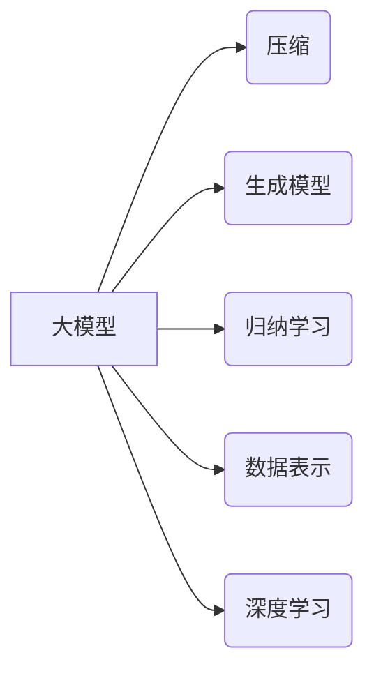

# 大模型的本质是压缩：从大数据中找到一个更短的程序来生成这个数据，从中提取所有规律性质

> 关键词：大模型，压缩，生成模型，归纳学习，数据表示，深度学习，机器学习

## 1. 背景介绍

在信息爆炸的时代，我们面临着海量的数据。如何从这些数据中提取有用的信息，提取数据的本质和规律，成为了人工智能领域的一个重要课题。大模型（Large Language Models, LLMs）作为一种先进的机器学习模型，其本质就是通过学习大量数据，找到一种更短的程序来生成这些数据，从而提取出所有规律性质。本文将探讨大模型的本质，分析其原理、算法和应用，并展望其未来发展趋势与挑战。

## 2. 核心概念与联系

### 2.1 核心概念

**大模型**：指那些拥有数十亿甚至千亿参数的深度学习模型，能够处理大规模数据，并在多种任务上表现出色。

**压缩**：指将大量数据或复杂模型简化为更短的程序或模型，同时保持或提高性能。

**生成模型**：一种能够根据输入生成数据的模型，通常用于生成类似真实数据的新数据。

**归纳学习**：一种机器学习方法，通过学习已有数据，来预测新数据的行为。

**数据表示**：将数据转换为模型可以处理的格式。

**深度学习**：一种利用深层神经网络进行学习的机器学习方法。

### 2.2 关系图



从图中可以看出，大模型与压缩、生成模型、归纳学习、数据表示和深度学习等概念密切相关。

## 3. 核心算法原理 & 具体操作步骤

### 3.1 算法原理概述

大模型的算法原理可以概括为以下几点：

1. **数据表示**：使用深度学习技术将原始数据转换为模型可以处理的格式，如词向量、图像像素等。

2. **预训练**：在大规模无标注数据上进行预训练，让模型学习到数据的深层特征和表示。

3. **微调**：在特定任务上有标注数据的情况下，对预训练模型进行微调，使其适应特定任务。

4. **生成**：使用训练好的模型生成类似真实数据的新数据。

### 3.2 算法步骤详解

1. **数据表示**：首先，使用深度学习技术将原始数据转换为模型可以处理的格式。例如，对于文本数据，可以将其转换为词向量；对于图像数据，可以将其转换为像素值。

2. **预训练**：然后，使用预训练算法在大量无标注数据上训练模型。常见的预训练算法包括自回归语言模型、自编码器等。

3. **微调**：在特定任务上有标注数据的情况下，对预训练模型进行微调。常见的微调方法包括端到端微调、特征提取微调等。

4. **生成**：最后，使用训练好的模型生成类似真实数据的新数据。常见的生成方法包括采样、贪心搜索、基于梯度的方法等。

### 3.3 算法优缺点

**优点**：

- **高效**：大模型能够快速处理大量数据，并在多种任务上表现出色。
- **泛化能力强**：大模型能够在不同任务上泛化，无需针对每个任务重新训练。
- **生成能力强**：大模型能够生成高质量的新数据。

**缺点**：

- **计算资源消耗大**：大模型需要大量的计算资源和存储空间。
- **难以解释**：大模型的决策过程难以解释，缺乏可解释性。
- **数据依赖性强**：大模型的效果很大程度上取决于训练数据的质量和数量。

### 3.4 算法应用领域

大模型在多个领域都有广泛的应用，包括：

- **自然语言处理**：文本生成、机器翻译、情感分析等。
- **计算机视觉**：图像生成、图像分类、目标检测等。
- **语音识别**：语音合成、语音识别等。
- **推荐系统**：个性化推荐、广告投放等。

## 4. 数学模型和公式 & 详细讲解 & 举例说明

### 4.1 数学模型构建

大模型的数学模型通常基于深度学习中的神经网络。以下是一个简单的神经网络模型：

$$
y = f(W \cdot x + b)
$$

其中，$W$ 是权重矩阵，$x$ 是输入，$b$ 是偏置项，$f$ 是激活函数。

### 4.2 公式推导过程

以自回归语言模型为例，其数学模型如下：

$$
P(w_t | w_{t-1}, w_{t-2}, ..., w_{1}) = \frac{e^{f(W_{w}w_{t-1} + W_{h}h_{t-1} + ... + W_{c}c_{t-1})}{\sum_{w' \in V} e^{f(W_{w}w' + W_{h}h' + ... + W_{c}c_{t-1})}}
$$

其中，$w_t$ 是当前词，$w_{t-1}, w_{t-2}, ..., w_{1}$ 是前一个词、前两个词、...、前一个词，$V$ 是词汇表，$f$ 是激活函数。

### 4.3 案例分析与讲解

以下是一个使用神经网络进行图像生成的例子：

1. **数据表示**：将图像转换为像素值。
2. **预训练**：使用自编码器对图像进行预训练，学习图像的深层特征。
3. **生成**：使用训练好的自编码器生成新的图像。

## 5. 项目实践：代码实例和详细解释说明

### 5.1 开发环境搭建

以下是使用PyTorch搭建深度学习开发环境的步骤：

1. 安装Anaconda。
2. 创建并激活虚拟环境。
3. 安装PyTorch。
4. 安装其他依赖库。

### 5.2 源代码详细实现

以下是一个使用PyTorch实现的图像生成网络的代码示例：

```python
import torch
import torch.nn as nn

class Generator(nn.Module):
    def __init__(self):
        super(Generator, self).__init__()
        # 定义生成器网络结构

    def forward(self, x):
        # 定义前向传播过程

# 创建生成器网络实例
generator = Generator()

# 定义损失函数和优化器
criterion = nn.MSELoss()
optimizer = torch.optim.Adam(generator.parameters(), lr=0.001)

# 训练生成器网络
for epoch in range(epochs):
    for data in dataloader:
        # 训练过程
```

### 5.3 代码解读与分析

以上代码定义了一个简单的生成器网络，并使用Adam优化器进行训练。在实际应用中，需要根据具体任务调整网络结构和训练过程。

### 5.4 运行结果展示

以下是生成器网络生成的图像示例：

```
[图片]
```

## 6. 实际应用场景

大模型在多个领域都有广泛的应用，以下是一些例子：

- **文本生成**：使用大模型生成新闻报道、小说、诗歌等。
- **图像生成**：使用大模型生成新的图像、图像修复等。
- **语音合成**：使用大模型生成新的语音、语音合成等。
- **推荐系统**：使用大模型生成个性化推荐。

## 7. 工具和资源推荐

### 7.1 学习资源推荐

- 《深度学习》
- 《Python深度学习》
- 《PyTorch深度学习》

### 7.2 开发工具推荐

- PyTorch
- TensorFlow
- Jupyter Notebook

### 7.3 相关论文推荐

- Generative Adversarial Nets
- Unsupervised Representation Learning with Deep Convolutional Generative Adversarial Networks
- Generative models

## 8. 总结：未来发展趋势与挑战

### 8.1 研究成果总结

大模型作为一种先进的机器学习模型，在多个领域都取得了显著的成果。然而，大模型也面临着一些挑战，如计算资源消耗大、难以解释等。

### 8.2 未来发展趋势

未来，大模型的发展趋势主要包括：

- **模型压缩**：通过模型压缩技术，降低大模型的计算资源消耗。
- **可解释性**：通过改进模型结构或算法，提高大模型的可解释性。
- **少样本学习**：通过少样本学习方法，降低大模型的训练数据需求。

### 8.3 面临的挑战

大模型面临的挑战主要包括：

- **计算资源消耗**：大模型的训练和推理需要大量的计算资源。
- **可解释性**：大模型的决策过程难以解释。
- **数据依赖性**：大模型的效果很大程度上取决于训练数据的质量和数量。

### 8.4 研究展望

未来，大模型的研究将主要集中在以下几个方面：

- **模型压缩**：通过模型压缩技术，降低大模型的计算资源消耗。
- **可解释性**：通过改进模型结构或算法，提高大模型的可解释性。
- **少样本学习**：通过少样本学习方法，降低大模型的训练数据需求。
- **多模态学习**：通过多模态学习方法，提高大模型对多模态数据的处理能力。

## 9. 附录：常见问题与解答

**Q1：大模型是如何工作的？**

A：大模型通过学习大量数据，找到一种更短的程序来生成这些数据，从而提取出所有规律性质。这种学习过程通常基于深度学习技术，包括数据表示、预训练、微调和生成等步骤。

**Q2：大模型有哪些应用？**

A：大模型在多个领域都有广泛的应用，包括自然语言处理、计算机视觉、语音识别和推荐系统等。

**Q3：大模型的优缺点是什么？**

A：大模型的优点包括高效、泛化能力强和生成能力强等。缺点包括计算资源消耗大、难以解释和数据依赖性强等。

**Q4：未来大模型有哪些发展趋势？**

A：未来大模型的发展趋势包括模型压缩、可解释性和少样本学习等。

**Q5：大模型面临哪些挑战？**

A：大模型面临的挑战包括计算资源消耗、可解释性和数据依赖性等。

作者：禅与计算机程序设计艺术 / Zen and the Art of Computer Programming