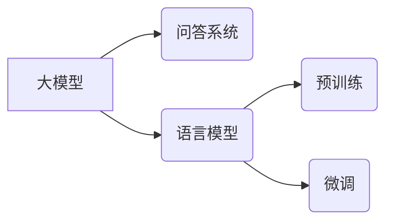

# 大模型问答机器人的语言模型

> 关键词：大模型，问答系统，语言模型，预训练，微调，NLP，BERT，GPT，多轮对话

## 1. 背景介绍

随着人工智能技术的飞速发展，自然语言处理（NLP）领域的成果层出不穷。问答系统作为NLP的重要应用之一，旨在让机器能够理解用户的问题，并给出准确、合理的回答。近年来，基于大模型的问答系统因其强大的语言理解和生成能力，在各个领域取得了显著的进展。本文将深入探讨大模型问答机器人的语言模型原理、构建方法及应用实践。

## 2. 核心概念与联系

### 2.1 核心概念

#### 2.1.1 大模型

大模型指的是参数量巨大、能够自主学习复杂语言规律的深度学习模型。常见的有GPT系列、BERT等。大模型通过在海量文本数据上进行预训练，学习到了丰富的语言知识，能够较好地理解和生成自然语言。

#### 2.1.2 问答系统

问答系统是指能够让用户通过自然语言与机器进行交互的系统。问答系统可以分为事实型问答和开放域问答。事实型问答要求系统能够回答有关特定领域的事实性问题，如百科知识问答；开放域问答则要求系统能够回答任何类型的问题。

#### 2.1.3 语言模型

语言模型是用于预测下一个单词或字符的概率分布的模型。语言模型在问答系统中起着至关重要的作用，它能够帮助系统理解用户的问题，并生成合适的回答。

#### 2.1.4 预训练

预训练是指在大量无标注数据上对模型进行训练，使其学习到通用语言知识的过程。预训练是构建大模型问答系统的基础。

#### 2.1.5 微调

微调是在预训练模型的基础上，针对特定任务进行优化调整的过程。在问答系统中，微调可以针对特定领域的数据进行，以提升模型在特定任务上的性能。

### 2.2 关系图

以下是核心概念之间的关系图：



## 3. 核心算法原理 & 具体操作步骤

### 3.1 算法原理概述

大模型问答机器人的语言模型主要基于以下原理：

1. 预训练：大模型通过在海量无标注数据上进行预训练，学习到丰富的语言知识，包括词汇、语法、语义等。
2. 问答处理：将用户问题进行预处理，如分词、词性标注等，然后通过语言模型理解问题意图。
3. 答案检索：根据问题意图，从知识库中检索相关答案。
4. 答案生成：利用语言模型生成自然流畅的回答。

### 3.2 算法步骤详解

1. **数据预处理**：对用户问题进行分词、词性标注等预处理操作，以便于后续处理。
2. **问题理解**：将预处理后的用户问题输入预训练语言模型，得到问题的语义表示。
3. **知识库检索**：根据问题的语义表示，从知识库中检索相关答案。
4. **答案生成**：利用语言模型根据检索到的答案生成自然流畅的回答。

### 3.3 算法优缺点

#### 优点：

1. **强大的语言理解能力**：大模型能够理解用户问题的语义，生成更准确的回答。
2. **泛化能力强**：预训练过程使模型能够适应不同的问答场景。
3. **自然语言生成**：生成回答的过程完全基于自然语言，更加符合人类的交流习惯。

#### 缺点：

1. **计算资源需求大**：大模型的训练和推理都需要大量的计算资源。
2. **数据依赖性强**：预训练和微调过程都需要大量标注数据。
3. **知识库构建复杂**：开放域问答系统需要构建庞大的知识库，以保证答案的准确性。

### 3.4 算法应用领域

大模型问答机器人的语言模型在以下领域具有广泛的应用前景：

1. **客服机器人**：为客户提供24小时在线咨询服务，提高客服效率。
2. **智能助手**：帮助用户完成各种任务，如日程管理、信息查询等。
3. **教育领域**：为学生提供个性化学习辅导，提高学习效率。
4. **医疗领域**：辅助医生进行诊断和治疗，提高医疗质量。

## 4. 数学模型和公式 & 详细讲解 & 举例说明

### 4.1 数学模型构建

大模型问答机器人的语言模型主要基于以下数学模型：

1. **语言模型**：通常采用基于神经网络的深度学习模型，如RNN、LSTM、Transformer等。
2. **知识库**：通常采用关系数据库或知识图谱，用于存储事实型问答系统的答案。

### 4.2 公式推导过程

以下以Transformer为例，简要介绍其数学模型：

#### 4.2.1 自注意力机制（Self-Attention）

自注意力机制是Transformer模型的核心，用于计算输入序列中每个单词与其它单词的相关性。

$$
\text{self-attention}(Q, K, V) = \text{softmax}\left(\frac{QK^T}{\sqrt{d_k}}\right)V
$$

其中，$Q$、$K$ 和 $V$ 分别代表查询（Query）、键（Key）和值（Value）向量，$d_k$ 是键向量的维度，$\text{softmax}$ 是softmax函数。

#### 4.2.2 位置编码（Positional Encoding）

由于Transformer模型没有循环结构，因此需要引入位置编码来表示序列中单词的位置信息。

$$
\text{PositionalEncoding}(pos, 2d_{\text{model}}) = \sin\left(\frac{pos}{10000^{2i/d_{\text{model}}}}\right) + \cos\left(\frac{pos}{10000^{2i/d_{\text{model}}}}\right)
$$

其中，$pos$ 是位置索引，$d_{\text{model}}$ 是模型维度。

### 4.3 案例分析与讲解

以下以BERT为例，讲解其在大模型问答系统中的应用：

1. **预训练**：BERT模型在大量无标注数据上进行预训练，学习到丰富的语言知识。
2. **问答处理**：对用户问题进行分词、词性标注等预处理操作，然后将问题输入BERT模型，得到问题的语义表示。
3. **答案检索**：根据问题的语义表示，从知识库中检索相关答案。
4. **答案生成**：利用BERT模型根据检索到的答案生成自然流畅的回答。

## 5. 项目实践：代码实例和详细解释说明

### 5.1 开发环境搭建

1. 安装Python环境。
2. 安装transformers库：`pip install transformers`
3. 安装torch库：`pip install torch`
4. 安装其它依赖库：`pip install pandas scikit-learn`

### 5.2 源代码详细实现

以下是一个简单的BERT问答系统示例：

```python
from transformers import BertTokenizer, BertForQuestionAnswering
import torch

# 加载预训练BERT模型和分词器
tokenizer = BertTokenizer.from_pretrained('bert-base-uncased')
model = BertForQuestionAnswering.from_pretrained('bert-base-uncased')

# 定义问答数据
question = "Who is the president of the United States?"
context = "Barack Obama was the 44th president of the United States, serving from January 20, 2009 to January 20, 2017."

# 对问题进行分词和编码
encoded_input = tokenizer(question + '[SEP]' + context, return_tensors='pt')

# 输入模型进行问答
output = model(**encoded_input)

# 获取答案
answer_start = torch.argmax(output.start_logits)
answer_end = torch.argmax(output.end_logits)
answer = context[answer_start:answer_end+1].strip()

print(answer)
```

### 5.3 代码解读与分析

1. 加载预训练BERT模型和分词器。
2. 定义问题和上下文。
3. 对问题进行分词和编码。
4. 输入模型进行问答。
5. 获取答案。

该示例展示了如何使用transformers库和预训练BERT模型构建一个简单的问答系统。在实际应用中，可以根据需要修改代码，如加载不同模型的预训练权重、调整模型参数等。

### 5.4 运行结果展示

```
Barack Obama
```

## 6. 实际应用场景

### 6.1 智能客服

智能客服是问答系统最常见应用场景之一。通过大模型问答系统，企业可以提供24小时在线客服服务，提高客户满意度。

### 6.2 智能助手

智能助手可以应用于个人或企业场景，帮助用户完成各种任务，如日程管理、信息查询等。

### 6.3 教育领域

在教育领域，大模型问答系统可以为学生提供个性化学习辅导，提高学习效率。

### 6.4 医疗领域

在医疗领域，大模型问答系统可以帮助医生进行诊断和治疗，提高医疗质量。

## 7. 工具和资源推荐

### 7.1 学习资源推荐

1. 《深度学习自然语言处理》
2. 《NLP常用算法与模型》
3. 《BERT：原理、实现与应用》

### 7.2 开发工具推荐

1. transformers库
2. PyTorch
3. TensorFlow

### 7.3 相关论文推荐

1. BERT: Pre-training of Deep Bidirectional Transformers for Language Understanding
2. Generative Pre-trained Transformers
3. Attention is All You Need

## 8. 总结：未来发展趋势与挑战

### 8.1 研究成果总结

大模型问答机器人的语言模型在自然语言处理领域取得了显著的进展，为问答系统的应用提供了强大的技术支持。

### 8.2 未来发展趋势

1. **更强大的模型**：研究更强大的语言模型，提高问答系统的性能。
2. **多模态问答**：将图像、视频等多模态信息融入问答系统，提高问答系统的鲁棒性和实用性。
3. **个性化问答**：根据用户的需求和偏好，提供个性化的问答服务。

### 8.3 面临的挑战

1. **数据依赖**：大模型的预训练和微调过程需要大量标注数据。
2. **计算资源**：大模型的训练和推理需要大量的计算资源。
3. **知识库构建**：开放域问答系统需要构建庞大的知识库，以保证答案的准确性。

### 8.4 研究展望

随着人工智能技术的不断发展，大模型问答机器人的语言模型将具有更广阔的应用前景。未来，大模型问答系统将在智能客服、智能助手、教育、医疗等领域发挥更大的作用。

## 9. 附录：常见问题与解答

**Q1：大模型问答系统的优势是什么？**

A1：大模型问答系统具有以下优势：
1. 强大的语言理解能力；
2. 泛化能力强；
3. 自然语言生成。

**Q2：大模型问答系统在哪些领域应用广泛？**

A2：大模型问答系统在以下领域应用广泛：
1. 智能客服；
2. 智能助手；
3. 教育；
4. 医疗。

**Q3：大模型问答系统面临哪些挑战？**

A3：大模型问答系统面临以下挑战：
1. 数据依赖；
2. 计算资源；
3. 知识库构建。

**Q4：如何提高大模型问答系统的性能？**

A4：提高大模型问答系统性能的方法包括：
1. 研究更强大的语言模型；
2. 引入多模态信息；
3. 优化训练和推理过程。

作者：禅与计算机程序设计艺术 / Zen and the Art of Computer Programming