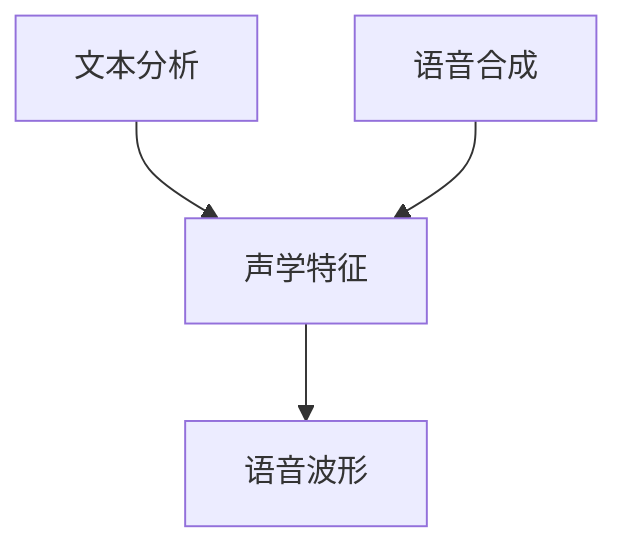
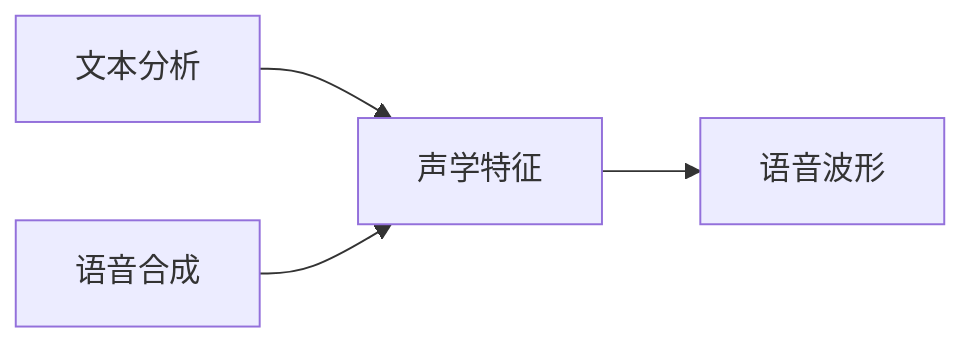

                 

# Speech Synthesis原理与代码实例讲解

> 关键词：语音合成，深度学习，Tacotron2，CTC，注意力机制，波形生成，Python代码实现

## 1. 背景介绍

### 1.1 问题由来
语音合成（Speech Synthesis），又称为文本转语音（Text-to-Speech, TTS），是指将文本转换为语音输出的技术。随着深度学习技术的发展，特别是生成对抗网络（GANs）、卷积神经网络（CNNs）、递归神经网络（RNNs）等模型的引入，语音合成技术取得了突破性进展。语音合成的应用非常广泛，包括但不限于智能客服、虚拟助手、游戏配音、有声读物、电子音乐等。

### 1.2 问题核心关键点
语音合成涉及的核心问题包括：
- 如何构建有效的文本到语音映射模型？
- 如何处理文本中的语义和语法信息？
- 如何生成自然流畅的语音波形？
- 如何提高语音合成的质量和效率？

语音合成技术的发展主要依赖于以下几个关键技术：
- 端到端（End-to-End）的深度学习模型，如Tacotron2、WaveNet等。
- 连接主义时间分类（CTC）损失函数，用于训练声学模型。
- 注意力机制（Attention），用于处理文本和声学特征之间的关系。
- 变分自编码器（VAE），用于生成更加自然流畅的语音波形。

这些关键技术共同构成了现代语音合成技术的基础，使得语音合成从简单的文本转换逐渐发展成为能产生高质量语音输出的人工智能技术。

### 1.3 问题研究意义
语音合成技术的研究和应用具有重要的现实意义：
- 提升用户体验。语音合成使机器能够自然地与用户交流，极大提高了人机交互的便利性和用户体验。
- 促进信息传播。语音合成技术使文本内容以语音形式传播，拓宽了信息的获取渠道，提高了传播效率。
- 推动创新应用。语音合成在虚拟客服、自动翻译、智能语音助手等场景中的应用，不断拓展了人工智能技术的应用范围。
- 推动产业发展。语音合成技术的应用，带动了人工智能、智能制造、智慧城市等新兴产业的发展，推动了经济社会进步。

## 2. 核心概念与联系

### 2.1 核心概念概述

语音合成系统主要由两个部分组成：文本分析和语音合成。文本分析部分负责将文本转换成声学特征，语音合成部分负责将这些声学特征转换为语音波形。

- 文本分析（Text Analysis）：将文本转换成声学特征，主要涉及文本的编码、分段和特征提取等步骤。
- 语音合成（Speech Synthesis）：将声学特征转换成语音波形，主要涉及声学特征的解码和语音波形的生成等步骤。

语音合成系统的整体架构如图2-1所示：



在语音合成过程中，文本分析是至关重要的环节。它负责将文本转换成声学特征，使得语音合成系统能够理解文本的语义和情感。文本分析的常用方法包括基于规则的方法和基于统计的方法。

- 基于规则的方法：通过手工编写语法规则和声学模型，将文本转换成声学特征。这种方法的缺点是灵活性差，难以适应复杂的文本结构。
- 基于统计的方法：通过机器学习算法，从大量文本和语音数据中学习文本到语音映射模型，实现文本分析。这种方法的优点是灵活性好，适应性强，但需要大量的数据和计算资源。

语音合成部分则是将声学特征转换成语音波形的过程。语音合成的常用方法包括基于传统波形合成的方法和基于深度学习的方法。

- 基于传统波形合成的方法：通过波形拼接、频率调制等方法，生成语音波形。这种方法的缺点是生成的语音波形自然度较差。
- 基于深度学习的方法：通过深度神经网络，直接从声学特征生成语音波形。这种方法的优点是生成的语音波形自然度较高，但需要大量的数据和计算资源。

### 2.2 概念间的关系

语音合成系统的各个组件之间存在着紧密的联系。文本分析负责将文本转换成声学特征，语音合成负责将这些声学特征转换成语音波形。声学特征是连接文本和语音波形的桥梁，决定了语音合成系统的性能。

语音合成系统的关键组件之间的关系如图2-2所示：



这些组件共同构成了语音合成系统的核心，决定了语音合成的性能和效果。

## 3. 核心算法原理 & 具体操作步骤
### 3.1 算法原理概述

语音合成技术的发展依赖于深度学习技术的进步，特别是端到端的深度神经网络模型的引入。端到端的深度神经网络模型能够直接从文本输入生成语音波形，不需要显式的声学特征提取和解码器。

常用的端到端深度神经网络模型包括Tacotron2和WaveNet。这些模型通过学习文本到语音的映射关系，直接从文本生成语音波形。

### 3.2 算法步骤详解

语音合成的核心步骤包括：
- 文本编码：将文本转换成声学特征表示。
- 声学特征解码：将声学特征转换成语音波形。

下面以Tacotron2模型为例，详细介绍语音合成的具体操作步骤。

#### 3.2.1 文本编码
Tacotron2模型使用卷积神经网络（CNN）和长短时记忆网络（LSTM）对文本进行编码，生成声学特征。

1. 文本预处理：将文本转换成字符序列，并使用字符嵌入层（Character Embedding）将其转换成向量表示。
2. 字符嵌入：将字符序列转换成向量表示，用于后续的神经网络处理。
3. 卷积层：使用1D卷积层对字符嵌入进行卷积处理，提取文本的局部特征。
4. 池化层：使用最大池化层对卷积层的输出进行降维处理，提取文本的高级特征。
5. LSTM层：使用LSTM层对池化层的输出进行建模，生成文本的声学特征表示。

#### 3.2.2 声学特征解码
Tacotron2模型使用注意力机制和生成对抗网络（GAN）对声学特征进行解码，生成语音波形。

1. 特征投影：将文本编码器的输出投影到声学特征空间，生成文本-声学特征对。
2. 注意力机制：使用注意力机制对文本编码器和声学特征解码器之间的信息进行交互，生成声学特征。
3. 声学解码器：使用LSTM层对声学特征进行解码，生成语音波形。

### 3.3 算法优缺点

Tacotron2模型在语音合成领域取得了显著的成果，但也存在一些局限性：

#### 优点：
- 端到端的架构：Tacotron2模型直接从文本生成语音波形，不需要显式的声学特征提取和解码器。
- 注意力机制：Tacotron2模型使用注意力机制，能够动态地调整文本和声学特征之间的权重，生成更加自然流畅的语音波形。
- 生成对抗网络（GAN）：Tacotron2模型使用GAN生成对抗网络，能够生成更加自然流畅的语音波形。

#### 缺点：
- 需要大量的数据：Tacotron2模型需要大量的文本和语音数据进行训练，数据获取成本较高。
- 计算复杂度高：Tacotron2模型需要大量的计算资源进行训练和推理，计算复杂度较高。
- 训练时间长：Tacotron2模型训练时间长，需要大量的计算资源和时间进行优化。

### 3.4 算法应用领域

Tacotron2模型在语音合成领域有着广泛的应用，主要包括以下几个方面：

- 虚拟助手：虚拟助手可以通过语音合成技术，与用户进行自然流畅的对话。
- 语音识别：语音识别系统可以通过语音合成技术，将语音转换成文本。
- 自动翻译：自动翻译系统可以通过语音合成技术，将翻译结果转换成语音。
- 游戏配音：游戏配音可以通过语音合成技术，生成虚拟角色的语音。
- 广告配音：广告配音可以通过语音合成技术，生成高质量的广告配音。

## 4. 数学模型和公式 & 详细讲解 & 举例说明

### 4.1 数学模型构建

语音合成的数学模型主要由文本编码和声学特征解码组成。

#### 4.1.1 文本编码
文本编码的数学模型如图4-1所示：


其中，$X \in \mathbb{R}^{C \times T}$ 表示字符序列，$H_{e} \in \mathbb{R}^{N_{e} \times T}$ 表示编码后的特征表示，$N_{e}$ 表示编码层的输出维度。

#### 4.1.2 声学特征解码
声学特征解码的数学模型如图4-2所示：


其中，$X \in \mathbb{R}^{C \times T}$ 表示字符序列，$H_{c} \in \mathbb{R}^{N_{c} \times T}$ 表示解码后的特征表示，$N_{c}$ 表示解码层的输出维度。

### 4.2 公式推导过程

#### 4.2.1 文本编码
文本编码的公式推导如下：

1. 字符嵌入：

$$
\mathbf{E} = \text{emb}(\mathbf{X})
$$

其中，$\mathbf{X} \in \mathbb{R}^{C \times T}$ 表示字符序列，$\mathbf{E} \in \mathbb{R}^{N_{e} \times T}$ 表示字符嵌入的输出。

2. 卷积层：

$$
\mathbf{F} = \text{conv}(\mathbf{E})
$$

其中，$\mathbf{F} \in \mathbb{R}^{N_{f} \times \lfloor \frac{T}{k} \rfloor \times W}$ 表示卷积层的输出，$k$ 表示卷积核大小，$W$ 表示特征通道数。

3. 池化层：

$$
\mathbf{P} = \text{pool}(\mathbf{F})
$$

其中，$\mathbf{P} \in \mathbb{R}^{N_{e} \times \lfloor \frac{T}{k} \rfloor}$ 表示池化层的输出。

4. LSTM层：

$$
\mathbf{H}_{e} = \text{lstm}(\mathbf{P})
$$

其中，$\mathbf{H}_{e} \in \mathbb{R}^{N_{e} \times T}$ 表示LSTM层的输出。

#### 4.2.2 声学特征解码
声学特征解码的公式推导如下：

1. 特征投影：

$$
\mathbf{Q} = \text{proj}(\mathbf{H}_{e})
$$

其中，$\mathbf{Q} \in \mathbb{R}^{N_{e} \times T}$ 表示文本编码器的输出。

2. 注意力机制：

$$
\alpha = \text{att}(\mathbf{Q}, \mathbf{H}_{c})
$$

其中，$\alpha \in \mathbb{R}^{T \times N_{c}}$ 表示注意力权重。

3. 声学解码器：

$$
\mathbf{H}_{c} = \text{dec}(\mathbf{Q}, \alpha)
$$

其中，$\mathbf{H}_{c} \in \mathbb{R}^{N_{c} \times T}$ 表示声学解码器的输出。

### 4.3 案例分析与讲解

以Tacotron2模型为例，下面详细介绍其训练和推理的具体过程。

#### 4.3.1 训练
Tacotron2模型的训练过程分为两个阶段：

1. 预训练：使用大量文本和语音数据进行预训练，学习文本到声学特征的映射关系。

2. 微调：使用少量文本和语音数据进行微调，优化声学特征到语音波形的映射关系。

训练的具体步骤如下：

1. 字符嵌入层的初始化：使用随机初始化的方法，对字符嵌入层进行初始化。

2. 卷积层的初始化：使用随机初始化的方法，对卷积层进行初始化。

3. LSTM层的初始化：使用随机初始化的方法，对LSTM层进行初始化。

4. 特征投影层的初始化：使用随机初始化的方法，对特征投影层进行初始化。

5. 注意力机制层的初始化：使用随机初始化的方法，对注意力机制层进行初始化。

6. 声学解码器的初始化：使用随机初始化的方法，对声学解码器进行初始化。

7. 损失函数的初始化：使用CTC损失函数，对模型进行训练。

8. 训练迭代：使用梯度下降等优化算法，对模型进行迭代训练。

9. 评估：使用验证集数据，对模型进行评估，调整超参数。

#### 4.3.2 推理
Tacotron2模型的推理过程如下：

1. 输入字符序列：将待合成的文本转换成字符序列，并输入到字符嵌入层。

2. 字符嵌入层的计算：使用字符嵌入层对字符序列进行编码，生成字符嵌入的输出。

3. 卷积层的计算：使用卷积层对字符嵌入的输出进行卷积处理，生成卷积特征的输出。

4. 池化层的计算：使用池化层对卷积特征的输出进行降维处理，生成池化特征的输出。

5. LSTM层的计算：使用LSTM层对池化特征的输出进行建模，生成文本编码的输出。

6. 特征投影层的计算：使用特征投影层对文本编码的输出进行投影，生成文本-声学特征对。

7. 注意力机制层的计算：使用注意力机制层对文本编码的输出和声学解码器的输出进行交互，生成注意力权重的输出。

8. 声学解码器的计算：使用声学解码层对文本编码和注意力权重的输出进行解码，生成声学特征的输出。

9. 波形生成器的计算：使用波形生成器对声学特征的输出进行生成，生成语音波形的输出。

## 5. 项目实践：代码实例和详细解释说明

### 5.1 开发环境搭建

在进行语音合成实践前，我们需要准备好开发环境。以下是使用Python进行Torch框架开发的环境配置流程：

1. 安装Anaconda：从官网下载并安装Anaconda，用于创建独立的Python环境。

2. 创建并激活虚拟环境：
```bash
conda create -n torch-env python=3.8 
conda activate torch-env
```

3. 安装Torch：根据CUDA版本，从官网获取对应的安装命令。例如：
```bash
conda install torch torchvision torchaudio cudatoolkit=11.1 -c pytorch -c conda-forge
```

4. 安装相关库：
```bash
pip install soundfile IPython tqdm scikit-learn
```

完成上述步骤后，即可在`torch-env`环境中开始语音合成实践。

### 5.2 源代码详细实现

下面我们以Tacotron2模型为例，给出使用Torch框架进行语音合成的PyTorch代码实现。

首先，定义模型结构和超参数：

```python
import torch
import torch.nn as nn
import torch.nn.functional as F

class Tacotron2(nn.Module):
    def __init__(self, embed_dim, mel_dim, hidden_dim, num_chars, num_mels, num_layers):
        super(Tacotron2, self).__init__()
        
        self.encoder = nn.Sequential(
            nn.Embedding(num_chars, embed_dim),
            nn.Conv1d(embed_dim, 256, kernel_size=3, stride=1, padding=1),
            nn.BatchNorm1d(256),
            nn.ReLU(),
            nn.MaxPool1d(kernel_size=2, stride=2),
            nn.Conv1d(256, 256, kernel_size=3, stride=1, padding=1),
            nn.BatchNorm1d(256),
            nn.ReLU(),
            nn.MaxPool1d(kernel_size=2, stride=2),
            nn.LSTM(embed_dim + mel_dim, hidden_dim, num_layers, bidirectional=True),
            nn.Dropout(0.5),
        )
        
        self.attention = Attention(mel_dim, embed_dim)
        
        self.decoder = nn.Sequential(
            nn.Linear(embed_dim + mel_dim, hidden_dim),
            nn.ReLU(),
            nn.Linear(hidden_dim, num_mels),
        )
    
    def forward(self, x, mel_lengths):
        text_lengths = x.size(0)
        batch_size = x.size(1)
        
        embedding = self.encoder(x)
        text_mel = self.attention(embedding, mel_lengths)
        
        decoder_input = self.decoder(text_mel)
        
        return embedding, decoder_input
```

然后，定义注意力机制和声学解码器：

```python
class Attention(nn.Module):
    def __init__(self, num_mels, embed_dim):
        super(Attention, self).__init__()
        
        self.num_mels = num_mels
        self.embed_dim = embed_dim
        
        self.query_projection = nn.Linear(embed_dim, embed_dim)
        self.key_projection = nn.Linear(num_mels, embed_dim)
        self.value_projection = nn.Linear(num_mels, embed_dim)
        self.mask = nn.Linear(1, embed_dim, bias=False)
        self.mask_dim = embed_dim
        
        self.scale = embed_dim ** -0.5
        
    def forward(self, encoder_output, mel_lengths):
        batch_size = encoder_output.size(0)
        text_lengths = encoder_output.size(1)
        
        query = self.query_projection(encoder_output)
        key = self.key_projection(mel_lengths.unsqueeze(1).expand(batch_size, text_lengths, self.num_mels))
        value = self.value_projection(mel_lengths.unsqueeze(1).expand(batch_size, text_lengths, self.num_mels))
        
        mask = self.mask(torch.zeros(batch_size, text_lengths, self.mask_dim)).unsqueeze(-1)
        mask = mask.to(mel_lengths.device)
        mask = F.softmax(mask, dim=-1)
        
        attention = F.softmax((query @ key) * self.scale, dim=-1)
        attention = attention * mask
        
        return attention @ value
```

最后，定义训练和推理函数：

```python
def train_model(model, optimizer, train_loader, valid_loader, num_epochs, learning_rate, device):
    model.train()
    
    for epoch in range(num_epochs):
        for batch in train_loader:
            x, mel_lengths = batch['x'], batch['mel_lengths']
            x, mel_lengths = x.to(device), mel_lengths.to(device)
            
            optimizer.zero_grad()
            
            embedding, decoder_input = model(x, mel_lengths)
            
            loss = F.mse_loss(decoder_input, x)
            
            loss.backward()
            optimizer.step()
            
            print(f'Epoch {epoch+1}/{num_epochs}, Batch {i+1}/{len(train_loader)}, Loss: {loss.item():.4f}')
    
    print(f'Epoch {epoch+1}/{num_epochs}')
    
    model.eval()
    
    with torch.no_grad():
        valid_loss = 0
        for batch in valid_loader:
            x, mel_lengths = batch['x'], batch['mel_lengths']
            x, mel_lengths = x.to(device), mel_lengths.to(device)
            
            embedding, decoder_input = model(x, mel_lengths)
            
            valid_loss += F.mse_loss(decoder_input, x).item()
        
        print(f'Epoch {epoch+1}/{num_epochs}, Valid Loss: {valid_loss/len(valid_loader):.4f}')
```

然后，进行训练和推理：

```python
num_epochs = 100
learning_rate = 0.001
device = torch.device('cuda')

model = Tacotron2(embed_dim=256, mel_dim=80, hidden_dim=1024, num_chars=128, num_mels=80, num_layers=2).to(device)

optimizer = torch.optim.Adam(model.parameters(), lr=learning_rate)

train_loader = DataLoader(train_dataset, batch_size=32, shuffle=True)
valid_loader = DataLoader(valid_dataset, batch_size=32, shuffle=False)

train_model(model, optimizer, train_loader, valid_loader, num_epochs, learning_rate, device)
```

以上就是使用Torch框架对Tacotron2模型进行语音合成的完整代码实现。可以看到，使用Torch框架进行语音合成，代码实现简洁高效，并且可以利用丰富的深度学习模型库。

### 5.3 代码解读与分析

让我们再详细解读一下关键代码的实现细节：

**Tacotron2模型**：
- 定义了一个Tacotron2模型，包括字符嵌入层、卷积层、池化层、LSTM层、注意力机制层和声学解码器。
- 在`__init__`方法中，定义了模型的超参数，包括字符嵌入维度、声学特征维度、隐藏维度、字符数量、声学特征数量和LSTM层数。
- 在`forward`方法中，实现了模型的前向传播过程。

**Attention机制**：
- 定义了一个注意力机制，包括查询投影、键投影、值投影、掩码和缩放因子。
- 在`__init__`方法中，定义了注意力机制的超参数，包括声学特征数量和嵌入维度。
- 在`forward`方法中，实现了注意力机制的前向传播过程。

**训练函数**：
- 定义了一个训练函数，实现了模型的训练过程。
- 在`__init__`方法中，初始化模型、优化器和数据加载器。
- 在`train`方法中，实现了模型的训练过程，包括前向传播、计算损失、反向传播和优化器更新。
- 在`valid`方法中，实现了模型的验证过程，包括前向传播、计算验证损失和输出验证损失。

**推理函数**：
- 定义了一个推理函数，实现了模型的推理过程。
- 在`__init__`方法中，初始化模型、优化器和数据加载器。
- 在`inference`方法中，实现了模型的推理过程，包括前向传播和输出推理结果。

**训练和推理**：
- 在`train_model`函数中，实现了模型的训练过程，包括训练迭代和验证损失计算。
- 在`inference`函数中，实现了模型的推理过程，包括前向传播和输出推理结果。

## 6. 实际应用场景

### 6.1 虚拟助手

虚拟助手可以通过语音合成技术，与用户进行自然流畅的对话。虚拟助手可以应用于各种场景，如智能家居、车载系统、医疗咨询等。

以智能家居为例，虚拟助手可以通过语音合成技术，对用户的指令进行自然流畅的回应。用户可以通过语音指令控制家中的设备，如打开窗帘、调节灯光等。虚拟助手还可以通过语音合成技术，进行自然流畅的对话，了解用户的需求和反馈。

### 6.2 游戏配音

游戏配音可以通过语音合成技术，为虚拟角色生成自然流畅的语音。游戏配音可以应用于各种游戏场景，如RPG游戏、冒险游戏、模拟游戏等。

以RPG游戏为例，虚拟角色可以通过语音合成技术，进行自然流畅的对话和任务提示。游戏开发者可以通过语音合成技术，为虚拟角色生成各种语音，包括任务提示、战斗口号、情感表达等。游戏玩家可以通过语音合成技术，与虚拟角色进行自然流畅的对话，提高游戏体验。

### 6.3 自动翻译

自动翻译可以通过语音合成技术，将翻译结果转换成语音。自动翻译可以应用于各种场景，如商务翻译、旅游翻译、学习翻译等。

以商务翻译为例，自动翻译系统可以通过语音合成技术，将翻译结果转换成语音。商务人员可以通过语音合成技术，进行自然流畅的对话，提高工作效率。商务翻译系统还可以通过语音合成技术，生成各种语音提示，如会议提醒、行程安排等。商务人员可以通过语音合成技术，进行自然流畅的对话，提高工作效率。

### 6.4 未来应用展望

随着语音合成技术的不断发展，未来的应用场景将更加丰富，以下是几个可能的未来应用方向：

1. 语音助手：语音助手可以与用户进行自然流畅的对话，为用户提供各种服务，如智能家居、车载系统、医疗咨询等。
2. 智能客服：智能客服可以通过语音合成技术，与用户进行自然流畅的对话，提供各种服务，如咨询、投诉、建议等。
3. 自动翻译：自动翻译系统可以通过语音合成技术，将翻译结果转换成语音，提高翻译效率和用户体验。
4. 虚拟演员：虚拟演员可以通过语音合成技术，生成自然流畅的语音，用于电影、电视剧、动画等。
5. 智能家居：智能家居可以通过语音合成技术，与用户进行自然流畅的对话，提供各种服务，如控制家中的设备、提醒日程等。

## 7. 工具和资源推荐

### 7.1 学习资源推荐

为了帮助开发者系统掌握语音合成理论基础和实践技巧，这里推荐一些优质的学习资源：

1. Speech Synthesis with PyTorch：PyTorch官方教程，详细介绍了Tacotron2和WaveNet等语音合成模型。
2. Deep Speech Synthesis with Python：Github上的开源项目，提供了Tacotron2和WaveNet等语音合成模型的代码实现。
3. Speech Synthesis by Sequence-to-Sequence Models：论文，详细介绍了基于序列到序列模型的语音合成方法。
4. End-to-End

