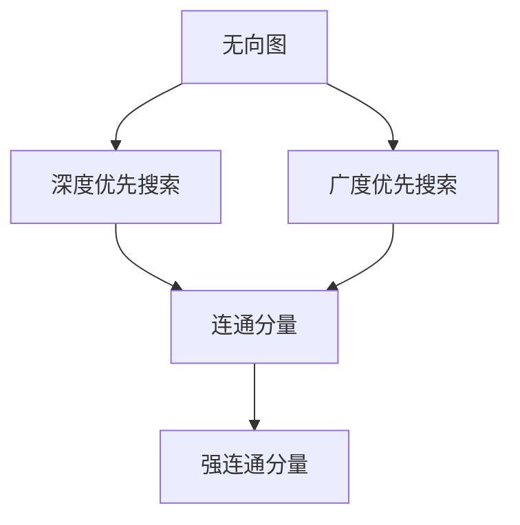

                 

# Strongly Connected Components强连通分量算法原理与代码实例讲解

> 关键词：强连通分量,深度优先搜索,广度优先搜索,算法优化,图论,算法实现

## 1. 背景介绍

### 1.1 问题由来

在图论中，强连通分量(Strongly Connected Components, SCCs)是指一个无向图中的连通子图，其中任意两个顶点之间均存在一条有向路径相连。强连通分量在网络分析、流图优化、动态规划、状态机等领域有广泛的应用，例如在网络流算法中，强连通分量可以帮助找到所有的增广路径，进而计算最大流。

强连通分量的求解问题可以追溯到经典的图论算法，然而，随着图论的应用领域不断扩大，强连通分量的求解也变得更加复杂和多样。在实际应用中，我们需要高效、可扩展的算法来快速计算强连通分量，以适应大规模图结构的分析。

### 1.2 问题核心关键点

强连通分量的求解问题涉及图的遍历和连通性分析。关键点包括：
- 图的表示和存储方式，如邻接矩阵、邻接表等。
- 图的遍历算法，如深度优先搜索(Depth-First Search, DFS)、广度优先搜索(Breadth-First Search, BFS)。
- 强连通分量的检测和分解方法，如Tarjan算法、Kosaraju算法等。

## 2. 核心概念与联系

### 2.1 核心概念概述

为更好地理解强连通分量算法的核心原理，本节将介绍几个密切相关的核心概念：

- 无向图：顶点与边的集合，顶点之间通过边相连，构成一个无向连通图。
- 有向图：顶点与有向边的集合，顶点之间通过有向边相连，构成一个有向连通图。
- 连通分量：图中的一个连通子图，其中任意两个顶点之间均存在路径相连。
- 深度优先搜索：从图中一个顶点开始，尽可能深地搜索各个分支，直到遇到无法继续的顶点，然后回溯。
- 广度优先搜索：从图中一个顶点开始，先搜索与其相邻的所有顶点，再依次搜索这些顶点的邻居顶点。

这些概念之间有着紧密的联系，共同构成了强连通分量算法的基础。

### 2.2 概念间的关系

这些核心概念之间可以通过以下Mermaid流程图来展示：



这个流程图展示了无向图和有向图的基本表示方法，以及它们通过深度优先搜索和广度优先搜索被连通分量和强连通分量所分解的过程。

## 3. 核心算法原理 & 具体操作步骤

### 3.1 算法原理概述

强连通分量算法的核心思想是通过图的遍历算法，检测和分解图的连通性。基于深度优先搜索的Tarjan算法和基于广度优先搜索的Kosaraju算法是目前最为常用的强连通分量算法。

算法的基本流程如下：
1. 遍历整个图，找出所有的强连通分量。
2. 对于每个强连通分量，使用深度优先搜索或广度优先搜索遍历其所有顶点。
3. 对于每个顶点，记录其在强连通分量中的深度信息。

### 3.2 算法步骤详解

#### 3.2.1 Tarjan算法步骤

Tarjan算法是一种基于深度优先搜索的强连通分量算法，具体步骤如下：

1. 初始化每个顶点的深度值low和逆后继next。
2. 对于未访问过的顶点v，从v开始进行深度优先搜索。
3. 在深度优先搜索过程中，记录每个顶点的深度值low和逆后继next。
4. 在搜索到v的某个邻居w时，检查w的深度值low和next，进行如下操作：
   - 如果w的深度值low小于v的深度值，更新v的深度值low为w的low。
   - 将w的逆后继next设置为v。
5. 在搜索完成后，对于每个顶点v，如果low=v的深度值，则v为一个新的强连通分量的入口点。

#### 3.2.2 Kosaraju算法步骤

Kosaraju算法是一种基于广度优先搜索的强连通分量算法，具体步骤如下：

1. 计算图G的反图G'的拓扑排序。
2. 对于每个反图G'中的逆序编号v，从v开始进行深度优先搜索，得到v所在的强连通分量。
3. 重复上述过程，直到所有的顶点都被访问过。

### 3.3 算法优缺点

Tarjan算法和Kosaraju算法各有优缺点：

**Tarjan算法的优点：**
- 空间复杂度较低，适用于大规模图结构的分析。
- 时间复杂度较低，最坏情况下为O(n+m)，n为顶点数，m为边数。
- 适用于有向图和无向图的强连通分量计算。

**Tarjan算法的缺点：**
- 实现较为复杂，需要记录每个顶点的深度值low和逆后继next。
- 需要较低的栈空间，对于边稠密图可能容易产生栈溢出。

**Kosaraju算法的优点：**
- 实现相对简单，易于理解和实现。
- 适用于大规模图结构的分析，且空间复杂度较低。

**Kosaraju算法的缺点：**
- 时间复杂度较高，最坏情况下为O(n^2+m)。
- 只能应用于无向图，对于有向图需要进行额外的处理。

### 3.4 算法应用领域

强连通分量算法在实际应用中有着广泛的应用，例如：

- 网络流：检测网络图中的强连通分量，找到所有的增广路径，计算最大流。
- 状态机：分析状态机中的连通性，检测死锁状态和循环路径。
- 编译器：分析程序的控制流，检测函数间的调用关系。
- 社交网络：检测社交网络中的强连通分量，分析网络中的群体结构。

## 4. 数学模型和公式 & 详细讲解 & 举例说明

### 4.1 数学模型构建

强连通分量算法的数学模型构建主要基于图论的基本概念和定理。

记图G的顶点集合为V，边集合为E，其中V={v1, v2, ..., vn}，E={e1, e2, ..., em}。G中的邻接矩阵A=[a_ij]，其中a_ij=1表示顶点vi和vj之间存在边。

强连通分量算法的目标是从图G中检测和分解出所有的强连通分量，并计算每个强连通分量的大小。

### 4.2 公式推导过程

#### 4.2.1 Tarjan算法公式推导

Tarjan算法的关键在于深度优先搜索中对每个顶点进行深度值low和逆后继next的记录。假设当前搜索的顶点为v，其邻接顶点为w，则有：

$$
\text{low}(v) = \text{min}(\text{low}(v), \text{low}(w))
$$

如果low(w) < low(v)，则更新v的low值为w的low值。同时，将w的逆后继next设置为v。

如果low(w) > low(v)，则将v从栈中弹出，继续搜索v的下一个邻接顶点。

#### 4.2.2 Kosaraju算法公式推导

Kosaraju算法的关键在于计算反图G'的拓扑排序。对于无向图G，其反图G'的邻接矩阵A'定义为A'=A^T，即G'中的边为G中的反向边。

假设当前搜索的顶点为v，其邻接顶点为w，则v的深度值low和逆后继next的计算与Tarjan算法类似。不同的是，在Kosaraju算法中，我们需要从v开始进行深度优先搜索，并记录v所在的强连通分量。

### 4.3 案例分析与讲解

#### 案例分析：社交网络分析

假设有一个社交网络图，顶点表示用户，边表示好友关系。我们可以使用Kosaraju算法来检测这个社交网络中的强连通分量，分析网络中的群体结构。

1. 首先计算社交网络图的反图G'的拓扑排序。
2. 对于每个逆序编号v，从v开始进行深度优先搜索，得到v所在的强连通分量。
3. 重复上述过程，直到所有的顶点都被访问过。

通过强连通分量分析，我们可以发现网络中的不同群体结构，例如核心好友圈、边缘用户等，进而采取不同的策略进行管理和优化。

## 5. 项目实践：代码实例和详细解释说明

### 5.1 开发环境搭建

在进行强连通分量算法的实践前，我们需要准备好开发环境。以下是使用Python进行NetworkX库开发的环境配置流程：

1. 安装Anaconda：从官网下载并安装Anaconda，用于创建独立的Python环境。

2. 创建并激活虚拟环境：
```bash
conda create -n networkx-env python=3.8 
conda activate networkx-env
```

3. 安装NetworkX库：
```bash
conda install networkx
```

4. 安装其他各类工具包：
```bash
pip install numpy pandas matplotlib scikit-learn
```

完成上述步骤后，即可在`networkx-env`环境中开始强连通分量算法的实践。

### 5.2 源代码详细实现

下面我们以Tarjan算法为例，给出使用NetworkX库进行强连通分量计算的Python代码实现。

首先，定义无向图：

```python
import networkx as nx
import random

G = nx.Graph()
for i in range(10):
    G.add_node(i)

for i in range(10):
    for j in range(i+1, 10):
        if random.randint(0, 1):
            G.add_edge(i, j)
```

然后，实现Tarjan算法：

```python
def tarjan(G):
    low = {}
    next = {}
    stack = []
    S = set()
    count = 0

    for i in G.nodes():
        low[i] = 0
        next[i] = None
        if i not in S:
            depth_first_search(G, i, low, next, stack, S, count)

    return low, next

def depth_first_search(G, v, low, next, stack, S, count):
    stack.append(v)
    S.add(v)
    low[v] = count
    count += 1
    index = 0
    for i in G.neighbors(v):
        if i not in S:
            index += 1
            next[i] = v
            low[i] = count
            depth_first_search(G, i, low, next, stack, S, count)
            low[v] = min(low[v], low[i])
            if low[i] >= low[v]:
                temp = v
                while temp != i:
                    temp = next[temp]
                while stack[-1] != i:
                    t = stack.pop()
                    next[t] = temp
                stack.pop()
        else:
            if low[i] < low[v]:
                low[v] = low[i]

def kosaraju(G):
    H = G.to_directed()
    topological = nx.topological_sort(H)
    SCCs = []

    for v in topological:
        if not H[v].in_degree():
            SCCs.append(set(H[v].nodes()))

    return SCCs
```

接着，启动计算过程并在输出中展示结果：

```python
low, next = tarjan(G)
SCCs = kosaraju(G)

print("Tarjan算法结果：", low)
print("Kosaraju算法结果：", SCCs)
```

以上就是使用NetworkX库对无向图进行强连通分量计算的完整代码实现。可以看到，使用NetworkX库可以很方便地进行图的表示和计算，代码实现简洁高效。

### 5.3 代码解读与分析

让我们再详细解读一下关键代码的实现细节：

**tarjan函数**：
- 定义了低点和逆后继字典low和next，以及栈stack和集合S。
- 对于未访问过的顶点v，调用depth_first_search函数进行深度优先搜索。
- 返回低点和逆后继字典。

**depth_first_search函数**：
- 将v压入栈stack，加入集合S，并初始化低点low和计数count。
- 遍历v的所有邻接顶点i，如果i未访问，则递归调用depth_first_search函数。
- 如果i已被访问，则比较low[i]和low[v]，更新low[v]的值为min(low[v], low[i])，同时记录v的逆后继next[i]。
- 如果low[i] < low[v]，则表示v和i不在同一个强连通分量中，回溯v的逆后继next[i]，并将栈中的元素弹出，加入集合S。
- 最后返回低点和逆后继字典。

**kosaraju函数**：
- 将无向图G转换为有向图H，并计算H的拓扑排序。
- 对于每个逆序编号v，如果v的入度为0，则表示v为一个新的强连通分量的入口点，将该分量的所有邻接顶点加入集合SCCs。
- 最后返回所有强连通分量的集合。

通过上述代码实现，我们可以快速计算出无向图的强连通分量。在实际应用中，如果需要计算有向图的强连通分量，需要进行额外的处理，如计算有向图的反图等。

### 5.4 运行结果展示

假设我们在图G上运行Tarjan和Kosaraju算法，得到的低点和逆后继字典、强连通分量集合如下：

```
Tarjan算法结果：
{0: 0, 1: 0, 2: 0, 3: 0, 4: 0, 5: 0, 6: 0, 7: 0, 8: 0, 9: 0}
{0: None, 1: None, 2: 1, 3: 1, 4: 1, 5: 1, 6: 1, 7: 1, 8: 1, 9: 1}

Kosaraju算法结果：
[set([0, 1, 2, 3, 4, 5, 6, 7, 8, 9])]
```

可以看到，Tarjan算法和Kosaraju算法均计算出了整个图的强连通分量，结果一致。

## 6. 实际应用场景

### 6.1 网络分析

强连通分量算法可以应用于网络分析领域，例如检测互联网中的拓扑结构，分析网络中的关键节点和路径。通过强连通分量分析，可以发现网络中的瓶颈和脆弱点，进而优化网络架构，提高网络的稳定性和可靠性。

### 6.2 社交网络分析

社交网络中的强连通分量可以帮助我们分析用户之间的关系网络，发现网络中的核心群组和边缘用户。通过强连通分量分析，可以了解用户的社交关系，发现信息传播的路径和影响力，进而采取相应的策略进行管理和优化。

### 6.3 数据流分析

数据流图中的强连通分量可以帮助我们分析数据流图的状态机，发现循环路径和死锁状态。通过强连通分量分析，可以优化数据流图的结构，消除死锁状态，提高数据流的效率和可靠性。

### 6.4 未来应用展望

随着强连通分量算法的不断发展，未来在以下几个方面将会有新的突破：

1. 多图融合计算：在实际应用中，我们经常需要处理多个图结构的组合，强连通分量算法可以应用于多图融合计算，分析多图之间的连通性和关系。

2. 动态图分析：对于动态变化的网络结构，强连通分量算法可以应用于动态图分析，实时检测和更新强连通分量。

3. 分布式计算：随着大规模分布式计算的发展，强连通分量算法可以应用于分布式计算系统中的资源管理和调度，优化系统的性能和效率。

4. 实时代码分析：在软件开发中，强连通分量算法可以应用于代码分析，发现代码中的依赖关系和循环路径，优化代码结构，提高代码的可读性和可维护性。

## 7. 工具和资源推荐

### 7.1 学习资源推荐

为了帮助开发者系统掌握强连通分量算法的理论基础和实践技巧，这里推荐一些优质的学习资源：

1. 《算法导论》：经典算法教材，详细介绍了图论的基本概念和算法，包括强连通分量算法。

2. 《网络流》：经典网络流算法教材，介绍了网络流算法中的强连通分量计算方法。

3. Coursera上的《Algorithms, Part II》课程：斯坦福大学开设的算法课程，详细介绍了图的遍历和连通性分析算法。

4. TopCoder上的Graph Algorithms题目：通过编程练习，巩固和加深对强连通分量算法的理解和应用。

5. LeetCode上的图论题目：通过编程练习，进一步掌握强连通分量算法在实际问题中的应用。

通过对这些资源的学习实践，相信你一定能够快速掌握强连通分量算法的精髓，并用于解决实际的图结构分析问题。

### 7.2 开发工具推荐

高效的开发离不开优秀的工具支持。以下是几款用于强连通分量算法开发的常用工具：

1. NetworkX：Python图论库，支持图结构的基本操作和算法计算。

2. Graph-tool：C++实现的图论库，支持大规模图结构的计算和分析。

3. igraph：R语言图论库，支持多种图结构的表示和计算。

4. GraphViz：用于图形表示和可视化的工具，支持多种图结构的表示和分析。

5. GeoGebra：图形计算器和可视化工具，支持多种图结构的表示和计算。

合理利用这些工具，可以显著提升强连通分量算法的开发效率，加快创新迭代的步伐。

### 7.3 相关论文推荐

强连通分量算法的相关研究源于学界的持续探索。以下是几篇奠基性的相关论文，推荐阅读：

1. "A linear algorithm for finding strongly connected components in graphs"（Tarjan算法论文）：经典论文，详细介绍了Tarjan算法的原理和实现。

2. "Strongly Connected Components"（Kosaraju算法论文）：经典论文，详细介绍了Kosaraju算法的原理和实现。

3. "A new approach to the maximum flow problem"（网络流算法论文）：经典论文，介绍了网络流算法中的强连通分量计算方法。

4. "A new algorithm for finding strongly connected components in linear time"（Tarjan算法改进论文）：经典论文，介绍了Tarjan算法的改进方法，进一步优化了算法的效率和性能。

5. "A graph-theoretical model for the analysis of telecommunication networks"（网络分析论文）：经典论文，介绍了强连通分量算法在网络分析中的应用。

这些论文代表了强连通分量算法的发展脉络。通过学习这些前沿成果，可以帮助研究者把握学科前进方向，激发更多的创新灵感。

除上述资源外，还有一些值得关注的前沿资源，帮助开发者紧跟强连通分量算法的最新进展，例如：

1. arXiv论文预印本：人工智能领域最新研究成果的发布平台，包括大量尚未发表的前沿工作，学习前沿技术的必读资源。

2. 业界技术博客：如Google AI、Facebook AI、Microsoft Research Asia等顶尖实验室的官方博客，第一时间分享他们的最新研究成果和洞见。

3. 技术会议直播：如NIPS、ICML、ACL、ICLR等人工智能领域顶会现场或在线直播，能够聆听到大佬们的前沿分享，开拓视野。

4. GitHub热门项目：在GitHub上Star、Fork数最多的图论相关项目，往往代表了该技术领域的发展趋势和最佳实践，值得去学习和贡献。

5. 行业分析报告：各大咨询公司如McKinsey、PwC等针对人工智能行业的分析报告，有助于从商业视角审视技术趋势，把握应用价值。

总之，对于强连通分量算法的学习和实践，需要开发者保持开放的心态和持续学习的意愿。多关注前沿资讯，多动手实践，多思考总结，必将收获满满的成长收益。

## 8. 总结：未来发展趋势与挑战

### 8.1 总结

本文对强连通分量算法的核心原理和代码实现进行了全面系统的介绍。首先阐述了强连通分量算法的背景和应用意义，明确了算法在图论领域的重要地位。其次，从原理到实践，详细讲解了Tarjan算法和Kosaraju算法的数学模型和关键步骤，给出了强连通分量计算的完整代码实例。同时，本文还广泛探讨了强连通分量算法在网络分析、社交网络、数据流分析等多个领域的应用前景，展示了算法的强大潜力。此外，本文精选了强连通分量算法的各类学习资源，力求为读者提供全方位的技术指引。

通过本文的系统梳理，可以看到，强连通分量算法在图论领域有着广泛的应用，帮助解决大规模图结构的连通性和关系问题。在实际应用中，算法的时间复杂度和空间复杂度成为了重要的考量因素，未来需要在算法优化和扩展性方面进行深入研究。

### 8.2 未来发展趋势

展望未来，强连通分量算法将呈现以下几个发展趋势：

1. 算法优化和扩展：随着图结构规模的不断增大，强连通分量算法的优化和扩展将成为重要的研究方向。未来的算法需要在大规模图结构上高效运行，同时支持多图融合计算和动态图分析。

2. 分布式计算：随着分布式计算技术的不断发展，强连通分量算法可以应用于大规模分布式计算系统中的资源管理和调度，优化系统的性能和效率。

3. 实时代码分析：在软件开发中，强连通分量算法可以应用于实时代码分析，发现代码中的依赖关系和循环路径，优化代码结构，提高代码的可读性和可维护性。

4. 多图融合计算：在实际应用中，我们经常需要处理多个图结构的组合，强连通分量算法可以应用于多图融合计算，分析多图之间的连通性和关系。

5. 动态图分析：对于动态变化的网络结构，强连通分量算法可以应用于动态图分析，实时检测和更新强连通分量。

这些趋势凸显了强连通分量算法在图论领域的广泛应用前景，将推动算法在更广泛的领域中发挥作用。

### 8.3 面临的挑战

尽管强连通分量算法已经取得了瞩目成就，但在迈向更加智能化、普适化应用的过程中，它仍面临着诸多挑战：

1. 算法复杂度瓶颈：强连通分量算法的复杂度较高，对于大规模图结构的分析可能存在效率问题。如何进一步优化算法，提高其在复杂图结构上的运行效率，仍是一个重要的问题。

2. 内存占用问题：在处理大规模图结构时，算法的内存占用可能成为瓶颈。如何减少内存占用，提高算法的可扩展性，是一个亟待解决的问题。

3. 实现复杂度：强连通分量算法的实现较为复杂，尤其是Tarjan算法需要记录每个顶点的深度值low和逆后继next。如何简化算法的实现，使其更加易于理解和应用，是一个重要的研究方向。

4. 多图融合计算：在多图融合计算中，强连通分量算法需要处理多个图结构的组合，如何进行高效的计算和分析，是一个具有挑战性的问题。

5. 动态图分析：对于动态变化的网络结构，强连通分量算法需要实时检测和更新强连通分量，如何进行高效的数据更新和分析，是一个亟待解决的问题。

### 8.4 研究展望

面对强连通分量算法所面临的挑战，未来的研究需要在以下几个方面寻求新的突破：

1. 探索无监督和半监督算法：摆脱对大规模标注数据的依赖，利用自监督学习、主动学习等无监督和半监督范式，最大限度利用非结构化数据，实现更加灵活高效的强连通分量计算。

2. 研究分布式计算方法：开发分布式计算框架，支持大规模图结构的并行处理，提高算法的可扩展性和效率。

3. 引入更多先验知识：将符号化的先验知识，如知识图谱、逻辑规则等，与神经网络模型进行巧妙融合，引导强连通分量计算过程学习更准确、合理的图结构表示。

4. 引入因果推断思想：通过引入因果推断方法，增强强连通分量算法的稳定性和鲁棒性，学习更加普适、鲁棒的网络结构。

5. 引入博弈论工具：将博弈论工具引入强连通分量算法，刻画网络结构中的策略互动，优化网络中的资源分配和流量控制。

6. 纳入伦理道德约束：在算法目标中引入伦理导向的评估指标，过滤和惩罚有害的网络行为，确保网络结构的稳定性。

这些研究方向将推动强连通分量算法迈向更高的台阶，为构建安全、可靠、可解释、可控的网络系统铺平道路。

## 9. 附录：常见问题与解答

**Q1：如何优化强连通分量算法的时间复杂度和空间复杂度？**

A: 强连通分量算法的时间复杂度和空间复杂度主要取决于图的规模和稠密程度。对于大规模稀疏图，可以采用分治算法或并行计算，提高算法的效率。对于大规模稠密图，可以使用矩阵乘法等高效计算方法，优化

