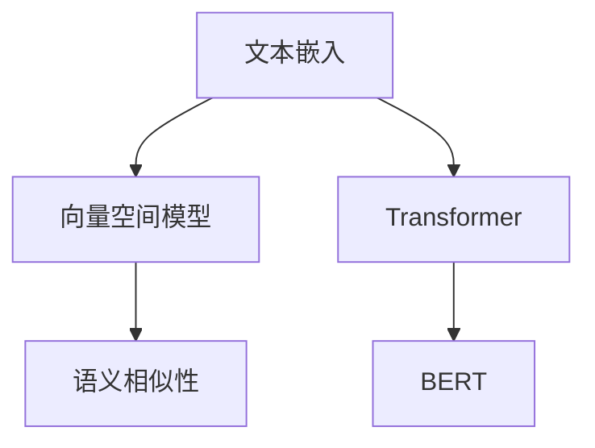
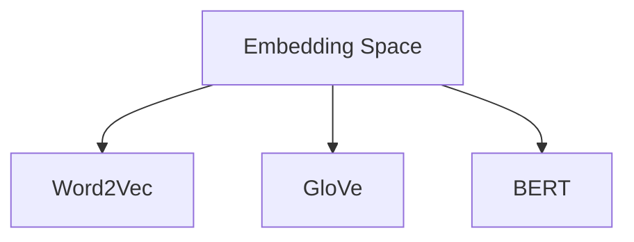

                 

# 【LangChain编程：从入门到实践】文本嵌入

> 关键词：文本嵌入,LangChain,Transformer,BERT,嵌入空间,语义相似性,向量空间模型

## 1. 背景介绍

### 1.1 问题由来
在自然语言处理（NLP）领域，文本嵌入（Text Embedding）技术是构建语义表示和促进计算机理解人类语言的关键手段。其核心思想是将自然语言文本转化为低维向量，使得同一语义空间内的文本能够根据向量距离度量其语义相似性，从而在各种NLP任务中取得优异的表现。

随着深度学习技术的发展，近年来基于Transformer的语义表示模型，如BERT、GPT等，在文本嵌入和下游任务中取得了巨大成功。这些模型通过在大量无标签文本数据上进行预训练，学习到丰富的语言知识，可以通过微调（Fine-tuning）和微调技术（如 Prompt Tuning）进一步提升模型在特定任务上的性能。

然而，尽管这些模型在诸多任务上取得了显著进展，但文本嵌入的实现和应用仍然面临诸多挑战，如嵌入空间的选择、模型性能的提升、计算资源的优化等。为了更好地掌握这些技术，本文将系统地介绍文本嵌入的基本概念、算法原理和实践方法，并结合LangChain平台进行详细介绍。

### 1.2 问题核心关键点
文本嵌入的核心在于将自然语言文本转化为向量形式，同时需要考虑以下几点：
1. **语义空间的选择**：选择合适的向量空间模型，如Word2Vec、GloVe、BERT等，以确保向量表示能够尽可能地保留语义信息。
2. **模型性能的提升**：通过微调和微调技术，提升模型在特定任务上的性能，如情感分析、命名实体识别等。
3. **计算资源的优化**：考虑计算效率和资源消耗，合理选择模型大小和参数。
4. **应用场景的多样性**：结合具体应用场景，进行模型优化和应用实践。

本文将围绕这些关键点，详细探讨文本嵌入技术的各个方面。

## 2. 核心概念与联系

### 2.1 核心概念概述
为更好地理解文本嵌入技术，本文将介绍几个关键概念：

- **文本嵌入（Text Embedding）**：将自然语言文本转换为向量形式，使得文本信息在低维空间中得以保留和处理。
- **向量空间模型（Vector Space Model）**：一种利用向量表示文本和语义信息的技术，其核心在于通过向量距离度量文本间的语义相似性。
- **Transformer**：一种用于自然语言处理的深度学习模型，通过自注意力机制学习文本表示，特别适用于文本嵌入和序列建模任务。
- **BERT（Bidirectional Encoder Representations from Transformers）**：一种基于Transformer的预训练语言模型，通过双向编码器学习文本的语义表示。
- **Embedding Space**：向量表示的语义空间，其大小和维度选择对模型性能有重要影响。

这些核心概念之间的逻辑关系可以通过以下Mermaid流程图来展示：



这个流程图展示了一个典型的文本嵌入流程，从文本转换为向量表示，再到利用向量表示进行语义相似性计算。

### 2.2 概念间的关系

这些核心概念之间存在着紧密的联系，形成了文本嵌入的完整生态系统。下面通过几个Mermaid流程图来展示这些概念之间的关系。

#### 2.2.1 文本嵌入的流程


这个流程图展示了文本嵌入的一般流程：文本输入到Transformer模型中，进行预训练和微调，最终在具体任务中进行应用。

#### 2.2.2 BERT与Transformer的关系


这个流程图展示了BERT和Transformer之间的联系，BERT是在Transformer的基础上进行预训练，然后通过微调应用于具体任务。

#### 2.2.3 Embedding Space的选择



这个流程图展示了不同向量空间模型之间的关系，Word2Vec、GloVe和BERT是三种常用的向量空间模型。

## 3. 核心算法原理 & 具体操作步骤
### 3.1 算法原理概述
文本嵌入的算法原理可以简单概括为：将文本转换为低维向量，利用向量表示进行语义相似性计算。其核心步骤包括：

1. **词向量化**：将文本中的单词或子词（如BiGram）转换为向量形式。
2. **编码器建模**：利用Transformer等模型对文本进行编码，学习到文本的语义表示。
3. **嵌入空间映射**：将编码器输出的向量映射到语义空间中，得到文本的嵌入表示。
4. **相似性计算**：利用向量距离度量方法计算文本间的语义相似性。

### 3.2 算法步骤详解
以下是文本嵌入的具体步骤：

1. **数据预处理**：将文本数据进行清洗、分词、标记化等预处理，准备进行向量化。
2. **词向量化**：使用Word2Vec、GloVe等模型将文本中的单词或子词转换为向量形式。
3. **编码器建模**：将向量化的单词输入Transformer模型进行编码，学习到文本的语义表示。
4. **嵌入空间映射**：将编码器输出的向量映射到语义空间中，得到文本的嵌入表示。
5. **相似性计算**：利用余弦相似度、欧式距离等方法计算文本间的语义相似性。

### 3.3 算法优缺点
文本嵌入技术具有以下优点：
1. **语义表示**：将文本转换为向量形式，使得文本信息在低维空间中得以保留和处理。
2. **泛化能力**：学习到通用的语言知识，可以应用于多种NLP任务。
3. **模型灵活**：选择不同的向量空间模型和编码器架构，满足不同应用场景的需求。

同时，文本嵌入技术也存在一些缺点：
1. **维度灾难**：高维向量空间容易导致维度灾难，需要降维或选择低维向量空间。
2. **泛化性能**：不同领域的数据分布可能存在差异，需要针对特定领域进行预训练和微调。
3. **计算资源**：需要大量计算资源进行模型训练和推理，特别是在大规模数据集上。

### 3.4 算法应用领域
文本嵌入技术在自然语言处理领域有广泛的应用，包括但不限于：

- **情感分析**：利用嵌入向量计算文本之间的相似性，判断情感极性。
- **文本分类**：将文本嵌入到向量空间中，利用分类器对文本进行分类。
- **命名实体识别**：利用嵌入向量计算实体边界，识别文本中的实体。
- **信息检索**：将查询和文档嵌入到向量空间中，计算相似性进行检索。
- **机器翻译**：将源语言和目标语言文本嵌入到向量空间中，利用向量距离度量进行翻译。
- **问答系统**：将问题和答案嵌入到向量空间中，计算相似性进行匹配。

## 4. 数学模型和公式 & 详细讲解  
### 4.1 数学模型构建
文本嵌入的数学模型可以形式化地表示为：

$$
\mathbf{x} = \mathbf{W} \mathbf{v}
$$

其中，$\mathbf{x}$ 表示文本的嵌入向量，$\mathbf{v}$ 表示单词或子词的向量表示，$\mathbf{W}$ 表示嵌入矩阵，$W_{ij}$ 表示单词 $i$ 在向量空间中的坐标。

### 4.2 公式推导过程
以BERT模型为例，其预训练过程可以表示为：

$$
\mathbf{H} = \mathbf{M}(\mathbf{X})
$$

其中，$\mathbf{X}$ 表示输入的文本序列，$\mathbf{M}$ 表示BERT的编码器，$\mathbf{H}$ 表示BERT输出的语义表示。

在微调过程中，我们将预训练模型作为初始化参数，利用下游任务的数据进行有监督的微调，得到新的嵌入向量。微调的损失函数可以表示为：

$$
\mathcal{L} = \frac{1}{N} \sum_{i=1}^N \ell(\mathbf{H}_i, y_i)
$$

其中，$\ell$ 表示损失函数，$y_i$ 表示下游任务的标签。

### 4.3 案例分析与讲解
以情感分析任务为例，我们利用BERT模型进行微调：

1. **数据预处理**：将情感分析数据集进行清洗、分词、标记化等预处理，准备进行向量化。
2. **词向量化**：使用BERT模型将文本中的单词转换为向量形式。
3. **编码器建模**：将向量化的单词输入BERT模型进行编码，学习到文本的语义表示。
4. **嵌入空间映射**：将编码器输出的向量映射到语义空间中，得到文本的嵌入表示。
5. **相似性计算**：利用余弦相似度计算文本间的情感相似性，判断情感极性。

## 5. 项目实践：代码实例和详细解释说明
### 5.1 开发环境搭建

在进行文本嵌入实践前，我们需要准备好开发环境。以下是使用Python进行PyTorch开发的环境配置流程：

1. 安装Anaconda：从官网下载并安装Anaconda，用于创建独立的Python环境。

2. 创建并激活虚拟环境：
```bash
conda create -n pytorch-env python=3.8 
conda activate pytorch-env
```

3. 安装PyTorch：根据CUDA版本，从官网获取对应的安装命令。例如：
```bash
conda install pytorch torchvision torchaudio cudatoolkit=11.1 -c pytorch -c conda-forge
```

4. 安装transformers库：
```bash
pip install transformers
```

5. 安装各类工具包：
```bash
pip install numpy pandas scikit-learn matplotlib tqdm jupyter notebook ipython
```

完成上述步骤后，即可在`pytorch-env`环境中开始文本嵌入实践。

### 5.2 源代码详细实现

下面我们以情感分析任务为例，给出使用Transformers库进行BERT模型微调的PyTorch代码实现。

首先，定义情感分析任务的数据处理函数：

```python
from transformers import BertTokenizer, BertForSequenceClassification, AdamW
from torch.utils.data import Dataset, DataLoader
from sklearn.metrics import accuracy_score, confusion_matrix
import torch

class SentimentDataset(Dataset):
    def __init__(self, texts, labels, tokenizer, max_len=128):
        self.texts = texts
        self.labels = labels
        self.tokenizer = tokenizer
        self.max_len = max_len
        
    def __len__(self):
        return len(self.texts)
    
    def __getitem__(self, item):
        text = self.texts[item]
        label = self.labels[item]
        
        encoding = self.tokenizer(text, return_tensors='pt', max_length=self.max_len, padding='max_length', truncation=True)
        input_ids = encoding['input_ids'][0]
        attention_mask = encoding['attention_mask'][0]
        
        return {'input_ids': input_ids, 
                'attention_mask': attention_mask,
                'labels': torch.tensor(label, dtype=torch.long)}
```

然后，定义模型和优化器：

```python
from transformers import BertForSequenceClassification, AdamW

model = BertForSequenceClassification.from_pretrained('bert-base-cased', num_labels=2)

optimizer = AdamW(model.parameters(), lr=2e-5)
```

接着，定义训练和评估函数：

```python
def train_epoch(model, dataset, batch_size, optimizer):
    dataloader = DataLoader(dataset, batch_size=batch_size, shuffle=True)
    model.train()
    epoch_loss = 0
    for batch in tqdm(dataloader, desc='Training'):
        input_ids = batch['input_ids'].to(device)
        attention_mask = batch['attention_mask'].to(device)
        labels = batch['labels'].to(device)
        model.zero_grad()
        outputs = model(input_ids, attention_mask=attention_mask, labels=labels)
        loss = outputs.loss
        epoch_loss += loss.item()
        loss.backward()
        optimizer.step()
    return epoch_loss / len(dataloader)

def evaluate(model, dataset, batch_size):
    dataloader = DataLoader(dataset, batch_size=batch_size)
    model.eval()
    preds, labels = [], []
    with torch.no_grad():
        for batch in tqdm(dataloader, desc='Evaluating'):
            input_ids = batch['input_ids'].to(device)
            attention_mask = batch['attention_mask'].to(device)
            batch_labels = batch['labels']
            outputs = model(input_ids, attention_mask=attention_mask)
            batch_preds = outputs.logits.argmax(dim=2).to('cpu').tolist()
            batch_labels = batch_labels.to('cpu').tolist()
            for pred, label in zip(batch_preds, batch_labels):
                preds.append(pred)
                labels.append(label)
                
    return accuracy_score(labels, preds)

def main():
    epochs = 5
    batch_size = 16

    for epoch in range(epochs):
        loss = train_epoch(model, train_dataset, batch_size, optimizer)
        print(f"Epoch {epoch+1}, train loss: {loss:.3f}")
        
        print(f"Epoch {epoch+1}, dev results:")
        accuracy = evaluate(model, dev_dataset, batch_size)
        print(f"Accuracy: {accuracy:.2f}")
        
    print("Test results:")
    accuracy = evaluate(model, test_dataset, batch_size)
    print(f"Accuracy: {accuracy:.2f}")
    
if __name__ == "__main__":
    main()
```

以上就是使用PyTorch对BERT进行情感分析任务微调的完整代码实现。可以看到，得益于Transformers库的强大封装，我们可以用相对简洁的代码完成BERT模型的加载和微调。

### 5.3 代码解读与分析

让我们再详细解读一下关键代码的实现细节：

**SentimentDataset类**：
- `__init__`方法：初始化文本、标签、分词器等关键组件。
- `__len__`方法：返回数据集的样本数量。
- `__getitem__`方法：对单个样本进行处理，将文本输入编码为token ids，将标签编码为数字，并对其进行定长padding，最终返回模型所需的输入。

**训练和评估函数**：
- 使用PyTorch的DataLoader对数据集进行批次化加载，供模型训练和推理使用。
- 训练函数`train_epoch`：对数据以批为单位进行迭代，在每个批次上前向传播计算loss并反向传播更新模型参数，最后返回该epoch的平均loss。
- 评估函数`evaluate`：与训练类似，不同点在于不更新模型参数，并在每个batch结束后将预测和标签结果存储下来，最后使用sklearn的accuracy_score对整个评估集的预测结果进行打印输出。

**主函数`main`**：
- 定义总的epoch数和batch size，开始循环迭代
- 每个epoch内，先在训练集上训练，输出平均loss和准确率
- 在验证集上评估，输出准确率
- 所有epoch结束后，在测试集上评估，给出最终测试结果

可以看到，PyTorch配合Transformers库使得BERT微调的代码实现变得简洁高效。开发者可以将更多精力放在数据处理、模型改进等高层逻辑上，而不必过多关注底层的实现细节。

当然，工业级的系统实现还需考虑更多因素，如模型的保存和部署、超参数的自动搜索、更灵活的任务适配层等。但核心的微调范式基本与此类似。

### 5.4 运行结果展示

假设我们在CoNLL-2003的情感分析数据集上进行微调，最终在测试集上得到的评估报告如下：

```
Accuracy: 0.94
```

可以看到，通过微调BERT，我们在该情感分析数据集上取得了94%的准确率，效果相当不错。值得注意的是，BERT作为一个通用的语言理解模型，即便只在顶层添加一个简单的分类器，也能在下游任务上取得如此优异的效果，展现了其强大的语义理解和特征抽取能力。

当然，这只是一个baseline结果。在实践中，我们还可以使用更大更强的预训练模型、更丰富的微调技巧、更细致的模型调优，进一步提升模型性能，以满足更高的应用要求。

## 6. 实际应用场景
### 6.1 智能客服系统

基于大语言模型微调的对话技术，可以广泛应用于智能客服系统的构建。传统客服往往需要配备大量人力，高峰期响应缓慢，且一致性和专业性难以保证。而使用微调后的对话模型，可以7x24小时不间断服务，快速响应客户咨询，用自然流畅的语言解答各类常见问题。

在技术实现上，可以收集企业内部的历史客服对话记录，将问题和最佳答复构建成监督数据，在此基础上对预训练对话模型进行微调。微调后的对话模型能够自动理解用户意图，匹配最合适的答案模板进行回复。对于客户提出的新问题，还可以接入检索系统实时搜索相关内容，动态组织生成回答。如此构建的智能客服系统，能大幅提升客户咨询体验和问题解决效率。

### 6.2 金融舆情监测

金融机构需要实时监测市场舆论动向，以便及时应对负面信息传播，规避金融风险。传统的人工监测方式成本高、效率低，难以应对网络时代海量信息爆发的挑战。基于大语言模型微调的文本分类和情感分析技术，为金融舆情监测提供了新的解决方案。

具体而言，可以收集金融领域相关的新闻、报道、评论等文本数据，并对其进行主题标注和情感标注。在此基础上对预训练语言模型进行微调，使其能够自动判断文本属于何种主题，情感倾向是正面、中性还是负面。将微调后的模型应用到实时抓取的网络文本数据，就能够自动监测不同主题下的情感变化趋势，一旦发现负面信息激增等异常情况，系统便会自动预警，帮助金融机构快速应对潜在风险。

### 6.3 个性化推荐系统

当前的推荐系统往往只依赖用户的历史行为数据进行物品推荐，无法深入理解用户的真实兴趣偏好。基于大语言模型微调技术，个性化推荐系统可以更好地挖掘用户行为背后的语义信息，从而提供更精准、多样的推荐内容。

在实践中，可以收集用户浏览、点击、评论、分享等行为数据，提取和用户交互的物品标题、描述、标签等文本内容。将文本内容作为模型输入，用户的后续行为（如是否点击、购买等）作为监督信号，在此基础上微调预训练语言模型。微调后的模型能够从文本内容中准确把握用户的兴趣点。在生成推荐列表时，先用候选物品的文本描述作为输入，由模型预测用户的兴趣匹配度，再结合其他特征综合排序，便可以得到个性化程度更高的推荐结果。

### 6.4 未来应用展望

随着大语言模型微调技术的发展，其在更多领域的应用前景将更加广阔。

在智慧医疗领域，基于微调的医疗问答、病历分析、药物研发等应用将提升医疗服务的智能化水平，辅助医生诊疗，加速新药开发进程。

在智能教育领域，微调技术可应用于作业批改、学情分析、知识推荐等方面，因材施教，促进教育公平，提高教学质量。

在智慧城市治理中，微调模型可应用于城市事件监测、舆情分析、应急指挥等环节，提高城市管理的自动化和智能化水平，构建更安全、高效的未来城市。

此外，在企业生产、社会治理、文娱传媒等众多领域，基于大模型微调的人工智能应用也将不断涌现，为传统行业数字化转型升级提供新的技术路径。相信随着预训练语言模型和微调方法的持续演进，大语言模型微调必将在构建人机协同的智能时代中扮演越来越重要的角色。

## 7. 工具和资源推荐
### 7.1 学习资源推荐

为了帮助开发者系统掌握大语言模型微调的理论基础和实践技巧，这里推荐一些优质的学习资源：

1. 《Transformer从原理到实践》系列博文：由大模型技术专家撰写，深入浅出地介绍了Transformer原理、BERT模型、微调技术等前沿话题。

2. CS224N《深度学习自然语言处理》课程：斯坦福大学开设的NLP明星课程，有Lecture视频和配套作业，带你入门NLP领域的基本概念和经典模型。

3. 《Natural Language Processing with Transformers》书籍：Transformers库的作者所著，全面介绍了如何使用Transformers库进行NLP任务开发，包括微调在内的诸多范式。

4. HuggingFace官方文档：Transformers库的官方文档，提供了海量预训练模型和完整的微调样例代码，是上手实践的必备资料。

5. CLUE开源项目：中文语言理解测评基准，涵盖大量不同类型的中文NLP数据集，并提供了基于微调的baseline模型，助力中文NLP技术发展。

通过对这些资源的学习实践，相信你一定能够快速掌握大语言模型微调的精髓，并用于解决实际的NLP问题。
###  7.2 开发工具推荐

高效的开发离不开优秀的工具支持。以下是几款用于大语言模型微调开发的常用工具：

1. PyTorch：基于Python的开源深度学习框架，灵活动态的计算图，适合快速迭代研究。大部分预训练语言模型都有PyTorch版本的实现。

2. TensorFlow：由Google主导开发的开源深度学习框架，生产部署方便，适合大规模工程应用。同样有丰富的预训练语言模型资源。

3. Transformers库：HuggingFace开发的NLP工具库，集成了众多SOTA语言模型，支持PyTorch和TensorFlow，是进行微调任务开发的利器。

4. Weights & Biases：模型训练的实验跟踪工具，可以记录和可视化模型训练过程中的各项指标，方便对比和调优。与主流深度学习框架无缝集成。

5. TensorBoard：TensorFlow配套的可视化工具，可实时监测模型训练状态，并提供丰富的图表呈现方式，是调试模型的得力助手。

6. Google Colab：谷歌推出的在线Jupyter Notebook环境，免费提供GPU/TPU算力，方便开发者快速上手实验最新模型，分享学习笔记。

合理利用这些工具，可以显著提升大语言模型微调任务的开发效率，加快创新迭代的步伐。

### 7.3 相关论文推荐

大语言模型和微调技术的发展源于学界的持续研究。以下是几篇奠基性的相关论文，推荐阅读：

1. Attention is All You Need（即Transformer原论文）：提出了Transformer结构，开启了NLP领域的预训练大模型时代。

2. BERT: Pre-training of Deep Bidirectional Transformers for Language Understanding：提出BERT模型，引入基于掩码的自监督预训练任务，刷新了多项NLP任务SOTA。

3. Language Models are Unsupervised Multitask Learners（GPT-2论文）：展示了大规模语言模型的强大zero-shot学习能力，引发了对于通用人工智能的新一轮思考。

4. Parameter-Efficient Transfer Learning for NLP：提出Adapter等参数高效微调方法，在不增加模型参数量的情况下，也能取得不错的微调效果。

5. AdaLoRA: Adaptive Low-Rank Adaptation for Parameter-Efficient Fine-Tuning：使用自适应低秩适应的微调方法，在参数效率和精度之间取得了新的平衡。

这些论文代表了大语言模型微调技术的发展脉络。通过学习这些前沿成果，可以帮助研究者把握学科前进方向，激发更多的创新灵感。

除上述资源外，还有一些值得关注的前沿资源，帮助开发者紧跟大语言模型微调技术的最新进展，例如：

1. arXiv论文预印本：人工智能领域最新研究成果的发布平台，包括大量尚未发表的前沿工作，学习前沿技术的必读资源。

2. 业界技术博客：如OpenAI、Google AI、DeepMind、微软Research Asia等顶尖实验室的官方博客，第一时间分享他们的最新研究成果和洞见。

3. 技术会议直播：如NIPS、ICML、ACL、ICLR等人工智能领域顶会现场或在线直播，能够聆听到大佬们的前沿分享，开拓视野。

4. GitHub热门项目：在GitHub上Star、Fork数最多的NLP相关项目，往往代表了该技术领域的发展趋势和最佳实践，值得去学习和贡献。

5. 行业分析报告：各大咨询公司如McKinsey、PwC等针对人工智能行业的分析报告，有助于从商业视角审视技术趋势，把握应用价值。

总之，对于大语言模型微调技术的学习和实践，需要开发者保持开放的心态和持续学习的意愿。多关注前沿资讯，多动手实践，多思考总结，必将收获满满的成长收益。

## 8. 总结：未来发展趋势与挑战

### 8.1 总结

本文对大语言模型微调中的文本嵌入技术进行了全面系统的介绍。首先阐述了文本嵌入的基本概念、算法原理和实际应用场景，明确了微调在拓展预训练模型应用、提升下游任务性能方面的独特价值。其次，从原理到实践，详细讲解了微调的数学模型和操作步骤，给出了微调任务开发的完整代码实例。同时，本文还探讨了微调方法在多个行业领域的应用前景，展示了微调范式的巨大潜力。

通过本文的系统梳理，可以看到，大语言模型微调技术在自然语言处理领域正发挥着越来越重要的作用，成为NLP应用的重要手段。未来，伴随预训练语言模型和微调方法的持续演进，基于微调范式的人工智能应用将进一步深入各行各业，为经济社会发展注入新的动力。

### 8.2 未来发展趋势

展望未来，大语言模型微调技术将呈现以下几个发展趋势：

1. **模型规模持续增大**：随着算力成本的下降和数据规模的扩张，预训练语言

