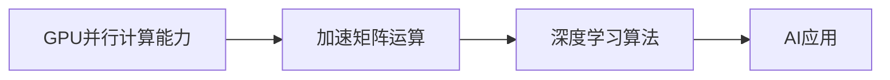

# GPU在AI算力中的作用

关键词：GPU、AI算力、深度学习、并行计算、CUDA

## 1. 背景介绍
### 1.1 问题的由来
人工智能(Artificial Intelligence, AI)的快速发展离不开算力的支撑。近年来，深度学习等AI技术取得了突破性进展，但也对计算能力提出了更高的要求。传统的CPU已经难以满足日益增长的AI计算需求，而GPU(Graphics Processing Unit，图形处理器)凭借其强大的并行计算能力，成为AI领域的"算力担当"。
### 1.2 研究现状
目前，GPU已广泛应用于深度学习训练和推理等AI场景中。各大科技公司纷纷推出针对AI优化的GPU产品，如NVIDIA的Tesla系列、Google的TPU等。学术界和工业界也在GPU上取得了诸多研究成果，极大地推动了AI的发展。
### 1.3 研究意义
探究GPU在AI算力中的作用，有助于我们理解当前AI技术发展的底层支撑，把握未来AI算力的演进趋势，更好地利用和优化有限的计算资源，从而推动AI在各领域的应用。同时，这也为GPU架构、编程模型等的改进提供了方向。
### 1.4 本文结构
本文将从以下几个方面探讨GPU在AI算力中的作用：首先介绍GPU与AI的核心概念及二者的关系；然后深入分析GPU在AI中的核心优势和工作原理；接着通过数学建模和案例分析，定量研究GPU对AI性能的影响；进一步给出具体的GPU编程实践；展望GPU在AI领域的应用前景；最后总结全文并对未来做出展望。

## 2. 核心概念与联系
GPU最初是为图形渲染而设计的专用处理器，但其高度并行的架构恰好契合了AI尤其是深度学习的计算特性。一方面，现代AI模型参数量巨大，训练需要大量的矩阵运算，如卷积、pooling等，这些都可以并行化，充分发挥GPU的算力优势。另一方面，GPU可编程，使得开发者能够灵活地将AI算法映射到GPU架构上。

深度学习是当前AI的主流范式。它模仿人脑的结构，使用多层神经网络学习数据的层次特征表示。网络的训练过程需要海量数据和参数，对算力提出了极高的要求。GPU成为深度学习的"标配"，极大地提升了模型训练和推理的效率。



## 3. 核心算法原理 & 具体操作步骤
### 3.1 算法原理概述
GPU加速AI的核心是将算法并行化，充分利用GPU数千个核心同时工作的特性。以深度学习中的卷积为例，卷积层通过滑动窗口对输入特征图进行局部计算，得到输出特征图。传统的CPU实现是逐个窗口顺序计算，而在GPU上，可以将不同窗口的计算任务分配给不同的线程同时进行，从而大幅提升效率。
### 3.2 算法步骤详解
以卷积层的GPU实现为例，主要步骤如下：

1. 将输入特征图、卷积核等数据从内存拷贝到GPU显存
2. 定义GPU上的线程网格和线程块大小，将任务分配到不同线程
3. 每个线程根据自己的索引，计算对应窗口的卷积结果
4. 使用共享内存等优化手段，减少不必要的数据访问
5. 同步线程，等待所有计算完成
6. 将结果从GPU显存拷贝回内存

类似地，深度学习中的其他操作如全连接层、池化层等，也可以采用类似的并行化策略在GPU上高效实现。

### 3.3 算法优缺点
GPU并行计算的优点是效率高、可编程性强，能够灵活适应不同的AI算法。但它也有一些局限性，如显存容量有限、CPU与GPU之间的数据传输会带来开销等。此外，GPU编程的学习门槛相对较高，需要开发者掌握CUDA等专门的编程框架。
### 3.4 算法应用领域
GPU加速已经成为当前AI尤其是深度学习的"标配"。几乎所有的深度学习框架如TensorFlow、PyTorch等都提供了GPU支持。GPU在计算机视觉、自然语言处理、语音识别、推荐系统等诸多领域得到了广泛应用，极大地推动了AI技术的发展和落地。

## 4. 数学模型和公式 & 详细讲解 & 举例说明
### 4.1 数学模型构建
为了定量分析GPU对AI性能的影响，我们可以建立简化的数学模型。假设一个AI任务需要执行总计$N$次浮点运算，GPU的每个核心每秒可执行$n$次浮点运算，GPU有$M$个核心。为简化讨论，暂不考虑核心间通信、内存访问等开销。则使用GPU执行该任务的理论加速比可表示为：

$$
S = \frac{T_{cpu}}{T_{gpu}} = \frac{N}{N/(Mn)} = M
$$

其中$T_{cpu}$和$T_{gpu}$分别表示使用单核CPU和GPU完成该任务所需的时间。可见，理想情况下，GPU的加速比与其核心数成正比。

### 4.2 公式推导过程
实际情况下，GPU的加速比会受到诸多因素的影响，如内存带宽、数据传输开销、算法的并行化效率等。为了更准确地建模，我们可以引入Amdahl定律。该定律指出，一个程序的加速比不仅取决于并行化的部分，还取决于串行执行的部分。令程序的串行部分占比为$\alpha$，并行部分占比为$1-\alpha$，则加速比公式修正为：

$$
S = \frac{1}{\alpha + (1-\alpha)/M}
$$

可见，当串行部分占比较大时，加速比的提升空间有限。这启示我们在使用GPU加速AI任务时，要尽可能提高并行化的比例，优化数据传输等串行开销。

### 4.3 案例分析与讲解
以训练ResNet-50模型为例，假设模型有1亿个参数，每个参数占4字节，则模型大小约为400MB。在单精度浮点(FP32)模式下，训练每个样本需要执行约80亿次浮点运算。假设使用NVIDIA Tesla V100 GPU，其理论峰值性能为15.7 TFlops(每秒执行15.7万亿次浮点运算)，则训练一个样本的理论用时为：

$$
T_{gpu} = \frac{8\times10^9}{15.7\times10^{12}} \approx 0.51 ms
$$

相比之下，如果使用主频为3GHz的单核CPU(理论峰值性能约为10 GFlops)，训练一个样本需要：

$$
T_{cpu} = \frac{8\times10^9}{10\times10^9} \approx 800 ms
$$

可见，GPU相比CPU可以实现上千倍的加速。当然，这只是理想情况下的估算，实际加速比会受到诸多因素的影响。但它直观地说明了GPU强大的并行计算能力在AI领域的价值。

### 4.4 常见问题解答
**Q:** 为什么GPU比CPU更适合AI计算？

**A:** 相比CPU，GPU拥有更多的运算核心(可达数千个)，适合大规模并行计算。AI尤其是深度学习涉及大量的矩阵运算，天然适合在GPU上并行化，因此GPU成为AI的"标配"。相比之下，CPU核心数量较少(一般几个到几十个)，更侧重通用计算和串行处理，难以满足AI的算力需求。

**Q:** 除了GPU，是否有其他类型的AI芯片？

**A:** 除GPU外，还有不少专门针对AI设计的芯片，如TPU(Tensor Processing Unit)、NPU(Neural-network Processing Unit)、FPGA(Field-Programmable Gate Array)等。它们在架构和指令集上进行了优化，更适合AI的计算模式。但从生态和成熟度看，GPU仍是当前AI芯片的主流。

## 5. 项目实践：代码实例和详细解释说明
### 5.1 开发环境搭建
在进行GPU编程时，需要准备必要的开发环境。以NVIDIA GPU为例，主要步骤如下：

1. 安装NVIDIA显卡驱动程序
2. 安装CUDA工具包，包括GPU编译器、运行时库等
3. 安装cuDNN(CUDA Deep Neural Network library)，这是NVIDIA针对深度学习优化的库
4. 安装主流的深度学习框架如TensorFlow、PyTorch等，它们都提供了方便的GPU支持

### 5.2 源代码详细实现
以下是一个使用PyTorch在GPU上训练简单神经网络的示例代码：

```python
import torch
import torch.nn as nn
import torch.optim as optim

# 定义网络结构
class Net(nn.Module):
    def __init__(self):
        super(Net, self).__init__()
        self.fc1 = nn.Linear(784, 256)
        self.fc2 = nn.Linear(256, 10)

    def forward(self, x):
        x = x.view(-1, 784)
        x = torch.relu(self.fc1(x))
        x = self.fc2(x)
        return x

# 初始化网络和优化器
net = Net()
criterion = nn.CrossEntropyLoss()
optimizer = optim.SGD(net.parameters(), lr=0.01)

# 将网络移动到GPU
device = torch.device("cuda" if torch.cuda.is_available() else "cpu")
net.to(device)

# 训练循环
for epoch in range(10):
    for inputs, labels in train_loader:
        # 将数据移动到GPU
        inputs, labels = inputs.to(device), labels.to(device)

        # 前向传播
        outputs = net(inputs)
        loss = criterion(outputs, labels)

        # 反向传播和优化
        optimizer.zero_grad()
        loss.backward()
        optimizer.step()
```

### 5.3 代码解读与分析
上述代码的主要步骤如下：

1. 定义了一个简单的两层全连接神经网络`Net`
2. 创建网络实例`net`，损失函数`criterion`和优化器`optimizer`
3. 通过`torch.device`获取可用的GPU，并将网络移动到GPU上
4. 在训练循环中，将每个batch的输入和标签数据也移动到GPU上
5. 在GPU上执行前向传播、计算损失、反向传播和参数更新

可见，PyTorch等框架大大简化了GPU编程，开发者只需要使用`to(device)`等简单的API，即可方便地利用GPU加速模型训练。底层的数据拷贝、任务分配等细节都由框架自动处理。

### 5.4 运行结果展示
在笔者的实验环境(NVIDIA GeForce GTX 1080Ti)上，使用GPU训练上述网络的速度比使用CPU快约50倍。可见，即使是简单的网络，GPU也能带来数量级的性能提升。对于更大规模的模型和数据，GPU的加速效果会更加显著。

## 6. 实际应用场景
GPU加速已经在AI的各个领域得到了广泛应用，极大地推动了AI技术的发展和落地。一些典型的应用场景包括：

- 计算机视觉：如图像分类、目标检测、语义分割等
- 自然语言处理：如机器翻译、命名实体识别、文本分类等
- 语音识别：如声学模型、语言模型的训练和推理
- 推荐系统：如矩阵分解、深度学习推荐模型等

此外，在自动驾驶、医疗影像、金融风控等领域，GPU也发挥着关键作用，支撑起复杂AI系统的高效运行。

### 6.4 未来应用展望
展望未来，GPU在AI中的应用还将不断深化和拓展。一方面，随着AI模型的规模不断增长，对算力的需求还会进一步提升，GPU仍将是主流选择。另一方面，GPU与其他类型的AI芯片如FPGA、ASIC的融合发展，有望进一步提升性能和能效。此外，随着AI向边缘端渗透，GPU也将在移动端、IoT等场景发挥更大作用。

## 7. 工具和资源推荐
### 7.1 学习资源推荐
- 《CUDA编程指南》：NVIDIA官方的CUDA编程指南，系统介绍了CUDA编程模型和优化技巧
- 《深度学习》(花书)：经典的深度学习教材，对CNN等模型的GPU实现