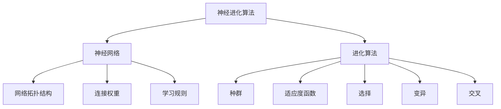

神经进化算法(Neuroevolution) - 原理与代码实例讲解

# 1. 背景介绍

## 1.1 问题的由来

在人工智能和机器学习领域中,神经网络已经成为解决复杂问题的强大工具。然而,传统的神经网络训练方法,如反向传播算法,存在一些固有的局限性。它们需要大量的训练数据,计算成本高,并且容易陷入局部最优解。此外,这些算法通常难以处理强化学习等在线学习任务。为了克服这些挑战,神经进化算法(Neuroevolution)应运而生。

## 1.2 研究现状

神经进化算法是一种将进化算法和神经网络相结合的方法。它利用进化算法(如遗传算法、进化策略等)来优化神经网络的权重、拓扑结构和学习规则,从而实现神经网络的自动设计和训练。近年来,神经进化算法在强化学习、机器人控制、游戏AI等领域取得了令人鼓舞的成果,展现出巨大的潜力。

## 1.3 研究意义

神经进化算法具有以下优势:

1. **数据高效**:与传统的监督学习方法相比,神经进化算法不需要大量的标记数据,可以从少量的示例中学习。
2. **并行性强**:进化算法的并行特性使得神经进化算法能够在多核CPU或GPU上高效运行。
3. **适应性强**:神经进化算法可以自动发现最佳的网络拓扑结构和参数,从而适应不同的问题领域。
4. **在线学习**:神经进化算法能够在线学习和适应动态环境,这对于强化学习任务尤为重要。

因此,神经进化算法为解决复杂的人工智能问题提供了一种新的视角和方法,具有广阔的应用前景。

## 1.4 本文结构

本文将全面介绍神经进化算法的原理、算法细节、数学模型、代码实现和应用场景。内容安排如下:

1. 背景介绍
2. 核心概念与联系
3. 核心算法原理与具体操作步骤
4. 数学模型和公式详细讲解与举例说明
5. 项目实践:代码实例和详细解释说明
6. 实际应用场景
7. 工具和资源推荐
8. 总结:未来发展趋势与挑战
9. 附录:常见问题与解答

# 2. 核心概念与联系

神经进化算法融合了神经网络和进化算法两大领域的核心概念。下面我们来了解它们之间的联系。

如上图所示,神经进化算法将神经网络的**网络拓扑结构**、**连接权重**和**学习规则**编码为一个个体,构成一个**种群**。然后,利用进化算法中的**适应度函数**评估每个个体的性能,并通过**选择**、**变异**和**交叉**等操作产生新的种群。经过多代进化,神经网络可以逐步优化,最终获得满意的性能。

需要注意的是,神经进化算法不仅可以优化神经网络的权重,还可以同时优化网络的拓扑结构和学习规则,从而实现真正的自动机器学习(AutoML)。这使得神经进化算法在处理复杂问题时具有更大的灵活性和适应性。

# 3. 核心算法原理与具体操作步骤

## 3.1 算法原理概述

神经进化算法的核心思想是将神经网络的参数(权重、拓扑结构等)编码为一个个体,并使用进化算法(如遗传算法)对这些个体进行优化。算法的基本流程如下:

1. **初始化种群**:随机生成一定数量的神经网络个体,作为初始种群。
2. **评估适应度**:对每个个体进行评估,计算其在给定任务上的适应度(性能)分数。
3. **选择操作**:根据适应度分数,从当前种群中选择一部分个体,作为下一代种群的父代。
4. **进化操作**:对选择的父代个体执行变异和交叉操作,产生新的子代个体。
5. **种群更新**:用新产生的子代个体替换当前种群中的一部分个体,形成新的种群。
6. **终止条件检查**:检查是否满足终止条件(如达到期望性能或进化代数上限)。如果不满足,返回步骤2,重复进化过程。

通过不断进化,神经网络的参数会逐渐优化,使其在目标任务上表现出越来越好的性能。

## 3.2 算法步骤详解

下面我们对神经进化算法的具体步骤进行详细解释。

### 3.2.1 初始化种群

算法首先需要生成一个初始种群,其中每个个体对应一个神经网络。常见的编码方式包括:

1. **直接编码**:将神经网络的所有连接权重编码为一个实数向量。
2. **间接编码**:使用一些生成规则(如递归生长过程)来描述神经网络的拓扑结构和权重。

无论采用哪种编码方式,初始种群通常是随机生成的,以确保种群的多样性。

### 3.2.2 评估适应度

适应度函数用于评估每个神经网络个体在目标任务上的性能。常见的适应度函数包括:

- 对于监督学习任务,可以使用神经网络在训练集或测试集上的分类准确率或回归误差作为适应度分数。
- 对于强化学习任务,可以使用神经网络控制器在环境中获得的累积奖励作为适应度分数。
- 对于其他任务,适应度函数需要根据具体问题进行定义。

适应度评估过程通常是算法中最耗时的部分,因为它需要在目标任务上运行每个神经网络个体。

### 3.2.3 选择操作

选择操作的目的是从当前种群中挑选出一部分个体,作为下一代种群的父代。常见的选择方法包括:

1. **精英保留策略**:直接将适应度最高的几个个体保留到下一代。
2. **轮盘赌选择**:个体被选中的概率与其适应度成正比。
3. **锦标赛选择**:随机选取几个个体,将其中适应度最高的个体选为父代。

选择操作可以确保种群中优秀的个体能够被保留下来,并传递给下一代。

### 3.2.4 变异操作

变异操作通过对个体的基因型(神经网络参数)进行微小的随机扰动,来产生新的子代个体。常见的变异方法包括:

1. **高斯变异**:对实数编码的权重添加高斯噪声。
2. **均匀变异**:在一个小范围内随机改变权重值。
3. **结构变异**:增加或删除神经网络中的节点和连接。

变异操作可以引入新的遗传多样性,有助于探索解空间的新区域,避免陷入局部最优解。

### 3.2.5 交叉操作

交叉操作通过组合两个父代个体的基因型,产生新的子代个体。常见的交叉方法包括:

1. **单点交叉**:在随机位置将两个父代的基因型切断,并交换后半部分。
2. **多点交叉**:在多个随机位置切断并交换基因型片段。
3. **均匀交叉**:按位随机选择父代的基因型bit。

交叉操作可以将父代个体的优良基因组合在一起,有助于产生更优秀的子代个体。

### 3.2.6 种群更新

在进行选择、变异和交叉操作后,算法需要用新产生的子代个体替换当前种群中的一部分个体,形成新的种群。常见的更新策略包括:

1. **全部替换**:用全部子代个体替换整个父代种群。
2. **部分替换**:只用部分子代个体替换父代种群中适应度较低的个体。
3. **生存竞争**:父代和子代个体一起进入竞争,只有适应度最高的个体才能进入下一代种群。

种群更新策略需要权衡探索(引入新的多样性)和利用(保留已有的优良个体)之间的平衡。

### 3.2.7 终止条件检查

在每一代进化之后,算法需要检查是否满足终止条件。常见的终止条件包括:

1. **达到期望性能**:如果存在适应度足够高的个体,则终止进化。
2. **进化代数上限**:设置一个最大进化代数,超过该代数后终止。
3. **适应度收敛**:如果种群的适应度在一定代数内没有明显改变,则终止进化。

满足终止条件后,算法将输出当前种群中适应度最高的个体,作为最终的神经网络解。

## 3.3 算法优缺点

神经进化算法具有以下优点:

1. **无需大量训练数据**:与传统的监督学习方法相比,神经进化算法不需要大量的标记数据,可以从少量的示例中学习。
2. **自动设计网络结构**:神经进化算法不仅可以优化神经网络的权重,还可以同时优化网络的拓扑结构,实现真正的自动机器学习。
3. **适应性强**:神经进化算法可以自动发现最佳的网络结构和参数,从而适应不同的问题领域。
4. **并行性强**:进化算法的并行特性使得神经进化算法能够在多核CPU或GPU上高效运行。
5. **在线学习能力**:神经进化算法能够在线学习和适应动态环境,这对于强化学习任务尤为重要。

同时,神经进化算法也存在一些缺点:

1. **计算成本高**:需要评估每个个体的适应度,计算量可能很大。
2. **收敛速度慢**:进化算法通常需要经过大量代数才能收敛到满意解。
3. **参数sensitiveness**:算法的性能对参数(如种群大小、变异率等)非常敏感,需要精心调参。
4. **梯度信息缺失**:与基于梯度的优化方法相比,进化算法无法利用梯度信息进行有效搜索。

总的来说,神经进化算法为解决复杂的人工智能问题提供了一种新的思路,但也面临一些需要解决的挑战。

## 3.4 算法应用领域

神经进化算法已经在多个领域展现出了优异的性能,主要包括:

1. **强化学习**:神经进化算法可以直接从环境反馈中学习策略,在许多强化学习任务(如Atari游戏、机器人控制等)中表现出色。
2. **进化机器器学习**:通过同时优化神经网络的权重和结构,神经进化算法可以自动设计出高性能的神经网络模型。
3. **组合优化问题**:神经进化算法可以用于解决一些NP难问题,如旅行商问题、作业调度问题等。
4. **艺术创作**:利用神经进化算法可以自动生成具有一定审美价值的艺术作品,如音乐、图像等。

未来,神经进化算法在自动驾驶、智能制造、金融等领域也有着广阔的应用前景。

# 4. 数学模型和公式详细讲解与举例说明

## 4.1 数学模型构建

为了形式化描述神经进化算法,我们需要构建数学模型。假设我们要优化的神经网络为$f(x; \theta)$,其中$x$为输入,$\theta$为所有可训练参数(包括权重和结构参数)的集合。我们的目标是找到最优参数$\theta^*$,使得在训练数据或任务上的某个性能指标$J(f(x; \theta))$最大化(或最小化)。

$$\begin{align*}
\theta^* &= \underset{\theta}{\operatorname{argmax}}\ J(f(x; \theta)) \
         &= \underset{\theta}{\operatorname{argmax}}\ \math