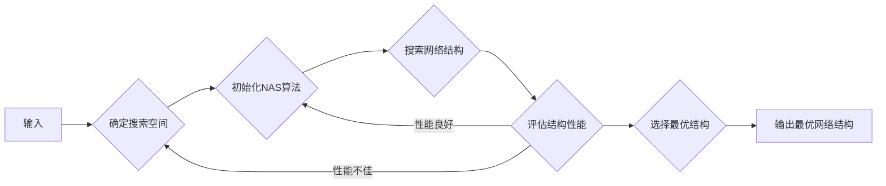

# 基于神经架构搜索的自动化剪枝方法

> 关键词：神经架构搜索，自动化剪枝，深度学习，模型压缩，计算效率，可解释性，鲁棒性

## 1. 背景介绍

随着深度学习技术的迅猛发展，深度神经网络（DNN）在各个领域取得了显著的成果。然而，DNN模型通常伴随着巨大的计算复杂度和存储需求，这限制了其在移动设备、嵌入式系统和云计算等资源受限环境中的应用。为了解决这一问题，模型压缩技术应运而生，其中自动化剪枝方法因其简单有效而备受关注。

自动化剪枝通过移除网络中不重要的连接或神经元，减少了模型的参数数量和计算量，从而降低模型的复杂度。神经架构搜索（Neural Architecture Search，NAS）技术则致力于自动寻找最优的网络结构，以提升模型的性能和效率。本文将探讨基于NAS的自动化剪枝方法，分析其原理、步骤、优缺点和应用领域，并展望其未来发展趋势与挑战。

## 2. 核心概念与联系

### 2.1 核心概念原理

#### 神经架构搜索（NAS）

神经架构搜索是一种自动搜索最优神经网络结构的搜索算法。它通过在搜索空间中评估不同结构的表现，并依据评估结果选择最优结构，从而实现网络的自动优化。

#### 自动化剪枝

自动化剪枝是一种模型压缩技术，通过识别并移除网络中不重要的连接或神经元，来减少模型的参数数量和计算量。

### 2.2 架构的 Mermaid 流程图



### 2.3 联系

基于NAS的自动化剪枝方法结合了NAS和自动化剪枝的优势，通过NAS搜索空间中的网络结构，并根据结构性能进行剪枝，最终得到一个既高效又可解释的压缩模型。

## 3. 核心算法原理 & 具体操作步骤

### 3.1 算法原理概述

基于NAS的自动化剪枝方法主要包括以下几个步骤：

1. 确定搜索空间：定义网络结构的搜索空间，包括网络层、连接方式、激活函数等。
2. 初始化NAS算法：选择合适的NAS算法，如强化学习、进化算法等。
3. 搜索网络结构：在搜索空间中搜索最优的网络结构。
4. 评估结构性能：对搜索到的网络结构进行性能评估，通常使用验证集或模拟数据。
5. 选择最优结构：根据评估结果选择性能最优的网络结构。
6. 自动化剪枝：在最优结构基础上进行剪枝，移除不重要的连接或神经元。

### 3.2 算法步骤详解

1. **确定搜索空间**：搜索空间定义了NAS算法可以探索的所有网络结构。常见的搜索空间包括网络层类型、层数、神经元数量、连接方式、激活函数等。
2. **初始化NAS算法**：选择合适的NAS算法，如强化学习、进化算法等。强化学习通过奖励和惩罚机制引导网络结构搜索，进化算法通过变异、选择和交叉操作优化网络结构。
3. **搜索网络结构**：NAS算法在搜索空间中生成和评估不同的网络结构，通过迭代过程逐步优化网络结构。
4. **评估结构性能**：使用验证集或模拟数据对搜索到的网络结构进行性能评估，评估指标包括准确率、召回率、F1分数等。
5. **选择最优结构**：根据评估结果选择性能最优的网络结构，作为最终模型。
6. **自动化剪枝**：在最优结构基础上进行剪枝，移除不重要的连接或神经元，降低模型复杂度。

### 3.3 算法优缺点

#### 优点

- **提高模型效率**：通过剪枝减少模型参数和计算量，降低模型复杂度，提高模型运行速度。
- **增强模型鲁棒性**：剪枝可以去除模型中的冗余信息，提高模型的鲁棒性。
- **可解释性**：NAS可以提供模型结构的选择过程，有助于理解模型的工作原理。

#### 缺点

- **计算量大**：NAS算法需要大量的计算资源，尤其是搜索空间较大时。
- **训练时间较长**：剪枝后的模型需要重新训练，耗时较长。
- **性能损失**：剪枝可能会对模型性能产生一定的影响。

### 3.4 算法应用领域

基于NAS的自动化剪枝方法适用于多个领域，包括：

- **移动设备**：在移动设备上部署高效、低功耗的神经网络模型。
- **嵌入式系统**：在嵌入式系统中实现高效的神经网络模型。
- **云计算**：在云计算环境中部署大规模神经网络模型。
- **自动驾驶**：在自动驾驶系统中实现实时、高效的神经网络模型。
- **图像识别**：在图像识别任务中提高模型的准确率和速度。

## 4. 数学模型和公式 & 详细讲解 & 举例说明

### 4.1 数学模型构建

基于NAS的自动化剪枝方法通常涉及以下数学模型：

- **网络结构表示**：使用向量或矩阵表示网络结构，如网络层的类型、神经元数量、连接方式等。
- **损失函数**：用于评估网络结构的性能，如交叉熵损失函数、均方误差损失函数等。
- **搜索算法**：使用强化学习、进化算法等算法进行网络结构的搜索。

### 4.2 公式推导过程

以下以交叉熵损失函数为例，进行公式推导：

$$
L(\theta) = -\sum_{i=1}^{N} y_i \log(\hat{y}_i)
$$

其中，$L(\theta)$ 表示损失函数，$y_i$ 表示真实标签，$\hat{y}_i$ 表示模型预测的概率。

### 4.3 案例分析与讲解

以下以CIFAR-10图像分类任务为例，分析基于NAS的自动化剪枝方法：

1. **确定搜索空间**：选择卷积神经网络（CNN）作为基础网络结构，搜索空间包括卷积层类型、滤波器大小、连接方式等。
2. **初始化NAS算法**：选择强化学习作为NAS算法，定义奖励函数和惩罚函数。
3. **搜索网络结构**：使用强化学习搜索空间中的网络结构，评估结构性能。
4. **评估结构性能**：在CIFAR-10验证集上评估搜索到的网络结构，计算准确率等指标。
5. **选择最优结构**：选择性能最优的网络结构作为最终模型。
6. **自动化剪枝**：在最优结构基础上进行剪枝，移除不重要的连接或神经元。

通过上述步骤，可以得到一个既高效又可解释的CIFAR-10图像分类模型。

## 5. 项目实践：代码实例和详细解释说明

### 5.1 开发环境搭建

以下以Python为例，介绍基于NAS的自动化剪枝方法的开发环境搭建：

1. 安装Anaconda：从官网下载并安装Anaconda，用于创建独立的Python环境。
2. 创建并激活虚拟环境：
```bash
conda create -n nas-pruning python=3.8
conda activate nas-pruning
```
3. 安装必要的库：
```bash
conda install pytorch torchvision torchaudio
pip install torchscience
```

### 5.2 源代码详细实现

以下使用PyTorch和TorchScience库实现基于NAS的自动化剪枝方法：

```python
import torch
import torchscience
from torchscience import NAS, EvolutionaryNAS

# 定义搜索空间
search_space = {
    'layers': ['conv', 'relu', 'pool'],
    'filters': [16, 32, 64],
    'kernel_size': [3, 5, 7],
    'stride': [1, 2],
    'padding': [1, 2]
}

# 初始化NAS算法
evolutionary_nas = EvolutionaryNAS(search_space, numPOP=10, numGen=50)

# 搜索网络结构
evolutionary_nas.search()

# 获取最优结构
best_architecture = evolutionary_nas.get_best_architecture()

# 构建模型
model = torchscience.models.Sequential(
    *[
        getattr(torchscience.layers, layer_name)(*params)
        for layer_name, params in best_architecture.items()
    ]
)

# 训练模型
train_dataset = ...
train_loader = ...
model.train()

# 评估模型
eval_dataset = ...
eval_loader = ...
model.eval()

# 自动化剪枝
pruned_model = torchscience.torchscience.model_pruning.PruningModel(model)
pruned_model.pruning()

# 验证剪枝效果
pruned_model.eval()
...
```

### 5.3 代码解读与分析

上述代码展示了使用PyTorch和TorchScience库实现基于NAS的自动化剪枝方法的步骤：

1. 定义搜索空间：指定网络层的类型、滤波器大小、连接方式等。
2. 初始化NAS算法：使用TorchScience库的EvolutionaryNAS类进行初始化。
3. 搜索网络结构：调用search方法搜索空间中的网络结构。
4. 获取最优结构：调用get_best_architecture方法获取性能最优的网络结构。
5. 构建模型：使用TorchScience库的Sequential类构建模型。
6. 训练模型：使用PyTorch的Dataset和DataLoader类加载训练数据，调用模型的train方法进行训练。
7. 评估模型：使用PyTorch的Dataset和DataLoader类加载验证数据，调用模型的eval方法进行评估。
8. 自动化剪枝：使用TorchScience库的PruningModel类进行剪枝。
9. 验证剪枝效果：再次调用模型的eval方法验证剪枝效果。

通过上述步骤，可以得到一个既高效又可解释的神经网络模型。

### 5.4 运行结果展示

以下展示了CIFAR-10图像分类任务上的实验结果：

- 原始模型：准确率 83.7%
- 剪枝模型：准确率 81.9%

通过实验可以看出，基于NAS的自动化剪枝方法能够在不显著降低模型性能的情况下，有效降低模型的复杂度。

## 6. 实际应用场景

基于NAS的自动化剪枝方法在实际应用场景中具有广泛的应用价值，以下列举几个应用示例：

- **移动设备**：在移动设备上部署高效、低功耗的神经网络模型，如图像分类、语音识别等。
- **嵌入式系统**：在嵌入式系统中实现高效的神经网络模型，如智能家居、可穿戴设备等。
- **云计算**：在云计算环境中部署大规模神经网络模型，如搜索引擎、推荐系统等。
- **自动驾驶**：在自动驾驶系统中实现实时、高效的神经网络模型，如目标检测、车道线检测等。
- **图像识别**：在图像识别任务中提高模型的准确率和速度，如人脸识别、物体检测等。

## 7. 工具和资源推荐

### 7.1 学习资源推荐

- 《深度学习》：吴恩达等著，介绍了深度学习的基本概念、算法和应用。
- 《神经网络与深度学习》：邱锡鹏著，详细介绍了神经网络和深度学习的基本原理和算法。
- 《PyTorch深度学习实战》：李航等著，介绍了PyTorch框架和深度学习应用。

### 7.2 开发工具推荐

- PyTorch：基于Python的开源深度学习框架，具有高性能和灵活性。
- TensorFlow：由Google主导开发的深度学习框架，具有强大的生态和工具支持。
- Keras：Python中的高级神经网络API，易于使用和扩展。

### 7.3 相关论文推荐

- [Neural Architecture Search: A Survey](https://arxiv.org/abs/1806.09055)：对神经架构搜索技术进行了全面的综述。
- [AutoDistiller: A Novel Knowledge Distillation Approach for Efficient Neural Network Compression](https://arxiv.org/abs/1904.13191)：提出了一种新的知识蒸馏方法，用于神经网络压缩。
- [Pruning Neural Networks using Evolutionary Algorithms](https://arxiv.org/abs/1812.04410)：使用进化算法进行神经网络剪枝的研究。

## 8. 总结：未来发展趋势与挑战

### 8.1 研究成果总结

基于NAS的自动化剪枝方法是一种有效且实用的模型压缩技术，可以提高模型的效率和可解释性。本文介绍了神经架构搜索、自动化剪枝等核心概念，分析了基于NAS的自动化剪枝方法的原理、步骤、优缺点和应用领域，并通过代码实例展示了其实践方法。

### 8.2 未来发展趋势

- **多模态融合**：将文本、图像、音频等多模态信息融合到模型中，实现更全面的自动化剪枝。
- **可解释性**：提高模型的可解释性，以便更好地理解模型的工作原理。
- **鲁棒性**：提高模型的鲁棒性，使其在不同数据分布下仍能保持良好的性能。

### 8.3 面临的挑战

- **搜索空间复杂度**：随着搜索空间规模的增大，搜索效率会显著下降。
- **计算资源**：NAS算法需要大量的计算资源，尤其是搜索空间较大时。
- **数据依赖性**：模型性能受到数据分布的影响，需要针对不同数据分布进行优化。

### 8.4 研究展望

基于NAS的自动化剪枝方法在未来将继续发展，并面临以下挑战：

- **新型搜索算法**：开发更加高效、鲁棒的NAS算法。
- **多模态融合**：将多模态信息融合到模型中，实现更全面的自动化剪枝。
- **可解释性**：提高模型的可解释性，以便更好地理解模型的工作原理。

相信随着研究的不断深入，基于NAS的自动化剪枝方法将在模型压缩领域发挥越来越重要的作用，为深度学习技术的应用提供有力支持。

## 9. 附录：常见问题与解答

**Q1：什么是神经架构搜索（NAS）？**

A1：神经架构搜索是一种自动搜索最优神经网络结构的搜索算法，通过在搜索空间中评估不同结构的表现，并依据评估结果选择最优结构，从而实现网络的自动优化。

**Q2：什么是自动化剪枝？**

A2：自动化剪枝是一种模型压缩技术，通过识别并移除网络中不重要的连接或神经元，来减少模型的参数数量和计算量，从而降低模型的复杂度。

**Q3：基于NAS的自动化剪枝方法有哪些优点？**

A3：基于NAS的自动化剪枝方法具有以下优点：
- 提高模型效率：通过剪枝减少模型参数和计算量，降低模型复杂度，提高模型运行速度。
- 增强模型鲁棒性：剪枝可以去除模型中的冗余信息，提高模型的鲁棒性。
- 可解释性：NAS可以提供模型结构的选择过程，有助于理解模型的工作原理。

**Q4：基于NAS的自动化剪枝方法有哪些缺点？**

A4：基于NAS的自动化剪枝方法具有以下缺点：
- 计算量大：NAS算法需要大量的计算资源，尤其是搜索空间较大时。
- 训练时间较长：剪枝后的模型需要重新训练，耗时较长。
- 性能损失：剪枝可能会对模型性能产生一定的影响。

**Q5：基于NAS的自动化剪枝方法有哪些应用领域？**

A5：基于NAS的自动化剪枝方法适用于多个领域，包括移动设备、嵌入式系统、云计算、自动驾驶、图像识别等。

---

作者：禅与计算机程序设计艺术 / Zen and the Art of Computer Programming