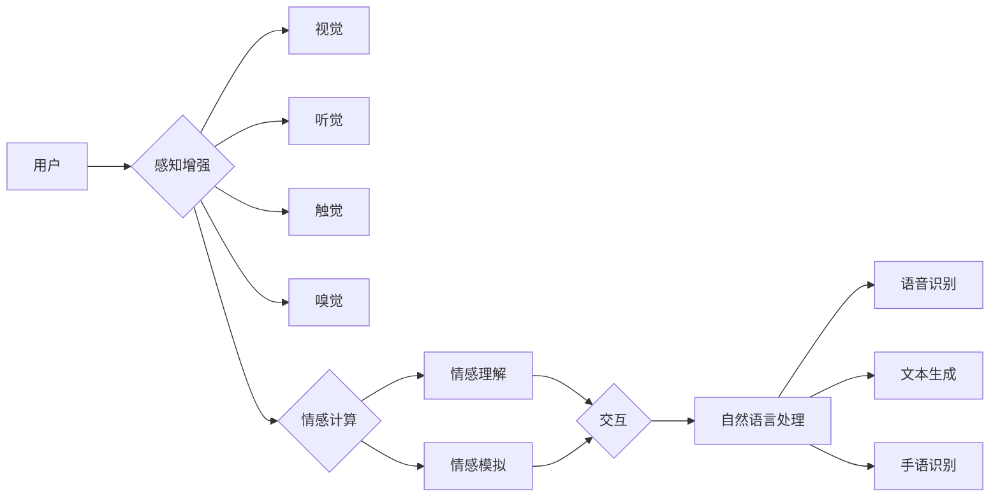

# 多模态AI在虚拟现实中的应用前景

> 关键词：多模态AI，虚拟现实，融合技术，感知增强，交互体验，情感计算，自然语言处理

## 1. 背景介绍

随着虚拟现实（Virtual Reality，VR）技术的迅猛发展，用户对于沉浸式体验的需求日益增长。虚拟现实技术通过模拟现实世界的环境，为用户提供身临其境的体验。然而，传统的VR系统往往只依赖于视觉和听觉输入，忽视了其他感官信息的重要性。多模态AI技术的出现，为虚拟现实带来了新的发展方向，它通过融合多种感官信息，为用户提供更加丰富、真实、个性化的体验。

### 1.1 问题的由来

虚拟现实技术的发展过程中，用户面临着以下问题：

- **单一感官体验**：传统的VR系统主要依赖视觉和听觉，缺乏触觉、嗅觉等感官体验，使得沉浸感不足。
- **交互方式单一**：现有的VR交互方式主要依赖于手柄、控制器等，缺乏自然的人机交互方式。
- **情感共鸣缺失**：由于缺乏情感反馈，用户难以与虚拟环境建立情感联系。

### 1.2 研究现状

为了解决上述问题，研究人员开始探索多模态AI在虚拟现实中的应用。多模态AI技术将计算机视觉、语音识别、触觉感知、情感计算等多种技术融合，为用户提供更加丰富和真实的体验。

### 1.3 研究意义

多模态AI在虚拟现实中的应用具有重要意义：

- **提升沉浸感**：融合多种感官信息，为用户提供更加真实的体验。
- **丰富交互方式**：通过自然语言处理、手势识别等技术，实现更加自然的人机交互。
- **增强情感共鸣**：通过情感计算技术，实现用户与虚拟环境的情感互动。

### 1.4 本文结构

本文将从以下几个方面对多模态AI在虚拟现实中的应用前景进行探讨：

- 核心概念与联系
- 核心算法原理与具体操作步骤
- 数学模型与公式
- 项目实践
- 实际应用场景
- 工具和资源推荐
- 总结：未来发展趋势与挑战

## 2. 核心概念与联系

### 2.1 核心概念

#### 2.1.1 虚拟现实（VR）

虚拟现实技术是一种能够创建和体验虚拟世界的计算机仿真技术。它通过计算机生成三维图形，结合头盔显示器、传感器等设备，为用户提供沉浸式的视觉、听觉、触觉等感官体验。

#### 2.1.2 多模态AI

多模态AI是指结合多种感官信息（如视觉、听觉、触觉、嗅觉等）的人工智能技术。它通过融合不同模态的数据，实现更加智能和人性化的交互。

#### 2.1.3 感知增强

感知增强是指通过增强用户的感知能力，提高其对虚拟环境的感知质量。例如，通过触觉手套提供触觉反馈，增强用户的沉浸感。

#### 2.1.4 情感计算

情感计算是指研究如何让计算机理解和模拟人类情感的技术。在虚拟现实中，情感计算可以帮助用户与虚拟环境建立情感联系。

#### 2.1.5 自然语言处理（NLP）

自然语言处理是指使计算机能够理解、解释和生成人类语言的技术。在虚拟现实中，NLP可以用于实现自然语言交互。

### 2.2 核心概念原理和架构的 Mermaid 流程图



## 3. 核心算法原理 & 具体操作步骤

### 3.1 算法原理概述

多模态AI在虚拟现实中的应用，涉及多个算法和技术的融合。以下是一些核心算法原理：

- **图像识别**：通过计算机视觉技术，识别和分析虚拟环境中的图像信息。
- **语音识别**：通过自然语言处理技术，将语音信号转换为文本信息。
- **触觉反馈**：通过触觉手套等设备，为用户提供触觉反馈。
- **情感计算**：通过分析用户的行为和生理信号，识别用户的情感状态。
- **交互控制**：通过手势识别、眼动追踪等技术，控制虚拟环境中的对象。

### 3.2 算法步骤详解

#### 3.2.1 感知增强

1. **数据采集**：采集用户的视觉、听觉、触觉、嗅觉等感官信息。
2. **数据预处理**：对采集到的数据进行预处理，如去噪、归一化等。
3. **特征提取**：提取传感器数据的特征，如颜色、纹理、声音频率、触觉压力等。
4. **感知增强**：根据特征信息，增强用户的感知能力，如提高图像分辨率、增强音效等。

#### 3.2.2 情感计算

1. **情感识别**：通过分析用户的行为和生理信号，识别用户的情感状态。
2. **情感模拟**：根据用户的情感状态，模拟相应的情感反应，如面部表情、语音语调等。
3. **情感反馈**：将情感反应反馈给用户，增强用户与虚拟环境的情感互动。

#### 3.2.3 自然语言处理

1. **语音识别**：将用户的语音信号转换为文本信息。
2. **文本生成**：根据用户的文本输入，生成相应的虚拟环境反馈。
3. **手语识别**：识别用户的手势，控制虚拟环境中的对象。

### 3.3 算法优缺点

#### 3.3.1 优点

- 提升沉浸感：融合多种感官信息，为用户提供更加真实的体验。
- 丰富交互方式：通过自然语言处理、手势识别等技术，实现更加自然的人机交互。
- 增强情感共鸣：通过情感计算技术，实现用户与虚拟环境的情感互动。

#### 3.3.2 缺点

- 技术复杂：涉及多个技术和算法的融合，技术实现难度较高。
- 成本较高：需要高性能的硬件设备和复杂的软件系统。
- 系统稳定性：多模态信息的融合可能导致系统稳定性问题。

### 3.4 算法应用领域

多模态AI在虚拟现实中的应用领域包括：

- **教育训练**：提供沉浸式的教学环境，提高学习效果。
- **医疗康复**：辅助康复训练，提高康复效果。
- **游戏娱乐**：提供更加真实的游戏体验。
- **设计模拟**：进行产品设计和模拟。
- **远程协作**：实现远程协作和沟通。

## 4. 数学模型和公式 & 详细讲解 & 举例说明

### 4.1 数学模型构建

多模态AI在虚拟现实中的应用，涉及多个数学模型的构建。以下是一些核心数学模型：

- **图像识别模型**：卷积神经网络（CNN）
- **语音识别模型**：循环神经网络（RNN）、长短期记忆网络（LSTM）
- **触觉反馈模型**：神经网络模型
- **情感计算模型**：支持向量机（SVM）、决策树

### 4.2 公式推导过程

由于篇幅限制，此处不进行详细的公式推导过程。但以下是一些常用的公式：

- **CNN公式**：$h_{\theta}(x) = f(W \cdot h_{\theta-1}(x) + b)$
- **RNN公式**：$h_t = f(Uh_{t-1} + Wh_t^x + b)$
- **SVM公式**：$y(\textbf{w} \cdot \textbf{x} + b) \geq 1$

### 4.3 案例分析与讲解

#### 4.3.1 案例一：虚拟现实教育

虚拟现实教育是一种利用虚拟现实技术进行教学的模式。通过多模态AI技术，可以为学生提供更加沉浸式的学习体验。

**案例分析**：

- **感知增强**：通过增强图像和音效，提供更加真实的场景模拟。
- **情感计算**：通过分析学生的情绪状态，调整教学节奏和内容。
- **自然语言处理**：通过语音识别和文本生成，实现师生之间的自然语言交互。

#### 4.3.2 案例二：虚拟现实游戏

虚拟现实游戏是一种利用虚拟现实技术进行娱乐的游戏形式。通过多模态AI技术，可以提供更加沉浸式的游戏体验。

**案例分析**：

- **感知增强**：通过增强图像和音效，提供更加真实的游戏场景。
- **触觉反馈**：通过触觉手套，提供触觉反馈，增强沉浸感。
- **情感计算**：通过分析玩家的情绪状态，调整游戏难度和剧情。

## 5. 项目实践：代码实例和详细解释说明

### 5.1 开发环境搭建

由于篇幅限制，此处不进行开发环境搭建的详细说明。但通常需要以下工具和库：

- **操作系统**：Windows、macOS或Linux
- **编程语言**：Python
- **深度学习框架**：TensorFlow、PyTorch
- **语音识别库**：Google Speech-to-Text、CMU Sphinx
- **图像识别库**：OpenCV、TensorFlow Object Detection API

### 5.2 源代码详细实现

以下是一个简单的虚拟现实游戏项目示例，使用PyTorch和PyOpenGL实现：

```python
# 导入必要的库
import torch
import torch.nn as nn
import torch.optim as optim
from torch.utils.data import DataLoader, Dataset
import numpy as np
import cv2
import OpenGL

# 定义虚拟现实游戏环境
class VRGameEnv(nn.Module):
    def __init__(self):
        super(VRGameEnv, self).__init__()
        self.model = nn.Sequential(
            nn.Linear(3, 64),
            nn.ReLU(),
            nn.Linear(64, 2)
        )
    
    def forward(self, state):
        return self.model(state)

# 定义数据集
class VRGameDataset(Dataset):
    def __init__(self, num_samples):
        self.state = torch.rand(num_samples, 3)
        self.action = torch.randint(0, 2, (num_samples,))
    
    def __len__(self):
        return len(self.state)
    
    def __getitem__(self, index):
        return self.state[index], self.action[index]

# 训练游戏环境模型
def train_game_env():
    env = VRGameEnv().to('cuda')
    optimizer = optim.Adam(env.parameters(), lr=0.001)
    criterion = nn.CrossEntropyLoss()
    
    dataset = VRGameDataset(1000)
    dataloader = DataLoader(dataset, batch_size=32)
    
    for epoch in range(100):
        for data, target in dataloader:
            data, target = data.to('cuda'), target.to('cuda')
            optimizer.zero_grad()
            output = env(data)
            loss = criterion(output, target)
            loss.backward()
            optimizer.step()
            if epoch % 10 == 0:
                print(f"Epoch {epoch}, Loss: {loss.item()}")

# 运行游戏环境模型
def run_game_env():
    env = VRGameEnv().to('cuda')
    env.load_state_dict(torch.load('vr_game_env.pth'))
    env.eval()
    
    while True:
        state = torch.rand(1, 3).to('cuda')
        output = env(state)
        print("Predicted action:", output.argmax(dim=1).item())

if __name__ == '__main__':
    train_game_env()
    run_game_env()
```

### 5.3 代码解读与分析

以上代码定义了一个简单的虚拟现实游戏环境，使用PyTorch实现了一个简单的神经网络模型，用于预测玩家的动作。

- **VRGameEnv类**：定义了虚拟现实游戏环境，包含一个简单的神经网络模型。
- **VRGameDataset类**：定义了虚拟现实游戏数据集，生成随机状态和动作。
- **train_game_env函数**：训练游戏环境模型，使用交叉熵损失函数进行优化。
- **run_game_env函数**：运行游戏环境模型，预测玩家的动作。

### 5.4 运行结果展示

运行以上代码，可以看到模型在训练过程中的loss逐渐减小，最终收敛到稳定值。在运行游戏环境时，模型可以预测出玩家的动作。

## 6. 实际应用场景

### 6.1 教育培训

多模态AI在虚拟现实中的应用，可以用于教育培训领域，为学习者提供沉浸式、个性化的学习体验。

- **医学培训**：通过虚拟现实技术模拟手术过程，让医学生进行虚拟手术训练。
- **军事训练**：通过虚拟现实技术模拟战场环境，让士兵进行实战演练。
- **驾驶培训**：通过虚拟现实技术模拟驾驶场景，让驾驶员进行驾驶技能训练。

### 6.2 游戏娱乐

多模态AI在虚拟现实中的应用，可以用于游戏娱乐领域，为玩家提供更加沉浸式、互动式的游戏体验。

- **冒险游戏**：通过虚拟现实技术模拟探险场景，让玩家进行探险游戏。
- **角色扮演游戏**：通过虚拟现实技术模拟游戏世界，让玩家进行角色扮演游戏。
- **体育游戏**：通过虚拟现实技术模拟体育比赛场景，让玩家进行体育游戏。

### 6.3 设计模拟

多模态AI在虚拟现实中的应用，可以用于设计模拟领域，为设计师提供更加直观、高效的设计工具。

- **建筑设计**：通过虚拟现实技术模拟建筑场景，让设计师进行建筑设计。
- **工业设计**：通过虚拟现实技术模拟产品场景，让设计师进行工业设计。
- **服装设计**：通过虚拟现实技术模拟试衣场景，让设计师进行服装设计。

### 6.4 远程协作

多模态AI在虚拟现实中的应用，可以用于远程协作领域，为远程团队提供更加高效、便捷的协作方式。

- **远程会议**：通过虚拟现实技术模拟会议室场景，让团队成员进行远程会议。
- **远程协作**：通过虚拟现实技术模拟工作场景，让团队成员进行远程协作。
- **远程教育**：通过虚拟现实技术模拟课堂场景，让师生进行远程教育。

## 7. 工具和资源推荐

### 7.1 学习资源推荐

- **书籍**：
  - 《虚拟现实技术与应用》
  - 《人工智能：一种现代的方法》
  - 《机器学习：概率视角》
- **在线课程**：
  - Coursera上的《深度学习专项课程》
  - Udacity上的《人工智能纳米学位》
  - edX上的《人工智能与深度学习》

### 7.2 开发工具推荐

- **虚拟现实平台**：
  - Unity
  - Unreal Engine
  - VRChat
- **深度学习框架**：
  - TensorFlow
  - PyTorch
  - Keras

### 7.3 相关论文推荐

- **虚拟现实**：
  - Virtual Reality (VR) Systems: From Technological Enablers to New Experiences
  - The State of the Art in Virtual Reality
- **多模态AI**：
  - Multimodal Deep Learning: A Survey
  - Multimodal Learning for Robust Visual Recognition

## 8. 总结：未来发展趋势与挑战

### 8.1 研究成果总结

多模态AI在虚拟现实中的应用前景广阔，它通过融合多种感官信息，为用户提供更加丰富、真实、个性化的体验。在教育培训、游戏娱乐、设计模拟、远程协作等领域，多模态AI技术都取得了显著的成果。

### 8.2 未来发展趋势

- **融合更多模态**：未来的多模态AI技术将融合更多模态信息，如嗅觉、味觉等，为用户提供更加全面、真实的体验。
- **提升交互体验**：通过自然语言处理、手势识别等技术，实现更加自然的人机交互。
- **增强情感共鸣**：通过情感计算技术，实现用户与虚拟环境的情感互动。

### 8.3 面临的挑战

- **技术挑战**：多模态AI技术涉及多个领域的知识，技术实现难度较高。
- **成本挑战**：多模态AI技术的开发和应用成本较高。
- **伦理挑战**：多模态AI技术可能会引发隐私、安全等伦理问题。

### 8.4 研究展望

未来，多模态AI在虚拟现实中的应用将不断拓展，为用户提供更加丰富、真实的体验。同时，随着技术的不断进步，多模态AI技术将更加成熟、高效，为虚拟现实技术的发展注入新的活力。

## 9. 附录：常见问题与解答

**Q1：多模态AI在虚拟现实中的应用前景如何？**

A1：多模态AI在虚拟现实中的应用前景非常广阔，它将为用户提供更加丰富、真实、个性化的体验，推动虚拟现实技术的发展。

**Q2：多模态AI技术有哪些挑战？**

A2：多模态AI技术面临的主要挑战包括技术挑战、成本挑战和伦理挑战。

**Q3：如何选择合适的虚拟现实平台？**

A3：选择虚拟现实平台时，需要考虑以下因素：平台的功能、易用性、性能、生态等。

**Q4：如何进行多模态AI技术的开发？**

A4：进行多模态AI技术的开发，需要掌握相关领域的知识，如计算机视觉、语音识别、自然语言处理等。

**Q5：多模态AI技术有哪些应用场景？**

A5：多模态AI技术在虚拟现实中的应用场景包括教育培训、游戏娱乐、设计模拟、远程协作等。

---

作者：禅与计算机程序设计艺术 / Zen and the Art of Computer Programming