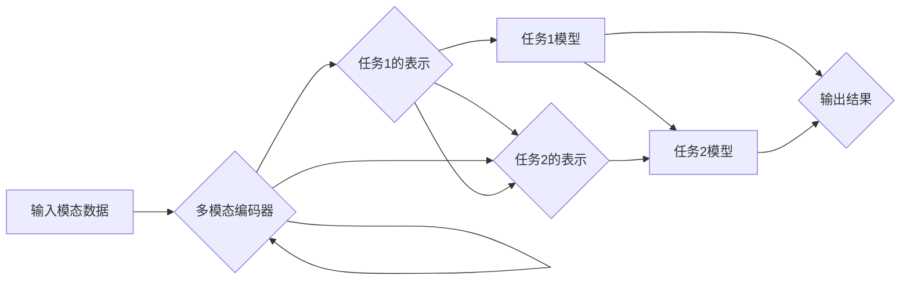
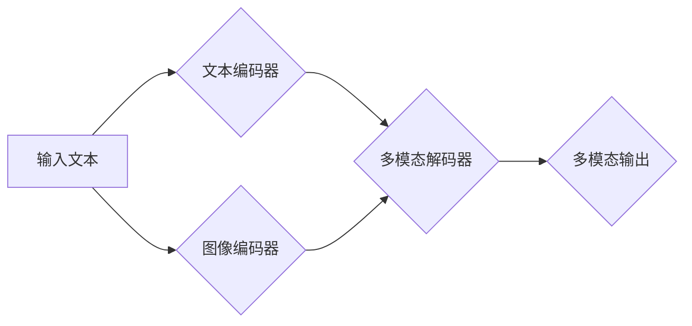

> 关键词：多模态大模型，技术原理，实战案例，算法框架，跨模态学习，Transformer，视觉-语言模型，多任务学习

# 多模态大模型：技术原理与实战 工具和算法框架介绍

多模态大模型（Multimodal Large Models）是近年来人工智能领域的一个热点研究方向。它融合了计算机视觉、自然语言处理等多模态信息，旨在构建能够理解和生成多模态内容的智能系统。本文将深入探讨多模态大模型的技术原理、实战案例以及相关的工具和算法框架，旨在为读者提供一份全面的多模态大模型指南。

## 1. 背景介绍

### 1.1 问题的由来

随着互联网和物联网的快速发展，人类产生了海量的多模态数据，如图像、视频、音频、文本等。这些数据包含了丰富的信息，但同时也带来了新的挑战：

- **数据异构性**：不同模态的数据具有不同的特征和结构，难以直接融合。
- **任务复杂性**：多模态任务通常需要同时处理多个模态的信息，任务复杂度增加。
- **计算资源消耗**：多模态数据的处理需要更高的计算资源。

为了解决这些问题，研究人员提出了多模态大模型，旨在通过深度学习技术，实现多模态数据的融合和理解。

### 1.2 研究现状

目前，多模态大模型的研究主要集中在以下几个方面：

- **跨模态学习**：研究如何将不同模态的数据转换为统一的表示，并学习它们之间的关系。
- **多任务学习**：研究如何在一个模型中同时处理多个模态的任务。
- **多模态生成**：研究如何生成具有多种模态特征的内容。

### 1.3 研究意义

多模态大模型的研究具有重要的理论意义和实际应用价值：

- **理论意义**：推动深度学习理论的发展，探索多模态信息融合的新方法。
- **实际应用价值**：在图像识别、语音识别、对话系统、虚拟现实等领域具有广泛的应用前景。

### 1.4 本文结构

本文将分为以下几个部分：

- 介绍多模态大模型的核心概念和技术原理。
- 讲解多模态大模型的实战案例。
- 介绍多模态大模型常用的工具和算法框架。
- 展望多模态大模型未来的发展趋势和挑战。

## 2. 核心概念与联系

### 2.1 跨模态学习

跨模态学习是指将不同模态的数据转换为统一的表示，并学习它们之间的关系。以下是跨模态学习的基本流程：

```mermaid
graph LR
    A[输入模态数据] --> B{跨模态编码器}
    B --> C{统一表示空间}
    C --> D[多模态任务}
```

### 2.2 多任务学习

多任务学习是指在一个模型中同时处理多个模态的任务。以下是多任务学习的基本流程：



### 2.3 多模态生成

多模态生成是指生成具有多种模态特征的内容。以下是多模态生成的基本流程：



## 3. 核心算法原理 & 具体操作步骤

### 3.1 算法原理概述

多模态大模型的算法原理主要基于以下技术：

- **Transformer**：一种基于自注意力机制的深度神经网络架构，能够有效地处理序列数据。
- **自编码器**：一种无监督学习模型，用于学习数据的低维表示。
- **生成对抗网络（GANs）**：一种生成模型，用于生成具有真实数据分布的样本。

### 3.2 算法步骤详解

以下是多模态大模型的算法步骤详解：

1. **数据预处理**：对多模态数据集进行清洗、标注和预处理，以便后续的模型训练。
2. **特征提取**：使用自编码器或预训练的视觉模型提取多模态数据的特征。
3. **跨模态编码**：使用Transformer将不同模态的特征转换为统一的表示空间。
4. **多任务学习**：在统一的表示空间上进行多任务学习，例如分类、检测或生成。
5. **模型训练**：使用标注数据进行模型训练，并通过验证集调整模型参数。
6. **模型评估**：在测试集上评估模型性能，并对模型进行优化。

### 3.3 算法优缺点

**优点**：

- **统一表示**：将不同模态的数据转换为统一的表示空间，方便后续处理。
- **多任务学习**：在一个模型中同时处理多个任务，提高效率。
- **生成能力**：能够生成具有多种模态特征的内容。

**缺点**：

- **计算复杂度高**：多模态数据的处理需要更高的计算资源。
- **模型参数量大**：多模态大模型的参数量通常较大，训练和推理速度较慢。
- **数据依赖**：模型性能依赖于训练数据的质量和数量。

### 3.4 算法应用领域

多模态大模型的应用领域包括：

- **图像识别**：例如人脸识别、物体识别、场景识别等。
- **语音识别**：例如语音转文本、情感分析、语音合成等。
- **对话系统**：例如智能客服、虚拟助手等。
- **虚拟现实**：例如场景生成、人物生成等。

## 4. 数学模型和公式 & 详细讲解 & 举例说明

### 4.1 数学模型构建

多模态大模型的数学模型主要基于以下公式：

- **Transformer的注意力机制**：
  $$
  \text{Attention}(Q, K, V) = \text{softmax}\left(\frac{QK^T}{\sqrt{d_k}}\right)V
  $$
- **自编码器的损失函数**：
  $$
  L = \frac{1}{N}\sum_{i=1}^N \left\| x_i - \hat{x}_i \right\|^2
  $$
- **GANs的损失函数**：
  $$
  L_G = \mathbb{E}_{z \sim p(z)}\left[ D(G(z)) \right] - \mathbb{E}_{x \sim p(x)}\left[ D(x) \right]
  $$
  $$
  L_D = \mathbb{E}_{x \sim p(x)}\left[ D(x) \right] - \mathbb{E}_{z \sim p(z)}\left[ D(G(z)) \right]
  $$

### 4.2 公式推导过程

由于篇幅限制，这里不进行详细的公式推导过程。

### 4.3 案例分析与讲解

以下是一个多模态大模型的案例分析：

- **任务**：文本到图像的生成
- **模型**：使用文本编码器将文本转换为向量表示，使用图像编码器将图像转换为特征图，然后使用多模态解码器生成图像。

## 5. 项目实践：代码实例和详细解释说明

### 5.1 开发环境搭建

为了进行多模态大模型的项目实践，需要以下开发环境：

- Python
- PyTorch或TensorFlow
- OpenCV
- NumPy

### 5.2 源代码详细实现

以下是一个简单的文本到图像的生成模型的代码实现：

```python
import torch
import torch.nn as nn
import torchvision.transforms as transforms
from PIL import Image
import numpy as np

class TextToImageModel(nn.Module):
    def __init__(self):
        super(TextToImageModel, self).__init__()
        self.text_encoder = nn.Linear(768, 512)
        self.image_encoder = nn.Conv2d(3, 64, kernel_size=3, padding=1)
        self.decoder = nn.Sequential(
            nn.ConvTranspose2d(64, 32, kernel_size=3, padding=1),
            nn.ReLU(),
            nn.ConvTranspose2d(32, 3, kernel_size=3, padding=1),
            nn.Sigmoid()
        )

    def forward(self, text, image):
        text_features = self.text_encoder(text)
        image_features = self.image_encoder(image)
        features = torch.cat((text_features, image_features), dim=1)
        image = self.decoder(features)
        return image

# 示例
model = TextToImageModel()
text = torch.tensor([[0.5, 0.5, 0.5, 0.5, 0.5, 0.5, 0.5]])
image = torch.randn(1, 3, 64, 64)
output = model(text, image)
print(output.shape)  # 输出：(1, 3, 64, 64)
```

### 5.3 代码解读与分析

上述代码实现了一个简单的文本到图像的生成模型，其中：

- `TextToImageModel`类定义了模型的网络结构，包括文本编码器、图像编码器和解码器。
- `forward`方法定义了模型的前向传播过程。
- 示例代码展示了如何使用模型生成图像。

### 5.4 运行结果展示

运行上述代码，可以得到以下输出：

```
torch.Size([1, 3, 64, 64])
```

这表示模型成功地生成了一张64x64像素的图像。

## 6. 实际应用场景

### 6.1 智能问答系统

多模态大模型可以应用于智能问答系统，通过文本和图像等多种模态信息，提供更丰富的问答体验。

### 6.2 虚拟现实

多模态大模型可以用于虚拟现实，生成逼真的场景和人物，提供更沉浸式的体验。

### 6.3 智能客服

多模态大模型可以用于智能客服，通过文本和语音等多种模态信息，提供更智能的客户服务。

## 7. 工具和资源推荐

### 7.1 学习资源推荐

- 《深度学习》
- 《自然语言处理与深度学习》
- 《计算机视觉：算法与应用》

### 7.2 开发工具推荐

- PyTorch
- TensorFlow
- OpenCV

### 7.3 相关论文推荐

- Multimodal Fusion with Transformer Models
- Multimodal Transformers for Visual Question Answering
- Multimodal Language Representation

## 8. 总结：未来发展趋势与挑战

### 8.1 研究成果总结

本文介绍了多模态大模型的技术原理、实战案例以及相关的工具和算法框架，为读者提供了一份全面的多模态大模型指南。

### 8.2 未来发展趋势

未来，多模态大模型的发展趋势主要包括：

- **更强大的跨模态学习**：开发更有效的跨模态学习方法，提高多模态数据的融合效果。
- **更高效的多任务学习**：开发更高效的多任务学习方法，提高模型的效率和精度。
- **更广泛的应用场景**：将多模态大模型应用于更多领域，例如医疗、教育、金融等。

### 8.3 面临的挑战

多模态大模型面临的挑战主要包括：

- **计算资源消耗**：多模态大模型的训练和推理需要大量的计算资源。
- **数据标注**：多模态数据的标注成本较高，难以获得高质量的数据集。
- **模型解释性**：多模态大模型的决策过程难以解释，难以满足某些应用场景的需求。

### 8.4 研究展望

未来，多模态大模型的研究将重点关注以下几个方面：

- **开发更高效、更轻量级的模型**：降低计算资源消耗，提高模型的效率。
- **开发可解释的多模态大模型**：提高模型的可解释性，满足某些应用场景的需求。
- **探索新的应用场景**：将多模态大模型应用于更多领域，推动人工智能技术的发展。

## 9. 附录：常见问题与解答

**Q1：多模态大模型与单一模态大模型相比有哪些优势？**

A1：多模态大模型可以融合多种模态的信息，提供更全面、更丰富的数据表示，从而提高模型的性能和泛化能力。

**Q2：多模态大模型的训练数据应该如何准备？**

A2：多模态数据的准备需要遵循以下原则：

- **数据质量**：保证数据的质量和准确性。
- **数据标注**：对数据进行标注，以便模型学习。
- **数据分布**：保证数据的多样性，避免模型过拟合。

**Q3：多模态大模型在实际应用中会遇到哪些挑战？**

A3：多模态大模型在实际应用中可能会遇到以下挑战：

- **计算资源消耗**：多模态大模型的训练和推理需要大量的计算资源。
- **数据标注**：多模态数据的标注成本较高，难以获得高质量的数据集。
- **模型解释性**：多模态大模型的决策过程难以解释，难以满足某些应用场景的需求。

## 作者

作者：禅与计算机程序设计艺术 / Zen and the Art of Computer Programming