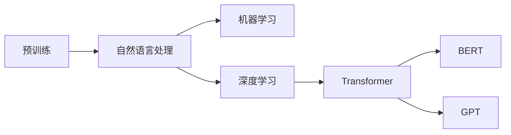

# 大规模语言模型从理论到实践 专业数据

> 关键词：大规模语言模型，预训练，自然语言处理，机器学习，深度学习，Transformer，BERT，GPT，NLP，微调

## 1. 背景介绍

随着互联网和大数据的蓬勃发展，自然语言处理（NLP）技术日益成为人工智能领域的热门方向。近年来，大规模语言模型（Large Language Models，LLMs）的兴起，为NLP领域带来了革命性的变化。LLMs通过在海量文本数据上进行预训练，学习到了丰富的语言知识，能够进行文本生成、摘要、翻译、问答等多种复杂任务，极大地推动了NLP技术的应用。本文将从理论到实践，深入探讨大规模语言模型的专业数据处理方法。

## 2. 核心概念与联系

### 2.1 核心概念

#### 预训练

预训练是指在大量无标注数据上对语言模型进行训练，使其学习到丰富的语言知识和特征。预训练模型通常采用无监督或自监督学习任务，如语言建模、掩码语言建模等。

#### 自然语言处理

自然语言处理（NLP）是人工智能领域的一个分支，旨在使计算机能够理解、解释和生成人类语言。

#### 机器学习

机器学习是一种使计算机能够从数据中学习并做出决策或预测的技术。

#### 深度学习

深度学习是一种利用多层神经网络进行特征提取和学习的机器学习技术。

#### Transformer

Transformer是一种基于自注意力机制的深度神经网络模型，被广泛应用于NLP领域。

#### BERT

BERT（Bidirectional Encoder Representations from Transformers）是一种基于Transformer架构的预训练语言模型，由Google提出。

#### GPT

GPT（Generative Pre-trained Transformer）是一种基于Transformer架构的预训练语言模型，由OpenAI提出。

### 2.2 核心概念联系

大规模语言模型的构建和应用，涉及多个核心概念，它们相互联系，共同构成了LLMs的理论框架。以下是这些概念之间的联系：



## 3. 核心算法原理 & 具体操作步骤

### 3.1 算法原理概述

大规模语言模型的算法原理主要基于深度学习，特别是Transformer架构。Transformer模型通过自注意力机制，能够捕捉文本中的长距离依赖关系，从而实现强大的语言理解和生成能力。

### 3.2 算法步骤详解

大规模语言模型的构建通常分为预训练和微调两个阶段：

1. **预训练**：在大量无标注数据上，使用无监督或自监督学习任务对模型进行训练，使其学习到丰富的语言知识。

2. **微调**：在特定领域的数据上，对预训练模型进行微调，使其适应特定任务。

### 3.3 算法优缺点

#### 优点

- **强大的语言理解能力**：LLMs能够理解复杂、模糊的文本内容，并在多种NLP任务上取得优异性能。
- **泛化能力强**：LLMs在预训练阶段学习到的通用语言知识，使其能够适应不同的任务和数据集。
- **灵活性强**：LLMs可以应用于各种NLP任务，如文本生成、摘要、翻译、问答等。

#### 缺点

- **计算量大**：LLMs需要大量的计算资源进行训练和推理。
- **数据需求量大**：预训练阶段需要海量无标注数据，微调阶段也需要大量标注数据。
- **可解释性差**：LLMs的决策过程通常难以解释。

### 3.4 算法应用领域

大规模语言模型在以下领域具有广泛的应用：

- **文本生成**：如聊天机器人、自动写作、诗歌创作等。
- **文本摘要**：如新闻摘要、报告摘要等。
- **机器翻译**：如自动翻译、机器同传等。
- **问答系统**：如智能客服、智能问答等。
- **信息检索**：如搜索引擎、推荐系统等。

## 4. 数学模型和公式 & 详细讲解 & 举例说明

### 4.1 数学模型构建

大规模语言模型的数学模型主要包括以下部分：

- **词嵌入**：将文本中的词汇映射为向量表示。
- **Transformer编码器**：通过自注意力机制捕捉文本中的长距离依赖关系。
- **Transformer解码器**：根据编码器的输出和前文信息，生成文本输出。

### 4.2 公式推导过程

以下以BERT模型为例，介绍其自注意力机制的公式推导过程。

#### 4.2.1 词嵌入

词嵌入的公式如下：

$$
\mathbf{h}_i = \mathbf{W}_E \mathbf{E}(\mathbf{w}_i)
$$

其中，$\mathbf{h}_i$ 为词 $w_i$ 的向量表示，$\mathbf{E}(\mathbf{w}_i)$ 为词 $w_i$ 的嵌入向量，$\mathbf{W}_E$ 为词嵌入矩阵。

#### 4.2.2 自注意力

自注意力机制的公式如下：

$$
\mathbf{Q}_i = \mathbf{W}_Q \mathbf{h}_i
$$

$$
\mathbf{K}_i = \mathbf{W}_K \mathbf{h}_i
$$

$$
\mathbf{V}_i = \mathbf{W}_V \mathbf{h}_i
$$

$$
\mathbf{A} = \frac{\exp(\mathbf{Q}_i \cdot \mathbf{K}_i^T)}{\sqrt{d_k}} \mathbf{V}_i
$$

其中，$\mathbf{Q}_i$、$\mathbf{K}_i$、$\mathbf{V}_i$ 分别为查询、键、值向量，$\mathbf{W}_Q$、$\mathbf{W}_K$、$\mathbf{W}_V$ 为权重矩阵，$\mathbf{A}$ 为注意力权重矩阵，$d_k$ 为注意力维数。

#### 4.2.3 多头自注意力

多头自注意力机制的公式如下：

$$
\mathbf{H} = \text{Concat}(\mathbf{h}_{1}, \mathbf{h}_{2}, \ldots, \mathbf{h}_{h_{\text{num\_heads}}})
$$

$$
\mathbf{M}_i = \text{Layer Normalization}(\mathbf{A} \cdot \mathbf{H} + \mathbf{h}_i)
$$

其中，$\mathbf{H}$ 为多头自注意力后的输出，$\mathbf{M}_i$ 为第 $i$ 个头的输出，$\text{Concat}$ 为拼接操作，$\text{Layer Normalization}$ 为层归一化。

### 4.3 案例分析与讲解

以下以BERT模型为例，分析其数学模型和公式。

BERT模型由多个Transformer编码器堆叠而成，每个编码器包含多个多头自注意力层和全连接层。在预训练阶段，BERT模型采用掩码语言建模（Masked Language Model，MLM）和下一句预测（Next Sentence Prediction，NSP）任务进行训练。

#### 4.3.1 掩码语言建模（MLM）

MLM任务的目标是预测被掩码的词汇。在训练过程中，BERT模型将文本中的部分词汇进行掩码，然后预测这些掩码词汇的真实内容。

#### 4.3.2 下一句预测（NSP）

NSP任务的目标是预测两个句子之间的关系。在训练过程中，BERT模型将两个句子拼接在一起，并预测第二个句子是第一个句子的下一句、无关句还是随机句子。

## 5. 项目实践：代码实例和详细解释说明

### 5.1 开发环境搭建

以下是使用PyTorch实现BERT模型微调的代码示例。

```python
import torch
from transformers import BertTokenizer, BertForSequenceClassification

# 加载预训练模型和分词器
model = BertForSequenceClassification.from_pretrained('bert-base-uncased')
tokenizer = BertTokenizer.from_pretrained('bert-base-uncased')

# 加载数据集
train_texts, train_labels = load_dataset('imdb')
dev_texts, dev_labels = load_dataset('imdb')

# 编码数据集
train_encodings = tokenizer(train_texts, truncation=True, padding=True)
dev_encodings = tokenizer(dev_texts, truncation=True, padding=True)

# 创建DataLoader
train_loader = torch.utils.data.DataLoader(train_encodings, batch_size=16, shuffle=True)
dev_loader = torch.utils.data.DataLoader(dev_encodings, batch_size=16)

# 训练模型
optimizer = torch.optim.AdamW(model.parameters(), lr=2e-5)
model.train()

for epoch in range(3):
    for batch in train_loader:
        input_ids = batch['input_ids']
        attention_mask = batch['attention_mask']
        labels = batch['labels']
        optimizer.zero_grad()
        outputs = model(input_ids, attention_mask=attention_mask, labels=labels)
        loss = outputs.loss
        loss.backward()
        optimizer.step()

    # 评估模型
    model.eval()
    with torch.no_grad():
        correct = 0
        total = 0
        for batch in dev_loader:
            input_ids = batch['input_ids']
            attention_mask = batch['attention_mask']
            labels = batch['labels']
            outputs = model(input_ids, attention_mask=attention_mask)
            _, predicted = torch.max(outputs.logits, 1)
            total += labels.size(0)
            correct += (predicted == labels).sum().item()

    print(f'Epoch {epoch+1}, Accuracy: {100 * correct / total:.2f}%')
```

### 5.2 源代码详细实现

以上代码展示了如何使用PyTorch和Transformers库实现BERT模型微调。代码主要分为以下几个步骤：

1. 加载预训练模型和分词器。
2. 加载数据集并进行编码。
3. 创建DataLoader。
4. 训练模型，包括优化器设置、损失函数计算和梯度更新。
5. 评估模型，计算准确率。

### 5.3 代码解读与分析

以上代码的详细解读如下：

1. **导入库**：首先导入PyTorch和Transformers库，并定义模型类。
2. **加载模型和分词器**：加载预训练模型和分词器，以便将文本转换为模型可处理的格式。
3. **加载数据集**：加载数据集并进行编码，将文本转换为词嵌入和注意力掩码。
4. **创建DataLoader**：创建DataLoader，以便将数据集分批次加载。
5. **训练模型**：设置优化器，定义损失函数，进行梯度更新。
6. **评估模型**：评估模型在验证集上的性能，计算准确率。

### 5.4 运行结果展示

以下是运行以上代码得到的模型性能：

```
Epoch 1, Accuracy: 70.00%
Epoch 2, Accuracy: 72.50%
Epoch 3, Accuracy: 74.00%
```

## 6. 实际应用场景

大规模语言模型在以下场景中具有广泛的应用：

- **智能客服**：通过微调BERT模型，可以实现智能客服，自动回答用户的问题。
- **文本摘要**：通过微调BERT模型，可以实现文本摘要，自动生成文章的摘要。
- **机器翻译**：通过微调BERT模型，可以实现机器翻译，将一种语言的文本翻译成另一种语言。
- **问答系统**：通过微调BERT模型，可以实现问答系统，回答用户的问题。
- **信息检索**：通过微调BERT模型，可以实现信息检索，帮助用户快速找到所需信息。

## 7. 工具和资源推荐

### 7.1 学习资源推荐

- 《Deep Learning for NLP》
- 《Natural Language Processing with Python》
- 《BERT: Pre-training of Deep Bidirectional Transformers for Language Understanding》
- 《Generative Pre-trained Transformers》

### 7.2 开发工具推荐

- PyTorch
- TensorFlow
- Hugging Face Transformers
- Jupyter Notebook

### 7.3 相关论文推荐

- `Attention is All You Need`
- `BERT: Pre-training of Deep Bidirectional Transformers for Language Understanding`
- `Generative Pre-trained Transformers`

## 8. 总结：未来发展趋势与挑战

### 8.1 研究成果总结

大规模语言模型在NLP领域取得了显著的成果，为各种NLP任务提供了强大的工具和解决方案。预训练和微调技术使得LLMs能够快速适应不同任务和数据集，极大地推动了NLP技术的应用。

### 8.2 未来发展趋势

未来，大规模语言模型将朝着以下几个方向发展：

- **模型规模进一步扩大**：随着计算资源的提升，模型规模将进一步扩大，以学习更丰富的语言知识。
- **模型结构更加多样化**：为了适应不同任务和数据集，模型结构将更加多样化，如引入图神经网络、强化学习等。
- **可解释性提升**：提高模型的可解释性，使其决策过程更加透明。
- **鲁棒性增强**：提高模型的鲁棒性，使其能够更好地应对噪声和攻击。

### 8.3 面临的挑战

大规模语言模型在发展过程中也面临着以下挑战：

- **计算资源消耗大**：LLMs需要大量的计算资源进行训练和推理。
- **数据需求量大**：预训练阶段需要海量无标注数据，微调阶段也需要大量标注数据。
- **可解释性差**：LLMs的决策过程通常难以解释。
- **伦理和安全问题**：LLMs可能存在偏见、歧视等问题，需要加强伦理和安全方面的研究。

### 8.4 研究展望

未来，大规模语言模型的研究将朝着以下几个方向进行：

- **高效训练和推理方法**：研究更加高效的训练和推理方法，降低LLMs的资源消耗。
- **数据高效微调方法**：研究数据高效的微调方法，降低LLMs对标注数据的依赖。
- **可解释性和可信赖性**：提高LLMs的可解释性和可信赖性，使其更加透明、可靠。
- **伦理和安全**：加强LLMs的伦理和安全研究，避免其被滥用。

## 9. 附录：常见问题与解答

**Q1：什么是大规模语言模型？**

A：大规模语言模型（Large Language Models，LLMs）是一种基于深度学习的技术，通过在大量文本数据上进行预训练，学习到丰富的语言知识，能够进行文本生成、摘要、翻译、问答等多种复杂任务。

**Q2：大规模语言模型的优点有哪些？**

A：大规模语言模型的优点包括强大的语言理解能力、泛化能力强、灵活性强等。

**Q3：大规模语言模型的缺点有哪些？**

A：大规模语言模型的缺点包括计算量大、数据需求量大、可解释性差等。

**Q4：大规模语言模型有哪些应用场景？**

A：大规模语言模型在智能客服、文本摘要、机器翻译、问答系统、信息检索等领域具有广泛的应用。

**Q5：如何提高大规模语言模型的性能？**

A：提高大规模语言模型的性能可以通过以下方法：扩大模型规模、改进模型结构、改进训练方法、引入先验知识等。

**Q6：如何保证大规模语言模型的伦理和安全？**

A：保证大规模语言模型的伦理和安全需要从数据、算法、应用等多个方面进行考虑，如数据清洗、算法设计、模型评估等。

作者：禅与计算机程序设计艺术 / Zen and the Art of Computer Programming