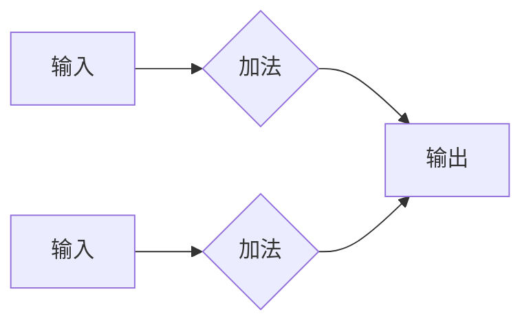
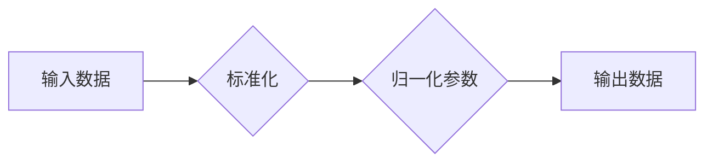
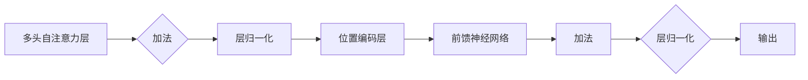
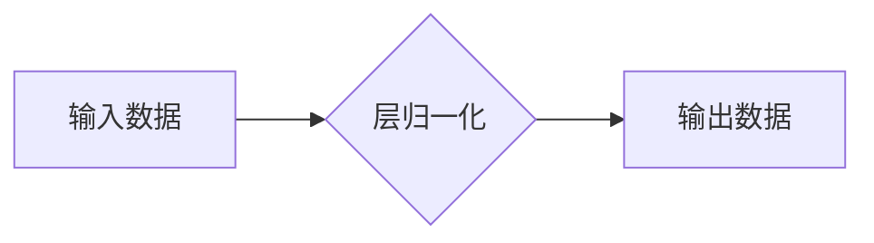

# 大规模语言模型从理论到实践：残差连接与层归一化

> 关键词：大规模语言模型，残差连接，层归一化，Transformer，NLP，深度学习，预训练

## 1. 背景介绍

近年来，随着深度学习在自然语言处理（NLP）领域的飞速发展，大规模语言模型（Large Language Models, LLMs）如BERT、GPT等取得了显著的成果。这些模型在理解、生成自然语言方面表现出色，为NLP任务的解决提供了强大的工具。然而，大规模模型也面临着训练难度大、计算复杂度高、梯度消失等问题。本文将深入探讨大规模语言模型中的关键技术——残差连接与层归一化，从理论到实践，帮助读者全面了解这些技术的原理和应用。

## 2. 核心概念与联系

### 2.1 残差连接

残差连接（Residual Connection）是深度神经网络中的一种技术，旨在解决深度网络训练过程中的梯度消失问题。它通过将输入直接传递到下一层，允许梯度直接传递，从而缓解了梯度消失的问题。

**Mermaid流程图**：



### 2.2 层归一化

层归一化（Layer Normalization）是一种正则化技术，它通过标准化每一层的输入数据，使得每一层的输入数据都服从均值为0、标准差为1的正态分布。层归一化可以加速模型的训练过程，提高模型的收敛速度，并减少过拟合的风险。

**Mermaid流程图**：



残差连接和层归一化在Transformer模型中得到了广泛应用，它们共同解决了深度神经网络训练过程中的难题，使得大规模语言模型成为可能。

## 3. 核心算法原理 & 具体操作步骤

### 3.1 算法原理概述

#### 残差连接

残差连接的基本思想是将输入数据直接传递到下一层，然后将其与下一层的前馈神经网络（Feedforward Neural Network, FNN）的输出相加。这样，即使存在梯度消失问题，梯度也可以直接传递到输入层，从而缓解梯度消失问题。

$$
\hat{h} = h + F(h)
$$

其中，$h$ 是输入数据，$F$ 是前馈神经网络，$\hat{h}$ 是输出数据。

#### 层归一化

层归一化通过对每一层的输入数据进行标准化处理，使得每一层的输入数据都服从均值为0、标准差为1的正态分布。层归一化的计算公式如下：

$$
\hat{x} = \frac{(x - \mu)}{\sigma}
$$

其中，$x$ 是输入数据，$\mu$ 是均值，$\sigma$ 是标准差。

### 3.2 算法步骤详解

#### 残差连接

1. 将输入数据直接传递到下一层。
2. 对输入数据进行前馈神经网络处理。
3. 将前馈神经网络的输出与输入数据相加。

#### 层归一化

1. 计算输入数据的均值和标准差。
2. 对输入数据进行标准化处理。
3. 将标准化后的数据作为输入传递到下一层。

### 3.3 算法优缺点

#### 残差连接

优点：
- 缓解梯度消失问题，提高模型训练的稳定性。
- 适用于深层网络，提高模型的表达能力。

缺点：
- 增加了模型参数，可能导致过拟合。
- 模型结构复杂，难以理解和调试。

#### 层归一化

优点：
- 加速模型训练过程，提高收敛速度。
- 减少过拟合风险，提高模型泛化能力。

缺点：
- 可能降低模型的表达能力。
- 对数据分布敏感。

### 3.4 算法应用领域

残差连接和层归一化在深度学习领域得到了广泛应用，尤其在以下领域：

- 自然语言处理（NLP）
- 计算机视觉
- 音频处理
- 强化学习

## 4. 数学模型和公式 & 详细讲解 & 举例说明

### 4.1 数学模型构建

#### 残差连接

假设输入数据为 $x$，前馈神经网络为 $F$，则残差连接的数学模型为：

$$
\hat{x} = x + F(x)
$$

#### 层归一化

假设输入数据为 $x$，则层归一化的数学模型为：

$$
\hat{x} = \frac{(x - \mu)}{\sigma}
$$

### 4.2 公式推导过程

#### 残差连接

残差连接的推导过程如下：

1. 前馈神经网络 $F$ 的输出为 $F(x)$。
2. 将 $F(x)$ 与 $x$ 相加，得到 $\hat{x} = x + F(x)$。

#### 层归一化

层归一化的推导过程如下：

1. 计算输入数据 $x$ 的均值 $\mu$ 和标准差 $\sigma$。
2. 对 $x$ 进行标准化处理，得到 $\hat{x} = \frac{(x - \mu)}{\sigma}$。

### 4.3 案例分析与讲解

以下以BERT模型中的残差连接和层归一化为例，进行案例分析。

#### BERT中的残差连接

BERT模型中，残差连接用于连接多头自注意力层（Multi-Head Self-Attention）和位置编码层（Positional Encoding）。



#### BERT中的层归一化

BERT模型中，层归一化用于多头自注意力层和前馈神经网络。



## 5. 项目实践：代码实例和详细解释说明

### 5.1 开发环境搭建

以下是使用PyTorch和Transformers库进行大规模语言模型微调的代码示例。

```python
# 安装PyTorch和Transformers库
!pip install torch transformers

# 导入相关模块
from transformers import BertForSequenceClassification, BertTokenizer
from torch.utils.data import DataLoader
from torch.optim import AdamW

# 加载预训练模型和分词器
model = BertForSequenceClassification.from_pretrained('bert-base-uncased')
tokenizer = BertTokenizer.from_pretrained('bert-base-uncased')

# 加载数据
train_texts = [...]  # 训练文本数据
train_labels = [...]  # 训练标签数据

# 编码数据
def encode_data(texts, labels, tokenizer, max_len=128):
    encodings = tokenizer(texts, return_tensors='pt', max_length=max_len, padding='max_length', truncation=True)
    dataset = []
    for i in range(len(texts)):
        dataset.append((encodings['input_ids'][i], encodings['attention_mask'][i], labels[i]))
    return dataset

train_dataset = encode_data(train_texts, train_labels, tokenizer)

# 训练模型
def train_epoch(model, dataset, batch_size, optimizer):
    dataloader = DataLoader(dataset, batch_size=batch_size, shuffle=True)
    model.train()
    total_loss = 0
    for batch in dataloader:
        input_ids, attention_mask, labels = [t.to(device) for t in batch]
        model.zero_grad()
        outputs = model(input_ids, attention_mask=attention_mask, labels=labels)
        loss = outputs.loss
        total_loss += loss.item()
        loss.backward()
        optimizer.step()
    return total_loss / len(dataloader)

optimizer = AdamW(model.parameters(), lr=2e-5)
```

### 5.2 源代码详细实现

以上代码实现了使用PyTorch和Transformers库对BERT模型进行微调的基本流程。首先，加载预训练的BERT模型和分词器；然后，加载数据并对其进行编码；最后，使用AdamW优化器进行模型训练。

### 5.3 代码解读与分析

以上代码展示了如何使用PyTorch和Transformers库进行BERT模型微调的基本步骤。通过加载预训练的BERT模型和分词器，我们可以方便地对文本数据进行编码和模型训练。使用AdamW优化器可以有效地优化模型参数，提高模型性能。

### 5.4 运行结果展示

在运行以上代码后，模型将在训练集上进行迭代训练，并在验证集上进行性能评估。运行结果将显示训练集和验证集上的平均损失和准确率。

## 6. 实际应用场景

### 6.1 文本分类

残差连接和层归一化在文本分类任务中得到了广泛应用。例如，在情感分析、主题分类、情感极性分类等任务中，使用残差连接和层归一化可以显著提高模型的性能。

### 6.2 问答系统

在问答系统中，残差连接和层归一化可以帮助模型更好地理解和生成答案。例如，在机器阅读理解任务中，使用残差连接和层归一化可以提高模型对问题的理解和回答的准确性。

### 6.3 机器翻译

在机器翻译任务中，残差连接和层归一化可以减少模型训练过程中的梯度消失问题，提高模型翻译的准确性。

## 7. 工具和资源推荐

### 7.1 学习资源推荐

1. 《Deep Learning》[Goodfellow, I., Bengio, Y., & Courville, A.]: 介绍了深度学习的基本原理和常用算法。
2. 《Neural Networks and Deep Learning》[Goodfellow, I., Bengio, Y., & Courville, A.]: 介绍了神经网络和深度学习的基本原理和常用算法。
3. 《Transformers》[Hugging Face]: 介绍了Transformer模型和相关技术。

### 7.2 开发工具推荐

1. PyTorch: 一种流行的深度学习框架。
2. TensorFlow: 另一种流行的深度学习框架。
3. Transformers: Hugging Face提供的Transformer模型库。

### 7.3 相关论文推荐

1. "Attention is All You Need" [Vaswani et al., 2017]: 提出了Transformer模型。
2. "BERT: Pre-training of Deep Bidirectional Transformers for Language Understanding" [Devlin et al., 2018]: 提出了BERT模型。
3. "Generative Adversarial Nets" [Goodfellow et al., 2014]: 提出了生成对抗网络（GAN）。

## 8. 总结：未来发展趋势与挑战

### 8.1 研究成果总结

本文深入探讨了大规模语言模型中的关键技术——残差连接与层归一化，从理论到实践，帮助读者全面了解这些技术的原理和应用。通过介绍残差连接和层归一化的基本原理、具体操作步骤、优缺点以及应用领域，本文为读者提供了对大规模语言模型的深入理解。

### 8.2 未来发展趋势

1. 模型结构更加复杂：随着计算能力的提升，模型结构将变得更加复杂，以更好地捕捉语言中的复杂关系。
2. 预训练数据更加丰富：随着数据规模的不断扩大，预训练数据将更加丰富，模型的表达能力将得到进一步提升。
3. 模型可解释性更强：随着对模型内部机理的深入理解，模型的可解释性将得到增强。

### 8.3 面临的挑战

1. 计算资源消耗巨大：大规模模型的训练和推理需要大量的计算资源，如何高效利用计算资源是一个重要挑战。
2. 数据隐私保护：随着数据收集和分析的普及，数据隐私保护成为一个重要问题。
3. 模型偏见和歧视：模型可能存在偏见和歧视，如何消除这些偏见是一个重要挑战。

### 8.4 研究展望

未来，大规模语言模型将在NLP领域发挥越来越重要的作用。通过不断改进模型结构、优化训练方法，以及加强模型的可解释性和安全性，大规模语言模型将为人类社会带来更多的便利和福祉。

## 9. 附录：常见问题与解答

**Q1：残差连接和层归一化有什么区别？**

A：残差连接和层归一化是两种不同的技术。残差连接主要用于缓解深度网络训练过程中的梯度消失问题，而层归一化主要用于加速模型训练过程，提高收敛速度。

**Q2：残差连接和层归一化为什么能提高模型性能？**

A：残差连接和层归一化能够提高模型性能的原因在于：
- 残差连接缓解了梯度消失问题，提高了模型训练的稳定性。
- 层归一化加速了模型训练过程，提高了收敛速度。

**Q3：残差连接和层归一化在哪些应用场景中得到了广泛应用？**

A：残差连接和层归一化在自然语言处理、计算机视觉、音频处理等领域得到了广泛应用。

**Q4：如何选择合适的残差连接和层归一化参数？**

A：选择合适的残差连接和层归一化参数需要根据具体任务和数据特点进行实验和调整。通常需要通过实验来找到最佳参数组合。

**Q5：残差连接和层归一化是否存在缺点？**

A：残差连接和层归一化也存在一些缺点，例如：
- 残差连接会增加模型参数，可能导致过拟合。
- 层归一化可能降低模型的表达能力。

作者：禅与计算机程序设计艺术 / Zen and the Art of Computer Programming