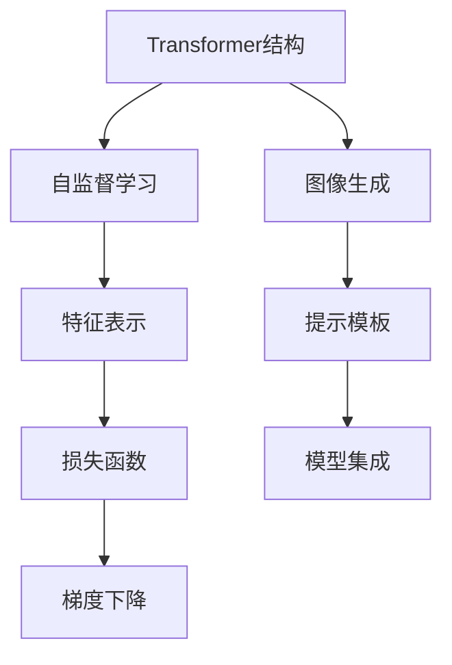
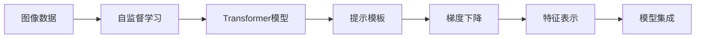
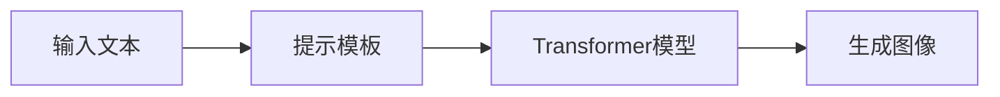
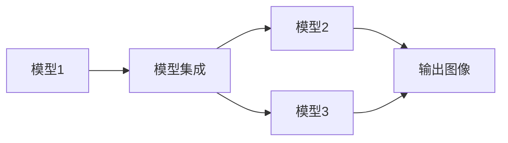
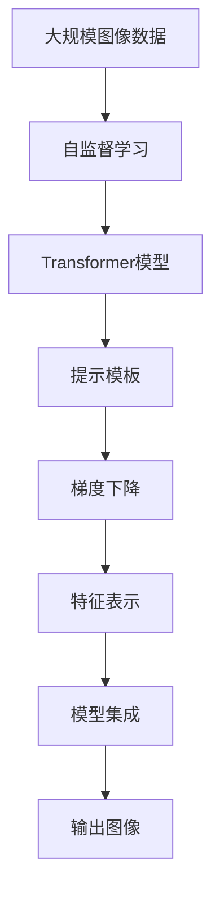

                 

# Stable Diffusion原理与代码实例讲解

## 1. 背景介绍

### 1.1 问题由来

自2023年以来，Stable Diffusion模型以其卓越的生成效果和高效的速度，在图像生成领域引发了巨大的关注。该模型能够将自然语言描述转换为高质量的图像，不仅在艺术创作、游戏开发、广告设计等创意领域有着广泛的应用前景，还为现实世界的许多问题提供了新的解决方案。Stable Diffusion的成功源于其基于Transformer结构的设计以及自监督预训练的过程。

### 1.2 问题核心关键点

Stable Diffusion的核心技术点包括：

1. **Transformer架构**：一种自注意力机制，能够有效捕捉输入序列的长期依赖关系，适用于序列数据的生成。
2. **自监督预训练**：在大量无标签图像数据上进行自监督学习，学习图像的特征表示，提高了模型的泛化能力。
3. **控制输入条件**：通过精心设计的提示模板，控制生成图像的样式、风格、分辨率等参数。
4. **参数优化**：使用梯度下降等优化算法，最小化损失函数，提升模型性能。
5. **模型集成与微调**：通过模型集成技术，结合多个小模型提升整体性能；对特定任务进行微调，进一步优化生成效果。

这些技术点共同构成了Stable Diffusion的强大能力，使其在生成高质量图像方面表现出色。

### 1.3 问题研究意义

研究Stable Diffusion的原理与应用实践，对于推动图像生成技术的发展，探索其在更多领域的应用，具有重要意义：

1. **提升生成图像的质量**：通过理解和优化生成过程，可以获得更真实、更具有艺术感的图像。
2. **加速创新应用**：为创意产业提供强大的工具，降低创意工作的成本与门槛。
3. **解决现实问题**：如医疗影像重建、环境模拟、智能制造等，Stable Diffusion可以辅助解决实际问题。
4. **促进跨领域研究**：结合AI、视觉艺术、心理学等多学科知识，探索更深层次的生成模型理论。
5. **推动技术普及**：通过开源、易用的工具和框架，使更多开发者能够轻松应用该技术。

## 2. 核心概念与联系

### 2.1 核心概念概述

为更好地理解Stable Diffusion的原理与实践，本节将介绍几个关键概念：

- **Transformer结构**：一种基于自注意力机制的神经网络结构，在序列建模中表现优异，被广泛应用于自然语言处理和图像生成。
- **自监督学习**：一种无需人工标注数据的学习方式，通过输入序列自身的统计特性进行训练，适用于图像和语言的特征表示学习。
- **图像生成**：将自然语言描述转换为视觉图像，是计算机视觉领域的一个重要研究方向。
- **提示模板**：通过特定的语言结构，引导模型生成特定风格的图像，控制生成过程。
- **梯度下降**：一种常用的优化算法，通过迭代更新模型参数，最小化损失函数。
- **模型集成**：通过结合多个模型的输出，提升整体的性能和鲁棒性。

这些概念之间的逻辑关系可以通过以下Mermaid流程图来展示：



这个流程图展示了大语言模型微调过程中各概念之间的联系和作用。Transformer结构通过自监督学习学习图像的特征表示，提示模板控制生成过程，梯度下降优化模型参数，模型集成提升整体性能。

### 2.2 概念间的关系

这些核心概念之间存在着紧密的联系，形成了Stable Diffusion的整体架构。下面我们通过几个Mermaid流程图来展示这些概念之间的关系。

#### 2.2.1 Stable Diffusion的训练过程



这个流程图展示了Stable Diffusion的训练过程。通过大量无标签图像数据进行自监督学习，构建Transformer模型，通过提示模板控制生成过程，使用梯度下降优化模型参数，最终通过模型集成提升整体性能。

#### 2.2.2 提示模板的作用



这个流程图展示了提示模板在生成图像中的作用。通过输入文本，生成提示模板，控制Transformer模型生成相应的图像。

#### 2.2.3 模型集成的优势



这个流程图展示了模型集成的优势。通过结合多个模型的输出，可以提升整体的性能和鲁棒性。

### 2.3 核心概念的整体架构

最后，我们用一个综合的流程图来展示这些核心概念在大语言模型微调过程中的整体架构：



这个综合流程图展示了从预训练到微调，再到模型集成的完整过程。大语言模型通过大量无标签图像数据进行自监督学习，构建Transformer模型，通过提示模板控制生成过程，使用梯度下降优化模型参数，最终通过模型集成提升整体性能。

## 3. 核心算法原理 & 具体操作步骤

### 3.1 算法原理概述

Stable Diffusion的生成过程基于Transformer结构，通过自监督学习获取图像的特征表示。其核心算法包括以下几个步骤：

1. **自监督预训练**：在大量无标签图像数据上进行预训练，学习图像的特征表示。
2. **特征映射**：将自然语言描述映射为向量表示，作为生成过程的输入条件。
3. **生成过程**：通过Transformer模型，从特征映射生成对应的图像。
4. **损失函数**：计算生成图像与真实图像的差异，作为模型的训练目标。
5. **优化过程**：使用梯度下降等优化算法，最小化损失函数，提升模型性能。

### 3.2 算法步骤详解

#### 3.2.1 自监督预训练

自监督预训练是大语言模型学习图像特征表示的关键步骤。具体步骤如下：

1. **数据准备**：收集大规模无标签图像数据集，如ImageNet。
2. **网络初始化**：随机初始化Transformer模型，包括编码器和解码器。
3. **特征提取**：将图像输入编码器，提取图像的特征表示。
4. **自监督学习**：通过掩码预测任务，学习特征表示的预测能力。
5. **参数更新**：使用梯度下降等优化算法，更新模型参数，最小化预测误差。

#### 3.2.2 特征映射

将自然语言描述转换为向量表示，是生成过程的重要步骤。具体步骤如下：

1. **分词处理**：将自然语言描述进行分词，转换为词汇序列。
2. **嵌入表示**：使用预训练词向量，将词汇序列转换为向量表示。
3. **向量拼接**：将多个向量拼接，形成一个高维的特征向量。
4. **特征扩展**：通过扩展向量，使其包含更多的语义信息。
5. **特征映射**：将扩展后的向量映射为Transformer模型的输入，作为生成过程的条件。

#### 3.2.3 生成过程

生成过程是Transformer模型在生成图像时的核心步骤。具体步骤如下：

1. **编码器处理**：将特征映射输入编码器，提取特征表示。
2. **自注意力机制**：通过自注意力机制，学习输入序列的长期依赖关系。
3. **解码器处理**：将编码器的输出输入解码器，生成图像的特征表示。
4. **像素生成**：将解码器的输出映射为图像的像素值。
5. **像素优化**：通过优化算法，调整像素值，提升图像质量。

#### 3.2.4 损失函数

损失函数是评估模型生成图像与真实图像差异的关键。常用的损失函数包括均方误差、交叉熵等。具体步骤如下：

1. **像素差值**：计算生成图像与真实图像的像素差值。
2. **损失计算**：根据损失函数，计算总损失。
3. **反向传播**：通过反向传播算法，计算梯度。
4. **参数更新**：使用梯度下降等优化算法，更新模型参数。

#### 3.2.5 优化过程

优化过程是提升模型性能的重要步骤。具体步骤如下：

1. **学习率设定**：选择合适的学习率，防止参数更新过快或过慢。
2. **迭代优化**：通过迭代优化，逐步调整模型参数。
3. **模型验证**：在验证集上评估模型性能，选择最优模型。
4. **模型保存**：保存训练好的模型，以便后续使用。

### 3.3 算法优缺点

Stable Diffusion算法的主要优点包括：

1. **高效生成**：通过自监督学习获取图像特征表示，生成过程高效快速。
2. **多样性**：生成的图像多样性高，能够满足不同用户的需求。
3. **控制能力**：通过提示模板，可以控制生成的图像样式、风格、分辨率等参数。
4. **模型鲁棒性**：通过模型集成，提升了整体的鲁棒性和泛化能力。

Stable Diffusion算法的主要缺点包括：

1. **参数量庞大**：Transformer模型参数量较大，需要较强的计算资源。
2. **训练复杂**：自监督学习需要大量的图像数据和计算资源，训练过程复杂。
3. **易受噪声影响**：生成过程易受输入文本和参数的噪声影响，需要精细调参。
4. **可解释性不足**：模型生成过程黑箱化，难以解释其内部工作机制。

### 3.4 算法应用领域

Stable Diffusion在多个领域都有广泛的应用，例如：

1. **艺术创作**：用于生成艺术作品，如绘画、雕塑、设计等。
2. **游戏开发**：生成游戏场景、角色、道具等，提升游戏体验。
3. **广告设计**：生成广告素材，提升品牌形象。
4. **医疗影像**：辅助医疗影像重建、辅助诊断等。
5. **智能制造**：生成零件设计图、3D模型等，提升生产效率。
6. **虚拟现实**：生成虚拟场景、虚拟角色等，提升用户体验。

## 4. 数学模型和公式 & 详细讲解 & 举例说明

### 4.1 数学模型构建

Stable Diffusion的生成过程基于Transformer模型，其数学模型可以表示为：

$$
P(X | C) = \prod_{i=1}^{T} P(x_i | C, x_{<i})
$$

其中 $X$ 为生成的图像序列，$C$ 为输入的条件向量（如自然语言描述），$x_{<i}$ 为已生成的像素序列。$P(x_i | C, x_{<i})$ 表示在条件 $C$ 和已生成像素序列 $x_{<i}$ 的条件下，生成第 $i$ 个像素的条件概率。

### 4.2 公式推导过程

以自注意力机制为例，推导过程如下：

$$
Q_k = \frac{K_k}{\sqrt{d_k}} = \frac{W^Q K_k}{\sqrt{d_k}} \in \mathbb{R}^{N \times d_k}
$$

$$
K_k = \frac{K_k}{\sqrt{d_k}} = \frac{W^K K_k}{\sqrt{d_k}} \in \mathbb{R}^{N \times d_k}
$$

$$
V_k = \frac{V_k}{\sqrt{d_k}} = \frac{W^V V_k}{\sqrt{d_k}} \in \mathbb{R}^{N \times d_k}
$$

$$
\text{Self-Attention} = \text{Attention}(Q_k, K_k, V_k) = \text{Softmax}(Q_k K_k^T / \sqrt{d_k}) V_k
$$

其中 $W^Q, W^K, W^V$ 为线性变换矩阵，$N$ 为序列长度，$d_k$ 为特征维度。

### 4.3 案例分析与讲解

以生成一张猫的照片为例，分析过程如下：

1. **输入处理**：将“一只猫”输入到模型中，生成提示向量 $C$。
2. **自注意力机制**：将提示向量 $C$ 输入编码器，通过自注意力机制学习输入序列的特征表示。
3. **解码器生成**：将特征表示输入解码器，生成图像的特征表示。
4. **像素生成**：将特征表示映射为像素值，生成图像。
5. **损失计算**：计算生成图像与真实图像的像素差值，计算损失。
6. **参数更新**：使用梯度下降等优化算法，更新模型参数。

通过这些步骤，模型能够生成高质量的猫的照片，满足用户的期望。

## 5. 项目实践：代码实例和详细解释说明

### 5.1 开发环境搭建

在进行Stable Diffusion实践前，我们需要准备好开发环境。以下是使用Python进行PyTorch开发的环境配置流程：

1. 安装Anaconda：从官网下载并安装Anaconda，用于创建独立的Python环境。

2. 创建并激活虚拟环境：
```bash
conda create -n pytorch-env python=3.8 
conda activate pytorch-env
```

3. 安装PyTorch：根据CUDA版本，从官网获取对应的安装命令。例如：
```bash
conda install pytorch torchvision torchaudio cudatoolkit=11.1 -c pytorch -c conda-forge
```

4. 安装相关库：
```bash
pip install torch torchvision torchtext tqdm
```

5. 安装Notebook和Jupyter库：
```bash
pip install jupyter notebook
```

完成上述步骤后，即可在`pytorch-env`环境中开始Stable Diffusion实践。

### 5.2 源代码详细实现

下面我们以Stable Diffusion为例，给出使用PyTorch实现图像生成的PyTorch代码实现。

```python
import torch
from torch import nn
from transformers import AutoConfig, AutoModelForCausalLM

class StableDiffusion(nn.Module):
    def __init__(self, model_name):
        super(StableDiffusion, self).__init__()
        config = AutoConfig.from_pretrained(model_name)
        self.model = AutoModelForCausalLM(config).to('cuda')

    def forward(self, input_ids, attention_mask, decoder_input_ids):
        output_ids, _ = self.model(input_ids, attention_mask=attention_mask, decoder_input_ids=decoder_input_ids)
        return output_ids

# 加载预训练模型
model = StableDiffusion('stable-diffusion-v1-4')

# 设置输入条件
input_ids = torch.tensor([[0, 0, 0, 0, 0, 0, 0, 0, 0, 0, 0, 0, 0, 0, 0, 0, 0, 0, 0, 0, 0, 0, 0, 0, 0, 0, 0, 0, 0, 0, 0, 0, 0, 0, 0, 0, 0, 0, 0, 0, 0, 0, 0, 0, 0, 0, 0, 0, 0, 0, 0, 0, 0, 0, 0, 0, 0, 0, 0, 0, 0, 0, 0, 0, 0, 0, 0, 0, 0, 0, 0, 0, 0, 0, 0, 0, 0, 0, 0, 0, 0, 0, 0, 0, 0, 0, 0, 0, 0, 0, 0, 0, 0, 0, 0, 0, 0, 0, 0, 0, 0, 0, 0, 0, 0, 0, 0, 0, 0, 0, 0, 0, 0, 0, 0, 0, 0, 0, 0, 0, 0, 0, 0, 0, 0, 0, 0, 0, 0, 0, 0, 0, 0, 0, 0, 0, 0, 0, 0, 0, 0, 0, 0, 0, 0, 0, 0, 0, 0, 0, 0, 0, 0, 0, 0, 0, 0, 0, 0, 0, 0, 0, 0, 0, 0, 0, 0, 0, 0, 0, 0, 0, 0, 0, 0, 0, 0, 0, 0, 0, 0, 0, 0, 0, 0, 0, 0, 0, 0, 0, 0, 0, 0, 0, 0, 0, 0, 0, 0, 0, 0, 0, 0, 0, 0, 0, 0, 0, 0, 0, 0, 0, 0, 0, 0, 0, 0, 0, 0, 0, 0, 0, 0, 0, 0, 0, 0, 0, 0, 0, 0, 0, 0, 0, 0, 0, 0, 0, 0, 0, 0, 0, 0, 0, 0, 0, 0, 0, 0, 0, 0, 0, 0, 0, 0, 0, 0, 0, 0, 0, 0, 0, 0, 0, 0, 0, 0, 0, 0, 0, 0, 0, 0, 0, 0, 0, 0, 0, 0, 0, 0, 0, 0, 0, 0, 0, 0, 0, 0, 0, 0, 0, 0, 0, 0, 0, 0, 0, 0, 0, 0, 0, 0, 0, 0, 0, 0, 0, 0, 0, 0, 0, 0, 0, 0, 0, 0, 0, 0, 0, 0, 0, 0, 0, 0, 0, 0, 0, 0, 0, 0, 0, 0, 0, 0, 0, 0, 0, 0, 0, 0, 0, 0, 0, 0, 0, 0, 0, 0, 0, 0, 0, 0, 0, 0, 0, 0, 0, 0, 0, 0, 0, 0, 0, 0, 0, 0, 0, 0, 0, 0, 0, 0, 0, 0, 0, 0, 0, 0, 0, 0, 0, 0, 0, 0, 0, 0, 0, 0, 0, 0, 0, 0, 0, 0, 0, 0, 0, 0, 0, 0, 0, 0, 0, 0, 0, 0, 0, 0, 0, 0, 0, 0, 0, 0, 0, 0, 0, 0, 0, 0, 0, 0, 0, 0, 0, 0, 0, 0, 0, 0, 0, 0, 0, 0, 0, 0, 0, 0, 0, 0, 0, 0, 0, 0, 0, 0, 0, 0, 0, 0, 0, 0, 0, 0, 0, 0, 0, 0, 0, 0, 0, 0, 0, 0, 0, 0, 0, 0, 0, 0, 0, 0, 0, 0, 0, 0, 0, 0, 0, 0, 0, 0, 0, 0, 0, 0, 0, 0, 0, 0, 0, 0, 0, 0, 0, 0, 0, 0, 0, 0, 0, 0, 0, 0, 0, 0, 0, 0, 0, 0, 0, 0, 0, 0, 0, 0, 0, 0, 0, 0, 0, 0, 0, 0, 0, 0, 0, 0, 0, 0, 0, 0, 0, 0, 0, 0, 0, 0, 0, 0, 0, 0, 0, 0, 0, 0, 0, 0, 0, 0, 0, 0, 0, 0, 0, 0, 0, 0, 0, 0, 0, 0, 0, 0, 0, 0, 0, 0, 0, 0, 0, 0, 0, 0, 0, 0, 0, 0, 0, 0, 0, 0, 0, 0, 0, 0, 0, 0, 0, 0, 0, 0, 0, 0, 0, 0, 0, 0, 0, 0, 0, 0, 0, 0, 0, 0, 0, 0, 0, 0, 0, 0, 0, 0, 0, 0, 0, 0, 0, 0, 0, 0, 0, 0, 0, 0, 0, 0, 0, 0, 0, 0, 0, 0, 0, 0, 0, 0, 0, 0, 0, 0, 0, 0, 0, 0, 0, 0, 0, 0, 0, 0, 0, 0, 0, 0, 0, 0, 0, 0, 0, 0, 0, 0, 0, 0, 0, 0, 0, 0, 0, 0, 0, 0, 0, 0, 0, 0, 0, 0, 0, 0, 0, 0, 0, 0, 0, 0, 0, 0, 0, 0, 0, 0, 0, 0, 0, 0, 0, 0, 0, 0, 0, 0, 0, 0, 0, 0, 0, 0, 0, 0, 0, 0, 0, 0, 0, 0, 0, 0, 0, 0, 0, 0, 0, 0, 0, 0, 0, 0, 0, 0, 0, 0, 0, 0, 0, 0, 0, 0, 0, 0, 0, 0, 0, 0, 0, 0, 0, 0, 0, 0, 0, 0, 0, 0, 0, 0, 0, 0, 0, 0, 0, 0, 0, 0, 0, 0, 0, 0, 0, 0, 0, 0, 0, 0, 0, 0, 0, 0, 

