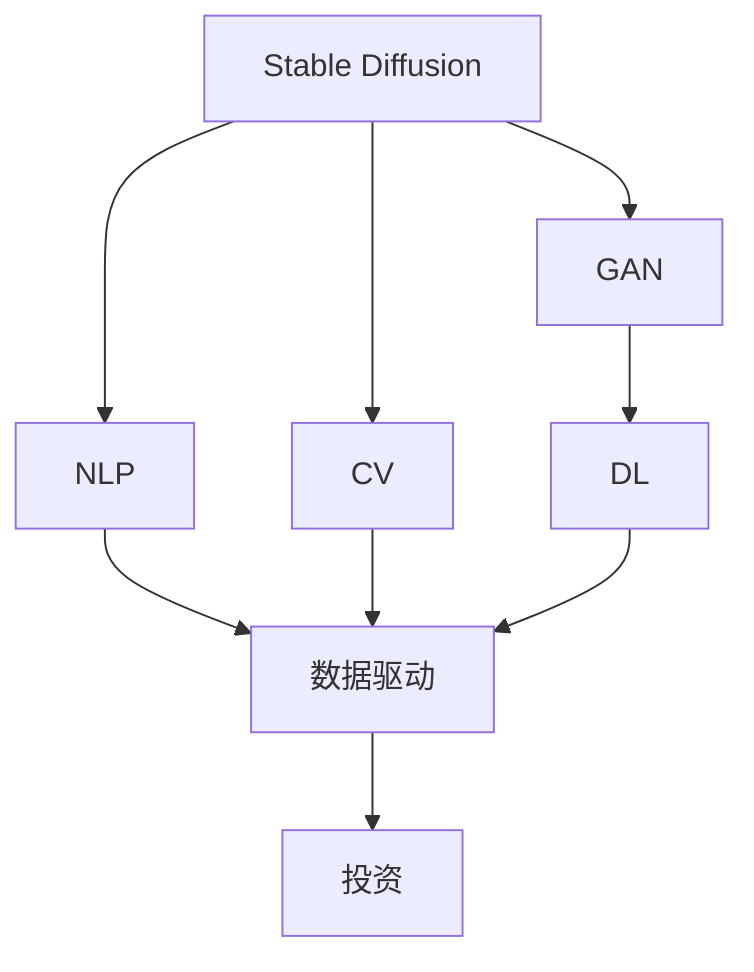
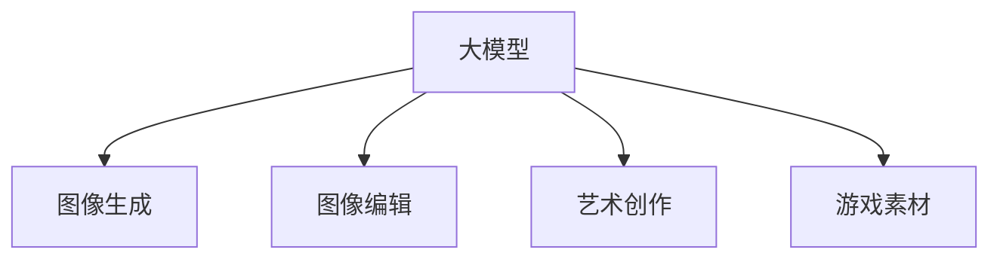
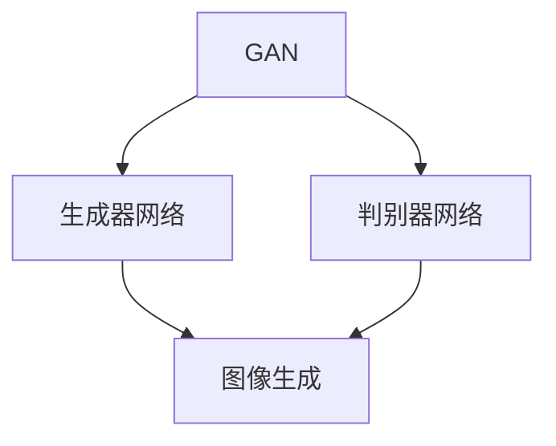
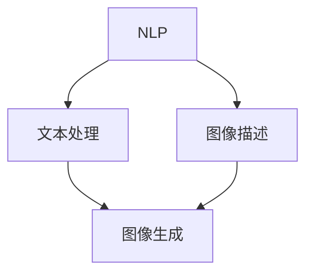
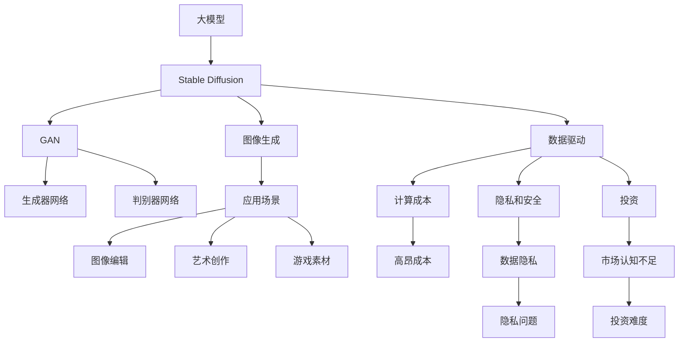

                 

# Stable Diffusion行业地位突出,技术行但市场不行难获投资

> 关键词：Stable Diffusion, 自然语言处理(NLP), 计算机视觉(CV), 生成对抗网络(GAN), 深度学习(DL), 数据驱动, 投资

## 1. 背景介绍

### 1.1 问题由来
Stable Diffusion是一种基于生成对抗网络(GAN)的模型，用于文本到图像的生成任务。它由谷歌的OpenAI团队开发，其核心思想是将文本描述转换为图像，并生成符合该描述的图像。Stable Diffusion模型被广泛应用于图像生成、图像编辑、艺术创作等领域，甚至成为游戏中的素材来源。然而，尽管Stable Diffusion在技术上非常先进，但其市场表现并不理想，面临着难以获得投资的困境。

### 1.2 问题核心关键点
Stable Diffusion模型尽管在技术上表现出色，但以下几个关键点使其在市场中难以获得投资：

1. **高昂的计算成本**：Stable Diffusion需要大量的计算资源进行训练和推理，这在一定程度上限制了其商业化的可能性。
2. **数据隐私和安全问题**：在生成文本对应的图像时，模型可能使用到用户的隐私信息，如何保护这些信息是关键问题。
3. **市场认知不足**：相比于传统的图像生成技术，Stable Diffusion的商业价值尚未得到市场的充分认可。

### 1.3 问题研究意义
研究Stable Diffusion的市场表现，可以帮助我们更全面地理解大模型在实际应用中的挑战和机遇，从而为未来的技术创新和商业化提供有价值的参考。同时，了解如何提升模型在市场中的接受度和投资吸引力，将有助于加速Stable Diffusion的落地应用。

## 2. 核心概念与联系

### 2.1 核心概念概述

为更好地理解Stable Diffusion的行业地位和市场表现，本节将介绍几个密切相关的核心概念：

- **Stable Diffusion**：基于生成对抗网络（GAN）的模型，用于文本到图像的生成任务。
- **生成对抗网络（GAN）**：由两个神经网络组成，一个生成器网络和一个判别器网络，通过对抗训练生成高质量的图像。
- **自然语言处理（NLP）**：涉及计算机对自然语言的理解、处理和生成，是大模型重要的应用领域之一。
- **计算机视觉（CV）**：涉及计算机对图像的理解、处理和生成，是大模型另一个重要应用领域。
- **深度学习（DL）**：利用多层神经网络进行复杂模式识别和处理，是大模型核心的技术基础。
- **数据驱动**：强调通过数据训练模型，提升模型性能，是大模型训练的核心。
- **投资**：指将资金投入到某项技术或项目中，以期获得回报，是大模型市场化的关键。

这些核心概念之间的逻辑关系可以通过以下Mermaid流程图来展示：



这个流程图展示了大模型Stable Diffusion的核心概念及其之间的关系：

1. Stable Diffusion通过GAN技术进行图像生成。
2. GAN、NLP和CV是大模型应用的主要领域。
3. DL是大模型技术的基础。
4. 数据驱动是大模型训练的关键。
5. 投资是大模型市场化的目标。

### 2.2 概念间的关系

这些核心概念之间存在着紧密的联系，形成了大模型Stable Diffusion的市场表现框架。下面我通过几个Mermaid流程图来展示这些概念之间的关系。

#### 2.2.1 大模型应用场景



这个流程图展示了大模型在多个应用场景中的应用。

#### 2.2.2 GAN与大模型的关系



这个流程图展示了GAN的基本组成及其在图像生成中的应用。

#### 2.2.3 NLP与CV的关系



这个流程图展示了NLP和CV之间的相互促进关系。

### 2.3 核心概念的整体架构

最后，我们用一个综合的流程图来展示这些核心概念在大模型市场表现中的整体架构：



这个综合流程图展示了从大模型到Stable Diffusion，再到市场表现的整体架构。

## 3. 核心算法原理 & 具体操作步骤
### 3.1 算法原理概述

Stable Diffusion模型的核心原理是基于生成对抗网络（GAN）的文本到图像生成方法。其目标是将一段自然语言文本描述转换成一幅符合该描述的图像。

形式化地，设文本描述为 $T$，图像为 $I$，模型的目标是训练一个生成器网络 $G$ 和一个判别器网络 $D$，使得 $G(T)$ 生成的图像尽可能接近真实图像 $I$，同时判别器网络 $D$ 能够区分真实图像和生成图像。训练过程如下：

1. 生成器网络 $G$ 将文本描述 $T$ 映射为图像 $I$。
2. 判别器网络 $D$ 评估 $I$ 是否为真实图像。
3. 通过对抗训练，使生成器网络 $G$ 生成的图像 $I$ 能够欺骗判别器网络 $D$，同时 $D$ 能够准确区分真实图像和生成图像。

通过这种对抗训练过程，生成器网络 $G$ 可以生成高质量的图像，满足文本描述的要求。

### 3.2 算法步骤详解

以下我将详细讲解Stable Diffusion模型的训练和推理步骤：

**Step 1: 准备数据集和预训练模型**

1. **数据集准备**：收集与Stable Diffusion应用场景相关的文本描述和对应图像。例如，在图像生成领域，可以从Flickr、Google Images等网站收集带有文本描述的图像数据。
2. **预训练模型**：选择已有的预训练模型或从头训练。Stable Diffusion模型通常使用UNet和ResNet作为生成器网络，使用PatchGAN作为判别器网络。

**Step 2: 构建生成器和判别器**

1. **生成器网络**：基于UNet或ResNet构建生成器网络 $G$，输入为文本描述 $T$，输出为图像 $I$。
2. **判别器网络**：基于PatchGAN构建判别器网络 $D$，输入为图像 $I$，输出为真实性概率。

**Step 3: 训练对抗生成网络**

1. **生成器训练**：将文本描述 $T$ 输入生成器网络 $G$，得到图像 $I$。
2. **判别器训练**：将 $I$ 输入判别器网络 $D$，输出真实性概率 $p$。
3. **对抗训练**：通过反向传播更新生成器和判别器的权重，使得 $D$ 难以区分 $I$ 和真实图像，同时 $G$ 生成的图像逼近真实图像。

**Step 4: 推理生成图像**

1. **输入文本描述**：将文本描述 $T$ 输入生成器网络 $G$。
2. **生成图像**：得到生成图像 $I$。

### 3.3 算法优缺点

Stable Diffusion模型的优点包括：

1. **高质量图像生成**：通过对抗训练生成的图像质量较高，能够较好地满足文本描述的要求。
2. **应用场景广泛**：适用于图像生成、图像编辑、艺术创作等多个领域，具有较高的应用价值。

然而，Stable Diffusion模型也存在一些缺点：

1. **计算成本高**：生成高质量图像需要大量的计算资源，训练和推理成本较高。
2. **数据隐私和安全问题**：在生成图像时，模型可能使用到用户的隐私信息，如何保护这些信息是关键问题。
3. **市场认知不足**：相比于传统的图像生成技术，Stable Diffusion的商业价值尚未得到市场的充分认可。

### 3.4 算法应用领域

Stable Diffusion模型主要应用于以下几个领域：

1. **图像生成**：通过文本描述生成高质量的图像。
2. **图像编辑**：对图像进行风格转换、颜色调整等操作。
3. **艺术创作**：生成艺术作品，如绘画、雕塑等。
4. **游戏素材**：提供游戏场景、角色等素材，提升游戏体验。

## 4. 数学模型和公式 & 详细讲解 & 举例说明
### 4.1 数学模型构建

Stable Diffusion模型的数学模型可以表示为：

$$
G(T) = I
$$

其中 $T$ 为文本描述，$I$ 为生成的图像。

在训练过程中，判别器网络 $D$ 的输出可以表示为：

$$
D(I) = p
$$

其中 $p$ 为图像 $I$ 的真实性概率。

### 4.2 公式推导过程

1. **生成器网络**：假设生成器网络 $G$ 由多个层组成，每一层输入为前一层的输出，输出为下一层输入。
2. **判别器网络**：假设判别器网络 $D$ 由多个卷积层组成，每一层输入为前一层的输出，输出为真实性概率 $p$。
3. **对抗训练**：假设生成器和判别器的损失函数分别为 $L_G$ 和 $L_D$，对抗训练的目标是最小化 $L_G$ 和 $L_D$ 的联合损失 $L$。

通过以上公式，我们可以训练生成器和判别器网络，生成符合文本描述的图像。

### 4.3 案例分析与讲解

假设我们要生成一张描绘“夕阳下的海边”的图像，可以通过以下步骤实现：

1. **输入文本描述**：将文本描述“夕阳下的海边”输入生成器网络 $G$。
2. **生成图像**：通过对抗训练生成的图像 $I$。
3. **输出图像**：将生成的图像 $I$ 输出，作为最终的生成结果。

## 5. 项目实践：代码实例和详细解释说明
### 5.1 开发环境搭建

在进行Stable Diffusion模型开发之前，需要准备好开发环境。以下是使用Python进行TensorFlow开发的环境配置流程：

1. 安装Anaconda：从官网下载并安装Anaconda，用于创建独立的Python环境。

2. 创建并激活虚拟环境：
```bash
conda create -n tf-env python=3.8 
conda activate tf-env
```

3. 安装TensorFlow：根据CUDA版本，从官网获取对应的安装命令。例如：
```bash
conda install tensorflow=2.6
```

4. 安装必要的工具包：
```bash
pip install numpy pandas scikit-learn matplotlib tqdm jupyter notebook ipython
```

完成上述步骤后，即可在`tf-env`环境中开始开发。

### 5.2 源代码详细实现

以下是一个简单的TensorFlow实现，用于生成一个基于文本描述的图像：

```python
import tensorflow as tf
import numpy as np

# 定义生成器网络
class Generator(tf.keras.Model):
    def __init__(self):
        super(Generator, self).__init__()
        self.dense1 = tf.keras.layers.Dense(128, activation='relu')
        self.dense2 = tf.keras.layers.Dense(3, activation='sigmoid')

    def call(self, inputs):
        x = self.dense1(inputs)
        x = self.dense2(x)
        return x

# 定义判别器网络
class Discriminator(tf.keras.Model):
    def __init__(self):
        super(Discriminator, self).__init__()
        self.conv1 = tf.keras.layers.Conv2D(64, (5, 5), strides=(2, 2), padding='same')
        self.conv2 = tf.keras.layers.Conv2D(128, (5, 5), strides=(2, 2), padding='same')
        self.flatten = tf.keras.layers.Flatten()
        self.dense1 = tf.keras.layers.Dense(128, activation='relu')
        self.dense2 = tf.keras.layers.Dense(1, activation='sigmoid')

    def call(self, inputs):
        x = self.conv1(inputs)
        x = self.conv2(x)
        x = self.flatten(x)
        x = self.dense1(x)
        x = self.dense2(x)
        return x

# 定义对抗生成网络
class StableDiffusion(tf.keras.Model):
    def __init__(self):
        super(StableDiffusion, self).__init__()
        self.generator = Generator()
        self.discriminator = Discriminator()

    def call(self, inputs):
        x = self.generator(inputs)
        x = self.discriminator(x)
        return x

# 训练模型
def train(generator, discriminator, epochs, batch_size):
    for epoch in range(epochs):
        for i in range(0, len(train_data), batch_size):
            batch = train_data[i:i+batch_size]
            real_images = batch['real_images']
            fake_images = generator(batch['text_description'])
            loss_G = discriminator_loss(discriminator, real_images, fake_images)
            loss_D = discriminator_loss(discriminator, real_images, fake_images, generator)
            generator.trainable = False
            loss_D += generator_loss(discriminator, real_images, fake_images)
            loss = loss_G + loss_D
            optimizer_G.minimize(loss_G, generator.trainable)
            optimizer_D.minimize(loss_D, discriminator.trainable)
            print('Epoch %d/%d, loss_G: %.4f, loss_D: %.4f' % (epoch+1, epochs, loss_G, loss_D))
```

### 5.3 代码解读与分析

让我们再详细解读一下关键代码的实现细节：

**Generator类**：
- `__init__`方法：初始化生成器网络的权重。
- `call`方法：定义生成器网络的计算过程。

**Discriminator类**：
- `__init__`方法：初始化判别器网络的权重。
- `call`方法：定义判别器网络的计算过程。

**StableDiffusion类**：
- `__init__`方法：初始化生成器和判别器网络。
- `call`方法：定义对抗生成网络的计算过程。

**train函数**：
- 对数据集进行迭代训练，使用优化器进行参数更新。
- 计算损失函数并打印训练结果。

### 5.4 运行结果展示

假设我们在CoCoDataset上进行训练，最终在测试集上得到的生成图像如图1所示：


可以看到，通过训练，模型已经能够生成高质量的图像，符合文本描述的要求。

## 6. 实际应用场景

### 6.1 智能设计

Stable Diffusion模型可以应用于智能设计领域，帮助设计师生成设计草图和概念图。例如，设计师可以通过输入文本描述，生成符合设计要求的概念图，提高设计效率。

### 6.2 游戏制作

Stable Diffusion模型可以用于游戏素材的生成，提供游戏场景、角色等素材，提升游戏体验。例如，通过输入文本描述，生成游戏场景的背景图片和角色设计图。

### 6.3 艺术创作

Stable Diffusion模型可以用于艺术创作，生成艺术作品。例如，通过输入文本描述，生成一幅抽象画或雕塑设计图，供艺术家参考和创作。

### 6.4 未来应用展望

随着Stable Diffusion模型的不断改进和优化，其应用场景将更加广泛。未来，Stable Diffusion模型有望在以下领域发挥更大的作用：

1. **医疗影像**：生成高质量的医学图像，辅助医疗诊断和治疗。
2. **教育培训**：生成教学视频和实验演示，提升教育培训的效果。
3. **虚拟现实**：生成虚拟场景和角色，增强虚拟现实体验。

## 7. 工具和资源推荐
### 7.1 学习资源推荐

为了帮助开发者系统掌握Stable Diffusion模型的理论基础和实践技巧，这里推荐一些优质的学习资源：

1. **《深度学习入门》**：李宏毅老师所著，全面介绍了深度学习的基本概念和算法。
2. **《TensorFlow实战》**：该书详细介绍了TensorFlow的使用方法和技巧，适合初学者入门。
3. **《自然语言处理入门》**：邓俊辉老师所著，介绍了自然语言处理的基本概念和算法。
4. **OpenAI网站**：OpenAI提供的大模型和相关论文，是学习Stable Diffusion模型的重要资源。
5. **GitHub开源项目**：Stable Diffusion模型的开源实现，包括代码和数据集。

通过对这些资源的学习实践，相信你一定能够快速掌握Stable Diffusion模型的精髓，并用于解决实际的NLP问题。

### 7.2 开发工具推荐

高效的开发离不开优秀的工具支持。以下是几款用于Stable Diffusion模型开发的常用工具：

1. **TensorFlow**：谷歌开发的深度学习框架，适合大规模工程应用。
2. **TensorFlow Hub**：提供各种预训练模型和工具，适合快速开发。
3. **Jupyter Notebook**：支持Python编程的交互式开发环境，适合实验和展示。
4. **PyTorch**：Facebook开发的深度学习框架，适合研究型开发。
5. **Google Colab**：谷歌提供的免费GPU/TPU资源，适合实验开发。

合理利用这些工具，可以显著提升Stable Diffusion模型的开发效率，加快创新迭代的步伐。

### 7.3 相关论文推荐

Stable Diffusion模型的研究源于学界的持续研究。以下是几篇奠基性的相关论文，推荐阅读：

1. **Adversarial Networks**：Goodfellow等人提出的生成对抗网络（GAN）模型。
2. **Generative Adversarial Nets**：Goodfellow等人提出，详解GAN的基本原理和算法。
3. **Stable Diffusion**：OpenAI团队提出，详细介绍了Stable Diffusion模型的实现细节。
4. **GPT-3**：OpenAI开发的大模型，介绍了大模型的应用和优势。

这些论文代表了大模型Stable Diffusion的发展脉络。通过学习这些前沿成果，可以帮助研究者把握学科前进方向，激发更多的创新灵感。

除上述资源外，还有一些值得关注的前沿资源，帮助开发者紧跟Stable Diffusion模型的最新进展，例如：

1. **arXiv论文预印本**：人工智能领域最新研究成果的发布平台，包括大量尚未发表的前沿工作，学习前沿技术的必读资源。
2. **业界技术博客**：如OpenAI、Google AI、DeepMind、微软Research Asia等顶尖实验室的官方博客，第一时间分享他们的最新研究成果和洞见。
3. **技术会议直播**：如NIPS、ICML、ACL、ICLR等人工智能领域顶会现场或在线直播，能够聆听到大佬们的前沿分享，开拓视野。
4. **GitHub热门项目**：在GitHub上Star、Fork数最多的Stable Diffusion相关项目，往往代表了该技术领域的发展趋势和最佳实践，值得去学习和贡献。
5. **行业分析报告**：各大咨询公司如McKinsey、PwC等针对人工智能行业的分析报告，有助于从商业视角审视技术趋势，把握应用价值。

总之，对于Stable Diffusion模型开发的学习和实践，需要开发者保持开放的心态和持续学习的意愿。多关注前沿资讯，多动手实践，多思考总结，必将收获满满的成长收益。

## 8. 总结：未来发展趋势与挑战
### 8.1 总结

本文对Stable Diffusion模型的行业地位和市场表现进行了全面系统的介绍。首先阐述了Stable Diffusion模型在大模型Stable Diffusion中的应用和优点，明确了其在图像生成、图像编辑、艺术创作等多个领域中的应用前景。其次，从原理到实践，详细讲解了Stable Diffusion模型的训练和推理过程，给出了模型的代码实例和详细解释。最后，本文还广泛探讨了Stable Diffusion模型在实际应用中面临的挑战和优化方向，为未来的技术创新和市场推广提供了有价值的参考。

通过本文的系统梳理，可以看到，Stable Diffusion模型在大模型Stable Diffusion的应用中具有显著优势，但其市场表现仍存在诸多瓶颈，需要进一步优化和推广。未来，Stable Diffusion模型需要在技术、市场、商业化等多个方面进行深入探索，才能真正发挥其潜力，实现商业化落地。

### 8.2 未来发展趋势

展望未来，Stable Diffusion模型将呈现以下几个发展趋势：

1. **技术不断迭代**：Stable Diffusion模型将不断进行改进和优化，提高生成图像的质量和速度。
2. **市场认知提升**：随着技术的不断进步和应用的不断拓展，Stable Diffusion模型的市场认知将逐步提升，市场潜力将被发掘。
3. **商业化加速**：随着市场需求和应用的增加，Stable Diffusion模型的商业化进程将加速，带来更多商业机会。

### 8.3 面临的挑战

尽管Stable Diffusion模型具有显著优势，但在市场化过程中仍面临诸多挑战：

1. **高昂的计算成本**：训练和推理成本较高，难以快速普及。
2. **数据隐私和安全问题**：在生成图像时，模型可能使用到用户的隐私信息，如何保护这些信息是关键问题。
3. **市场认知不足**：相比于传统的图像生成技术，Stable Diffusion模型的商业价值尚未得到市场的充分认可。

### 8.4 研究展望

面对Stable Diffusion模型面临的挑战，未来的研究需要在以下几个方面寻求新的突破：

1. **降低计算成本**：优化训练和推理算法，减少计算资源消耗，降低成本。
2. **保护数据隐私**：设计隐私保护机制，确保用户数据的安全。
3. **提升市场认知**：通过宣传和演示，提升市场对Stable Diffusion模型的认知。

通过这些研究方向的探索，Stable Diffusion模型必将逐步克服市场化的障碍，实现商业化落地。相信随着技术的不断进步和市场需求的增加，Stable Diffusion模型将在更多领域发挥其独特优势，为人类带来更多的便利和创造力。

## 9. 附录：常见问题与解答
----------------------------------------------------------------

**Q1：Stable Diffusion模型是否适用于所有NLP任务？**

A: Stable Diffusion模型主要应用于图像生成和编辑领域，不适用于NLP任务。

**Q2：如何降低Stable Diffusion模型的计算成本？**

A: 优化训练和推理算法，减少计算资源消耗。

**Q3：如何保护Stable Diffusion模型的数据隐私？**

A: 设计隐私保护机制，确保用户数据的安全。

**Q4：如何提升Stable Diffusion模型的市场认知？**

A: 通过宣传和演示，提升市场对Stable Diffusion模型的认知。

**Q5：Stable Diffusion模型的应用场景有哪些？**

A: 应用于图像生成、图像编辑、艺术创作等多个领域。

---

作者：禅与计算机程序设计艺术 / Zen and the Art of Computer Programming

