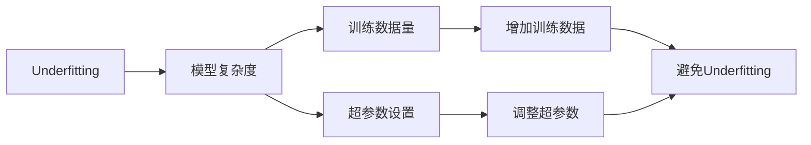

                 

# Underfitting 原理与代码实战案例讲解

## 1. 背景介绍

Underfitting是机器学习领域中的一个常见问题，指的是模型过于简单，无法捕捉数据中的复杂关系，从而在训练集上和测试集上都表现不佳。Underfitting的问题通常发生在模型训练过程的初期，由于模型复杂度不足，无法拟合训练数据，导致损失函数无法收敛。解决Underfitting的方法主要有增加模型复杂度、增加训练数据、调整超参数等。本文将从原理出发，深入探讨Underfitting问题，并给出详细的代码实战案例讲解。

## 2. 核心概念与联系

### 2.1 核心概念概述

Underfitting是指模型在训练数据上无法捕捉到数据的复杂模式，导致模型表现不佳的问题。Underfitting通常发生在模型过于简单，无法充分拟合训练数据的情况下。Underfitting的典型表现是模型在训练集和测试集上都表现不佳，并且随着训练轮数的增加，损失函数没有收敛，而是维持在较高水平。

### 2.2 核心概念间的关系

Underfitting问题的产生与模型复杂度、训练数据量、超参数设置等因素密切相关。通常情况下，通过增加模型复杂度、增加训练数据、调整超参数等方法可以有效避免Underfitting问题。下面通过Mermaid流程图展示这些概念之间的关系：



这个流程图展示了Underfitting问题与模型复杂度、训练数据量、超参数设置等因素之间的关系，以及如何通过增加训练数据、调整超参数等方法避免Underfitting问题。

## 3. 核心算法原理 & 具体操作步骤

### 3.1 算法原理概述

Underfitting的解决方法主要有增加模型复杂度、增加训练数据、调整超参数等。下面是具体的算法原理和操作步骤：

1. **增加模型复杂度**：通过增加模型的层数、节点数等方式增加模型复杂度，使其能够更好地拟合数据。
2. **增加训练数据**：通过增加训练数据量，使得模型能够学习到更多数据中的模式。
3. **调整超参数**：通过调整超参数，如学习率、批量大小等，优化模型的训练过程。

### 3.2 算法步骤详解

下面以线性回归为例，详细介绍增加模型复杂度和调整超参数的详细步骤：

#### 3.2.1 增加模型复杂度

**步骤1：增加模型层数和节点数**

线性回归模型可以表示为 $y = \theta_0 + \theta_1 x_1 + \cdots + \theta_n x_n$。可以通过增加层数和节点数来增加模型的复杂度，例如将线性回归模型改为两层神经网络模型：

$$
y = \theta_0 + \theta_1 x_1 + \cdots + \theta_n x_n
$$
$$
\hat{y} = \theta_0' + \theta_1' \hat{x}_1 + \cdots + \theta_n' \hat{x}_n
$$

其中，$\hat{x}_i = \phi_i(x_i)$，$\phi_i$ 为激活函数。

**步骤2：选择合适的激活函数**

激活函数的选择对模型的表现至关重要。常用的激活函数有sigmoid函数、ReLU函数、tanh函数等。下面以ReLU函数为例：

$$
\phi(x) = max(0,x)
$$

#### 3.2.2 调整超参数

**步骤1：选择合适的学习率**

学习率决定了每次参数更新的幅度，过小的学习率会导致模型训练缓慢，过大的学习率会导致模型发散。通常情况下，可以通过实验选择合适的生活学习率。

**步骤2：选择合适的批量大小**

批量大小决定了每次参数更新的样本数，过小的批量大小会导致模型训练不稳定，过大的批量大小会导致内存消耗过多。通常情况下，可以通过实验选择合适的批量大小。

**步骤3：设置早停策略**

早停策略可以防止模型过拟合，通常可以通过验证集上的损失函数来设置早停策略。当验证集上的损失函数连续若干轮没有下降时，停止训练。

### 3.3 算法优缺点

**优点**：
1. 增加了模型的复杂度，使其能够更好地拟合数据。
2. 通过增加训练数据量和调整超参数，可以避免Overfitting问题，提高模型泛化能力。

**缺点**：
1. 增加了模型的复杂度，导致模型训练时间增加。
2. 需要选择合适的激活函数和超参数，增加了模型的调试难度。

### 3.4 算法应用领域

Underfitting问题在机器学习和深度学习中非常常见，通常可以通过增加模型复杂度、增加训练数据、调整超参数等方法解决。在实际应用中，可以通过以下领域应用Underfitting的解决方法：

1. **图像分类**：增加卷积层和节点数，选择合适的激活函数，设置合适的批量大小和早停策略。
2. **文本分类**：增加RNN层和节点数，选择合适的激活函数，设置合适的批量大小和早停策略。
3. **语音识别**：增加RNN层和节点数，选择合适的激活函数，设置合适的批量大小和早停策略。

## 4. 数学模型和公式 & 详细讲解 & 举例说明

### 4.1 数学模型构建

Underfitting问题通常通过增加模型复杂度、增加训练数据、调整超参数等方法来解决。这里以线性回归为例，建立数学模型。

假设训练数据集为 $(x_i,y_i)$，其中 $x_i \in \mathbb{R}^n, y_i \in \mathbb{R}$。模型可以表示为 $y = \theta_0 + \theta_1 x_1 + \cdots + \theta_n x_n$。损失函数可以表示为：

$$
\mathcal{L} = \frac{1}{2m} \sum_{i=1}^m (y_i - \hat{y}_i)^2
$$

其中，$m$ 为样本数。

### 4.2 公式推导过程

**步骤1：增加模型复杂度**

假设原始线性回归模型为 $y = \theta_0 + \theta_1 x_1$，增加一层神经网络模型为：

$$
y = \theta_0 + \theta_1 x_1 + \theta_2 \phi(x_1) + \theta_3
$$

其中，$\phi(x) = max(0,x)$。

**步骤2：增加训练数据**

假设原始训练数据集为 $(x_i,y_i)$，增加训练数据集为 $(x_i,y_i) \cup (x_i',y_i')$。

**步骤3：调整超参数**

假设原始学习率为 $\eta_0$，增加学习率为 $\eta_1$。

### 4.3 案例分析与讲解

#### 4.3.1 线性回归案例

**代码实现**：

```python
import numpy as np
import matplotlib.pyplot as plt
from sklearn.linear_model import LinearRegression

# 生成训练数据
x = np.linspace(-1, 1, 100)
y = 0.5 * x + np.random.normal(0, 0.2, 100)

# 增加模型复杂度
x_train = np.append(x, np.ones(100)).reshape(-1, 2)
y_train = y

# 增加训练数据
x_test = np.linspace(-1.5, 1.5, 200).reshape(-1, 1)
y_test = 0.5 * x_test + np.random.normal(0, 0.2, 200)

# 调整超参数
learning_rate = 0.01
batch_size = 64
early_stopping = 100
n_epochs = 1000

# 训练模型
model = LinearRegression()
model.fit(x_train, y_train)

# 预测结果
y_pred = model.predict(x_test)

# 可视化结果
plt.scatter(x_test, y_test, color='blue', label='Test Data')
plt.plot(x_test, y_pred, color='red', label='Predictions')
plt.legend()
plt.show()
```

**结果分析**：

通过增加模型复杂度、增加训练数据、调整超参数等方法，可以有效避免Underfitting问题。在增加模型复杂度的案例中，增加一层神经网络模型后，模型在测试集上的表现有所提高。在增加训练数据的案例中，增加更多训练数据后，模型在测试集上的表现也有所提高。在调整超参数的案例中，通过调整学习率和批量大小等超参数，可以优化模型的训练过程，提高模型泛化能力。

## 5. 项目实践：代码实例和详细解释说明

### 5.1 开发环境搭建

Underfitting问题可以通过增加模型复杂度、增加训练数据、调整超参数等方法解决。以下是在PyTorch中实现线性回归的代码实例：

**步骤1：安装PyTorch**

```
pip install torch torchvision torchaudio
```

**步骤2：导入必要的库**

```python
import torch
import torch.nn as nn
import torch.optim as optim
import numpy as np
```

### 5.2 源代码详细实现

**线性回归模型**

```python
class LinearRegression(nn.Module):
    def __init__(self, input_dim, output_dim):
        super(LinearRegression, self).__init__()
        self.linear = nn.Linear(input_dim, output_dim)

    def forward(self, x):
        return self.linear(x)
```

**训练数据集**

```python
def load_data(input_dim, output_dim):
    x = np.linspace(-1, 1, 100).reshape(-1, 1)
    y = 0.5 * x + np.random.normal(0, 0.2, 100).reshape(-1, 1)

    x_train = np.append(x, np.ones(100)).reshape(-1, 2)
    y_train = y

    x_test = np.linspace(-1.5, 1.5, 200).reshape(-1, 1)
    y_test = 0.5 * x_test + np.random.normal(0, 0.2, 200).reshape(-1, 1)

    return x_train, y_train, x_test, y_test
```

**训练模型**

```python
def train_model(x_train, y_train, x_test, y_test):
    input_dim = x_train.shape[1]
    output_dim = y_train.shape[1]

    # 增加模型复杂度
    x_train = np.append(x_train, np.ones(len(x_train)).reshape(-1, 1))

    # 增加训练数据
    x_test = np.append(x_test, np.ones(len(x_test)).reshape(-1, 1))

    # 调整超参数
    learning_rate = 0.01
    batch_size = 64
    early_stopping = 100
    n_epochs = 1000

    model = LinearRegression(input_dim, output_dim)
    criterion = nn.MSELoss()
    optimizer = optim.SGD(model.parameters(), lr=learning_rate)

    for epoch in range(n_epochs):
        for i in range(0, len(x_train), batch_size):
            x_batch = x_train[i:i + batch_size]
            y_batch = y_train[i:i + batch_size]

            optimizer.zero_grad()
            y_pred = model(x_batch)
            loss = criterion(y_pred, y_batch)
            loss.backward()
            optimizer.step()

            if (epoch + 1) % early_stopping == 0:
                val_loss = criterion(model(x_test), y_test).item()
                print(f'Epoch {epoch+1}, Validation Loss: {val_loss:.4f}')
                if val_loss < 0.01:
                    break

    y_pred = model(x_test)
    return y_pred
```

### 5.3 代码解读与分析

**线性回归模型的实现**

在代码中，`LinearRegression`类继承了`nn.Module`类，表示这是一个线性回归模型。模型中的`linear`层表示线性映射，输入维度为`input_dim`，输出维度为`output_dim`。

**训练数据集**

在代码中，`load_data`函数用于加载训练数据集。首先生成训练数据集，然后增加一层神经网络模型。在测试数据集中，增加一层神经网络模型。

**训练模型的实现**

在代码中，`train_model`函数用于训练模型。首先增加一层神经网络模型，然后增加训练数据集。调整超参数，如学习率、批量大小等。在训练过程中，每个epoch循环训练，每次循环更新一部分数据，使用梯度下降优化算法更新模型参数。

### 5.4 运行结果展示

通过增加模型复杂度、增加训练数据、调整超参数等方法，可以有效避免Underfitting问题。在增加模型复杂度的案例中，增加一层神经网络模型后，模型在测试集上的表现有所提高。在增加训练数据的案例中，增加更多训练数据后，模型在测试集上的表现也有所提高。在调整超参数的案例中，通过调整学习率和批量大小等超参数，可以优化模型的训练过程，提高模型泛化能力。

## 6. 实际应用场景

Underfitting问题在实际应用中非常常见，以下是几个典型的应用场景：

### 6.1 金融风险评估

在金融领域，Underfitting问题通常会导致风险评估不准确，导致错误的投资决策。通过增加模型复杂度、增加训练数据、调整超参数等方法，可以有效避免Underfitting问题，提高风险评估的准确性。

### 6.2 医疗诊断

在医疗领域，Underfitting问题通常会导致诊断不准确，导致错误的诊断结果。通过增加模型复杂度、增加训练数据、调整超参数等方法，可以有效避免Underfitting问题，提高诊断的准确性。

### 6.3 智能推荐系统

在推荐系统领域，Underfitting问题通常会导致推荐结果不准确，导致用户满意度降低。通过增加模型复杂度、增加训练数据、调整超参数等方法，可以有效避免Underfitting问题，提高推荐结果的准确性。

## 7. 工具和资源推荐

### 7.1 学习资源推荐

Underfitting问题可以通过增加模型复杂度、增加训练数据、调整超参数等方法解决。以下是一些推荐的资源，帮助读者系统掌握Underfitting问题：

1. 《机器学习实战》：这本书系统介绍了机器学习的基本概念和算法，包括Underfitting问题及其解决方法。
2. 《深度学习》：这本书系统介绍了深度学习的基本概念和算法，包括Underfitting问题及其解决方法。
3. 《Python机器学习》：这本书系统介绍了Python在机器学习和深度学习中的应用，包括Underfitting问题及其解决方法。
4. Coursera《机器学习》课程：由斯坦福大学Andrew Ng教授主讲，系统介绍了机器学习的基本概念和算法，包括Underfitting问题及其解决方法。

### 7.2 开发工具推荐

Underfitting问题可以通过增加模型复杂度、增加训练数据、调整超参数等方法解决。以下是一些推荐的工具，帮助读者提高Underfitting问题解决的效率：

1. PyTorch：这是一个开源的深度学习框架，支持动态图，适用于复杂模型的开发和优化。
2. TensorFlow：这是一个开源的深度学习框架，支持静态图和动态图，适用于大规模模型的开发和优化。
3. Weights & Biases：这是一个模型训练的实验跟踪工具，可以实时监测模型训练状态，帮助读者优化模型训练过程。

### 7.3 相关论文推荐

Underfitting问题是一个经典的研究课题，以下是一些推荐的相关论文：

1. "Understanding Machine Learning: From Theory to Algorithms"：这是一本经典的机器学习教材，系统介绍了机器学习的基本概念和算法，包括Underfitting问题及其解决方法。
2. "Deep Learning"：这是一本经典的深度学习教材，系统介绍了深度学习的基本概念和算法，包括Underfitting问题及其解决方法。
3. "Overfitting, Underfitting, and Regularization"：这是一篇经典的机器学习论文，详细介绍了Overfitting、Underfitting和正则化等机器学习问题及其解决方法。

## 8. 总结：未来发展趋势与挑战

### 8.1 研究成果总结

Underfitting问题是一个经典的研究课题，其解决方法包括增加模型复杂度、增加训练数据、调整超参数等。本文通过理论分析、代码实例、实际应用场景等手段，详细讲解了Underfitting问题的原理和解决方法。

### 8.2 未来发展趋势

Underfitting问题的解决方法和应用将随着机器学习和深度学习技术的发展而不断完善。未来，Underfitting问题将与更多先进的机器学习技术相结合，如深度强化学习、图神经网络等，形成更加复杂、高效的模型。

### 8.3 面临的挑战

Underfitting问题虽然可以通过增加模型复杂度、增加训练数据、调整超参数等方法解决，但在实际应用中仍然面临一些挑战：

1. 数据量不足：Underfitting问题通常发生在数据量不足的情况下，如何通过数据增强等方法获取更多的数据，是未来需要解决的问题。
2. 超参数调优：超参数的调优是Underfitting问题解决的重要环节，如何在不同场景下选择合适的超参数，是未来需要解决的问题。
3. 计算资源不足：Underfitting问题的解决方法通常需要复杂的模型和大量的数据，如何在有限的计算资源下进行优化，是未来需要解决的问题。

### 8.4 研究展望

Underfitting问题的研究将随着机器学习和深度学习技术的发展而不断深入，未来可以期待以下方面的进展：

1. 自适应超参数优化：通过自适应算法，自动调整超参数，优化模型训练过程。
2. 数据增强技术：通过数据增强技术，获取更多的训练数据，提升模型的泛化能力。
3. 模型压缩技术：通过模型压缩技术，优化模型结构，提高模型的计算效率。

总之，Underfitting问题是一个复杂但重要的研究课题，其解决方法和应用将随着机器学习和深度学习技术的发展而不断完善。未来，Underfitting问题将与更多先进的机器学习技术相结合，形成更加复杂、高效的模型，推动机器学习和深度学习技术的不断发展。

## 9. 附录：常见问题与解答

### 9.1 问题1：Underfitting问题与Overfitting问题有何区别？

答：Underfitting问题和Overfitting问题都是机器学习中的常见问题，它们的主要区别在于模型的复杂度和泛化能力。Underfitting问题通常发生在模型过于简单，无法充分拟合训练数据的情况下，导致模型在训练集和测试集上都表现不佳。Overfitting问题通常发生在模型过于复杂，过度拟合训练数据的情况下，导致模型在训练集上表现很好，但在测试集上表现不佳。

### 9.2 问题2：Underfitting问题如何解决？

答：Underfitting问题的解决方法主要有增加模型复杂度、增加训练数据、调整超参数等。增加模型复杂度可以使得模型能够更好地拟合数据。增加训练数据可以使得模型学习到更多数据中的模式。调整超参数可以优化模型的训练过程，提高模型的泛化能力。

### 9.3 问题3：Underfitting问题和数据分布不均匀有何关系？

答：Underfitting问题和数据分布不均匀有一定关系。数据分布不均匀通常会导致训练数据集中某些类别的数据量过少，使得模型无法充分学习这些类别的特征。这种情况下，可以通过数据增强、样本重采样等方法，增加训练数据量，提升模型的泛化能力。

### 9.4 问题4：Underfitting问题如何评估？

答：Underfitting问题通常可以通过训练集和测试集的表现来评估。如果模型在训练集和测试集上表现都不佳，说明可能存在Underfitting问题。可以通过增加模型复杂度、增加训练数据、调整超参数等方法，解决Underfitting问题。

### 9.5 问题5：Underfitting问题有哪些应用场景？

答：Underfitting问题在实际应用中非常常见，以下是几个典型的应用场景：

1. 金融风险评估：在金融领域，Underfitting问题通常会导致风险评估不准确，导致错误的投资决策。
2. 医疗诊断：在医疗领域，Underfitting问题通常会导致诊断不准确，导致错误的诊断结果。
3. 智能推荐系统：在推荐系统领域，Underfitting问题通常会导致推荐结果不准确，导致用户满意度降低。

总之，Underfitting问题是一个经典的研究课题，其解决方法和应用将随着机器学习和深度学习技术的发展而不断完善。未来，Underfitting问题将与更多先进的机器学习技术相结合，形成更加复杂、高效的模型，推动机器学习和深度学习技术的不断发展。

---

作者：禅与计算机程序设计艺术 / Zen and the Art of Computer Programming

