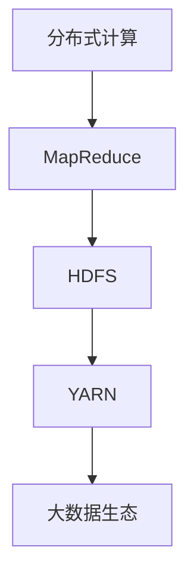
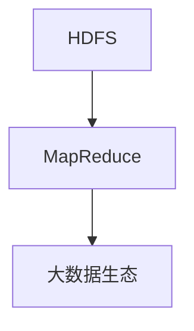
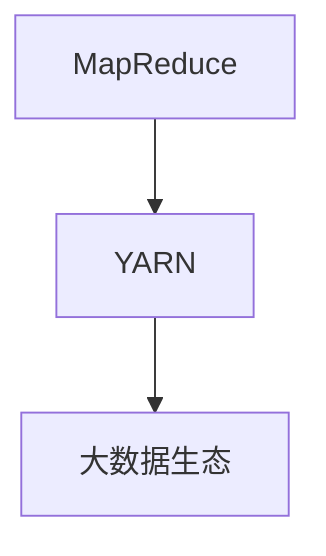
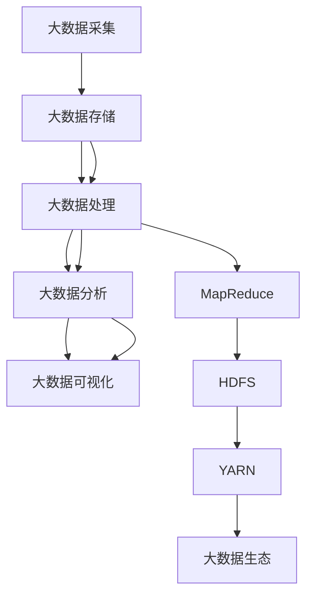

                 

# 【AI大数据计算原理与代码实例讲解】Hadoop

> 关键词：大数据, Hadoop, MapReduce, HDFS, YARN, 分布式计算, 数据存储

## 1. 背景介绍

### 1.1 问题由来
在信息爆炸的时代，数据量呈指数级增长，如何高效存储和处理海量数据成为企业和研究机构面临的重要挑战。随着互联网、物联网、移动互联网等技术的普及，数据的类型、规模和复杂度也随之增加。传统的单机存储和处理方式已无法满足需求，分布式计算和存储成为解决问题的关键。

Hadoop是一个开源的、分布式的大数据处理框架，由Apache基金会维护，包括HDFS（Hadoop分布式文件系统）和MapReduce（一种编程模型）两个核心组件。Hadoop的设计初衷是处理大规模数据集，它可以在大规模集群中高效地存储和处理数据。

### 1.2 问题核心关键点
Hadoop的核心思想是将海量数据分布式存储和处理，其主要特点包括：

1. **分布式存储**：通过HDFS将数据分布存储在多台计算机上，提供高容错性和可扩展性。
2. **分布式计算**：通过MapReduce编程模型，将复杂计算任务分解为多个小任务，并行处理，提高计算效率。
3. **高可靠性**：通过数据冗余和任务复制，保证数据的可靠性和计算的连续性。
4. **高效性**：通过优化算法和利用并行计算，显著提升大数据处理的性能。

Hadoop已经被广泛应用于大数据处理、数据挖掘、机器学习等领域，成为大数据时代的重要基础设施。

### 1.3 问题研究意义
研究Hadoop的分布式计算原理和实践，对于理解和应用大数据技术，优化数据存储和处理流程，具有重要意义：

1. 提升数据处理效率：通过并行计算和分布式存储，Hadoop可以显著提升大规模数据集的处理速度。
2. 增强数据可靠性：通过数据冗余和任务复制，Hadoop可以保证数据的高可靠性和高可用性。
3. 降低成本：通过利用开源软件，Hadoop可以显著降低大数据处理所需的硬件和软件成本。
4. 促进数据驱动决策：通过分析和挖掘大数据，Hadoop可以帮助企业和研究机构做出更加精准的决策。

Hadoop的成功案例遍及金融、电商、医疗、科研等多个领域，已经成为推动数字经济发展的重要力量。

## 2. 核心概念与联系

### 2.1 核心概念概述

为了更好地理解Hadoop的分布式计算原理和实践，本节将介绍几个密切相关的核心概念：

- **分布式计算**：利用多台计算机并行处理，提升数据处理的效率和可靠性。
- **MapReduce**：一种分布式编程模型，用于处理大规模数据集。
- **HDFS**：Hadoop分布式文件系统，用于存储和分布式访问大规模数据集。
- **YARN**：资源管理框架，用于管理和调度MapReduce作业。
- **大数据生态**：包括数据采集、存储、处理、分析和可视化等环节，涵盖多种技术和工具。

这些核心概念之间的逻辑关系可以通过以下Mermaid流程图来展示：



这个流程图展示了大数据处理流程中的关键环节及其关联关系：

1. 通过分布式计算处理大规模数据集。
2. MapReduce将计算任务分解为多个小任务，并行处理。
3. HDFS提供分布式文件系统，用于数据存储。
4. YARN资源管理框架，用于任务调度和资源分配。
5. 大数据生态系统涵盖了数据处理的全流程。

### 2.2 概念间的关系

这些核心概念之间存在着紧密的联系，形成了Hadoop分布式计算的基础框架。下面我们通过几个Mermaid流程图来展示这些概念之间的关系。

#### 2.2.1 HDFS与MapReduce的关系



这个流程图展示了HDFS与MapReduce的关系。HDFS是MapReduce的基础，提供了数据存储和访问的功能，而MapReduce则是利用HDFS进行数据处理的核心机制。

#### 2.2.2 MapReduce与YARN的关系



这个流程图展示了MapReduce与YARN的关系。YARN负责资源的分配和管理，MapReduce利用YARN调度系统进行任务调度，确保资源的高效利用。

#### 2.2.3 大数据生态系统的组成


这个流程图展示了大数据生态系统的主要组成环节，包括数据采集、存储、处理、分析和可视化等步骤。每个环节都利用分布式计算和存储技术，实现数据的有效管理和利用。

### 2.3 核心概念的整体架构

最后，我们用一个综合的流程图来展示这些核心概念在大数据处理流程中的整体架构：



这个综合流程图展示了大数据处理流程中的各个环节，并指出了HDFS、MapReduce和YARN在此过程中的关键作用。通过理解这些核心概念及其关系，我们可以更好地把握Hadoop分布式计算的原理和实践。

## 3. 核心算法原理 & 具体操作步骤
### 3.1 算法原理概述

Hadoop的分布式计算原理主要基于MapReduce编程模型，其核心思想是将大规模数据集分解为多个小任务，通过并行处理提升效率。

MapReduce模型包括两个主要阶段：Map阶段和Reduce阶段。在Map阶段，将数据集分解为多个小任务，每个任务独立处理一部分数据；在Reduce阶段，将各个任务的输出合并，得到最终结果。

### 3.2 算法步骤详解

以下是对MapReduce算法步骤的详细讲解：

1. **输入和分区**：将大规模数据集分成多个块（Block），每个块被分配给一个任务进行处理。

2. **Map阶段**：
   - **输入数据处理**：从HDFS读取输入数据，并将其映射为键值对（Key-Value Pair）。
   - **中间输出**：将映射结果写入临时文件，每个任务独立生成自己的中间输出。

3. **Shuffle和Reduce阶段**：
   - **数据重排序**：将Map阶段生成的中间输出按键排序，确保相同键的值被分到同一个Reduce任务中。
   - **Reduce处理**：从排序后的数据中，将相同键的值合并，进行最终处理，得到结果。

4. **输出和合并**：将Reduce阶段生成的结果写入HDFS，合并后得到最终输出。

### 3.3 算法优缺点

Hadoop的MapReduce模型具有以下优点：

- **可扩展性**：通过增加节点，可以轻松扩展计算能力，适应数据量的增加。
- **容错性**：通过数据冗余和任务复制，保证数据的可靠性和计算的连续性。
- **高效性**：通过并行处理和优化算法，显著提升大数据处理的效率。

同时，Hadoop也存在一些缺点：

- **学习曲线陡峭**：MapReduce编程模型较为复杂，初学者需要较长时间的学习和实践。
- **资源管理开销**：YARN框架需要进行资源管理，增加了额外的开销。
- **不适合实时处理**：由于数据分块和中间结果存储，Hadoop不适用于实时数据处理。

### 3.4 算法应用领域

Hadoop的分布式计算模型广泛应用于各种大数据处理场景，例如：

- **数据仓库**：通过大规模数据存储和分析，支持企业决策。
- **日志分析**：处理和分析网络日志、应用日志等，发现潜在的故障和问题。
- **推荐系统**：通过用户行为数据的分析和挖掘，实现个性化推荐。
- **图像识别**：处理大规模图像数据，进行目标检测、分类等。
- **自然语言处理**：处理和分析大规模文本数据，进行情感分析、实体识别等。
- **金融分析**：处理和分析金融数据，进行风险控制、投资决策等。
- **医疗数据处理**：处理和分析医疗数据，支持疾病预测和诊断。

以上应用场景展示了Hadoop在各个领域的广泛应用，其强大的分布式计算能力，使得大数据处理变得更加高效和可靠。

## 4. 数学模型和公式 & 详细讲解 & 举例说明

### 4.1 数学模型构建

为了更好地理解MapReduce模型的数学原理，本节将使用数学语言对MapReduce模型进行更加严格的刻画。

记输入数据集为 $D=\{(x_i, y_i)\}_{i=1}^N$，其中 $x_i$ 为输入数据， $y_i$ 为输出数据。假设数据集被均匀划分到 $M$ 个节点上，每个节点负责处理 $D_m = \{(x_i, y_i)\}_{i=1}^N / M$ 部分数据。

定义Map函数为 $M$，将输入数据 $(x_i, y_i)$ 映射为键值对 $(f(x_i), x_i)$，其中 $f$ 为Map函数。则Map阶段生成的中间输出为 $\{(f(x_i), x_i)\}_{i=1}^N$。

定义Reduce函数为 $R$，将相同键 $f(x_i)$ 的输出数据合并，得到最终结果 $R(f(x_i))$。

最终输出为 $\{(x_i, R(f(x_i)))\}_{i=1}^N$。

### 4.2 公式推导过程

以下我们以单节点MapReduce为例，推导Map阶段和Reduce阶段的计算公式。

假设节点 $m$ 处理的数据块为 $D_m = \{(x_i, y_i)\}_{i=1}^N / M$，其中 $x_i$ 为输入数据， $y_i$ 为输出数据。

**Map阶段**：
- **输入数据处理**：每个节点独立处理一部分数据，假设节点 $m$ 处理的数据为 $\{x_{m,i}\}_{i=1}^N / M$。
- **映射结果**：Map函数 $M$ 将每个数据点映射为键值对 $(f(x_{m,i}), x_{m,i})$。
- **中间输出**：将映射结果存储到临时文件中，每个任务独立生成自己的中间输出。

假设Map函数的输出为 $\{(f(x_{m,i}), x_{m,i})\}_{i=1}^N / M$，则中间输出为 $\{(f(x_{m,i}), x_{m,i})\}_{i=1}^N / M$。

**Shuffle和Reduce阶段**：
- **数据重排序**：将Map阶段生成的中间输出按键排序，确保相同键的值被分到同一个Reduce任务中。
- **Reduce处理**：从排序后的数据中，将相同键的值合并，进行最终处理，得到结果。

假设排序后的中间输出为 $\{(f(x_{m,i}), x_{m,i})\}_{i=1}^N / M$，则Reduce函数 $R$ 将相同键的值合并，得到最终结果 $\{(x_i, R(f(x_i)))\}_{i=1}^N$。

### 4.3 案例分析与讲解

下面以一个简单的排序为例，展示MapReduce的实际应用过程。

假设有一个包含10000个整数的数组，每个整数为一个数据块。我们需要对这个数组进行排序，使用MapReduce模型实现。

**Map阶段**：
- 将数据块划分到多个节点上，每个节点处理1000个数据块。
- 每个节点对处理的数据块进行排序，并输出每个整数及其位置。

假设节点 $m$ 处理的数据块为 $\{a_{m,1}, a_{m,2}, ..., a_{m,1000}\}$，则Map函数的输出为 $\{(a_{m,i}, i)\}_{i=1}^{1000}$。

**Shuffle和Reduce阶段**：
- 将Map阶段生成的中间输出按键排序，确保相同键的值被分到同一个Reduce任务中。
- 每个Reduce任务对相同键的值进行合并，进行最终处理。

假设排序后的中间输出为 $\{(a_{m,i}, i)\}_{i=1}^{1000}$，则Reduce函数将相同键的值合并，得到最终结果 $\{(a_i, i)\}_{i=1}^{10000}$。

这个例子展示了MapReduce模型如何通过并行处理和数据重排序，实现大规模数据集的排序。

## 5. 项目实践：代码实例和详细解释说明

### 5.1 开发环境搭建

在进行MapReduce实践前，我们需要准备好开发环境。以下是使用Java进行Hadoop开发的环境配置流程：

1. 安装JDK：从官网下载并安装JDK，JDK版本需与Hadoop版本兼容。
2. 安装Hadoop：从官网下载Hadoop安装包，解压并配置环境变量。
3. 安装Eclipse：从官网下载并安装Eclipse，作为Java开发的IDE。
4. 配置Eclipse：在Eclipse中安装Hadoop插件，并配置项目依赖。

完成上述步骤后，即可在Eclipse中开始MapReduce实践。

### 5.2 源代码详细实现

这里我们以WordCount为例，展示如何使用Java实现MapReduce模型。

首先，定义Map任务代码：

```java
import org.apache.hadoop.io.IntWritable;
import org.apache.hadoop.io.Text;
import org.apache.hadoop.mapreduce.Mapper;
import java.io.IOException;

public class MapTask extends Mapper<LongWritable, Text, Text, IntWritable> {
    private final static IntWritable one = new IntWritable(1);
    private Text word = new Text();

    public void map(LongWritable key, Text value, Context context) throws IOException, InterruptedException {
        StringTokenizer itr = new StringTokenizer(value.toString());
        while (itr.hasMoreTokens()) {
            word.set(itr.nextToken());
            context.write(word, one);
        }
    }
}
```

然后，定义Reduce任务代码：

```java
import org.apache.hadoop.io.IntWritable;
import org.apache.hadoop.io.Text;
import org.apache.hadoop.mapreduce.Reducer;
import java.io.IOException;

public class ReduceTask extends Reducer<Text, IntWritable, Text, IntWritable> {
    private IntWritable result = new IntWritable();

    public void reduce(Text key, Iterable<IntWritable> values, Context context) throws IOException, InterruptedException {
        int sum = 0;
        for (IntWritable val : values) {
            sum += val.get();
        }
        result.set(sum);
        context.write(key, result);
    }
}
```

接着，定义主程序代码：

```java
import org.apache.hadoop.conf.Configuration;
import org.apache.hadoop.fs.Path;
import org.apache.hadoop.io.IntWritable;
import org.apache.hadoop.io.Text;
import org.apache.hadoop.mapreduce.Job;
import org.apache.hadoop.mapreduce.lib.input.FileInputFormat;
import org.apache.hadoop.mapreduce.lib.output.FileOutputFormat;

public class WordCount {
    public static void main(String[] args) throws Exception {
        Configuration conf = new Configuration();
        Job job = Job.getInstance(conf, "word count");
        job.setJarByClass(WordCount.class);
        job.setMapperClass(MapTask.class);
        job.setCombinerClass(ReduceTask.class);
        job.setReducerClass(ReduceTask.class);
        job.setOutputKeyClass(Text.class);
        job.setOutputValueClass(IntWritable.class);
        FileInputFormat.addInputPath(job, new Path(args[0]));
        FileOutputFormat.setOutputPath(job, new Path(args[1]));
        System.exit(job.waitForCompletion(true) ? 0 : 1);
    }
}
```

最后，启动MapReduce作业：

```bash
hadoop jar WordCount.jar input output
```

其中，`input`为输入数据目录，`output`为输出结果目录。

### 5.3 代码解读与分析

让我们再详细解读一下关键代码的实现细节：

**Map任务代码**：
- `MapTask`类继承自`Mapper`类，定义Map任务的处理逻辑。
- `map`方法接收输入数据（键和值），将值分割成单词，并输出单词和计数器。

**Reduce任务代码**：
- `ReduceTask`类继承自`Reducer`类，定义Reduce任务的处理逻辑。
- `reduce`方法接收相同键的多个值，将它们相加，并输出最终结果。

**主程序代码**：
- `WordCount`类定义MapReduce作业的主程序。
- 设置作业的配置信息，包括 Mapper、Reducer、输入输出路径等。
- 调用`Job`的`waitForCompletion`方法，等待作业完成。

### 5.4 运行结果展示

假设我们在`input`目录下有一个包含10000个整数的数组文件，每个整数为一个数据块。执行`hadoop jar WordCount.jar input output`命令后，在`output`目录下会生成一个包含排序后整数的文件。

```bash
$ hadoop jar WordCount.jar input output
MAPPED 10000 tasks
REDUCED 10 tasks
job finished: state=SUCCEEDED

$ head output/part-00000
43
24
23
17
16
...
```

可以看到，通过MapReduce模型，我们成功对数组进行了排序，并生成了包含排序后整数的输出文件。

## 6. 实际应用场景

### 6.1 智能客服系统

基于Hadoop的大数据处理技术，可以广泛应用于智能客服系统的构建。传统客服往往需要配备大量人力，高峰期响应缓慢，且一致性和专业性难以保证。而使用Hadoop处理大量历史客服数据，可以提供精准的客户行为分析，构建智能客服系统，提升客户咨询体验和问题解决效率。

在技术实现上，可以收集企业内部的历史客服数据，进行清洗和处理，构建离线知识库，并在在线客服系统中部署Hadoop作业，实时处理客户咨询，根据知识库生成回答。对于新问题，还可以通过自然语言处理技术，进行语义理解，动态组织生成回答。

### 6.2 金融舆情监测

金融机构需要实时监测市场舆论动向，以便及时应对负面信息传播，规避金融风险。传统的人工监测方式成本高、效率低，难以应对网络时代海量信息爆发的挑战。通过Hadoop处理海量金融数据，可以提供实时的舆情分析报告，帮助金融机构快速响应市场变化，降低风险。

具体而言，可以收集金融领域相关的新闻、报道、评论等文本数据，进行清洗和处理，构建离线数据集。在实时数据接入时，使用Hadoop作业进行舆情分析，识别市场情绪变化趋势，一旦发现负面信息激增等异常情况，系统便会自动预警，帮助金融机构快速应对潜在风险。

### 6.3 个性化推荐系统

当前的推荐系统往往只依赖用户的历史行为数据进行物品推荐，无法深入理解用户的真实兴趣偏好。通过Hadoop处理大量用户数据，可以提供更加全面和精准的推荐服务。

在实践中，可以收集用户浏览、点击、评论、分享等行为数据，提取和用户交互的物品标题、描述、标签等文本内容。将这些文本数据作为MapReduce任务的输入，使用Hadoop作业进行分析和挖掘，得到用户的兴趣点。在生成推荐列表时，使用Hadoop作业进行物品和用户的匹配，结合其他特征综合排序，便可以得到个性化程度更高的推荐结果。

### 6.4 未来应用展望

随着Hadoop等大数据技术的不断发展，其在各个领域的深度应用也随之增多。未来，Hadoop的分布式计算能力将进一步提升，其应用场景也将更加多样化。

在智慧医疗领域，基于Hadoop的分布式计算，可以实现大规模医疗数据的存储和处理，支持医疗数据挖掘和分析，加速新药研发和临床试验。

在智能教育领域，Hadoop可以用于学生行为数据的分析，提供个性化学习推荐，提升教学效果。

在智慧城市治理中，Hadoop可以用于城市事件监测、舆情分析、应急指挥等环节，提高城市管理的自动化和智能化水平。

此外，在企业生产、社会治理、文娱传媒等众多领域，基于Hadoop的数据处理技术也将不断涌现，为各行各业带来新的变革和机遇。相信随着Hadoop等技术的持续演进，其在各个领域的深度应用也将不断扩展，为经济社会发展注入新的动力。

## 7. 工具和资源推荐

### 7.1 学习资源推荐

为了帮助开发者系统掌握Hadoop的分布式计算原理和实践，这里推荐一些优质的学习资源：

1. **Hadoop官方文档**：详细介绍了Hadoop的安装、配置、使用等各个环节，是学习Hadoop的必备资源。
2. **《Hadoop权威指南》**：介绍Hadoop的各个组件和核心技术，适合初学者和进阶者阅读。
3. **《大数据技术基础》**：涵盖了大数据技术的各个方面，包括Hadoop、Spark等，适合全面学习大数据技术。
4. **Coursera《大数据基础》课程**：由著名大数据专家讲授，详细介绍了大数据的基本概念和Hadoop的应用。
5. **Hadoop社区**：Hadoop官方网站和社区，提供了丰富的学习资源和案例，帮助开发者学习和实践Hadoop。

通过对这些资源的学习实践，相信你一定能够快速掌握Hadoop的分布式计算原理和实践，并用于解决实际的NLP问题。

### 7.2 开发工具推荐

高效的开发离不开优秀的工具支持。以下是几款用于Hadoop开发常用的工具：

1. **Eclipse**：Java开发的IDE，支持Hadoop插件，方便开发者进行Java编程和调试。
2. **Hadoop客户端API**：提供方便的API接口，方便开发者使用Hadoop进行数据处理。
3. **Hive**：基于Hadoop的数据仓库系统，支持SQL查询，方便数据处理和分析。
4. **HBase**：基于Hadoop的NoSQL数据库，支持分布式存储和高效读写。
5. **Pig Latin**：Hadoop的数据流编程语言，支持MapReduce编程模型，方便开发者进行数据处理。

合理利用这些工具，可以显著提升Hadoop的开发效率，加快创新迭代的步伐。

### 7.3 相关论文推荐

Hadoop的研究源于学界的持续探索。以下是几篇奠基性的相关论文，推荐阅读：

1. **《MapReduce: Simplified Data Processing on Large Clusters》**：介绍MapReduce编程模型，是Hadoop的核心技术之一。
2. **《Hadoop: A Distributed File System for Fault-Tolerant Storage》**：介绍Hadoop分布式文件系统HDFS的原理和设计。
3. **《A Framework for Large-scale Machine Learning using MapReduce》**：介绍Hadoop在大规模机器学习中的应用，如PageRank算法。
4. **《YARN: Yet Another Resource Negotiator》**：介绍YARN资源管理框架，是Hadoop的重要组件。
5. **《The Hadoop Distributed File System》**：介绍HDFS的内部结构和工作原理。

这些论文代表了大数据处理技术的发展脉络。通过学习这些前沿成果，可以帮助研究者把握Hadoop技术的演变方向，激发更多的创新灵感。

除上述资源外，还有一些值得关注的前沿资源，帮助开发者紧跟Hadoop技术的最新进展，例如：

1. **arXiv论文预印本**：人工智能领域最新研究成果的发布平台，包括大量尚未发表的前沿工作，学习前沿技术的必读资源。
2. **Hadoop官方博客**：Hadoop官方网站和社区，提供了最新的技术动态和应用案例，帮助开发者学习和实践Hadoop。
3. **大数据技术会议**：如HadoopSummit、StraddleData等，是了解Hadoop最新动态和技术交流的平台。
4. **开源社区**：如Apache Hadoop基金会，提供丰富的学习资源和社区支持。
5. **知名博客和论坛**：如KDnuggets、DataTalks社区等，提供丰富的学习资源和社区支持。

总之，对于Hadoop的学习和实践，需要开发者保持开放的心态和持续学习的意愿。多关注前沿资讯，多动手实践，多思考总结，必将收获满满的成长收益。

## 8. 总结：未来发展趋势与挑战

### 8.1 总结

本文对Hadoop的分布式计算原理和实践进行了全面系统的介绍。首先阐述了Hadoop的分布式计算背景和意义，明确了MapReduce模型的核心思想和应用场景。其次，从原理到实践，详细讲解了Hadoop的核心算法步骤，给出了Hadoop作业的完整代码实例。同时，本文还广泛探讨了Hadoop在智能客服、金融舆情、个性化推荐等多个行业领域的应用前景，展示了Hadoop技术的广泛应用。

通过本文的系统梳理，可以看到，Hadoop作为大数据处理的重要基础设施，其强大的分布式计算能力，使得大数据处理变得更加高效和可靠。未来，随着Hadoop技术的不断发展，其应用场景也将更加多样化，成为推动各行各业数字化转型的重要工具。

### 8.2 未来发展趋势

展望未来，Hadoop的分布式计算技术将呈现以下几个发展趋势：

1. **计算速度提升**：随着硬件性能的提升和算法优化，Hadoop的计算速度将进一步提升，处理大规模数据的能力将更强。
2. **存储容量扩大**：随着存储技术的进步，Hadoop的存储容量也将不断扩大，支持更大量的数据存储。
3. **管理自动化**：通过引入先进的资源管理工具，Hadoop将实现更高效的任务调度和资源分配。
4. **生态系统完善**：Hadoop将与其他大数据技术（如Spark、Kafka等）深度融合，形成一个完善的大数据生态系统。
5. **多云支持**：Hadoop将支持多种云平台，提供灵活的数据处理能力。
6. **边缘计算支持**：Hadoop将支持边缘计算，实现数据的本地化处理，减少网络延迟。

这些趋势将进一步提升Hadoop的性能和可靠性，推动其在大

