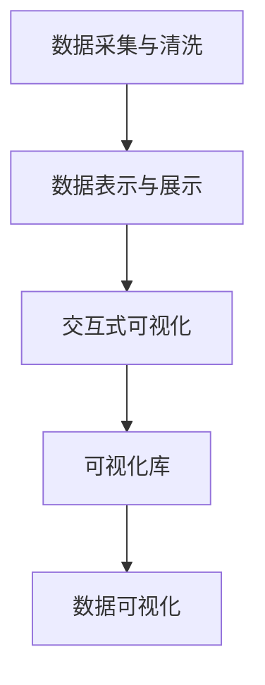

                 

# 【AI大数据计算原理与代码实例讲解】数据可视化

> 关键词：数据可视化, 数据处理, 图表生成, 可视化工具, 数据探索

## 1. 背景介绍

### 1.1 问题由来

随着大数据时代的到来，数据已经成为了各行各业决策的重要依据。然而，数据本身往往是复杂、抽象的，难以为非专业人士所理解。为了使决策更加科学、高效，数据可视化技术应运而生。数据可视化不仅仅是一种展示手段，更是一种利用数据推动决策的重要工具。

数据可视化通过将数据以图形、图像等直观形式展示出来，帮助人们更好地理解数据的内在规律、趋势和关系。在商业决策、科学研究、社会治理等领域，数据可视化已成为不可或缺的技术手段。

### 1.2 问题核心关键点

数据可视化的核心关键点主要包括以下几个方面：

- **数据采集与清洗**：数据的真实性、完整性和一致性是数据可视化的基础，需要对原始数据进行预处理和清洗。
- **数据表示与展示**：选择合适的数据表示方式和展示形式，使数据更加直观、易于理解。
- **交互与探索**：提供交互式功能，使用户可以更加灵活地探索数据，发现数据中的隐藏规律。
- **美观与可读性**：视觉效果要美观，图表布局要合理，颜色选择要科学，使数据展示更加易于阅读和理解。

### 1.3 问题研究意义

数据可视化在决策支持、风险预警、业务分析等方面具有重要意义，研究数据可视化技术，对于提高数据处理和利用效率，推动决策科学化、智能化，具有重要意义：

1. **提高决策效率**：数据可视化通过直观展示数据，使决策者能够快速理解数据，减少误解和错误。
2. **发现数据规律**：通过可视化手段，发现数据中的潜在规律和关联，帮助决策者做出更加科学的决策。
3. **增强数据可理解性**：将复杂的数据以可视化的形式展示出来，使数据更加易于理解，便于数据共享和交流。
4. **促进数据分析和探索**：通过交互式探索，用户能够更加深入地分析数据，发现数据中的隐藏价值。
5. **推动数据驱动决策**：数据可视化技术使数据驱动决策成为可能，推动企业决策更加科学、高效。

## 2. 核心概念与联系

### 2.1 核心概念概述

数据可视化涉及的核心概念主要包括：

- **数据可视化**：通过图形、图像等方式，将数据直观展示出来。
- **数据处理**：包括数据采集、清洗、转换等步骤，为可视化做准备。
- **交互式可视化**：提供交互功能，使用户能够动态地调整数据展示方式。
- **可视化库**：如D3.js、Highcharts等，是数据可视化的工具和技术基础。

### 2.2 概念间的关系

这些核心概念之间的逻辑关系可以通过以下Mermaid流程图来展示：



这个流程图展示了从数据采集与清洗到最终数据可视化的完整过程：

1. 首先对原始数据进行采集和清洗，去除噪声和异常值。
2. 通过数据表示与展示，选择合适的图表类型，如柱状图、折线图、散点图等。
3. 交互式可视化允许用户动态调整图表，更加灵活地探索数据。
4. 可视化库是数据可视化的工具，提供了丰富的图表类型和交互功能。

通过这些核心概念，我们可以构建一个完整的数据可视化系统，实现数据的直观展示和深入分析。

## 3. 核心算法原理 & 具体操作步骤
### 3.1 算法原理概述

数据可视化算法通常基于统计学和图形学原理，通过选择合适的统计方法和图形类型，将数据直观展示出来。其主要步骤包括：

1. **数据清洗与预处理**：去除噪声、填补空缺、归一化等。
2. **数据选择与表示**：选择合适的数据集和图表类型。
3. **数据展示与交互**：动态展示数据，提供交互式功能。
4. **可视化效果优化**：调整颜色、布局、字体大小等，使数据展示更加美观和可读。

### 3.2 算法步骤详解

以下是数据可视化的详细操作步骤：

**Step 1: 数据清洗与预处理**

1. **数据采集**：通过API、爬虫等方式获取数据。
2. **数据清洗**：去除噪声、填补空缺、归一化等。
3. **数据转换**：将数据转换为适合可视化的形式，如数值型数据转换为时间序列、分类数据转换为频率分布等。

**Step 2: 数据选择与表示**

1. **选择合适的图表类型**：根据数据类型和分析目的，选择柱状图、折线图、散点图、热力图等图表类型。
2. **数据表示**：根据图表类型，将数据转换为图表元素，如x轴、y轴、数据点等。

**Step 3: 数据展示与交互**

1. **数据展示**：将数据元素按照设定的布局和风格展示出来。
2. **交互式功能**：添加交互式元素，如鼠标悬停、数据筛选、动态更新等，使用户能够更加灵活地探索数据。

**Step 4: 可视化效果优化**

1. **调整颜色**：根据图表类型和数据特征，选择合适的颜色方案，使数据展示更加美观。
2. **布局优化**：调整图表布局，使数据展示更加紧凑、合理。
3. **字体和标签优化**：调整字体大小和标签位置，使数据展示更加易于阅读。

### 3.3 算法优缺点

数据可视化算法具有以下优点：

1. **直观性**：通过图形、图像等形式展示数据，使数据更加直观、易于理解。
2. **高效性**：通过可视化工具，可以快速生成各种图表，提高数据展示效率。
3. **灵活性**：通过交互式功能，用户可以动态调整图表，更加灵活地探索数据。

同时，数据可视化算法也存在以下缺点：

1. **信息损失**：可视化过程中可能会丢失部分原始数据信息，需要结合原始数据进行分析。
2. **过度简化**：可视化过程中可能会对数据进行过度简化，导致误解和错误。
3. **技术门槛高**：可视化工具和技术较为复杂，需要一定的技术和经验积累。

### 3.4 算法应用领域

数据可视化在以下领域中有着广泛应用：

- **商业决策**：在销售分析、市场研究、财务报表等方面，数据可视化能够帮助决策者快速理解数据，做出科学决策。
- **科学研究**：在气象、环境、生物等领域，数据可视化能够帮助研究人员发现数据中的隐藏规律，推动科学进步。
- **社会治理**：在城市管理、公共安全、公共卫生等方面，数据可视化能够帮助政府部门更好地理解数据，制定政策。
- **医疗健康**：在患者诊断、疾病研究、公共卫生监测等方面，数据可视化能够帮助医疗工作者更好地理解数据，提高诊疗效果。
- **教育培训**：在学生评估、课程设计、教师培训等方面，数据可视化能够帮助教育工作者更好地理解数据，提高教学效果。

## 4. 数学模型和公式 & 详细讲解  
### 4.1 数学模型构建

数据可视化通常使用统计学和图形学原理进行建模。以下是几个常用的数学模型：

1. **线性回归模型**：用于描述变量之间的线性关系。
2. **散点图模型**：用于描述变量之间的关系，判断其是否具有相关性。
3. **时间序列模型**：用于描述时间序列数据的趋势和周期性。

### 4.2 公式推导过程

以线性回归模型为例，其公式推导过程如下：

假设有一组数据 $(x_1, y_1), (x_2, y_2), \ldots, (x_n, y_n)$，其中 $x_i$ 为自变量，$y_i$ 为因变量。线性回归模型的目标是找到一个最优的线性函数 $y = \beta_0 + \beta_1 x$，使得预测值与实际值的误差最小。其最小二乘法公式为：

$$
\hat{\beta} = (X^T X)^{-1} X^T y
$$

其中 $\hat{\beta}$ 为模型参数，$X$ 为数据矩阵，$y$ 为因变量向量。

### 4.3 案例分析与讲解

以股票价格预测为例，我们可以使用线性回归模型来预测未来的股票价格。数据采集后，对数据进行清洗和预处理，使用线性回归模型建立预测模型，通过散点图展示预测结果与实际价格的差异，使用交互式可视化工具允许用户调整参数，优化预测效果。

## 5. 项目实践：代码实例和详细解释说明
### 5.1 开发环境搭建

要进行数据可视化项目开发，需要搭建以下开发环境：

1. **安装Python和必要的库**：如numpy、pandas、matplotlib、seaborn等。
2. **安装可视化库**：如D3.js、Highcharts、ECharts等。
3. **安装IDE和Jupyter Notebook**：如PyCharm、VS Code、Jupyter Notebook等。

### 5.2 源代码详细实现

以下是一个使用Python和Matplotlib进行数据可视化的代码示例：

```python
import matplotlib.pyplot as plt
import numpy as np

# 生成随机数据
x = np.random.rand(100)
y = x**2 + np.random.randn(100) * 0.5

# 创建散点图
plt.scatter(x, y)

# 添加标题和标签
plt.title('Scatter Plot Example')
plt.xlabel('X')
plt.ylabel('Y')

# 显示图表
plt.show()
```

### 5.3 代码解读与分析

这个示例代码展示了如何使用Matplotlib库创建散点图。首先，生成随机数据x和y，然后使用plt.scatter函数创建散点图，最后通过plt.title、plt.xlabel、plt.ylabel函数添加标题和标签。

### 5.4 运行结果展示

运行上述代码，可以得到一个简单的散点图，展示了x和y之间的关系。

## 6. 实际应用场景
### 6.1 智能推荐系统

在智能推荐系统中，数据可视化技术可以帮助推荐算法更好地理解用户行为，提高推荐效果。通过可视化的方式展示用户行为数据，推荐算法可以更加灵活地进行数据分析和优化，提升推荐效果。

### 6.2 客户画像分析

在客户画像分析中，数据可视化技术可以帮助企业更好地理解客户特征，制定针对性的营销策略。通过可视化的方式展示客户画像数据，企业可以更加直观地发现客户特征和行为规律，制定更加精准的营销策略。

### 6.3 供应链管理

在供应链管理中，数据可视化技术可以帮助企业更好地理解供应链状态，提高供应链管理效率。通过可视化的方式展示供应链数据，企业可以更加直观地发现供应链瓶颈和风险，及时采取措施，提高供应链管理效率。

### 6.4 未来应用展望

未来，数据可视化技术将在以下几个领域中发挥重要作用：

- **人工智能**：在AI训练、调优等方面，数据可视化技术可以帮助数据科学家更好地理解数据，优化模型训练效果。
- **医疗健康**：在患者诊断、疾病研究、公共卫生监测等方面，数据可视化技术可以帮助医疗工作者更好地理解数据，提高诊疗效果。
- **教育培训**：在学生评估、课程设计、教师培训等方面，数据可视化技术可以帮助教育工作者更好地理解数据，提高教学效果。

## 7. 工具和资源推荐
### 7.1 学习资源推荐

为了帮助开发者系统掌握数据可视化的理论基础和实践技巧，这里推荐一些优质的学习资源：

1. **《数据可视化实战》**：这本书详细介绍了数据可视化的原理和实践，提供了丰富的案例和代码。
2. **《D3.js实战教程》**：这本书介绍了如何使用D3.js进行数据可视化，提供了大量的实例代码。
3. **《Python数据可视化》**：这本书介绍了使用Python进行数据可视化的常用库和方法，提供了丰富的实例和代码。
4. **《数据可视化之美》**：这是一本关于数据可视化的经典著作，介绍了数据可视化的历史和未来发展方向。
5. **在线课程**：如Coursera、Udemy、edX等平台上的数据可视化课程，可以系统学习数据可视化理论和实践。

### 7.2 开发工具推荐

以下是几款用于数据可视化开发的常用工具：

1. **Python的Matplotlib库**：提供了丰富的图表类型和绘制函数，适合初学者和快速原型开发。
2. **JavaScript的D3.js库**：功能强大，支持交互式可视化，适合高级开发者。
3. **R语言的ggplot2库**：适合数据分析和可视化，提供丰富的统计图表。
4. **Tableau**：商业级数据可视化工具，提供简单易用的可视化界面和丰富的图表类型。
5. **Power BI**：微软推出的商业级BI工具，支持丰富的数据连接和可视化功能。

### 7.3 相关论文推荐

以下是几篇经典的数据可视化论文，推荐阅读：

1. **《数据可视化的原则与实践》**：介绍了数据可视化的基本原则和常用技术。
2. **《交互式数据可视化：挑战与机遇》**：探讨了交互式数据可视化的重要性和实现方法。
3. **《多维度数据可视化技术综述》**：综述了多维度数据可视化的常用方法和技术。
4. **《基于大数据的数据可视化研究》**：研究了大数据环境下数据可视化的实现方法和技术。
5. **《智能数据可视化系统研究》**：介绍了智能数据可视化系统的设计思路和实现方法。

这些论文代表了数据可视化技术的最新进展，通过学习这些前沿成果，可以帮助研究者把握学科前进方向，激发更多的创新灵感。

## 8. 总结：未来发展趋势与挑战
### 8.1 总结

本文对数据可视化技术进行了全面系统的介绍。首先阐述了数据可视化的研究背景和意义，明确了数据可视化在决策支持、风险预警、业务分析等方面的重要作用。其次，从原理到实践，详细讲解了数据可视化的数学模型和操作步骤，给出了数据可视化项目开发的完整代码实例。同时，本文还广泛探讨了数据可视化技术在智能推荐、客户画像、供应链管理等实际场景中的应用前景，展示了数据可视化技术的广阔应用空间。

通过本文的系统梳理，可以看到，数据可视化技术已经成为各领域决策支持的重要手段，其应用前景广阔。数据可视化不仅仅是一种展示手段，更是一种利用数据推动决策的重要工具。

### 8.2 未来发展趋势

展望未来，数据可视化技术将呈现以下几个发展趋势：

1. **交互式可视化增强**：通过交互式功能，用户可以更加灵活地探索数据，发现数据中的隐藏规律。
2. **多维度数据可视化**：将数据进行多维度展示，使用户能够更加全面地理解数据。
3. **实时可视化**：实现数据的实时可视化，使用户能够及时发现数据中的变化和趋势。
4. **自动化可视化**：使用自动化技术，生成和更新数据可视化图表，提高可视化效率。
5. **基于AI的可视化**：结合AI技术，使用机器学习算法对数据进行分析和预测，提高数据可视化的准确性和效率。

### 8.3 面临的挑战

尽管数据可视化技术已经取得了一定的进展，但在迈向更加智能化、普适化应用的过程中，它仍面临诸多挑战：

1. **数据质量问题**：数据的真实性、完整性和一致性是数据可视化的基础，数据质量不高会导致误导性的可视化结果。
2. **技术门槛高**：数据可视化技术较为复杂，需要一定的技术和经验积累。
3. **交互式功能复杂**：交互式功能的实现较为复杂，需要考虑用户的交互体验。
4. **数据量大**：在大数据环境下，数据可视化需要处理海量数据，需要高效的算法和工具。
5. **可视化效果优化**：如何调整颜色、布局、字体大小等，使数据展示更加美观和可读，是一个重要的优化方向。

### 8.4 研究展望

面对数据可视化面临的这些挑战，未来的研究需要在以下几个方面寻求新的突破：

1. **自动化数据处理**：开发自动化数据处理工具，提高数据处理效率。
2. **可视化技术优化**：优化数据可视化的算法和工具，提高可视化效果。
3. **交互式界面设计**：设计友好的交互式界面，提高用户的使用体验。
4. **可视化工具集成**：开发可视化工具集成框架，提高可视化工具的易用性。
5. **多模态数据可视化**：结合多种数据类型，实现多模态数据的可视化展示。

这些研究方向将进一步推动数据可视化技术的发展，使其在更多领域得到应用，成为各行业决策支持的重要工具。

## 9. 附录：常见问题与解答
### Q1：什么是数据可视化？

A: 数据可视化是将数据以图形、图像等直观形式展示出来的过程。通过可视化技术，数据变得更加直观、易于理解，帮助用户发现数据中的规律和关系。

### Q2：数据可视化的主要步骤包括哪些？

A: 数据可视化的主要步骤包括数据采集与清洗、数据选择与表示、数据展示与交互、可视化效果优化等。

### Q3：如何选择适合的数据可视化图表类型？

A: 选择适合的数据可视化图表类型，需要根据数据类型和分析目的来决定。常见的图表类型包括柱状图、折线图、散点图、热力图等。

### Q4：如何提高数据可视化效果？

A: 提高数据可视化效果的方法包括调整颜色、布局、字体大小等，使数据展示更加美观和可读。同时，可以使用交互式功能，提高用户的使用体验。

### Q5：数据可视化技术有哪些应用领域？

A: 数据可视化技术在商业决策、科学研究、社会治理、医疗健康、教育培训等领域中有着广泛应用。

---

作者：禅与计算机程序设计艺术 / Zen and the Art of Computer Programming

