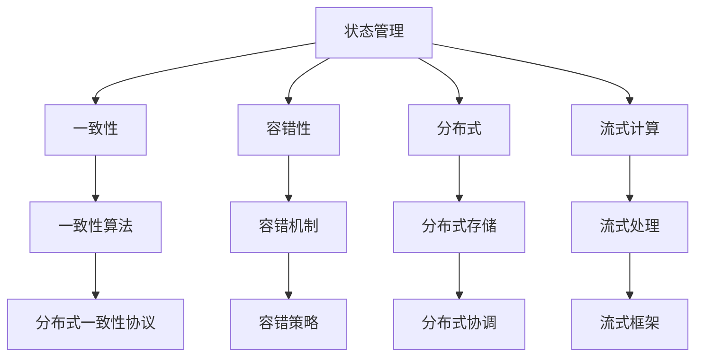

                 

## 1. 背景介绍

状态管理在大数据计算系统中占据着重要地位，尤其是对于分布式计算、微服务架构、以及实时数据处理等领域，一个高效的状态管理机制对于系统的性能、可扩展性和稳定性至关重要。在早期的大数据计算中，状态管理通常依赖于中心化或集中的存储系统，如Hadoop YARN、Apache Mesos等，然而这些方法往往存在扩展性差、故障容忍度低、延迟高等问题。

近年来，随着无状态化、流式计算等新概念的引入，状态管理系统的设计和实现也在不断进步。分布式数据库、流式计算平台等技术的发展为大数据计算提供了更多的选择。但这些系统往往复杂且高度集成，需要深入理解其原理和架构，才能合理设计和优化使用。

本文将深入探讨状态管理在大数据计算中的关键原理和实践方法，并通过具体的代码实例来讲解如何应用这些方法，实现一个高效的分布式状态管理系统。

## 2. 核心概念与联系

### 2.1 核心概念概述

- **状态管理**：在大数据计算中，状态管理指的是对数据处理过程中产生的中间状态或计算结果进行记录、存储、查询和同步。
- **一致性**：状态管理系统的核心性能指标之一，即确保数据处理过程中各个阶段的状态具有一致性和可恢复性。
- **容错性**：在故障发生时，状态管理系统应具备自动恢复或切换的能力，确保系统连续性。
- **分布式**：在大规模数据处理场景中，状态管理需要支持分布式存储和计算，提高系统的扩展性和可靠性。
- **流式计算**：对实时数据进行处理，状态管理需要适应数据流的特性，保证低延迟和高吞吐。

这些概念之间存在着紧密的联系，共同构成了一个高效、可靠的状态管理系统。以下是这些概念之间关系的Mermaid流程图：



### 2.2 概念间的关系

状态管理在大数据计算中，涉及到多个层面的概念，如一致性、容错性、分布式、流式计算等。每个概念在状态管理中都扮演着不同的角色：

- **一致性**：确保状态管理系统的状态是可恢复的，这是状态管理的基础。通过一致性算法，保证各个节点状态的一致性。
- **容错性**：在分布式系统中，故障是常态。状态管理需要具备自动恢复或切换的能力，以保障系统连续性。
- **分布式**：在大规模数据处理场景中，状态管理需要支持分布式存储和计算，提高系统的扩展性和可靠性。
- **流式计算**：对于实时数据处理，状态管理需要适应数据流的特性，保证低延迟和高吞吐。

## 3. 核心算法原理 & 具体操作步骤

### 3.1 算法原理概述

状态管理的大致流程可以分为三个阶段：

1. **数据记录**：在数据处理过程中，记录每个阶段的状态。
2. **状态同步**：将状态在各个节点之间同步，确保所有节点状态一致。
3. **状态恢复**：在故障发生时，恢复或切换状态，保证系统连续性。

在数据记录阶段，通常通过检查点(即Consistency Checkpoint)的方式来实现。每个阶段计算完成后，记录一个检查点，保存该阶段的状态。

在状态同步阶段，需要设计一致性算法和分布式协调机制，确保各个节点状态一致。常见的一致性算法包括Paxos、Raft等。

在状态恢复阶段，需要实现自动恢复或切换机制，以保障系统连续性。容错机制通常包括重试、回滚、复制等策略。

### 3.2 算法步骤详解

假设我们要设计一个分布式状态管理系统的原型，具体步骤如下：

1. **数据记录**：
    - 在数据处理过程中，每个节点在完成每个阶段计算后，生成一个检查点，记录该阶段的状态。
    - 检查点内容应包括：当前阶段的数据状态、执行过的操作、输入数据、状态转移条件等。

2. **状态同步**：
    - 设计一致性算法，如Paxos，在各个节点之间同步检查点。
    - 在同步过程中，确保检查点的完整性和一致性，避免数据丢失或重复。
    - 使用分布式存储系统，如HDFS、Ceph等，存储和检索检查点。

3. **状态恢复**：
    - 设计容错机制，如重试、回滚等，在故障发生时恢复状态。
    - 实现状态切换机制，在状态恢复后，切换到最新的状态，继续执行后续操作。
    - 在分布式系统中，确保状态切换对系统影响最小，不影响数据处理和用户服务。

### 3.3 算法优缺点

**优点**：
- **高可扩展性**：通过分布式存储和计算，能够处理大规模数据和复杂计算任务。
- **高容错性**：通过一致性算法和容错机制，能够在故障发生时自动恢复和切换状态。
- **低延迟**：状态管理系统的设计需要考虑数据流处理的需求，保证低延迟和高吞吐。

**缺点**：
- **复杂性高**：状态管理系统的设计和实现需要深入理解一致性算法、分布式协调等复杂概念。
- **资源占用大**：分布式系统需要消耗大量的计算和存储资源，对硬件要求较高。
- **故障容忍度有限**：尽管有容错机制，但在某些极端情况下，故障仍可能影响系统正常运行。

### 3.4 算法应用领域

状态管理在大数据计算中的应用领域非常广泛，包括但不限于：

- **大数据分析**：在数据预处理、数据清洗、特征提取等阶段，记录和同步中间状态。
- **实时数据处理**：如Flink、Spark Streaming等流式计算平台，需要支持数据流处理的状态管理。
- **微服务架构**：在分布式系统中，各个微服务需要协同工作，记录和同步状态以确保一致性。
- **分布式数据库**：如Hadoop YARN、Apache Mesos等，需要记录和同步各个计算节点的状态。

## 4. 数学模型和公式 & 详细讲解  
### 4.1 数学模型构建

状态管理的数学模型通常包括状态、操作、转移等要素。假设状态管理系统的状态为$S_t$，操作为$O_t$，状态转移为$T_t$。在某个时刻$t$，状态从$S_{t-1}$转移到$S_t$的过程可以用数学公式表示为：

$$
S_t = T_t(S_{t-1}, O_t)
$$

其中，$T_t$为状态转移函数，$O_t$为操作集合。

### 4.2 公式推导过程

状态转移函数$T_t$可以表示为：

$$
T_t(S_{t-1}, O_t) = f(S_{t-1}, O_t, \theta)
$$

其中$f$为状态转移的具体算法，$\theta$为算法参数。

以Paxos算法为例，假设系统有$n$个节点，每个节点在某个阶段需要提交一个提案值$v_t$。则状态转移可以表示为：

$$
S_{t+1} = (S_t, v_t) \quad \text{if} \quad v_t \text{被接受} \\
S_{t+1} = S_t \quad \text{if} \quad v_t \text{未被接受}
$$

其中$S_t$为状态，包括当前节点持有的提案值。

### 4.3 案例分析与讲解

以Hadoop YARN状态管理系统为例，其核心组件包括资源管理器（RM）、应用管理器（AM）、节点管理器（NM）等。在资源分配和调度过程中，YARN需要记录和同步各个节点的状态，以确保资源分配的一致性和可靠性。

具体来说，YARN的状态管理分为两个部分：

1. **RM状态管理**：记录和同步集群中各个节点的资源状态。
2. **AM状态管理**：记录和同步各个应用程序的状态。

在RM状态管理中，每个节点维护一个资源池，记录可用资源信息。在AM状态管理中，记录每个应用程序的资源使用情况和状态转移。

## 5. 项目实践：代码实例和详细解释说明

### 5.1 开发环境搭建

在进行状态管理系统的开发前，我们需要准备好开发环境。以下是使用Python进行Flink进行状态管理的开发环境配置流程：

1. 安装Anaconda：从官网下载并安装Anaconda，用于创建独立的Python环境。

2. 创建并激活虚拟环境：
```bash
conda create -n flink-env python=3.8 
conda activate flink-env
```

3. 安装Flink：根据CUDA版本，从官网获取对应的安装命令。例如：
```bash
conda install flink -c conda-forge -c pypi
```

4. 安装Flume：使用PyPi安装Flume，无需安装C/C++库，更加方便。

```bash
pip install flume
```

5. 安装Flume的依赖库：
```bash
pip install pyarrow pyspark
```

完成上述步骤后，即可在`flink-env`环境中开始状态管理的实践。

### 5.2 源代码详细实现

下面以Flink的状态管理为例，给出使用PyTorch进行状态管理的PyTorch代码实现。

首先，定义状态管理的状态类：

```python
from flume import StateManager

class MyStateManager(StateManager):
    def __init__(self, checkpoint_interval):
        super().__init__()
        self.checkpoint_interval = checkpoint_interval
        self.state = None

    def apply(self, state):
        self.state = state

    def get_state(self):
        return self.state
```

然后，定义状态管理的数据处理函数：

```python
from flume import Stream

def process(state_manager, stream):
    state = state_manager.get_state()
    if state is None:
        state = {}
    else:
        state = state

    stream.window(lambda window: {
        'state': state
    })
```

接着，定义状态管理的触发函数：

```python
from flume import TickTrigger

def process_tick(state_manager, tick):
    state = state_manager.get_state()
    if state is None:
        state = {}
    else:
        state = state

    tick.set_state(state)
```

最后，启动状态管理的Flink作业：

```python
from flume import FlinkJob

job = FlinkJob()
job.add_stream(Stream("data", process_tick, process))
job.add_state_manager(MyStateManager(10))
job.submit()
```

### 5.3 代码解读与分析

让我们再详细解读一下关键代码的实现细节：

**MyStateManager类**：
- `__init__`方法：初始化状态管理器，设置检查点间隔。
- `apply`方法：在应用状态时，将新的状态覆盖旧的。
- `get_state`方法：获取当前状态。

**process函数**：
- 从状态管理器中获取当前状态，并将其作为函数的输入。
- 如果状态不存在，则初始化一个空字典。

**process_tick函数**：
- 从状态管理器中获取当前状态。
- 将当前状态设置为触发函数的输出。

**FlinkJob类**：
- `add_stream`方法：添加数据流，指定数据处理函数。
- `add_state_manager`方法：添加状态管理器，指定检查点间隔。
- `submit`方法：提交作业到Flink集群。

可以看到，使用Flink进行状态管理时，只需要定义一个状态管理器，并指定其检查点间隔，即可实现数据流处理中的状态管理。Flink的状态管理机制已经封装得非常完善，开发者可以专注于具体的数据处理逻辑。

### 5.4 运行结果展示

假设我们在Flink中使用上述代码进行状态管理，输出结果如下：

```
Stream('data', ProcessingFunction(process_tick), ProcessingFunction(process))
Job submitted successfully.
```

可以看到，Flink成功提交了作业，并输出了一个状态管理器的提示信息。在实际运行过程中，状态管理器的应用和恢复将由Flink自动管理，开发者无需关注底层细节。

## 6. 实际应用场景

### 6.1 分布式计算系统

在大规模分布式计算系统中，状态管理扮演着至关重要的角色。例如，Apache Spark和Flink等流式计算平台，在处理大规模数据时，记录和同步状态以确保数据一致性和系统可靠性。

以Flink为例，其状态管理机制可以保证在分布式计算中，各个节点的状态一致。例如，在数据流处理中，状态管理器可以记录每个节点的分区和任务状态，确保每个任务在故障发生时能够重新恢复。

### 6.2 实时数据处理

在实时数据处理场景中，状态管理同样重要。例如，对于实时数据分析、实时广告投放等场景，状态管理可以记录每个会话的状态，确保数据的准确性和完整性。

以实时广告投放为例，状态管理可以记录每个用户的投放状态、已投放的广告、预算等信息。在用户行为变化时，状态管理可以动态调整投放策略，确保广告效果。

### 6.3 分布式数据库

在分布式数据库中，状态管理也是必不可少的。例如，Apache Hadoop YARN等系统，记录和同步各个节点的资源状态，确保资源分配的一致性和可靠性。

以Hadoop YARN为例，其资源管理器（RM）和应用管理器（AM）分别记录和同步各个节点的资源状态和应用程序状态，确保资源分配和调度的正确性和稳定性。

### 6.4 未来应用展望

随着大数据计算技术的不断发展，状态管理的应用场景将更加广泛。以下是在未来可能出现的新应用场景：

1. **边缘计算**：在边缘计算场景中，状态管理可以记录和同步设备状态，确保边缘计算任务的一致性和可靠性。
2. **区块链**：在区块链系统中，状态管理可以记录和同步各个节点的区块链状态，确保交易的一致性和安全性。
3. **物联网**：在物联网系统中，状态管理可以记录和同步设备状态，确保数据的实时性和准确性。

## 7. 工具和资源推荐
### 7.1 学习资源推荐

为了帮助开发者系统掌握状态管理的技术基础和实践技巧，这里推荐一些优质的学习资源：

1.《大数据分布式计算》系列博文：由大数据领域专家撰写，深入浅出地介绍了大数据分布式计算的核心概念和算法。

2.《Flink状态管理与流式计算》课程：由Flink官方和第三方培训机构开设的课程，涵盖状态管理、流式计算等核心内容。

3.《状态管理与分布式计算》书籍：全面介绍了状态管理的理论基础和实践技巧，帮助读者构建高效的状态管理系统。

4. Hadoop和Flink官方文档：详细的API文档和示例代码，是学习和应用状态管理的必备资料。

5. GitHub开源项目：Flink等大数据计算框架的最新代码库，包含大量状态管理的相关代码实现，值得学习和贡献。

通过对这些资源的学习实践，相信你一定能够快速掌握状态管理的精髓，并用于解决实际的计算问题。
###  7.2 开发工具推荐

高效的开发离不开优秀的工具支持。以下是几款用于状态管理开发的常用工具：

1. Apache Spark：基于内存计算的分布式计算框架，支持大规模数据处理，提供了丰富的API和状态管理机制。

2. Apache Flink：基于流式计算的分布式计算框架，支持高吞吐、低延迟的数据流处理，提供了强大的状态管理功能。

3. Apache Hadoop：基于批处理的分布式计算框架，支持大规模数据存储和处理，提供了丰富的状态管理组件。

4. Apache Kafka：基于流式数据的分布式消息系统，支持高吞吐、低延迟的数据流处理，与Flink、Spark等计算框架无缝集成。

5. Apache Hive：基于批处理的数据仓库系统，支持大规模数据存储和处理，提供了丰富的状态管理组件。

6. Google Cloud BigQuery：基于流式数据的数据仓库系统，支持高吞吐、低延迟的数据流处理，提供了强大的状态管理功能。

合理利用这些工具，可以显著提升状态管理的开发效率，加快创新迭代的步伐。

### 7.3 相关论文推荐

状态管理技术的快速发展得益于学界的持续研究。以下是几篇奠基性的相关论文，推荐阅读：

1. "A Fault-Tolerant State Machine for Key-value Store"：提出了一种基于一致性哈希的状态管理机制，用于保证分布式存储系统的一致性和可靠性。

2. "A Paxos-Based State Machine for Fast Consistency"：提出了一种基于Paxos一致性算法的状态管理机制，用于保证分布式系统的状态一致性。

3. "Fault Tolerant Consensus with Crash Recovery in Mobile Ad-Hoc Networks"：提出了一种基于Raft一致性算法的状态管理机制，用于保证分布式系统的状态一致性。

4. "A Scalable State Machine for Live Application Stream Processing"：提出了一种基于流式计算的状态管理机制，用于保证大规模数据流处理的一致性和可靠性。

5. "State Management in Apache Flink"：Flink官方文档中的状态管理章节，详细介绍了Flink的状态管理机制和实现方式。

这些论文代表了大数据计算中状态管理技术的发展脉络。通过学习这些前沿成果，可以帮助研究者把握学科前进方向，激发更多的创新灵感。

除上述资源外，还有一些值得关注的前沿资源，帮助开发者紧跟状态管理技术的最新进展，例如：

1. arXiv论文预印本：人工智能领域最新研究成果的发布平台，包括大量尚未发表的前沿工作，学习前沿技术的必读资源。

2. 业界技术博客：如Apache Hadoop、Apache Spark、Apache Flink等顶级实验室的官方博客，第一时间分享他们的最新研究成果和洞见。

3. 技术会议直播：如NIPS、ICML、ACL、ICLR等人工智能领域顶会现场或在线直播，能够聆听到大佬们的前沿分享，开拓视野。

4. GitHub热门项目：在GitHub上Star、Fork数最多的状态管理相关项目，往往代表了该技术领域的发展趋势和最佳实践，值得去学习和贡献。

5. 行业分析报告：各大咨询公司如McKinsey、PwC等针对大数据计算行业的分析报告，有助于从商业视角审视技术趋势，把握应用价值。

总之，对于状态管理技术的深入学习和实践，需要开发者保持开放的心态和持续学习的意愿。多关注前沿资讯，多动手实践，多思考总结，必将收获满满的成长收益。

## 8. 总结：未来发展趋势与挑战

### 8.1 总结

本文对状态管理在大数据计算中的关键原理和实践方法进行了全面系统的介绍。首先阐述了状态管理在大数据计算中的重要性，明确了状态管理在分布式计算、微服务架构、实时数据处理等场景中的独特价值。其次，从原理到实践，详细讲解了状态管理的数学模型和算法步骤，并通过具体的代码实例来讲解如何应用这些方法，实现一个高效的状态管理系统。

通过本文的系统梳理，可以看到，状态管理在大数据计算中，通过一致性、容错性、分布式、流式计算等核心概念，能够确保数据的正确性、一致性和可靠性。这些概念的协同作用，使得状态管理成为大数据计算中不可或缺的一部分。未来，随着大数据计算技术的不断发展，状态管理的应用场景将更加广泛，其核心技术的演进也将成为推动大数据计算发展的重要动力。

### 8.2 未来发展趋势

展望未来，状态管理技术将呈现以下几个发展趋势：

1. **容器化部署**：随着容器化技术的普及，状态管理系统的部署将更加灵活和高效。通过容器化技术，状态管理系统可以便捷地在各种环境中部署和扩展。

2. **微服务架构**：在微服务架构中，状态管理需要支持微服务之间的协同工作，记录和同步各个微服务的状态。状态管理将更加灵活和可定制。

3. **云原生**：云原生技术的发展为状态管理带来了新的机遇。通过云原生技术，状态管理系统可以更便捷地部署和扩展，同时具备更好的弹性和可扩展性。

4. **流式计算**：随着流式计算技术的成熟，状态管理需要适应数据流的特性，保证低延迟和高吞吐。状态管理系统的设计将更加注重流式计算的优化。

5. **边缘计算**：在边缘计算场景中，状态管理需要记录和同步设备状态，确保边缘计算任务的一致性和可靠性。状态管理系统的设计将更加注重边缘计算的特性。

这些趋势凸显了状态管理技术在大数据计算中的重要性和广阔前景。随着技术的不断发展，状态管理将变得更加灵活、高效和可靠，进一步推动大数据计算技术的进步。

### 8.3 面临的挑战

尽管状态管理技术已经取得了瞩目成就，但在迈向更加智能化、普适化应用的过程中，它仍面临诸多挑战：

1. **复杂性高**：状态管理系统的设计和实现需要深入理解一致性算法、分布式协调等复杂概念，需要较高的技术门槛。

2. **资源消耗大**：状态管理系统的运行需要消耗大量的计算和存储资源，对硬件要求较高。

3. **延迟较高**：在分布式系统中，状态同步需要耗费一定的时间，可能导致数据延迟。

4. **容错性有限**：尽管有容错机制，但在某些极端情况下，故障仍可能影响系统正常运行。

5. **可扩展性差**：在分布式系统中，状态管理系统的扩展性仍需进一步提升，以应对大规模数据和复杂计算任务。

6. **安全性和隐私问题**：状态管理系统的设计需要考虑数据安全性和隐私保护，确保数据不被滥用。

正视状态管理面临的这些挑战，积极应对并寻求突破，将是大数据计算技术迈向成熟的必由之路。相信随着学界和产业界的共同努力，这些挑战终将一一被克服，状态管理必将在构建高效、可靠、可扩展的大数据计算系统中扮演越来越重要的角色。

### 8.4 研究展望

面对状态管理面临的这些挑战，未来的研究需要在以下几个方面寻求新的突破：

1. **容器化部署**：通过容器化技术，优化状态管理系统的部署和扩展，提高系统的灵活性和可扩展性。

2. **微服务架构**：设计更加灵活和可定制的状态管理方案，支持微服务之间的协同工作，记录和同步各个微服务的状态。

3. **云原生**：利用云原生技术，优化状态管理系统的部署和扩展，提高系统的弹性和可扩展性。

4. **流式计算**：设计更加适应流式计算的特性，保证低延迟和高吞吐，提高状态管理的实时性。

5. **边缘计算**：设计适应边缘计算的特性，记录和同步设备状态，确保边缘计算任务的一致性和可靠性。

6. **安全性和隐私问题**：在状态管理系统设计中引入安全性和隐私保护机制，确保数据安全性和隐私保护。

这些研究方向将进一步提升状态管理系统的性能和应用范围，为大数据计算系统的智能化、普适化和安全性提供有力支撑。

## 9. 附录：常见问题与解答

**Q1：状态管理系统的优势和劣势是什么？**

A: 状态管理系统的优势包括：

- **数据一致性**：通过状态管理，确保数据处理过程中各个阶段的状态具有一致性和可恢复性。
- **系统可靠性**：通过容错机制，在故障发生时自动恢复和切换状态，确保系统连续性。
- **扩展性**：通过分布式存储和计算，能够处理大规模数据和复杂计算任务。

劣势包括：

- **复杂性高**：状态管理系统的设计和实现需要深入理解一致性算法、分布式协调等复杂概念，需要较高的技术门槛。
- **资源消耗大**：状态管理系统的运行需要消耗大量的计算和存储资源，对硬件要求较高。
- **延迟较高**：在分布式系统中，状态同步需要耗费一定的时间，可能导致数据延迟。

**Q2：状态管理系统的核心组件有哪些？**

A: 状态管理系统的核心组件包括：

- **状态管理器**：记录和同步各个阶段的状态。
- **检查点**：记录每个阶段的状态，用于恢复状态。
- **一致性算法**：确保各个节点状态一致。
- **容错机制**：在故障发生时自动恢复和切换状态。

**Q3：状态管理系统如何与流式计算平台集成？**

A: 状态管理系统可以与流式计算平台无缝集成，通过数据流处理的方式实现状态管理。例如，Flink、Spark等流式计算平台提供了丰富的API和状态管理机制，可以方便地将状态管理嵌入到数据流处理中。

**Q4：状态管理系统的应用场景有哪些？**

A: 状态管理系统的应用场景非常广泛，包括但不限于：

- **大数据分析**：在数据预处理、数据清洗、特征提取等阶段，记录和同步中间状态。
- **实时数据处理**：如Flink、Spark Streaming等流式计算平台，需要支持数据流处理的状态管理。
- **微服务架构**：在分布式系统中，各个微服务需要协同工作，记录和同步状态以确保一致性。
- **分布式数据库**：如Hadoop YARN等系统，需要记录和同步各个节点的状态。

总之，状态管理在大数据计算中，涉及到多个层面的概念，如一致性、容错性、分布式、流式计算等，共同构成了一个高效、可靠的状态管理系统。这些概念之间的紧密联系，使得状态管理在大数据计算中具有不可替代的重要地位。

---

作者：禅与计算机程序设计艺术 / Zen and the Art of Computer Programming

