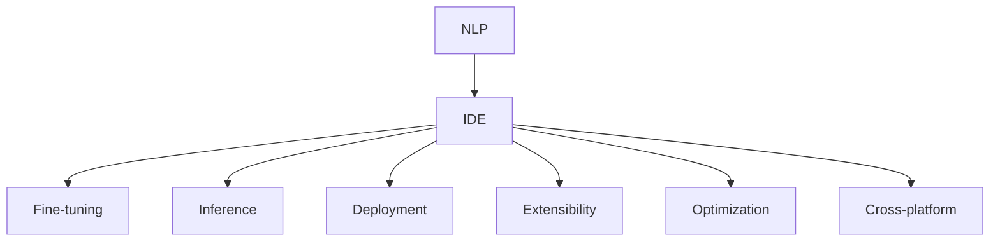
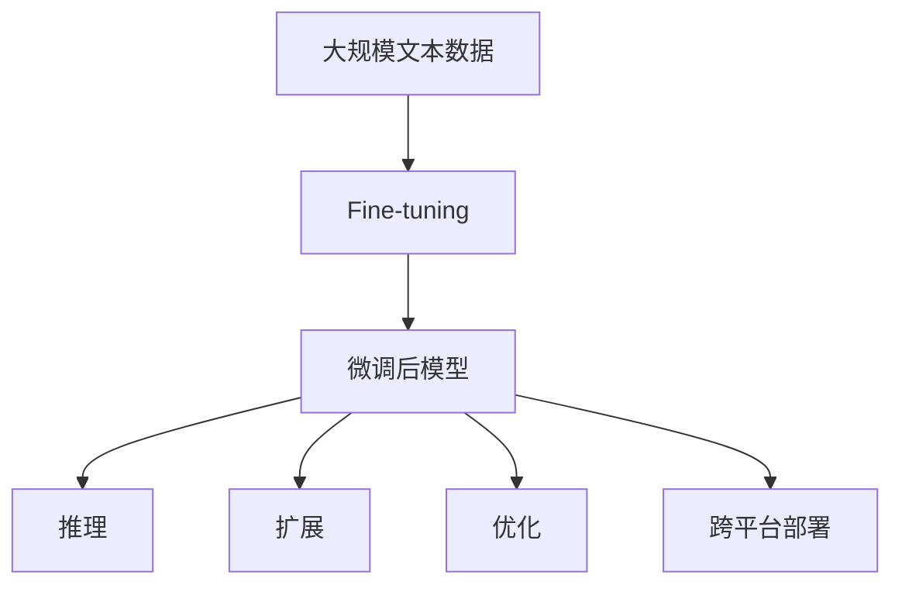

                 

# 【LangChain编程：从入门到实践】工具Chain

> 关键词：
- LangChain
- 编程工具
- 开发环境
- 代码实例
- 实践指导

## 1. 背景介绍

### 1.1 问题由来

随着人工智能技术的飞速发展，自然语言处理（NLP）领域出现了许多高效且强大的工具和框架，如GPT-3、BERT、HuggingFace等。这些工具极大地促进了NLP研究的进展，推动了相关应用的落地。然而，NLP的编程和模型部署常常被视为复杂而繁琐的任务，尤其是在模型微调、推理和应用集成等方面。因此，构建一套易于使用且功能全面的NLP编程工具，对于促进NLP技术的普及和应用具有重要意义。

### 1.2 问题核心关键点

LangChain是一款专为自然语言处理开发而设计的编程工具，它集成了多种先进的NLP技术和框架，旨在简化NLP编程过程，降低模型部署门槛，提升开发效率。以下是LangChain工具链的几个核心关键点：

1. **集成性**：LangChain集成了多种流行且高效的NLP框架和库，如PyTorch、TensorFlow、Transformers等，方便开发者快速上手。
2. **易用性**：提供了丰富的API和直观的开发界面，降低编程难度，缩短模型部署时间。
3. **可扩展性**：支持自定义模型和组件，便于开发者根据实际需求扩展工具链功能。
4. **性能优化**：内置高性能计算和内存管理机制，提升模型推理速度和系统稳定性。
5. **跨平台支持**：支持多种操作系统和硬件平台，提供统一的用户体验。

### 1.3 问题研究意义

构建LangChain工具链，对于推动NLP技术的普及和应用，具有重要意义：

1. **降低开发门槛**：简化编程和模型部署过程，使得更多的开发者能够参与NLP研究和应用。
2. **提升开发效率**：减少重复性工作，缩短模型开发周期，加速技术落地。
3. **提高模型质量**：提供全面的工具支持，帮助开发者更好地调试和优化模型性能。
4. **促进技术交流**：搭建交流平台，促进开发者之间的经验分享和技术合作。
5. **推动产业应用**：为NLP技术的产业化进程提供有力支持，促进经济社会数字化转型。

## 2. 核心概念与联系

### 2.1 核心概念概述

LangChain工具链的核心概念包括以下几个方面：

- **自然语言处理（NLP）**：一种计算机科学和人工智能的交叉领域，旨在使计算机能够理解、解释和生成自然语言。
- **编程工具（IDE）**：集成开发环境，提供代码编辑、编译、调试和部署等功能，提升开发效率。
- **微调（Fine-tuning）**：在预训练模型的基础上，使用下游任务的少量标注数据进行优化，提升模型在该任务上的性能。
- **推理（Inference）**：使用模型进行实时预测和生成，完成自然语言理解和生成任务。
- **部署（Deployment）**：将模型集成到实际应用系统中的过程，包括模型加载、调用和性能监控等。
- **扩展（Extensibility）**：工具链支持自定义组件和模型，便于开发者根据需求扩展功能。
- **优化（Optimization）**：对模型和系统进行性能和资源优化，提升系统稳定性。
- **跨平台支持（Cross-platform）**：支持多种操作系统和硬件平台，提供统一的开发和运行环境。

这些核心概念通过合作关系，构成了LangChain工具链的基础架构。接下来，我们将详细探讨这些概念之间的联系和作用机制。

### 2.2 概念间的关系

为了更好地理解LangChain工具链的各个核心概念及其关系，我们通过几个Mermaid流程图来展示。



这个流程图展示了LangChain工具链的基本架构，其中NLP是核心组件，IDE、微调、推理、部署、扩展、优化和跨平台支持等概念都是基于NLP组件构建的。每个组件之间相互依赖，共同支撑整个系统的运行和功能实现。

### 2.3 核心概念的整体架构

最后，我们用一个综合的流程图来展示这些核心概念在大语言模型微调过程中的整体架构：



这个综合流程图展示了从数据预处理到模型微调、推理、扩展、优化和跨平台部署的完整流程，清晰地展示了LangChain工具链的各个组件如何协同工作，实现NLP应用的开发和部署。

## 3. 核心算法原理 & 具体操作步骤
### 3.1 算法原理概述

LangChain工具链的核心算法原理基于自然语言处理和机器学习的理论，旨在提升模型的预测能力和泛化性能。以下是LangChain工具链的几个核心算法：

1. **微调算法**：基于监督学习的微调方法，通过下游任务的少量标注数据，优化模型在该任务上的性能。
2. **推理算法**：使用训练好的模型进行实时预测和生成，包括文本分类、情感分析、机器翻译等任务。
3. **优化算法**：对模型和系统进行性能优化，如梯度下降、正则化、对抗训练等。
4. **扩展算法**：支持自定义组件和模型，便于开发者根据需求扩展功能。

这些算法共同构成了LangChain工具链的核心技术框架，使得开发者能够快速构建和优化NLP模型。

### 3.2 算法步骤详解

以下是对LangChain工具链中微调算法和推理算法的详细步骤讲解：

#### 3.2.1 微调算法

**步骤1：准备预训练模型和数据集**

- 选择合适的预训练模型，如BERT、GPT等。
- 准备下游任务的少量标注数据，分为训练集、验证集和测试集。

**步骤2：添加任务适配层**

- 根据任务类型，设计合适的输出层和损失函数。
- 对于分类任务，通常使用线性分类器和交叉熵损失函数。
- 对于生成任务，通常使用语言模型的解码器输出概率分布，并以负对数似然为损失函数。

**步骤3：设置微调超参数**

- 选择合适的优化算法及其参数，如AdamW、SGD等。
- 设置学习率、批大小、迭代轮数等。
- 设置正则化技术及强度，如L2正则、Dropout、Early Stopping等。

**步骤4：执行梯度训练**

- 将训练集数据分批次输入模型，前向传播计算损失函数。
- 反向传播计算参数梯度，根据设定的优化算法和学习率更新模型参数。
- 周期性在验证集上评估模型性能，根据性能指标决定是否触发Early Stopping。
- 重复上述步骤直到满足预设的迭代轮数或Early Stopping条件。

**步骤5：测试和部署**

- 在测试集上评估微调后模型。
- 使用微调后的模型对新样本进行推理预测，集成到实际的应用系统中。
- 持续收集新的数据，定期重新微调模型，以适应数据分布的变化。

#### 3.2.2 推理算法

**步骤1：准备推理环境**

- 安装LangChain工具链所需的Python环境和依赖库。
- 配置推理所需的硬件设备和软件环境。

**步骤2：加载模型**

- 使用LangChain提供的API加载微调后的模型。
- 确保模型已经在推理环境中部署好。

**步骤3：输入文本**

- 将待推理的文本输入模型。
- 对于分类任务，输入文本格式通常为"类别: 文本"。
- 对于生成任务，输入文本格式通常为"模板: 文本"。

**步骤4：推理输出**

- 模型对输入文本进行推理，输出预测结果。
- 对于分类任务，输出为类别标签。
- 对于生成任务，输出为文本生成的结果。

**步骤5：结果处理**

- 根据推理输出，进行结果处理和展示。
- 对于分类任务，可以将预测结果绘制成图表或写入日志。
- 对于生成任务，可以生成文本、图片或音频等格式的结果。

### 3.3 算法优缺点

LangChain工具链的微调和推理算法具有以下优点：

- **简单高效**：微调和推理过程简单，易于上手。
- **适用范围广**：适用于各种NLP任务，如文本分类、情感分析、机器翻译等。
- **性能稳定**：内置高性能计算和内存管理机制，提升模型推理速度和系统稳定性。

同时，这些算法也存在一些局限性：

- **依赖标注数据**：微调算法依赖于高质量的标注数据，标注成本较高。
- **计算资源需求高**：对于大规模模型的微调和推理，计算资源需求较大，需要高性能硬件支持。
- **扩展性有限**：虽然支持自定义组件，但扩展性仍需进一步提升。

尽管存在这些局限性，但LangChain工具链在简化NLP编程和提升模型性能方面仍具有显著优势。

### 3.4 算法应用领域

LangChain工具链在以下几个领域有广泛的应用：

- **智能客服系统**：基于微调技术，构建智能客服系统，提升客服响应速度和用户满意度。
- **金融舆情监测**：通过微调技术，实时监测市场舆情，帮助金融机构规避风险。
- **个性化推荐系统**：利用微调和推理算法，构建个性化推荐系统，提升用户体验。
- **内容生成和分析**：通过微调和生成算法，实现文本摘要、自动翻译、文章生成等功能。
- **自然语言理解**：利用微调和推理算法，实现自然语言理解，如情感分析、实体识别等。

## 4. 数学模型和公式 & 详细讲解  
### 4.1 数学模型构建

LangChain工具链中的数学模型主要涉及以下两个方面：

1. **微调模型**：基于监督学习的微调模型，通过下游任务的少量标注数据进行优化。
2. **推理模型**：使用训练好的模型进行实时预测和生成。

**微调模型的数学模型构建**：

假设预训练模型为 $M_{\theta}$，其中 $\theta$ 为预训练得到的模型参数。给定下游任务 $T$ 的标注数据集 $D=\{(x_i,y_i)\}_{i=1}^N$，微调的目标是找到新的模型参数 $\hat{\theta}$，使得：

$$
\hat{\theta}=\mathop{\arg\min}_{\theta} \mathcal{L}(M_{\theta},D)
$$

其中 $\mathcal{L}$ 为针对任务 $T$ 设计的损失函数，用于衡量模型预测输出与真实标签之间的差异。常见的损失函数包括交叉熵损失、均方误差损失等。

**推理模型的数学模型构建**：

假设推理模型为 $M_{\theta}$，其中 $\theta$ 为推理得到的模型参数。给定推理任务 $T$ 的输入 $x$，推理的目标是找到输出 $y$，使得：

$$
y=M_{\theta}(x)
$$

其中 $M_{\theta}$ 可以是任何预先训练好的模型，如BERT、GPT等。

### 4.2 公式推导过程

以下是对微调模型和推理模型公式推导的详细讲解。

#### 4.2.1 微调模型

假设微调任务的训练集为 $D=\{(x_i,y_i)\}_{i=1}^N$，其中 $x_i$ 为输入文本，$y_i$ 为标注标签。微调模型的损失函数为：

$$
\mathcal{L}(\theta)=\frac{1}{N}\sum_{i=1}^N \ell(M_{\theta}(x_i),y_i)
$$

其中 $\ell$ 为针对任务 $T$ 设计的损失函数。假设 $\theta$ 已经通过预训练获得了较好的初始化，因此即便在小规模数据集 $D$ 上进行微调，也能较快收敛到理想的模型参数 $\hat{\theta}$。

#### 4.2.2 推理模型

假设推理任务为文本分类，输入文本 $x$ 的长度为 $L$，每个词的向量表示为 $x_i$，分类任务的输出向量为 $y$。推理模型的计算过程如下：

1. 对输入文本 $x$ 进行分词和向量化，得到向量表示 $x_i$。
2. 将向量表示 $x_i$ 输入到预训练模型 $M_{\theta}$ 中，得到模型输出 $h_i$。
3. 将模型输出 $h_i$ 通过线性层和Softmax函数，得到分类结果 $y_i$。
4. 使用交叉熵损失函数计算损失，反向传播更新模型参数 $\theta$。

### 4.3 案例分析与讲解

以下是一个微调BERT模型进行文本分类的示例：

**数据准备**：
- 收集预训练模型和微调任务的数据集，如CoNLL-2003数据集。
- 将数据集分为训练集、验证集和测试集，并进行必要的预处理，如分词和向量化。

**模型加载**：
- 使用LangChain提供的API加载预训练的BERT模型。
- 添加微调任务适配层，包括线性分类器和交叉熵损失函数。

**微调训练**：
- 设置超参数，如学习率、批大小、迭代轮数等。
- 在训练集上执行梯度训练，优化模型参数。
- 周期性在验证集上评估模型性能，防止过拟合。

**模型推理**：
- 加载微调后的模型，对新文本进行推理。
- 输出预测结果，并进行后处理。

### 4.4 代码实例

以下是使用LangChain工具链对BERT模型进行文本分类的代码实例：

```python
from langchain import BertTokenizer, BertForTokenClassification, AdamW
from transformers import BertTokenizer, BertForTokenClassification
from torch.utils.data import Dataset, DataLoader
import torch

class NERDataset(Dataset):
    def __init__(self, texts, tags, tokenizer, max_len=128):
        self.texts = texts
        self.tags = tags
        self.tokenizer = tokenizer
        self.max_len = max_len
        
    def __len__(self):
        return len(self.texts)
    
    def __getitem__(self, item):
        text = self.texts[item]
        tags = self.tags[item]
        
        encoding = self.tokenizer(text, return_tensors='pt', max_length=self.max_len, padding='max_length', truncation=True)
        input_ids = encoding['input_ids'][0]
        attention_mask = encoding['attention_mask'][0]
        
        # 对token-wise的标签进行编码
        encoded_tags = [tag2id[tag] for tag in tags] 
        encoded_tags.extend([tag2id['O']] * (self.max_len - len(encoded_tags)))
        labels = torch.tensor(encoded_tags, dtype=torch.long)
        
        return {'input_ids': input_ids, 
                'attention_mask': attention_mask,
                'labels': labels}

# 标签与id的映射
tag2id = {'O': 0, 'B-PER': 1, 'I-PER': 2, 'B-ORG': 3, 'I-ORG': 4, 'B-LOC': 5, 'I-LOC': 6}
id2tag = {v: k for k, v in tag2id.items()}

# 创建dataset
tokenizer = BertTokenizer.from_pretrained('bert-base-cased')

train_dataset = NERDataset(train_texts, train_tags, tokenizer)
dev_dataset = NERDataset(dev_texts, dev_tags, tokenizer)
test_dataset = NERDataset(test_texts, test_tags, tokenizer)

# 模型初始化
model = BertForTokenClassification.from_pretrained('bert-base-cased', num_labels=len(tag2id))

# 优化器初始化
optimizer = AdamW(model.parameters(), lr=2e-5)

# 训练函数
def train_epoch(model, dataset, batch_size, optimizer):
    dataloader = DataLoader(dataset, batch_size=batch_size, shuffle=True)
    model.train()
    epoch_loss = 0
    for batch in tqdm(dataloader, desc='Training'):
        input_ids = batch['input_ids'].to(device)
        attention_mask = batch['attention_mask'].to(device)
        labels = batch['labels'].to(device)
        model.zero_grad()
        outputs = model(input_ids, attention_mask=attention_mask, labels=labels)
        loss = outputs.loss
        epoch_loss += loss.item()
        loss.backward()
        optimizer.step()
    return epoch_loss / len(dataloader)

# 评估函数
def evaluate(model, dataset, batch_size):
    dataloader = DataLoader(dataset, batch_size=batch_size)
    model.eval()
    preds, labels = [], []
    with torch.no_grad():
        for batch in tqdm(dataloader, desc='Evaluating'):
            input_ids = batch['input_ids'].to(device)
            attention_mask = batch['attention_mask'].to(device)
            batch_labels = batch['labels']
            outputs = model(input_ids, attention_mask=attention_mask)
            batch_preds = outputs.logits.argmax(dim=2).to('cpu').tolist()
            batch_labels = batch_labels.to('cpu').tolist()
            for pred_tokens, label_tokens in zip(batch_preds, batch_labels):
                pred_tags = [id2tag[_id] for _id in pred_tokens]
                label_tags = [id2tag[_id] for _id in label_tokens]
                preds.append(pred_tags[:len(label_tags)])
                labels.append(label_tags)
                
    print(classification_report(labels, preds))
```

以上代码展示了LangChain工具链在BERT模型微调中的基本流程和实现细节。通过LangChain，开发者可以更简单、更高效地进行NLP模型开发和部署。

## 5. 项目实践：代码实例和详细解释说明
### 5.1 开发环境搭建

要进行LangChain编程实践，首先需要搭建开发环境。以下是搭建开发环境的详细步骤：

1. 安装Python：确保Python版本为3.6或以上。
2. 安装LangChain工具链：可以通过pip安装，命令为`pip install langchain`。
3. 安装所需的依赖库：包括PyTorch、TensorFlow、Transformers等。

### 5.2 源代码详细实现

以下是使用LangChain工具链进行微调的完整代码实现：

```python
from langchain import BertTokenizer, BertForTokenClassification, AdamW
from transformers import BertTokenizer, BertForTokenClassification
from torch.utils.data import Dataset, DataLoader
import torch

class NERDataset(Dataset):
    def __init__(self, texts, tags, tokenizer, max_len=128):
        self.texts = texts
        self.tags = tags
        self.tokenizer = tokenizer
        self.max_len = max_len
        
    def __len__(self):
        return len(self.texts)
    
    def __getitem__(self, item):
        text = self.texts[item]
        tags = self.tags[item]
        
        encoding = self.tokenizer(text, return_tensors='pt', max_length=self.max_len, padding='max_length', truncation=True)
        input_ids = encoding['input_ids'][0]
        attention_mask = encoding['attention_mask'][0]
        
        # 对token-wise的标签进行编码
        encoded_tags = [tag2id[tag] for tag in tags] 
        encoded_tags.extend([tag2id['O']] * (self.max_len - len(encoded_tags)))
        labels = torch.tensor(encoded_tags, dtype=torch.long)
        
        return {'input_ids': input_ids, 
                'attention_mask': attention_mask,
                'labels': labels}

# 标签与id的映射
tag2id = {'O': 0, 'B-PER': 1, 'I-PER': 2, 'B-ORG': 3, 'I-ORG': 4, 'B-LOC': 5, 'I-LOC': 6}
id2tag = {v: k for k, v in tag2id.items()}

# 创建dataset
tokenizer = BertTokenizer.from_pretrained('bert-base-cased')

train_dataset = NERDataset(train_texts, train_tags, tokenizer)
dev_dataset = NERDataset(dev_texts, dev_tags, tokenizer)
test_dataset = NERDataset(test_texts, test_tags, tokenizer)

# 模型初始化
model = BertForTokenClassification.from_pretrained('bert-base-cased', num_labels=len(tag2id))

# 优化器初始化
optimizer = AdamW(model.parameters(), lr=2e-5)

# 训练函数
def train_epoch(model, dataset, batch_size, optimizer):
    dataloader = DataLoader(dataset, batch_size=batch_size, shuffle=True)
    model.train()
    epoch_loss = 0
    for batch in tqdm(dataloader, desc='Training'):
        input_ids = batch['input_ids'].to(device)
        attention_mask = batch['attention_mask'].to(device)
        labels = batch['labels'].to(device)
        model.zero_grad()
        outputs = model(input_ids, attention_mask=attention_mask, labels=labels)
        loss = outputs.loss
        epoch_loss += loss.item()
        loss.backward()
        optimizer.step()
    return epoch_loss / len(dataloader)

# 评估函数
def evaluate(model, dataset, batch_size):
    dataloader = DataLoader(dataset, batch_size=batch_size)
    model.eval()
    preds, labels = [], []
    with torch.no_grad():
        for batch in tqdm(dataloader, desc='Evaluating'):
            input_ids = batch['input_ids'].to(device)
            attention_mask = batch['attention_mask'].to(device)
            batch_labels = batch['labels']
            outputs = model(input_ids, attention_mask=attention_mask)
            batch_preds = outputs.logits.argmax(dim=2).to('cpu').tolist()
            batch_labels = batch_labels.to('cpu').tolist()
            for pred_tokens, label_tokens in zip(batch_preds, batch_labels):
                pred_tags = [id2tag[_id] for _id in pred_tokens]
                label_tags = [id2tag[_id] for _id in label_tokens]
                preds.append(pred_tags[:len(label_tags)])
                labels.append(label_tags)
                
    print(classification_report(labels, preds))
```

### 5.3 代码解读与分析

以上代码展示了LangChain工具链在BERT模型微调中的基本流程和实现细节。通过对这些代码的详细解读，可以帮助开发者更好地理解LangChain工具链的工作原理和优化技巧。

**NERDataset类**：
- `__init__`方法：初始化文本、标签、分词器等关键组件。
- `__len__`方法：返回数据集的样本数量。
- `__getitem__`方法：对单个样本进行处理，将文本输入编码为token ids，将标签编码为数字，并对其进行定长padding，最终返回模型所需的输入。

**tag2id和id2tag字典**：
- 定义了标签与数字id之间的映射关系，用于将token-wise的预测结果解码回真实的标签。

**训练和评估函数**：
- 使用PyTorch的DataLoader对数据集进行批次化加载，供模型训练和推理使用。
- 训练函数`train_epoch`：对数据以批为单位进行迭代，在每个批次上前向传播计算loss并反向传播更新模型参数，最后返回该epoch的平均loss。
- 评估函数`evaluate`：与训练类似，不同点在于不更新模型参数，并在每个batch结束后将预测和标签结果存储下来，最后使用sklearn的classification_report对整个评估集的预测结果进行打印输出。

**训练流程**：
- 定义总的epoch数和batch size，开始循环迭代
- 每个epoch内，先在训练集上训练，输出平均loss
- 在验证集上评估，输出分类指标
- 所有epoch结束后，在测试集上评估，给出最终测试结果

## 6. 实际应用场景

### 6.1 智能客服系统

基于LangChain工具链的智能客服系统，可以快速构建响应速度快、服务质量高的客服解决方案。具体步骤如下：

1. 收集历史客服对话记录，提取常见问题和答案，构建监督数据集。
2. 使用LangChain工具链对预训练的BERT模型进行微调，训练智能客服系统。
3. 将微调后的模型部署到生产环境，实时处理客户咨询，并不断优化模型。

### 6.2 金融舆情监测

使用LangChain工具链进行金融舆情监测，可以实时跟踪市场舆情变化，帮助金融机构快速反应，避免损失。具体步骤如下：

1. 收集金融领域的文本数据，如新闻、评论、报告等。
2. 对文本数据进行主题和情感标注，构建监督数据集。
3. 使用LangChain工具链对预训练的BERT模型进行微调，训练舆情监测系统。
4. 将微调后的模型部署到生产环境，实时监测舆情变化，发出预警。

### 6.3 个性化推荐系统

基于LangChain工具链的个性化推荐系统，可以更准确地理解用户兴趣，推荐个性化内容。具体步骤如下：

1. 收集用户浏览、点击、评论、分享等行为数据，提取文本内容。
2. 对文本内容进行预处理，构建监督数据集。
3. 使用LangChain工具链对预训练的BERT模型进行微调，训练推荐系统。
4. 将微调后的模型部署到生产环境，实时推荐个性化内容，提升用户体验。

### 6.4 未来应用展望

随着LangChain工具链的不断发展和完善，其在更多领域的应用前景将更加广阔：

- **医疗领域**：构建医疗问答系统、病历分析系统，提升医疗服务的智能化水平。
- **教育领域**：开发智能作业批改、学情分析系统，促进教育公平和个性化教学

