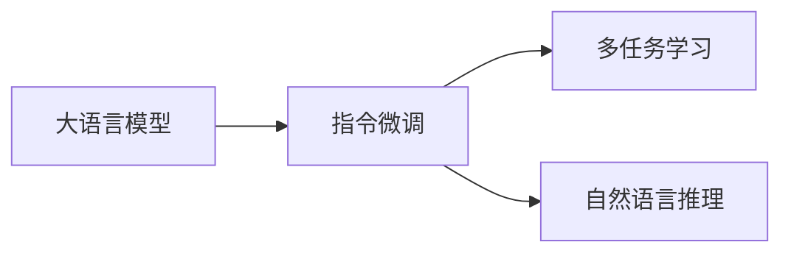

# Stanford Alpaca 的相关研究

关键词：Stanford Alpaca、大语言模型、指令微调、多任务学习、人工智能

## 1. 背景介绍

### 1.1 问题的由来
近年来，大语言模型（Large Language Models, LLMs）在自然语言处理领域取得了令人瞩目的成就。这些模型通过在海量文本数据上进行预训练，能够完成各种自然语言理解和生成任务。然而，预训练的LLMs通常需要进一步微调才能适应特定的下游任务。Stanford Alpaca项目旨在探索一种称为指令微调（Instruction Tuning）的新颖方法，以提高LLMs在执行指令性任务时的性能。

### 1.2 研究现状
目前，大语言模型的微调主要采用传统的有监督微调方法，即在标注数据集上对模型进行微调。这种方法虽然有效，但存在标注成本高、领域适应性差等问题。一些研究尝试使用少样本学习、元学习等技术来提高微调效率，但效果有限。Stanford Alpaca项目提出的指令微调方法为这一问题提供了新的思路。

### 1.3 研究意义
Stanford Alpaca的研究具有重要意义：
1. 提高大语言模型在执行指令性任务的性能，拓展其应用场景。
2. 降低微调所需的标注数据量，减少人工标注成本。
3. 增强模型的泛化能力和领域适应性，实现更广泛的知识迁移。
4. 推动自然语言处理技术向通用人工智能的方向发展。

### 1.4 本文结构
本文将全面介绍Stanford Alpaca的相关研究工作。第2部分阐述Stanford Alpaca涉及的核心概念；第3部分详细解析其核心算法原理；第4部分建立数学模型并给出公式推导；第5部分展示项目实践和代码实现；第6部分讨论其实际应用场景；第7部分推荐相关工具和资源；第8部分总结全文并展望未来研究方向。

## 2. 核心概念与联系

Stanford Alpaca项目涉及以下核心概念：

- 大语言模型（Large Language Models）：在海量文本数据上预训练得到的神经网络模型，具有强大的自然语言理解和生成能力，代表模型如GPT-3、PaLM等。
- 指令微调（Instruction Tuning）：一种新颖的LLMs微调方法，旨在教会模型理解和执行自然语言指令，从而完成各种任务。与传统微调不同，它不需要为每个任务准备专门的标注数据。
- 多任务学习（Multi-task Learning）：一种机器学习范式，旨在同时学习多个相关任务，通过共享知识来提高模型的泛化能力。Stanford Alpaca利用多任务学习来实现指令微调。
- 自然语言推理（Natural Language Inference）：判断一个句子是否可以从另一个句子推断出来。Stanford Alpaca将指令理解建模为一个自然语言推理任务。

这些概念之间的联系如下图所示：



## 3. 核心算法原理 & 具体操作步骤

### 3.1 算法原理概述
Stanford Alpaca的核心算法是指令微调，其基本思想是将指令理解建模为一个自然语言推理任务，然后利用多任务学习的方式在多个指令数据集上对预训练的LLMs进行微调。通过这种方式，模型可以学会理解和执行各种自然语言指令，而无需为每个任务准备专门的标注数据。

### 3.2 算法步骤详解
Stanford Alpaca的指令微调算法可分为以下步骤：

1. 指令数据构建：收集和构建多个指令数据集，每个数据集包含一系列指令及其对应的执行结果。这些指令涵盖了不同的任务领域和形式。

2. 指令理解建模：将指令理解建模为一个三分类的自然语言推理任务。对于每个指令，模型需要判断其执行结果是否与指令相关（entailment）、无关（neutral）或矛盾（contradiction）。

3. 多任务学习：将多个指令数据集视为不同的子任务，利用多任务学习的方式在这些子任务上对预训练的LLMs进行微调。模型共享大部分参数，同时为每个子任务设置独立的输出层。

4. 推理和执行：对于新的指令，模型首先判断其执行结果与指令的关系，如果为entailment，则输出该执行结果；如果为neutral或contradiction，则拒绝执行并给出相应的反馈。

### 3.3 算法优缺点
Stanford Alpaca的指令微调算法具有以下优点：
- 降低了微调所需的标注成本，提高了微调效率。
- 增强了模型的泛化能力，可以执行各种类型的指令。
- 通过多任务学习，实现了不同指令数据集之间的知识迁移和共享。

同时，该算法也存在一些局限性：
- 依赖高质量的指令数据集，构建这些数据集仍需要一定的人工成本。
- 对于超出训练数据分布的指令，模型可能难以理解和执行。
- 模型的推理和执行过程缺乏可解释性，难以对其决策进行分析和调试。

### 3.4 算法应用领域
Stanford Alpaca的指令微调算法可应用于以下领域：
- 智能助手：通过指令微调，LLMs可以作为通用的智能助手，执行日程安排、信息查询等各种任务。
- 知识库问答：指令微调使LLMs能够根据指令从知识库中检索和组织信息，回答用户的问题。
- 程序合成：将编程任务建模为自然语言指令，LLMs可以通过指令微调学习根据需求自动生成代码。
- 机器人控制：指令微调使LLMs能够理解自然语言控制指令，并将其转化为机器人的动作序列。

## 4. 数学模型和公式 & 详细讲解 & 举例说明

### 4.1 数学模型构建
我们将Stanford Alpaca的指令微调建模为一个多任务学习问题。假设有$M$个指令数据集$\{D_1,D_2,...,D_M\}$，每个数据集$D_i$包含$N_i$个指令-执行结果对$\{(x_i^j,y_i^j)\}_{j=1}^{N_i}$，其中$x_i^j$表示第$i$个数据集中的第$j$个指令，$y_i^j$表示其对应的执行结果。

我们的目标是训练一个模型$f_\theta$，使其能够在所有数据集上均取得较好的性能。形式化地，我们希望最小化以下多任务学习目标：

$$\mathcal{L}(\theta)=\sum_{i=1}^M \lambda_i \mathcal{L}_i(\theta)$$

其中$\mathcal{L}_i(\theta)$表示模型在第$i$个数据集上的损失函数，$\lambda_i$为该数据集的权重系数。损失函数$\mathcal{L}_i(\theta)$定义为：

$$\mathcal{L}_i(\theta)=\frac{1}{N_i}\sum_{j=1}^{N_i} l(f_\theta(x_i^j),y_i^j)$$

其中$l(\cdot,\cdot)$为模型输出与真实执行结果之间的损失，如交叉熵损失。

### 4.2 公式推导过程
为了优化多任务学习目标$\mathcal{L}(\theta)$，我们采用随机梯度下降算法。在每个训练步骤中，我们从所有数据集中随机采样一个Batch的指令-执行结果对，然后计算模型在该Batch上的损失函数，并根据梯度更新模型参数。设第$t$步采样的Batch为$B_t=\{(x_{i_t}^j,y_{i_t}^j)\}_{j=1}^{b}$，其中$i_t$为随机选择的数据集编号，$b$为Batch大小。则第$t$步的参数更新公式为：

$$\theta_{t+1}=\theta_t-\eta \nabla_\theta \mathcal{L}_{B_t}(\theta_t)$$

其中$\eta$为学习率，$\mathcal{L}_{B_t}(\theta_t)$为模型在Batch $B_t$上的损失函数：

$$\mathcal{L}_{B_t}(\theta_t)=\frac{1}{b}\sum_{j=1}^b l(f_{\theta_t}(x_{i_t}^j),y_{i_t}^j)$$

通过多次迭代更新，模型逐渐学会在所有指令数据集上执行指令。

### 4.3 案例分析与讲解
下面我们以一个简单的例子来说明Stanford Alpaca的指令微调过程。假设我们有两个指令数据集：
- $D_1$：时间查询指令，如"现在几点了？"、"明天星期几？"等。
- $D_2$：天气查询指令，如"今天天气如何？"、"明天会下雨吗？"等。

我们希望训练一个模型，使其能够同时执行这两类指令。首先，我们将每个指令数据集中的指令-执行结果对表示为自然语言推理任务的形式。例如，对于指令"现在几点了？"，我们构建三个样本：
- Entailment：现在是下午3点。
- Neutral：明天是周二。
- Contradiction：现在是晚上9点。

然后，我们使用预训练的LLMs作为基础模型，在这两个数据集上进行多任务微调。在每个训练步骤中，我们从$D_1$和$D_2$中随机采样一个Batch的样本，计算模型在该Batch上的损失函数，并更新模型参数。经过多轮迭代后，模型学会了理解和执行时间查询和天气查询两类指令。

### 4.4 常见问题解答
Q1: Stanford Alpaca可以处理哪些类型的指令？
A1: 理论上，Stanford Alpaca可以处理任何可以表示为自然语言推理任务的指令。在实践中，它主要应用于信息查询、任务规划、对话生成等领域。

Q2: Stanford Alpaca的泛化能力如何？
A2: 通过在多个指令数据集上进行微调，Stanford Alpaca可以学习到一般的指令执行能力，从而泛化到未见过的指令。但对于完全不同领域或超出训练数据分布的指令，其泛化能力可能有限。

Q3: Stanford Alpaca需要多少标注数据？
A3: 与传统微调方法相比，Stanford Alpaca显著降低了所需标注数据的量。但构建高质量的指令数据集仍需要一定的人工成本。数据量的多少取决于任务的复杂度和模型的参数量。

Q4: Stanford Alpaca的推理速度如何？
A4: Stanford Alpaca的推理速度主要取决于基础LLMs的推理速度。一般而言，推理速度会慢于传统的微调模型，但仍在可接受的范围内。可以通过模型蒸馏、量化等技术进一步加速推理过程。

## 5. 项目实践：代码实例和详细解释说明

### 5.1 开发环境搭建
首先，我们需要搭建Stanford Alpaca的开发环境。主要依赖的库包括：
- Python 3.7+
- PyTorch 1.9+
- Transformers 4.10+
- Datasets 1.6+

可以使用以下命令安装这些库：

```bash
pip install torch transformers datasets
```

### 5.2 源代码详细实现
下面是Stanford Alpaca指令微调的PyTorch实现代码：

```python
import torch
from torch.utils.data import DataLoader
from transformers import AutoTokenizer, AutoModelForSequenceClassification, AdamW

# 加载预训练的LLMs作为基础模型
model_name = "bert-base-uncased"
tokenizer = AutoTokenizer.from_pretrained(model_name)
model = AutoModelForSequenceClassification.from_pretrained(model_name, num_labels=3)

# 加载指令数据集
def load_dataset(dataset_path):
    # 从文件中加载指令-执行结果对，并转换为自然语言推理任务的形式
    # 返回Dataset对象
    ...

train_datasets = [load_dataset(path) for path in train_dataset_paths]
eval_datasets = [load_dataset(path) for path in eval_dataset_paths]

# 定义数据加载器
train_loaders = [DataLoader(dataset, batch_size=32, shuffle=True) for dataset in train_datasets]
eval_loaders = [