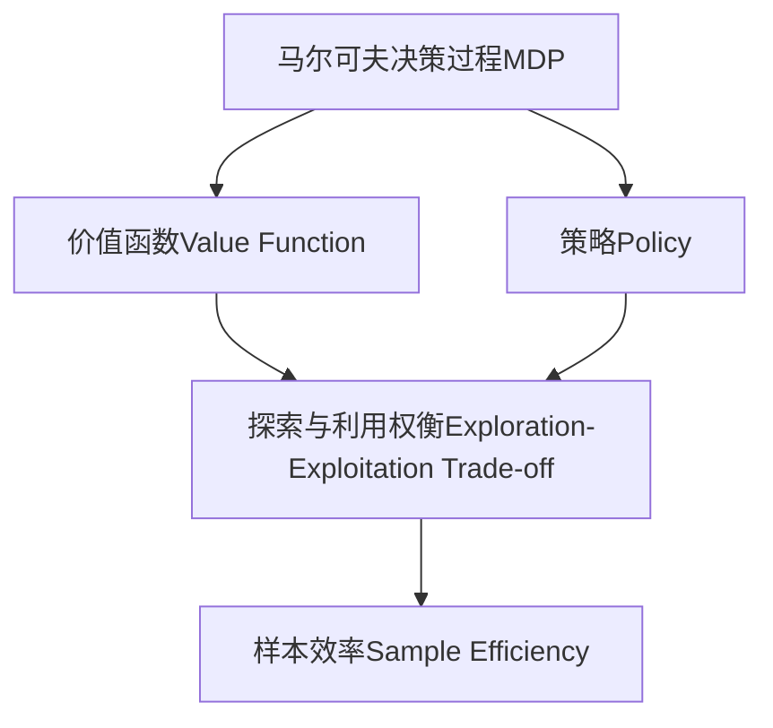

# 强化学习Reinforcement Learning算法的样本效率提升策略

## 1. 背景介绍

### 1.1 问题的由来

强化学习(Reinforcement Learning, RL)是机器学习的一个重要分支,旨在让智能体(Agent)通过与环境(Environment)的交互来学习如何获取最大的累积奖励。与监督学习不同,强化学习没有给定的输入-输出样本对,智能体需要通过试错来探索环境,了解行为与奖励之间的关联。

然而,探索过程往往是低效的,需要大量的样本(经验)才能收敛到一个良好的策略。这种低效率的探索过程被称为"样本效率"(Sample Efficiency)问题,是强化学习面临的一个主要挑战。低样本效率不仅会导致训练时间过长,还可能使智能体无法在有限的探索时间内学习到一个理想的策略。

### 1.2 研究现状

为了提高强化学习算法的样本效率,研究人员提出了多种策略,包括:

1. **经验重用**(Experience Replay):通过存储之前的经验,并在训练时重复利用这些经验,以提高数据利用率。
2. **层次强化学习**(Hierarchical Reinforcement Learning):将复杂任务分解为多个子任务,每个子任务由一个低级策略解决,从而降低探索空间的复杂度。
3. **元学习**(Meta-Learning):利用从相关任务中学习到的知识,加速新任务的学习过程。
4. **模型基础强化学习**(Model-Based Reinforcement Learning):通过构建环境模型来模拟交互,减少与真实环境交互的需求。
5. **多任务学习**(Multi-Task Learning):同时学习多个相关任务,利用任务之间的相关性提高学习效率。

尽管取得了一定进展,但提高样本效率仍然是强化学习领域的一个重要研究方向。

### 1.3 研究意义

提高强化学习算法的样本效率具有重要的理论和实际意义:

1. **理论意义**:样本效率问题反映了强化学习算法的基本局限性,解决这一问题有助于深入理解强化学习的本质,推动算法的理论发展。
2. **实际应用**:在许多实际应用场景中(如机器人控制、游戏AI等),与真实环境的交互往往是昂贵或危险的,提高样本效率可以减少与环境交互的需求,降低成本和风险。
3. **可解释性**:高样本效率意味着算法能够在有限的经验中捕捉到环境的本质特征,从而有助于提高算法的可解释性。

### 1.4 本文结构

本文将从以下几个方面探讨强化学习算法的样本效率提升策略:

1. 核心概念与联系
2. 核心算法原理与具体操作步骤
3. 数学模型和公式详细讲解与案例分析
4. 项目实践:代码实例和详细解释说明
5. 实际应用场景
6. 工具和资源推荐
7. 总结:未来发展趋势与挑战
8. 附录:常见问题与解答

## 2. 核心概念与联系

在探讨提升强化学习算法样本效率的策略之前,我们需要先了解一些核心概念:

1. **马尔可夫决策过程(Markov Decision Process, MDP)**: 强化学习问题通常被建模为MDP,它由一组状态(States)、行为(Actions)、状态转移概率(Transition Probabilities)和奖励函数(Reward Function)组成。
2. **价值函数(Value Function)**: 定义了在给定状态下执行一系列行为所能获得的期望累积奖励,是评估策略好坏的关键指标。
3. **策略(Policy)**: 定义了智能体在每个状态下选择行为的策略,是强化学习算法需要学习的目标。
4. **探索与利用权衡(Exploration-Exploitation Trade-off)**: 智能体需要在探索未知状态以获取新知识,和利用已有知识获取更高奖励之间进行权衡。

这些概念之间存在着紧密的联系,如下图所示:

提高样本效率的关键在于合理地解决探索与利用的权衡,从而在有限的样本中学习到一个高质量的价值函数和策略。

## 3. 核心算法原理与具体操作步骤

### 3.1 算法原理概述

提高强化学习算法的样本效率,主要有以下几种思路:

1. **经验重用(Experience Replay)**:通过存储之前的经验,并在训练时重复利用这些经验,可以提高数据利用率,减少与环境交互的需求。
2. **层次强化学习(Hierarchical Reinforcement Learning)**:将复杂任务分解为多个子任务,每个子任务由一个低级策略解决。这种分层结构可以降低探索空间的复杂度,加快学习速度。
3. **元学习(Meta-Learning)**:利用从相关任务中学习到的知识,加速新任务的学习过程。这种方法可以有效地利用先验知识,减少从头开始学习的需求。
4. **模型基础强化学习(Model-Based Reinforcement Learning)**:通过构建环境模型来模拟交互,减少与真实环境交互的需求。这种方法可以在模拟环境中进行大量的探索,提高样本效率。
5. **多任务学习(Multi-Task Learning)**:同时学习多个相关任务,利用任务之间的相关性提高学习效率。这种方法可以共享不同任务之间的知识,加速各个任务的学习过程。

### 3.2 算法步骤详解

以下我们将详细介绍经验重用(Experience Replay)算法的具体步骤,它是提高样本效率的一种常用策略。

1. **初始化经验池(Experience Replay Buffer)**:创建一个固定大小的经验池,用于存储智能体与环境交互的经验。
2. **与环境交互并存储经验**:智能体与环境交互,获取状态(State)、行为(Action)、奖励(Reward)和下一状态(Next State)等信息,并将这些信息作为一个经验存储到经验池中。
3. **从经验池中采样批次数据**:在每个训练步骤中,从经验池中随机采样一个批次(Batch)的经验数据。
4. **使用批次数据进行训练**:使用采样的批次数据,根据强化学习算法(如Q-Learning、PolicyGradient等)的具体方法,更新价值函数或策略。
5. **重复步骤2-4**:持续与环境交互,存储经验,并使用存储的经验进行训练,直到策略收敛或达到预期性能。

通过重复利用之前的经验,经验重用算法可以有效地提高数据利用率,减少与环境交互的需求,从而提高样本效率。

### 3.3 算法优缺点

**优点**:

1. 提高了数据利用率,减少了与环境交互的需求。
2. 通过重复利用经验,可以减少相关性较强的经验之间的冗余,提高训练效率。
3. 经验池中的经验可以被多次利用,有助于策略的收敛和稳定性。

**缺点**:

1. 需要额外的内存空间来存储经验池,对于大规模问题可能会成为瓶颈。
2. 经验池中的经验可能会过时或不再相关,导致训练效率降低。
3. 对于连续控制任务,经验池中的经验可能会存在相关性,影响训练效果。

### 3.4 算法应用领域

经验重用算法广泛应用于各种强化学习任务,包括但不限于:

1. **游戏AI**:在许多经典游戏(如Atari游戏、AlphaGo等)中,经验重用算法被用于提高智能体的学习效率。
2. **机器人控制**:在机器人控制任务中,与真实机器人交互往往是昂贵和危险的,经验重用算法可以减少这种交互的需求。
3. **自动驾驶**:在自动驾驶系统中,经验重用算法可以利用模拟环境中的经验,加速真实环境下的学习过程。
4. **推荐系统**:在推荐系统中,经验重用算法可以利用用户的历史交互数据,提高推荐策略的学习效率。

## 4. 数学模型和公式详细讲解与举例说明

### 4.1 数学模型构建

在强化学习中,我们通常将问题建模为马尔可夫决策过程(Markov Decision Process, MDP)。一个MDP可以用一个五元组 $(S, A, P, R, \gamma)$ 来表示,其中:

- $S$ 是状态空间的集合
- $A$ 是行为空间的集合
- $P(s' | s, a)$ 是状态转移概率,表示在状态 $s$ 下执行行为 $a$ 后,转移到状态 $s'$ 的概率
- $R(s, a, s')$ 是奖励函数,表示在状态 $s$ 下执行行为 $a$ 后,转移到状态 $s'$ 所获得的奖励
- $\gamma \in [0, 1)$ 是折现因子,用于权衡即时奖励和未来奖励的重要性

在MDP中,我们的目标是找到一个策略 $\pi: S \rightarrow A$,使得在该策略下的期望累积奖励最大化。期望累积奖励可以用价值函数 $V^\pi(s)$ 来表示,它定义为在状态 $s$ 下,按照策略 $\pi$ 执行后的期望累积奖励:

$$V^\pi(s) = \mathbb{E}_\pi \left[ \sum_{t=0}^\infty \gamma^t R(s_t, a_t, s_{t+1}) | s_0 = s \right]$$

其中 $s_t$、$a_t$ 和 $s_{t+1}$ 分别表示时间步 $t$ 的状态、行为和下一状态。

### 4.2 公式推导过程

我们可以使用贝尔曼方程(Bellman Equation)来计算价值函数 $V^\pi(s)$。对于任意状态 $s$,我们有:

$$\begin{aligned}
V^\pi(s) &= \mathbb{E}_\pi \left[ R(s, a, s') + \gamma V^\pi(s') | s_0 = s, a \sim \pi(s), s' \sim P(s'|s, a) \right] \
&= \sum_{a \in A} \pi(a|s) \sum_{s' \in S} P(s'|s, a) \left[ R(s, a, s') + \gamma V^\pi(s') \right]
\end{aligned}$$

这个方程表明,在状态 $s$ 下的价值函数等于在该状态下执行所有可能行为 $a$ 后,获得即时奖励 $R(s, a, s')$ 和折现后的下一状态价值函数 $\gamma V^\pi(s')$ 的期望。

同理,我们可以定义状态-行为价值函数 $Q^\pi(s, a)$,表示在状态 $s$ 下执行行为 $a$ 后的期望累积奖励:

$$Q^\pi(s, a) = \mathbb{E}_\pi \left[ \sum_{t=0}^\infty \gamma^t R(s_t, a_t, s_{t+1}) | s_0 = s, a_0 = a \right]$$

$Q^\pi(s, a)$ 和 $V^\pi(s)$ 之间存在以下关系:

$$V^\pi(s) = \sum_{a \in A} \pi(a|s) Q^\pi(s, a)$$

### 4.3 案例分析与讲解

为了更好地理解上述公式,我们来分析一个简单的网格世界(Gridworld)案例。

在这个网格世界中,智能体(Agent)位于一个 $4 \times 4$ 的网格中,目标是从起点(左上角)到达终点(右下角)。每一步,智能体可以选择上下左右四个方向中的一个行为,并获得相应的奖励(到达终点获得 +1 的奖励,其他情况获得 -0.04 的奖励)。如果智能体撞墙或越界,则会停留在原地。

我们假设智能体采用一个简单的随机策略 $\pi$,即在每个状态下均匀随机选择一个行为。对于任意状态 $s$,我们可以计算其价值函数 $V^\pi(s)$ 如下: