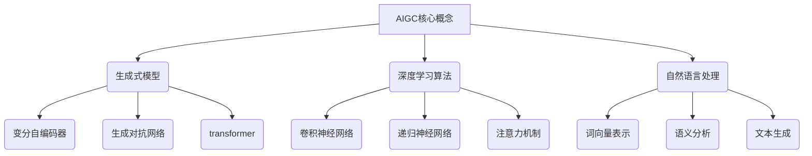

# 生成式AIGC：数据与商业的深度融合

## 1. 背景介绍

### 1.1 问题的由来

在数字时代的浪潮中，数据已经成为了推动商业发展的核心动力。企业需要高效地利用海量数据,从中发掘洞见,制定战略决策。然而,传统的数据处理方式已经无法满足现代商业的需求。人工智能生成式内容(AIGC)技术应运而生,旨在通过深度学习算法自动生成高质量的内容,实现数据与商业的深度融合。

### 1.2 研究现状

AIGC技术的兴起,为企业带来了前所未有的机遇。一些领先的公司已经开始探索AIGC在营销、客户服务、内容创作等领域的应用。然而,AIGC技术仍处于初级阶段,存在一些挑战需要克服,如生成内容的质量、一致性、个性化等问题。

### 1.3 研究意义

AIGC技术的发展将极大地提高企业利用数据的效率,降低人力成本,提升竞争力。通过深入研究AIGC的核心原理和算法,我们可以更好地理解和应用这项革命性技术,助力企业实现数据与商业的无缝融合。

### 1.4 本文结构

本文将全面探讨AIGC技术在数据与商业融合中的应用。我们将首先介绍AIGC的核心概念和算法原理,然后深入讲解数学模型和公式,并通过实际案例进行说明。接下来,我们将分享AIGC在实际应用场景中的实践经验,并推荐相关工具和资源。最后,我们将总结AIGC的发展趋势和面临的挑战,为读者提供一个全面的视角。

## 2. 核心概念与联系

AIGC(AI-Generated Content)技术是基于深度学习算法和自然语言处理技术,自动生成高质量内容的一种新兴技术。它的核心概念包括:

1. **生成式模型(Generative Models)**: 通过学习数据的概率分布,生成新的、类似于训练数据的样本。常见的生成式模型包括变分自编码器(VAE)、生成对抗网络(GAN)和Transformer等。

2. **深度学习算法(Deep Learning Algorithms)**: AIGC技术的核心驱动力,包括卷积神经网络(CNN)、递归神经网络(RNN)和注意力机制(Attention Mechanism)等。这些算法能够从大量数据中自动学习特征表示和模式。

3. **自然语言处理(Natural Language Processing, NLP)**: 处理和理解人类语言的技术,在AIGC中扮演着关键角色。NLP技术包括词向量表示、语义分析和文本生成等。

这些核心概念相互关联、相互促进,共同推动了AIGC技术的发展。生成式模型提供了自动生成内容的框架,深度学习算法赋予了模型强大的学习能力,而NLP技术则确保了生成内容的质量和可读性。

## 3. 核心算法原理 & 具体操作步骤

### 3.1 算法原理概述

AIGC技术的核心算法原理是基于生成式深度学习模型,通过学习大量训练数据,捕捉其中的统计规律和模式,从而能够生成新的、类似于训练数据的内容。

常见的生成式模型包括:

1. **变分自编码器(Variational Autoencoder, VAE)**: 通过编码器将输入数据映射到潜在空间,然后通过解码器从潜在空间生成新的数据。

2. **生成对抗网络(Generative Adversarial Networks, GAN)**: 由生成器和判别器两个神经网络组成。生成器试图生成逼真的数据,而判别器则试图区分生成的数据和真实数据。两者通过对抗训练,相互促进,最终达到生成高质量数据的目的。

3. **Transformer**: 一种基于注意力机制的序列到序列模型,在自然语言处理任务中表现出色,也被广泛应用于AIGC领域。

### 3.2 算法步骤详解

以Transformer为例,AIGC算法的具体步骤如下:

1. **数据预处理**: 对原始数据进行清洗、标记化、填充等预处理操作,将其转换为模型可以接受的格式。

2. **词嵌入(Word Embedding)**: 将词语映射到向量空间,使得语义相似的词语在向量空间中也相近。

3. **编码器(Encoder)**: 将输入序列(如文本)编码为一系列向量表示。

4. **解码器(Decoder)**: 根据编码器的输出,一个词一个词地生成目标序列(如生成的文本)。

5. **注意力机制(Attention Mechanism)**: 在生成每个词时,模型会关注输入序列中的不同部分,赋予不同的权重。

6. **训练**: 使用大量的文本数据对Transformer模型进行训练,让它学习到生成高质量文本的能力。

7. **生成(Generation)**: 对于新的输入,模型将生成相应的目标序列作为输出。

8. **后处理(Post-processing)**: 对生成的文本进行必要的后处理,如去除特殊标记、调整格式等。

### 3.3 算法优缺点

优点:

- 能够生成逼真、流畅、多样化的内容
- 可以处理各种类型的数据,如文本、图像、音频等
- 具有很强的泛化能力,可以应用于多个领域

缺点:

- 需要大量的训练数据和计算资源
- 生成的内容可能存在偏差或不一致性
- 难以控制生成内容的特定属性或风格
- 存在潜在的安全和隐私风险

### 3.4 算法应用领域

AIGC算法可以应用于多个领域,包括但不限于:

- **内容创作**: 自动生成文章、小说、诗歌、剧本等创作性内容。
- **对话系统**: 生成自然、流畅的对话响应,用于智能客服、虚拟助手等场景。
- **广告营销**: 根据用户数据生成个性化的广告文案和创意。
- **新闻报道**: 自动生成新闻报道的初稿,提高新闻生产效率。
- **教育领域**: 生成练习题目、辅导材料,为个性化教育提供支持。

## 4. 数学模型和公式 & 详细讲解 & 举例说明

### 4.1 数学模型构建

在AIGC技术中,我们通常使用概率模型来描述生成过程。假设我们要生成一个序列 $Y = (y_1, y_2, \dots, y_T)$,给定一个条件 $X$,我们可以建立如下概率模型:

$$P(Y|X) = \prod_{t=1}^{T} P(y_t|y_{<t}, X)$$

其中,$ y_{<t} $表示序列 $Y$ 中位于 $t$ 之前的所有元素。该模型描述了生成序列 $Y$ 的过程:在每个时间步 $t$,我们根据之前生成的元素 $y_{<t}$ 和条件 $X$,预测下一个元素 $y_t$ 的概率分布。

对于文本生成任务,$X$ 可以是一个提示(prompt)或上下文信息,而 $Y$ 则是要生成的文本序列。

### 4.2 公式推导过程

我们可以使用神经网络来参数化上述概率模型,即:

$$P(y_t|y_{<t}, X) = f_\theta(y_{<t}, X)$$

其中,$ f_\theta $是一个由神经网络参数 $\theta$ 决定的函数。

在训练过程中,我们希望最大化训练数据的似然函数(likelihood):

$$\mathcal{L}(\theta) = \sum_{(X, Y) \in \mathcal{D}} \log P_\theta(Y|X)$$

其中,$ \mathcal{D} $表示训练数据集。

对于序列生成任务,我们通常使用交叉熵损失函数(cross-entropy loss)来优化模型参数:

$$\mathcal{L}(\theta) = -\sum_{(X, Y) \in \mathcal{D}} \sum_{t=1}^{T} \log P_\theta(y_t|y_{<t}, X)$$

在训练过程中,我们使用随机梯度下降等优化算法,不断调整模型参数 $\theta$,最小化损失函数 $\mathcal{L}(\theta)$,从而获得一个能够很好地拟合训练数据的模型。

### 4.3 案例分析与讲解

假设我们要训练一个文本生成模型,用于自动生成新闻报道。我们可以收集大量的新闻文本作为训练数据,并将其划分为标题(条件 $X$)和正文(目标序列 $Y$)两部分。

在训练过程中,模型会学习到生成高质量新闻正文的能力。具体来说,对于给定的新闻标题 $X$,模型会预测第一个词 $y_1$ 的概率分布 $P(y_1|X)$,然后根据采样的 $y_1$ 和 $X$ 预测下一个词 $y_2$ 的概率分布 $P(y_2|y_1, X)$,如此循环,直到生成完整的新闻正文序列。

例如,给定标题 "科技巨头发布新品",模型可能会生成如下新闻正文:

"科技巨头 AppleCorp 今天在旗舰发布会上推出了全新的智能手机 iPhonePro。这款手机采用了业界领先的 A16 芯片,拥有出色的性能表现。同时,它还配备了三摄像头系统和长续航电池,为用户带来卓越的拍照和使用体验。AppleCorp 表示,iPhonePro 将在下周开始接受预订,并于本月底正式上市销售。"

通过上述案例,我们可以看到AIGC模型如何根据给定的条件(标题),生成相关且流畅的文本内容。

### 4.4 常见问题解答

**Q: 生成的内容是否存在偏差或不一致性?**

A: 是的,AIGC模型生成的内容可能存在一定程度的偏差或不一致性。这是因为模型是基于训练数据进行学习的,如果训练数据本身存在偏差或噪声,模型也会学习到这些特征。另外,由于生成过程具有随机性,不同的生成结果可能会有所不同。

**Q: 如何控制生成内容的特定属性或风格?**

A: 有几种方法可以控制生成内容的属性或风格:

1. 在训练数据中加入特定风格的示例,让模型学习到相应的风格特征。
2. 在生成过程中,提供风格化的提示(prompt),引导模型生成特定风格的内容。
3. 使用控制代码(control codes)或其他技术,直接操纵模型的生成过程。

**Q: AIGC技术是否存在潜在的安全和隐私风险?**

A: 是的,AIGC技术确实存在一些潜在的安全和隐私风险。例如,恶意使用AIGC技术可能会产生虚假信息或有害内容,对社会造成不利影响。另外,训练数据中可能包含敏感信息,如果处理不当,也可能导致隐私泄露。因此,在应用AIGC技术时,我们需要高度重视安全和隐私保护,采取必要的预防措施。

## 5. 项目实践：代码实例和详细解释说明

### 5.1 开发环境搭建

在实践AIGC项目之前,我们需要首先搭建开发环境。以下是一些常用的深度学习框架和库:

- **PyTorch**: 一个流行的深度学习框架,提供了强大的张量计算能力和动态计算图。
- **TensorFlow**: 另一个广泛使用的深度学习框架,具有良好的可扩展性和部署能力。
- **Hugging Face Transformers**: 一个集成了多种预训练语言模型的库,方便进行自然语言处理任务。
- **