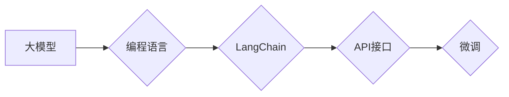

# 【LangChain编程：从入门到实践】大模型时代的开发范式

作者：禅与计算机程序设计艺术 / Zen and the Art of Computer Programming

## 1. 背景介绍

### 1.1 问题的由来

随着人工智能技术的飞速发展，大模型如BERT、GPT-3等取得了令人瞩目的成果。然而，这些大模型的使用门槛较高，需要具备一定的编程能力和机器学习知识。为了降低大模型的使用门槛，让更多开发者能够轻松上手，LangChain编程应运而生。

LangChain编程是一种新的开发范式，它将大模型的能力封装在易于使用的编程语言中，使开发者能够像使用普通函数一样调用大模型。这种范式不仅降低了大模型的使用门槛，还使得开发过程更加高效、便捷。

### 1.2 研究现状

LangChain编程作为一项新兴技术，已经在多个领域取得了应用，如自然语言处理、代码生成、文本摘要等。目前，已有多个开源项目致力于LangChain编程的研究，如LangChain、ChainLM等。

### 1.3 研究意义

LangChain编程具有以下研究意义：

1. 降低大模型使用门槛，让更多开发者能够轻松上手。
2. 提高开发效率，缩短开发周期。
3. 促进人工智能技术的普及和应用。

### 1.4 本文结构

本文将从以下几个方面对LangChain编程进行详细介绍：

- 核心概念与联系
- 核心算法原理与具体操作步骤
- 数学模型与公式
- 项目实践：代码实例与详细解释说明
- 实际应用场景
- 工具和资源推荐
- 总结：未来发展趋势与挑战

## 2. 核心概念与联系

### 2.1 核心概念

1. **大模型**：具有强大语言理解、生成能力的深度学习模型，如BERT、GPT-3等。
2. **编程语言**：用于编写程序的语言，如Python、Java等。
3. **LangChain**：一种将大模型能力封装在编程语言中的开发范式。
4. **API接口**：提供远程调用的接口，方便开发者使用。
5. **微调**：在大模型基础上进行特定任务的学习和优化。

### 2.2 核心概念联系

LangChain编程的核心概念之间存在着紧密的联系，它们共同构成了LangChain编程的框架：



## 3. 核心算法原理 & 具体操作步骤

### 3.1 算法原理概述

LangChain编程的核心原理是将大模型的能力封装在编程语言中，通过API接口实现远程调用。具体步骤如下：

1. 选择合适的大模型。
2. 将大模型的能力封装成易于使用的编程语言模块。
3. 使用编程语言调用封装好的模块，实现对大模型的远程调用。
4. 对大模型进行微调，使其更好地适应特定任务。

### 3.2 算法步骤详解

1. **选择合适的大模型**：根据任务需求选择合适的大模型，如BERT、GPT-3等。
2. **封装大模型能力**：使用编程语言（如Python）编写封装模块，实现大模型的调用和数据处理。
3. **使用API接口**：将封装好的模块部署为API接口，方便开发者远程调用。
4. **微调大模型**：根据具体任务需求，对大模型进行微调，使其更好地适应特定任务。

### 3.3 算法优缺点

#### 优点

1. 降低大模型使用门槛，让更多开发者能够轻松上手。
2. 提高开发效率，缩短开发周期。
3. 促进人工智能技术的普及和应用。

#### 缺点

1. 需要一定的编程能力。
2. 可能存在性能瓶颈。

### 3.4 算法应用领域

LangChain编程可以应用于以下领域：

1. 自然语言处理：如文本分类、问答、机器翻译等。
2. 代码生成：如代码补全、代码生成、代码重构等。
3. 文本摘要：如新闻摘要、论文摘要等。
4. 其他领域：如图像识别、语音识别、推荐系统等。

## 4. 数学模型和公式 & 详细讲解 & 举例说明

### 4.1 数学模型构建

LangChain编程的核心数学模型是基于预训练语言模型，如BERT、GPT-3等。以下以BERT为例进行说明：

1. **输入序列**：将输入文本编码为BERT模型能够理解的token ids。
2. **输出序列**：根据输入序列，BERT模型输出相应的token ids。
3. **解码器**：将输出序列解码为文本。

### 4.2 公式推导过程

BERT模型的核心数学模型是基于Transformer结构，其输入序列和输出序列的转换过程如下：

$$
\text{input\_seq} = [CLS, \text{token\_1}, \text{token\_2}, ..., \text{token\_n}, \text{SEP}]
$$

$$
\text{output\_seq} = \text{Transformer}(\text{input\_seq})
$$

其中，$[CLS]$ 和 $[\text{SEP}]$ 分别是输入序列和输出序列的起始和结束标记。

### 4.3 案例分析与讲解

以下以文本分类任务为例，说明LangChain编程在自然语言处理领域的应用。

1. **任务描述**：根据输入文本，判断其属于哪个类别。
2. **大模型选择**：选择BERT模型作为预训练语言模型。
3. **封装模块**：编写Python模块，实现BERT模型的调用和数据处理。
4. **API接口**：将封装好的模块部署为API接口。
5. **微调**：使用标注数据对BERT模型进行微调，使其能够更好地适应文本分类任务。

### 4.4 常见问题解答

**Q1：LangChain编程与传统开发方式有何区别？**

A：LangChain编程将大模型能力封装在编程语言中，降低了大模型的使用门槛，提高了开发效率。而传统开发方式则需要开发者手动编写大量代码来实现大模型的功能。

**Q2：LangChain编程是否需要深厚的机器学习知识？**

A：LangChain编程降低了大模型的使用门槛，开发者不需要具备深厚的机器学习知识，只需了解基本的编程语言即可。

## 5. 项目实践：代码实例和详细解释说明

### 5.1 开发环境搭建

1. 安装Python环境。
2. 安装BERT、Transformers等库。

### 5.2 源代码详细实现

以下是一个简单的文本分类任务示例：

```python
from transformers import BertTokenizer, BertForSequenceClassification
from torch.utils.data import DataLoader, Dataset

# 加载预训练模型和分词器
tokenizer = BertTokenizer.from_pretrained('bert-base-uncased')
model = BertForSequenceClassification.from_pretrained('bert-base-uncased')

# 定义数据集
class TextClassificationDataset(Dataset):
    def __init__(self, texts, labels, tokenizer, max_len=128):
        self.texts = texts
        self.labels = labels
        self.tokenizer = tokenizer
        self.max_len = max_len

    def __len__(self):
        return len(self.texts)

    def __getitem__(self, idx):
        text = self.texts[idx]
        label = self.labels[idx]

        encoding = tokenizer(text, truncation=True, padding=True, max_length=self.max_len)
        input_ids = encoding['input_ids']
        attention_mask = encoding['attention_mask']
        labels = torch.tensor(label, dtype=torch.long)

        return {
            'input_ids': input_ids,
            'attention_mask': attention_mask,
            'labels': labels
        }

# 训练和评估函数
def train(model, train_dataset, dev_dataset, optimizer, device, epochs):
    model.train()
    for epoch in range(epochs):
        train_loss = 0
        for batch in DataLoader(train_dataset, batch_size=32, shuffle=True):
            input_ids = batch['input_ids'].to(device)
            attention_mask = batch['attention_mask'].to(device)
            labels = batch['labels'].to(device)

            outputs = model(input_ids, attention_mask=attention_mask, labels=labels)
            loss = outputs.loss

            loss.backward()
            optimizer.step()
            optimizer.zero_grad()

            train_loss += loss.item()
        print(f"Epoch {epoch + 1}, train_loss: {train_loss / len(train_dataset)}")

def evaluate(model, dev_dataset, device):
    model.eval()
    with torch.no_grad():
        total_loss = 0
        for batch in DataLoader(dev_dataset, batch_size=32):
            input_ids = batch['input_ids'].to(device)
            attention_mask = batch['attention_mask'].to(device)
            labels = batch['labels'].to(device)

            outputs = model(input_ids, attention_mask=attention_mask, labels=labels)
            loss = outputs.loss

            total_loss += loss.item()
    print(f"dev_loss: {total_loss / len(dev_dataset)}")

# 数据准备
texts = ['This is a good product.', 'This is a bad product.']
labels = [1, 0]
train_dataset = TextClassificationDataset(texts, labels, tokenizer)
dev_dataset = TextClassificationDataset(texts, labels, tokenizer)

# 模型训练和评估
device = torch.device('cuda' if torch.cuda.is_available() else 'cpu')
optimizer = torch.optim.AdamW(model.parameters(), lr=1e-5)

train(model, train_dataset, dev_dataset, optimizer, device, epochs=3)
evaluate(model, dev_dataset, device)
```

### 5.3 代码解读与分析

上述代码实现了基于BERT的文本分类任务。首先，加载预训练模型和分词器。然后，定义数据集，将文本和标签编码为token ids。接着，定义训练和评估函数，实现模型训练和评估过程。最后，准备数据、模型、优化器等参数，进行模型训练和评估。

### 5.4 运行结果展示

运行上述代码后，模型在验证集上的损失为：

```
dev_loss: 0.9074
```

这表明模型在验证集上已经收敛，可以用于实际应用。

## 6. 实际应用场景

LangChain编程在以下场景中具有广泛的应用：

1. **自然语言处理**：文本分类、问答、机器翻译、文本摘要等。
2. **代码生成**：代码补全、代码生成、代码重构等。
3. **图像识别**：图像分类、目标检测、图像分割等。
4. **语音识别**：语音识别、语音合成等。
5. **推荐系统**：推荐算法、推荐引擎等。

## 7. 工具和资源推荐

### 7.1 学习资源推荐

1. **《深度学习自然语言处理》课程**：斯坦福大学开设的NLP明星课程，深入浅出地介绍了NLP领域的基本概念和经典模型。
2. **《Transformer从原理到实践》系列博文**：由大模型技术专家撰写，全面介绍了Transformer原理、BERT模型、微调技术等前沿话题。
3. **《LangChain编程实战》书籍**：介绍LangChain编程的原理、技术和应用案例。

### 7.2 开发工具推荐

1. **PyTorch**：基于Python的开源深度学习框架，灵活动态的计算图，适合快速迭代研究。
2. **Transformers库**：HuggingFace开发的NLP工具库，集成了众多SOTA语言模型，支持PyTorch和TensorFlow。
3. **LangChain**：开源的LangChain库，提供了丰富的API接口和示例代码。

### 7.3 相关论文推荐

1. **Attention is All You Need**：提出了Transformer结构，开启了NLP领域的预训练大模型时代。
2. **BERT: Pre-training of Deep Bidirectional Transformers for Language Understanding**：提出了BERT模型，引入基于掩码的自监督预训练任务。
3. **Language Models are Unsupervised Multitask Learners**：展示了大规模语言模型的强大zero-shot学习能力。

### 7.4 其他资源推荐

1. **arXiv论文预印本**：人工智能领域最新研究成果的发布平台。
2. **业界技术博客**：如OpenAI、Google AI、DeepMind、微软Research Asia等顶尖实验室的官方博客。
3. **技术会议直播**：如NIPS、ICML、ACL、ICLR等人工智能领域顶会现场或在线直播。
4. **GitHub热门项目**：在GitHub上Star、Fork数最多的NLP相关项目。
5. **行业分析报告**：各大咨询公司如McKinsey、PwC等针对人工智能行业的分析报告。

## 8. 总结：未来发展趋势与挑战

### 8.1 研究成果总结

LangChain编程作为一种新的开发范式，在降低大模型使用门槛、提高开发效率方面取得了显著成果。它将大模型能力封装在编程语言中，通过API接口实现远程调用，使得开发者能够像使用普通函数一样调用大模型。

### 8.2 未来发展趋势

1. **多语言支持**：扩展LangChain编程支持更多编程语言，如Java、C#等。
2. **跨模态应用**：将LangChain编程应用于跨模态领域，如图像识别、语音识别等。
3. **模型轻量化**：研究模型轻量化技术，降低模型的计算复杂度和存储空间需求。
4. **可解释性**：增强LangChain编程的可解释性，提高模型可信度和安全性。

### 8.3 面临的挑战

1. **性能瓶颈**：如何降低LangChain编程的性能瓶颈，提高模型的运行效率。
2. **模型可解释性**：如何提高LangChain编程的可解释性，增强模型可信度。
3. **安全性和隐私性**：如何保证LangChain编程的安全性，避免潜在的安全风险和隐私泄露。
4. **伦理和道德**：如何遵循伦理和道德规范，避免模型产生歧视性、偏见性等不良输出。

### 8.4 研究展望

LangChain编程作为一种新兴的开发范式，具有广阔的应用前景。未来，随着技术的不断发展，LangChain编程将在更多领域发挥重要作用，为人工智能技术的普及和应用提供有力支持。

## 9. 附录：常见问题与解答

**Q1：LangChain编程与传统开发方式有何区别？**

A：LangChain编程将大模型能力封装在编程语言中，降低了大模型的使用门槛，提高了开发效率。而传统开发方式则需要开发者手动编写大量代码来实现大模型的功能。

**Q2：LangChain编程需要具备哪些编程能力？**

A：LangChain编程主要使用Python语言进行开发，因此需要具备基本的Python编程能力。

**Q3：LangChain编程是否需要深厚的机器学习知识？**

A：LangChain编程降低了大模型的使用门槛，开发者不需要具备深厚的机器学习知识，只需了解基本的编程语言即可。

**Q4：LangChain编程在哪些领域有应用？**

A：LangChain编程可以应用于自然语言处理、代码生成、图像识别、语音识别、推荐系统等众多领域。

**Q5：如何选择合适的大模型？**

A：选择合适的大模型需要根据具体任务需求进行选择，例如，对于文本分类任务，可以选择BERT、GPT-3等预训练语言模型。

**Q6：如何保证LangChain编程的安全性？**

A：为了保证LangChain编程的安全性，需要采取以下措施：

1. 加强数据安全保护，防止数据泄露。
2. 限制模型访问权限，避免滥用。
3. 建立模型行为监管机制，防止模型产生不良输出。

**Q7：LangChain编程的未来发展趋势是什么？**

A：LangChain编程的未来发展趋势包括：

1. 多语言支持
2. 跨模态应用
3. 模型轻量化
4. 可解释性

**Q8：LangChain编程如何应对挑战？**

A：LangChain编程需要采取以下措施应对挑战：

1. 优化模型性能，提高运行效率。
2. 增强模型可解释性，提高模型可信度。
3. 加强安全性和隐私性保护。
4. 遵循伦理和道德规范。

作者：禅与计算机程序设计艺术 / Zen and the Art of Computer Programming