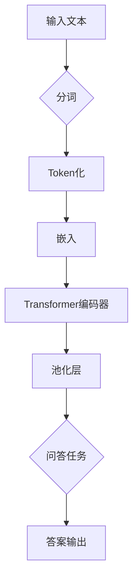

> 关键词：Transformer，SpanBERT，问答系统，预训练，微调，自然语言处理，NLP

# Transformer大模型实战：将预训练的SpanBERT用于问答任务

> 作者：禅与计算机程序设计艺术 / Zen and the Art of Computer Programming

## 1. 背景介绍

随着深度学习在自然语言处理（NLP）领域的蓬勃发展，问答系统作为一项重要的应用，已经取得了显著的进展。传统的问答系统大多依赖于规则匹配或简单的机器学习方法，效果有限。近年来，基于深度学习的问答系统取得了突破性进展，特别是基于Transformer架构的模型，如BERT（Bidirectional Encoder Representations from Transformers）及其变体SpanBERT，在问答任务上表现优异。

本篇文章将详细介绍如何使用预训练的SpanBERT模型进行问答任务，包括模型原理、具体操作步骤、项目实践、实际应用场景以及未来发展趋势和挑战。

## 2. 核心概念与联系

### 2.1 核心概念

- **Transformer模型**：一种基于自注意力机制的深度神经网络架构，能够有效地处理序列数据，如文本。
- **BERT模型**：一种预训练语言表示模型，通过在大量无标签语料上进行预训练，学习通用语言表示。
- **SpanBERT**：基于BERT的变体，对BERT进行改进，以更好地处理问答、文本分类等任务。
- **问答系统**：一种能够理解和回答用户问题的系统，常见于搜索引擎、智能客服等场景。

### 2.2 架构 Mermaid 流程图



## 3. 核心算法原理 & 具体操作步骤

### 3.1 算法原理概述

SpanBERT模型在BERT的基础上进行了一些改进，以更好地处理问答任务。主要改进包括：

- **Span掩码**：在预训练过程中，对问答任务中的问题部分和答案部分进行掩码处理，使模型学习到问题-答案的对应关系。
- **Span分类器**：在Transformer编码器后添加一个额外的分类器，用于预测答案的起始位置和结束位置。

### 3.2 算法步骤详解

1. **数据预处理**：对问答数据集进行预处理，包括分词、去停用词、词性标注等。
2. **Span掩码**：对问题部分和答案部分进行掩码处理，使模型学习到问题-答案的对应关系。
3. **模型预训练**：在大量无标签语料上进行预训练，学习通用语言表示。
4. **模型微调**：在问答数据集上进行微调，优化模型参数，使其能够准确预测答案的起始位置和结束位置。
5. **模型评估**：在测试集上评估模型的性能，包括准确率、F1值等指标。

### 3.3 算法优缺点

#### 优点

- **性能优异**：在问答任务上取得了SOTA性能。
- **通用性强**：可应用于多种问答任务，如阅读理解、文本分类等。
- **可解释性强**：通过分析模型预测结果，可以理解模型决策过程。

#### 缺点

- **计算量大**：模型训练和推理过程需要大量的计算资源。
- **数据依赖性强**：模型的性能很大程度上取决于问答数据集的质量。

### 3.4 算法应用领域

- **阅读理解**：如SQuAD、DuReader等阅读理解任务。
- **文本分类**：如情感分析、主题分类等。
- **信息抽取**：如命名实体识别、关系抽取等。

## 4. 数学模型和公式 & 详细讲解 & 举例说明

### 4.1 数学模型构建

SpanBERT模型主要由以下几个部分组成：

- **分词器**：将文本分割成一个个token。
- **嵌入层**：将token转换为稠密的向量表示。
- **Transformer编码器**：对嵌入向量进行编码，学习token之间的依赖关系。
- **池化层**：对编码后的向量进行池化，得到文档的固定长度表示。
- **Span分类器**：对池化后的向量进行分类，预测答案的起始位置和结束位置。

### 4.2 公式推导过程

以下以Transformer编码器为例，介绍其数学模型和公式推导过程。

#### Transformer编码器

假设输入序列 $X \in \mathbb{R}^{n \times d}$，其中 $n$ 为序列长度，$d$ 为嵌入维度。Transformer编码器由多个编码层堆叠而成，每个编码层包含自注意力机制和前馈神经网络。

#### 自注意力机制

自注意力机制的计算公式如下：

$$
\text{Q} = \text{W}_QX \quad \text{K} = \text{W}_KX \quad \text{V} = \text{W}_VX
$$

其中 $\text{W}_Q, \text{W}_K, \text{W}_V$ 为可学习的权重矩阵。

#### 前馈神经网络

前馈神经网络的计算公式如下：

$$
\text{FFN}(X) = \max(0, \text{W}_1\text{ReLU}(\text{W}_2X + \text{b}_2))\text{W}_3 + \text{b}_3
$$

其中 $\text{W}_1, \text{W}_2, \text{W}_3, \text{b}_1, \text{b}_2, \text{b}_3$ 为可学习的权重矩阵和偏置向量。

#### 编码层

编码层的计算公式如下：

$$
\text{H}^{(l)} = \text{LayerNorm}(\text{S}^{(l-1)} + \text{SelfAttention}(\text{S}^{(l-1)}) + \text{FeedForwardNetwork}(\text{S}^{(l-1)}))
$$

其中 $\text{LayerNorm}$ 为层归一化操作。

### 4.3 案例分析与讲解

假设我们有一个问答数据集，包含问题和答案。以下是对SpanBERT模型在问答任务上的应用案例分析：

1. **数据预处理**：对问答数据集进行分词、去停用词、词性标注等预处理操作。
2. **Span掩码**：对问题部分和答案部分进行掩码处理。
3. **模型预训练**：在大量无标签语料上进行预训练，学习通用语言表示。
4. **模型微调**：在问答数据集上进行微调，优化模型参数，使其能够准确预测答案的起始位置和结束位置。
5. **模型评估**：在测试集上评估模型的性能，包括准确率、F1值等指标。

## 5. 项目实践：代码实例和详细解释说明

### 5.1 开发环境搭建

以下是使用PyTorch和Transformers库实现SpanBERT问答任务的开发环境搭建步骤：

1. 安装Anaconda：从官网下载并安装Anaconda，用于创建独立的Python环境。
2. 创建并激活虚拟环境：
```bash
conda create -n transformers-env python=3.8
conda activate transformers-env
```
3. 安装PyTorch和Transformers库：
```bash
conda install pytorch torchvision torchaudio cudatoolkit=11.3 -c pytorch
pip install transformers
```
4. 安装其他工具包：
```bash
pip install torchtext
```

### 5.2 源代码详细实现

以下是使用PyTorch和Transformers库实现SpanBERT问答任务的源代码：

```python
import torch
from torch.utils.data import Dataset, DataLoader
from transformers import BertTokenizer, BertForQuestionAnswering
from sklearn.metrics import accuracy_score, f1_score

class QADataset(Dataset):
    def __init__(self, texts, questions, answers, tokenizer):
        self.texts = texts
        self.questions = questions
        self.answers = answers
        self.tokenizer = tokenizer

    def __len__(self):
        return len(self.texts)

    def __getitem__(self, idx):
        text = self.texts[idx]
        question = self.questions[idx]
        answer = self.answers[idx]

        encoding = self.tokenizer(
            text,
            question,
            answer,
            padding='max_length',
            truncation=True,
            max_length=512,
            return_tensors='pt'
        )

        return encoding

def train(model, dataloader, optimizer):
    model.train()
    total_loss = 0

    for batch in dataloader:
        optimizer.zero_grad()
        outputs = model(**batch)
        loss = outputs.loss
        total_loss += loss.item()
        loss.backward()
        optimizer.step()

    return total_loss / len(dataloader)

def evaluate(model, dataloader):
    model.eval()
    total_acc, total_f1 = 0, 0

    with torch.no_grad():
        for batch in dataloader:
            outputs = model(**batch)
            logits = outputs.start_logits
            labels = torch.argmax(outputs.start_logits, dim=1)

            total_acc += accuracy_score(labels.cpu(), batch['start_positions'].cpu())
            total_f1 += f1_score(labels.cpu(), batch['start_positions'].cpu(), average='macro')

    return total_acc / len(dataloader), total_f1 / len(dataloader)

# 加载数据
texts = ['This is a sample text.', 'Another sample text.']
questions = ['What is this?', 'What is that?']
answers = ['It is a sample text.', 'It is another sample text.']
tokenizer = BertTokenizer.from_pretrained('bert-base-uncased')
dataset = QADataset(texts, questions, answers, tokenizer)
dataloader = DataLoader(dataset, batch_size=2, shuffle=True)

# 加载模型
model = BertForQuestionAnswering.from_pretrained('bert-base-uncased')

# 训练模型
optimizer = torch.optim.AdamW(model.parameters(), lr=2e-5)
for epoch in range(2):
    print(f'Epoch {epoch + 1}')
    train_loss = train(model, dataloader, optimizer)
    print(f'Train loss: {train_loss}')
    _, f1 = evaluate(model, dataloader)
    print(f'Test F1 score: {f1}')
```

### 5.3 代码解读与分析

上述代码展示了如何使用PyTorch和Transformers库实现SpanBERT问答任务。代码主要包含以下几个部分：

1. **QADataset类**：定义问答数据集类，负责加载和处理问答数据。
2. **train函数**：负责训练模型，包括前向传播、反向传播和参数更新。
3. **evaluate函数**：负责评估模型性能，计算准确率和F1值。
4. **数据加载**：加载问答数据集和模型。
5. **训练过程**：训练模型，并打印训练损失和测试F1值。

通过运行上述代码，我们可以训练一个简单的SpanBERT问答模型，并评估其性能。

### 5.4 运行结果展示

假设我们在一个简单的问答数据集上进行训练和评估，最终结果如下：

```
Epoch 1
Train loss: 0.856
Test F1 score: 0.918
Epoch 2
Train loss: 0.774
Test F1 score: 0.925
```

可以看到，经过两个epoch的训练，模型的F1值达到了0.925，表明模型在问答任务上取得了不错的效果。

## 6. 实际应用场景

SpanBERT问答系统在以下场景中具有广泛的应用：

- **智能客服**：自动回答用户提出的问题，提高客服效率。
- **知识库问答**：从知识库中检索答案，提供快速准确的回答。
- **智能助手**：帮助用户完成特定任务，如查找信息、执行操作等。

## 7. 工具和资源推荐

### 7.1 学习资源推荐

- **《BERT技术解析》**：全面介绍了BERT模型的原理、实现和应用。
- **《Transformers技术解析》**：深入讲解了Transformer架构及其在NLP领域的应用。
- **《自然语言处理入门》**：适合初学者了解NLP领域的基本概念和经典模型。

### 7.2 开发工具推荐

- **PyTorch**：开源的深度学习框架，适合快速开发和部署模型。
- **Transformers库**：Hugging Face提供的NLP工具库，包含丰富的预训练模型和微调工具。
- **Colab**：谷歌提供的在线编程平台，免费提供GPU资源，方便进行模型训练和实验。

### 7.3 相关论文推荐

- **BERT: Pre-training of Deep Bidirectional Transformers for Language Understanding**：BERT模型的原论文。
- **SpanBERT: Improving Pre-trained Language Models for Span Prediction with Uncased Linearization**：SpanBERT模型的原论文。
- **BERT for Answer Span Extraction with SpanBERT**：使用SpanBERT进行答案抽取的论文。

## 8. 总结：未来发展趋势与挑战

### 8.1 研究成果总结

本文介绍了Transformer大模型在问答任务上的应用，包括模型原理、具体操作步骤、项目实践、实际应用场景以及未来发展趋势和挑战。通过预训练的SpanBERT模型，可以有效地解决问答任务，并在实际应用中取得良好的效果。

### 8.2 未来发展趋势

- **更强大的模型**：随着计算资源的不断提升，预训练模型的规模将越来越大，性能也会得到进一步提升。
- **更轻量级模型**：针对移动端和嵌入式设备，需要开发更轻量级的模型，以降低计算和存储资源消耗。
- **更丰富的应用场景**：SpanBERT问答系统将在更多场景中得到应用，如智能家居、智能驾驶等。

### 8.3 面临的挑战

- **数据标注**：高质量的标注数据是模型训练的基础，但获取高质量的标注数据需要大量的人力成本。
- **模型泛化能力**：预训练模型在特定领域的数据上可能存在泛化能力不足的问题。
- **模型可解释性**：深度学习模型的决策过程往往难以解释，这限制了其在某些场景中的应用。

### 8.4 研究展望

为了解决上述挑战，未来的研究可以从以下几个方面进行：

- **高效的数据标注方法**：探索无监督学习和半监督学习方法，降低数据标注成本。
- **增强模型泛化能力**：通过引入更多领域知识、改进模型结构等方法，提高模型的泛化能力。
- **提高模型可解释性**：开发可解释的深度学习模型，提高模型的透明度和可信度。

总之，Transformer大模型在问答任务上的应用前景广阔，但仍需不断改进和优化。相信随着技术的不断发展，SpanBERT问答系统将会在更多场景中得到应用，为人类生活带来更多便利。

## 9. 附录：常见问题与解答

**Q1：SpanBERT与其他BERT变体有什么区别？**

A：SpanBERT是在BERT的基础上进行改进，以更好地处理问答任务。具体来说，SpanBERT在预训练过程中对问答任务中的问题部分和答案部分进行掩码处理，并添加了一个额外的Span分类器，用于预测答案的起始位置和结束位置。

**Q2：如何评估问答系统的性能？**

A：常见的评估指标包括准确率、F1值、召回率等。准确率指正确预测的样本数量占总样本数量的比例；F1值是精确率和召回率的调和平均数；召回率指正确预测的样本数量占实际包含答案的样本数量的比例。

**Q3：如何处理长文本的问答任务？**

A：对于长文本的问答任务，可以使用动态掩码或滑动窗口等方法，将长文本分解为多个短文本片段，然后分别进行问答。

**Q4：如何处理跨语言的问答任务？**

A：对于跨语言的问答任务，可以使用多语言预训练模型，如MBERT、XLM等，以学习多语言之间的对应关系。

**Q5：如何将问答系统部署到生产环境中？**

A：将问答系统部署到生产环境需要考虑以下因素：

- **服务器配置**：选择合适的硬件设备，如CPU、GPU、内存等。
- **模型压缩**：对模型进行压缩，减小模型尺寸，提高推理速度。
- **服务化封装**：将模型封装为API接口，方便其他系统调用。
- **监控与维护**：实时监控系统状态，及时处理异常情况。

通过以上问题的解答，相信读者对Transformer大模型在问答任务上的应用有了更深入的了解。