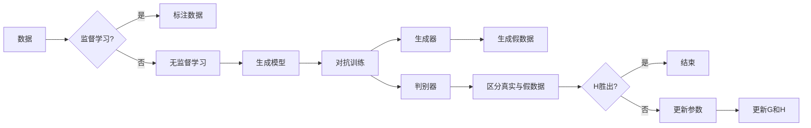

> 生成对抗网络，GAN，深度学习，无监督学习，生成模型，图像生成，数据增强，对抗训练

# 一切皆是映射：生成对抗网络(GAN)原理剖析

## 1. 背景介绍

生成对抗网络（Generative Adversarial Networks，GAN）自2014年由Ian Goodfellow等研究者提出以来，就在深度学习领域引起了广泛的关注。GAN因其独特的无监督学习方式和对复杂数据分布的建模能力，成为图像生成、数据增强、视频处理等领域的核心技术。本文将深入剖析GAN的原理，探讨其具体操作步骤，分析其优缺点，并展望其未来发展趋势。

## 2. 核心概念与联系

### 2.1 核心概念

#### 监督学习与无监督学习

监督学习（Supervised Learning）依赖于标注数据来训练模型，模型的目标是学习输入和输出之间的映射关系。而无监督学习（Unsupervised Learning）则是在没有标签数据的情况下，通过学习数据中的内在结构来发现数据分布。

#### 生成模型

生成模型（Generative Model）旨在学习数据分布，并能够生成具有相似分布的新数据。常见的生成模型包括马尔可夫链蒙特卡洛方法、变分自编码器（VAE）等。

#### 对抗训练

对抗训练（Adversarial Training）是一种训练两个神经网络相互竞争的机制。其中一个网络称为生成器（Generator），另一个网络称为判别器（Discriminator）。生成器尝试生成看起来像真实数据的假数据，而判别器则试图区分真实数据和生成器生成的假数据。

### 2.2 架构的 Mermaid 流程图



### 2.3 核心概念之间的联系

GAN通过对抗训练的方式，将生成模型与对抗训练结合，从而在没有标注数据的情况下学习数据分布。

## 3. 核心算法原理 & 具体操作步骤

### 3.1 算法原理概述

GAN由生成器和判别器两个神经网络组成，它们在对抗训练中相互竞争，以学习真实数据分布。

- 生成器：试图生成看起来像真实数据的假数据。
- 判别器：试图区分真实数据和生成器生成的假数据。

两个网络通过交替更新参数来相互竞争，直至达到平衡状态。

### 3.2 算法步骤详解

1. 初始化生成器和判别器参数。
2. 判别器对真实数据和生成器生成的假数据进行区分。
3. 根据判别器的输出，生成器调整参数，生成更难被判别器区分的假数据。
4. 重复步骤2和3，直至生成器和判别器达到平衡状态。

### 3.3 算法优缺点

#### 优点

- 无需标注数据，适用于无监督学习场景。
- 可以生成具有复杂结构和多样性的数据。
- 在图像生成、数据增强等领域取得了显著成果。

#### 缺点

- 训练过程不稳定，容易陷入模式崩溃（mode collapse）。
- 模型可解释性较差，难以理解模型的生成过程。
- 在某些任务中，GAN可能不如其他生成模型或监督学习方法。

### 3.4 算法应用领域

- 图像生成：生成逼真的图像、视频、艺术作品等。
- 数据增强：为训练深度学习模型生成更多的训练数据。
- 视频处理：生成新的视频帧、修复损坏的视频等。
- 语音合成：生成逼真的语音波形。

## 4. 数学模型和公式 & 详细讲解 & 举例说明

### 4.1 数学模型构建

GAN的数学模型可以表示为：

$$
\begin{aligned}
\min_{G} \quad & \mathbb{E}_{x \sim p_{data}(x)}[-\log D(x)] \\
\max_{D} \quad & \mathbb{E}_{x \sim G(z)}[\log D(x)] + \mathbb{E}_{x \sim p_{data}(x)}[\log (1-D(x))]
\end{aligned}
$$

其中，$G(z)$ 是生成器的参数化函数，$D(x)$ 是判别器的参数化函数，$p_{data}(x)$ 是真实数据分布，$z$ 是从先验分布 $p(z)$ 中采样的随机噪声。

### 4.2 公式推导过程

GAN的目标是最小化生成器生成的假数据被判别器判为真实数据的概率，最大化判别器判断假数据的概率。

### 4.3 案例分析与讲解

以下是一个简单的GAN例子，生成手写数字图像。

- 判别器：使用卷积神经网络，判断图像是真实数据还是生成器生成的假数据。
- 生成器：使用卷积神经网络，从随机噪声生成手写数字图像。

通过训练，生成器能够生成越来越像真实数字的图像。

## 5. 项目实践：代码实例和详细解释说明

### 5.1 开发环境搭建

1. 安装Python环境。
2. 安装深度学习库，如TensorFlow或PyTorch。
3. 安装图像处理库，如PIL或OpenCV。

### 5.2 源代码详细实现

以下是一个简单的GAN示例，使用PyTorch实现。

```python
import torch
import torch.nn as nn
import torch.optim as optim
from torchvision import datasets, transforms
from torch.utils.data import DataLoader

# 定义生成器和判别器
class Generator(nn.Module):
    # ... 定义生成器的网络结构 ...

class Discriminator(nn.Module):
    # ... 定义判别器的网络结构 ...

# 初始化模型
generator = Generator()
discriminator = Discriminator()

# 定义损失函数和优化器
criterion = nn.BCELoss()
optimizer_G = optim.Adam(generator.parameters(), lr=0.0002)
optimizer_D = optim.Adam(discriminator.parameters(), lr=0.0002)

# 加载数据集
transform = transforms.Compose([
    transforms.ToTensor(),
    transforms.Normalize((0.5, 0.5, 0.5), (0.5, 0.5, 0.5))
])

dataset = datasets.MNIST(root='./data', train=True, transform=transform, download=True)
dataloader = DataLoader(dataset, batch_size=64, shuffle=True)

# 训练模型
for epoch in range(epochs):
    for i, (real_images, _) in enumerate(dataloader):
        # ... 训练生成器和判别器 ...
```

### 5.3 代码解读与分析

以上代码实现了最基本的GAN结构，包括生成器和判别器的定义、损失函数和优化器的设置、数据集加载以及模型训练过程。

### 5.4 运行结果展示

训练过程中，生成器会逐渐生成越来越像真实数字的图像。最终，可以在生成器生成图像上看到类似数字的手写图像。

## 6. 实际应用场景

GAN在图像生成、数据增强、视频处理等领域有广泛的应用，以下是一些具体的应用场景：

- **图像生成**：生成逼真的面部图像、艺术作品、3D模型等。
- **数据增强**：为训练深度学习模型生成更多的训练数据，提高模型的泛化能力。
- **视频处理**：生成新的视频帧、修复损坏的视频等。
- **语音合成**：生成逼真的语音波形。

## 7. 工具和资源推荐

### 7.1 学习资源推荐

- 《Generative Adversarial Nets》论文：GAN的原始论文，详细介绍了GAN的原理和实现。
- 《Deep Learning with Python》书籍：介绍深度学习基础和GAN的实践案例。
- GAN官方GitHub仓库：包含了大量的GAN代码和实现。

### 7.2 开发工具推荐

- TensorFlow：开源的深度学习框架，支持GAN的搭建和训练。
- PyTorch：开源的深度学习框架，支持GAN的搭建和训练。
- Keras：高级神经网络API，可以方便地搭建和训练GAN。

### 7.3 相关论文推荐

- **Stacked Generative Adversarial Networks**：提出了Stacked GAN结构，提高了GAN的稳定性和生成质量。
- **Unsupervised Representation Learning with Deep Convolutional Generative Adversarial Networks**：提出了DCGAN结构，是目前最常用的GAN之一。
- **Conditional Image Generation with PixelCNN, Conditional GANs, and Deep Convolutional Generative Adversarial Networks**：提出了条件GAN和DCGAN结构，在图像生成领域取得了很好的效果。

## 8. 总结：未来发展趋势与挑战

### 8.1 研究成果总结

GAN作为一种创新的深度学习框架，在图像生成、数据增强等领域取得了显著成果。然而，GAN仍面临着训练不稳定、可解释性差等挑战。

### 8.2 未来发展趋势

- **提高训练稳定性**：通过改进算法和模型结构，提高GAN的训练稳定性，避免模式崩溃等问题。
- **增强可解释性**：研究GAN的可解释性，使研究人员和开发者能够更好地理解GAN的生成过程。
- **拓展应用领域**：将GAN应用于更多领域，如语音合成、文本生成、视频生成等。

### 8.3 面临的挑战

- **训练不稳定**：GAN的训练过程容易陷入局部最优解，导致训练不稳定。
- **模式崩溃**：生成器生成的数据过于集中在某些特定模式上，缺乏多样性。
- **可解释性差**：GAN的生成过程难以理解，模型的可解释性较差。

### 8.4 研究展望

GAN作为一种强大的生成模型，未来将在更多领域得到应用。同时，针对GAN的挑战，也需要更多研究者和开发者的努力，以推动GAN技术的进一步发展和完善。

## 9. 附录：常见问题与解答

**Q1：GAN的优缺点是什么？**

A1：GAN的优点在于无需标注数据，适用于无监督学习场景，可以生成具有复杂结构和多样性的数据。缺点包括训练不稳定、模式崩溃、可解释性差等。

**Q2：GAN在图像生成中的应用有哪些？**

A2：GAN在图像生成中的应用包括生成逼真的面部图像、艺术作品、3D模型等。

**Q3：如何提高GAN的训练稳定性？**

A3：可以通过改进算法和模型结构来提高GAN的训练稳定性，例如使用多层感知器（MLP）代替卷积神经网络（CNN）。

**Q4：如何解决GAN的模式崩溃问题？**

A4：可以通过增加噪声、使用条件GAN、引入注意力机制等方法来解决GAN的模式崩溃问题。

**Q5：GAN的可解释性如何？**

A5：GAN的可解释性较差，难以理解GAN的生成过程。未来需要更多研究来提高GAN的可解释性。

作者：禅与计算机程序设计艺术 / Zen and the Art of Computer Programming