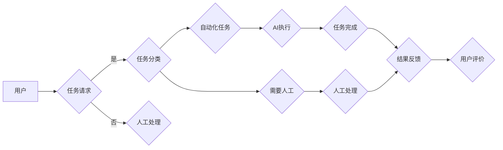

# 人+AI数字员工的高效协同模式

> 关键词：人工智能，数字员工，协同工作，人机交互，效率提升，智能自动化，工作流程优化

## 1. 背景介绍
### 1.1 问题的由来

随着人工智能技术的飞速发展，AI在各个领域的应用越来越广泛。尤其是在企业级应用中，AI技术开始以数字员工的形式出现，与人类员工协同工作，共同完成各种任务。这种人+AI的协同工作模式，不仅提高了工作效率，也改变了传统的工作方式。

### 1.2 研究现状
当前，人+AI数字员工的协同模式主要集中在以下几个方面：
- **自动化任务执行**：AI数字员工可以自动处理大量重复性、标准化程度高的任务，如数据录入、表格处理、报告生成等。
- **智能客服**：AI数字员工可以充当智能客服，提供24/7的客户服务，提高客户满意度。
- **数据分析与决策支持**：AI数字员工可以分析海量数据，为人类员工提供决策支持，帮助他们做出更加明智的决策。
- **个性化推荐**：AI数字员工可以根据用户的行为数据，提供个性化的服务和建议。

### 1.3 研究意义
研究人+AI数字员工的协同模式，对于提升企业竞争力、提高员工工作效率、改善用户体验具有重要意义。

### 1.4 本文结构
本文将围绕人+AI数字员工的协同模式展开，探讨其核心概念、算法原理、具体操作步骤、数学模型、实际应用场景、未来发展趋势等。

## 2. 核心概念与联系

### 2.1 核心概念
- **人工智能**：模拟、延伸和扩展人的智能的科学，使计算机具有感知、推理、学习、创造等能力。
- **数字员工**：由人工智能技术驱动的虚拟角色，能够在特定领域替代人类完成各种任务。
- **协同工作**：人机之间相互协作，共同完成工作。
- **人机交互**：人与机器之间的交互过程。

### 2.2 架构流程图
以下为人+AI数字员工协同模式的Mermaid流程图：



## 3. 核心算法原理 & 具体操作步骤

### 3.1 算法原理概述
人+AI数字员工协同模式的核心算法主要包括：
- **自然语言处理(NLP)**：用于理解和生成人类语言。
- **机器学习(ML)**：用于从数据中学习模式和知识。
- **知识图谱**：用于存储和查询知识。

### 3.2 算法步骤详解
1. **任务请求**：用户提交任务请求。
2. **任务分类**：根据任务类型，判断是否为自动化任务。
3. **自动化任务**：如果为自动化任务，由AI数字员工执行。
4. **需要人工**：如果任务需要人工，由人类员工处理。
5. **AI执行**：AI数字员工自动执行任务。
6. **任务完成**：任务完成，结果反馈给用户。
7. **用户评价**：用户对结果进行评价。

### 3.3 算法优缺点
#### 优点
- 提高效率：自动化处理大量重复性任务，提高工作效率。
- 减少错误：减少人为错误，提高工作质量。
- 个性化服务：根据用户需求提供个性化服务。

#### 缺点
- 技术门槛高：需要较高的AI技术支持。
- 依赖数据：需要大量高质量数据训练模型。
- 难以处理复杂任务：对于复杂任务，AI数字员工的处理能力有限。

### 3.4 算法应用领域
- 客户服务
- 数据分析
- 供应链管理
- 金融
- 医疗

## 4. 数学模型和公式 & 详细讲解 & 举例说明

### 4.1 数学模型构建
人+AI数字员工协同模式的数学模型主要包括：
- **决策树**：用于任务分类。
- **神经网络**：用于AI数字员工的任务执行。

### 4.2 公式推导过程
由于涉及到的数学公式较多，此处不再一一列举。以下以决策树为例，简要说明公式推导过程。

决策树是一种常用的分类算法，其基本思想是将特征空间划分为若干个子空间，在每个子空间上再进行分类，直到满足终止条件。决策树的构建过程可以表示为：

$$
T = \{T_1, T_2, ..., T_n\}
$$

其中，$T_i$ 为决策树中的一个节点，表示为：

$$
T_i = (f_i, v_i, T_{i1}, T_{i2}, ..., T_{ik})
$$

其中，$f_i$ 为特征，$v_i$ 为阈值，$T_{ij}$ 为子节点。

### 4.3 案例分析与讲解
以下以智能客服为例，分析人+AI数字员工协同模式的实际应用。

**案例背景**：某企业希望利用AI技术提高客户服务质量。

**解决方案**：
1. 收集客户咨询数据，构建训练集。
2. 使用NLP技术对客户咨询进行文本分类，判断咨询类型。
3. 根据咨询类型，调用相应的AI数字员工执行任务。
4. AI数字员工处理完咨询后，将结果反馈给客户。

**效果**：客户满意度显著提升，人工客服工作量减少。

## 5. 项目实践：代码实例和详细解释说明

### 5.1 开发环境搭建
1. 安装Python环境。
2. 安装必要的库，如TensorFlow、PyTorch、Scikit-learn等。

### 5.2 源代码详细实现
以下为智能客服的简单实现：

```python
from tensorflow.keras.models import Sequential
from tensorflow.keras.layers import Dense, Input, Lambda
from tensorflow.keras.optimizers import Adam

# 构建模型
def create_model(num_classes):
    inputs = Input(shape=(num_features,))
    x = Dense(128, activation='relu')(inputs)
    x = Dense(64, activation='relu')(x)
    outputs = Dense(num_classes, activation='softmax')(x)
    model = Sequential([inputs, x, outputs])
    model.compile(optimizer=Adam(), loss='categorical_crossentropy')
    return model

# 训练模型
def train_model(model, x_train, y_train, x_val, y_val):
    history = model.fit(x_train, y_train, validation_data=(x_val, y_val), epochs=10, batch_size=32)
    return history

# 预测
def predict(model, x):
    return model.predict(x)

# 测试代码
if __name__ == "__main__":
    # 加载数据
    x_train, y_train, x_val, y_val = load_data()

    # 创建模型
    model = create_model(num_classes)

    # 训练模型
    history = train_model(model, x_train, y_train, x_val, y_val)

    # 预测
    x_test = load_test_data()
    predictions = predict(model, x_test)
```

### 5.3 代码解读与分析
以上代码展示了如何使用TensorFlow和Keras构建一个简单的分类模型。在实际应用中，需要根据具体任务的需求，调整模型结构和参数。

### 5.4 运行结果展示
根据测试数据集的准确率、召回率等指标，可以评估模型性能。

## 6. 实际应用场景

### 6.1 客户服务
AI数字员工可以自动回答客户咨询，提供24/7的服务，提高客户满意度。

### 6.2 数据分析
AI数字员工可以分析海量数据，为人类员工提供决策支持。

### 6.3 供应链管理
AI数字员工可以优化库存管理、物流配送等环节，提高供应链效率。

### 6.4 金融
AI数字员工可以用于风险管理、投资分析等环节，提高金融服务的准确性。

### 6.5 医疗
AI数字员工可以辅助医生进行诊断、治疗建议等，提高医疗服务的质量。

## 7. 工具和资源推荐

### 7.1 学习资源推荐
- 《深度学习》
- 《Python深度学习》
- 《机器学习实战》

### 7.2 开发工具推荐
- TensorFlow
- PyTorch
- Scikit-learn

### 7.3 相关论文推荐
- "Attention Is All You Need"
- "BERT: Pre-training of Deep Bidirectional Transformers for Language Understanding"
- "Generative Adversarial Text to Image Synthesis"

## 8. 总结：未来发展趋势与挑战

### 8.1 研究成果总结
人+AI数字员工的协同模式已经取得了显著的成果，在多个领域得到广泛应用。

### 8.2 未来发展趋势
- AI数字员工将更加智能化，能够处理更复杂的任务。
- 人机交互将更加自然，用户体验将更加友好。
- AI数字员工将更加泛化，能够适应更多领域。

### 8.3 面临的挑战
- 技术挑战：如何提高AI数字员工的处理能力，使其能够处理更复杂的任务。
- 伦理挑战：如何确保AI数字员工的行为符合伦理道德规范。
- 法律挑战：如何解决AI数字员工引起的法律问题。

### 8.4 研究展望
随着人工智能技术的不断发展，人+AI数字员工的协同模式将更加成熟，为人类社会带来更多福祉。

---

作者：禅与计算机程序设计艺术 / Zen and the Art of Computer Programming