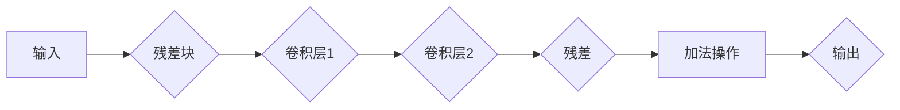

# 从零开始大模型开发与微调：ResNet网络的实现

> 关键词：ResNet, 深度学习, 卷积神经网络, 图像分类, 网络架构，微调, 迁移学习

## 1. 背景介绍

随着深度学习技术的飞速发展，卷积神经网络（CNN）在图像识别、分类等领域取得了突破性的成果。ResNet（残差网络）作为CNN的一个重要里程碑，通过引入残差学习机制，成功解决了深度网络训练过程中的梯度消失和梯度爆炸问题，使得深度网络的层数可以达到更深的水平。本文将深入探讨ResNet网络的原理、实现以及微调技术，帮助读者从零开始掌握大模型开发与微调的技巧。

## 2. 核心概念与联系

### 2.1 核心概念

**残差学习（Residual Learning）**：残差学习是ResNet的核心思想，它通过添加残差块来缓解深层网络训练中的梯度消失和梯度爆炸问题。残差块包含两个卷积层，其中第一个卷积层输出与输入具有相同的维度，第二个卷积层输出为两个维度之差，这两者相加作为残差块输出。

**深度网络（Deep Network）**：深度网络指的是具有多层结构的神经网络，通过层层学习特征，能够提取更加丰富的信息。深度网络的层数越多，理论上能够提取的特征越丰富，但是也会带来梯度消失和梯度爆炸等问题。

**迁移学习（Transfer Learning）**：迁移学习是一种利用已有知识解决新问题的机器学习方法。在深度学习中，迁移学习通过在预训练模型的基础上进行微调，快速适应新的任务。

### 2.2 核心概念原理和架构的 Mermaid 流程图



**流程图说明**：
- 输入经过卷积层1和卷积层2，得到特征图。
- 特征图与输入进行加法操作，得到残差。
- 残差作为输出，传递给下一层。

## 3. 核心算法原理 & 具体操作步骤

### 3.1 算法原理概述

ResNet网络通过引入残差块，将原本的深度网络分解为多个残差块，每个残差块包含两个卷积层，第一个卷积层的输出与输入具有相同的维度，第二个卷积层的输出为两个维度之差。这种结构使得网络训练过程中的梯度可以有效地传播，避免了梯度消失和梯度爆炸问题。

### 3.2 算法步骤详解

1. 定义输入层，接收图像数据。
2. 对输入数据进行预处理，如归一化、裁剪等。
3. 初始化网络结构，包括多个残差块。
4. 对输入数据进行卷积、激活、池化等操作，逐步提取特征。
5. 将特征图与输入进行加法操作，得到残差。
6. 将残差作为下一层的输入，继续进行特征提取。
7. 最后，输出最终的分类结果。

### 3.3 算法优缺点

**优点**：

1. 避免梯度消失和梯度爆炸问题，提高网络训练稳定性。
2. 能够训练更深的网络，提取更丰富的特征。
3. 在多个图像分类任务中取得了优异的性能。

**缺点**：

1. 网络结构复杂，训练和推理时间较长。
2. 需要大量的计算资源和存储空间。

### 3.4 算法应用领域

ResNet网络在图像分类、目标检测、图像分割等多个领域得到了广泛应用，如：

1. 图像分类：CIFAR-10、ImageNet等。
2. 目标检测：Faster R-CNN、YOLO等。
3. 图像分割：U-Net、Mask R-CNN等。

## 4. 数学模型和公式 & 详细讲解 & 举例说明

### 4.1 数学模型构建

ResNet网络的核心是残差块，其数学模型如下：

$$
y = x + F(x)
$$

其中，$y$ 是残差块的输出，$x$ 是残差块的输入，$F(x)$ 是残差块内部的操作。

### 4.2 公式推导过程

假设残差块内部的卷积层1和卷积层2分别为 $C_1$ 和 $C_2$，则有：

$$
y = x + C_2(C_1(x))
$$

其中，$C_1$ 和 $C_2$ 都是卷积操作，可以表示为：

$$
C_1(x) = \sigma(W_1 \cdot x + b_1)
$$

$$
C_2(x) = \sigma(W_2 \cdot x + b_2)
$$

其中，$\sigma$ 是激活函数，$W_1$ 和 $W_2$ 是卷积层的权重，$b_1$ 和 $b_2$ 是卷积层的偏置。

将上述公式代入残差块的数学模型，得到：

$$
y = x + \sigma(W_2 \cdot \sigma(W_1 \cdot x + b_1) + b_2)
$$

### 4.3 案例分析与讲解

以下是一个简单的ResNet网络实例，包含两个残差块：

```python
import torch
import torch.nn as nn

class ResidualBlock(nn.Module):
    def __init__(self, in_channels, out_channels, stride=1):
        super(ResidualBlock, self).__init__()
        self.conv1 = nn.Conv2d(in_channels, out_channels, kernel_size=3, stride=stride, padding=1)
        self.bn1 = nn.BatchNorm2d(out_channels)
        self.relu = nn.ReLU(inplace=True)
        self.conv2 = nn.Conv2d(out_channels, out_channels, kernel_size=3, stride=1, padding=1)
        self.bn2 = nn.BatchNorm2d(out_channels)
        self.shortcut = nn.Sequential()
        if stride != 1 or in_channels != out_channels:
            self.shortcut = nn.Sequential(
                nn.Conv2d(in_channels, out_channels, kernel_size=1, stride=stride),
                nn.BatchNorm2d(out_channels)
            )

    def forward(self, x):
        out = self.relu(self.bn1(self.conv1(x)))
        out = self.bn2(self.conv2(out))
        out += self.shortcut(x)
        out = self.relu(out)
        return out
```

该实例定义了一个残差块，包含两个卷积层、两个批归一化层、一个ReLU激活函数以及一个残差连接。

## 5. 项目实践：代码实例和详细解释说明

### 5.1 开发环境搭建

在进行ResNet网络的实现之前，我们需要准备以下开发环境：

1. Python 3.6及以上版本
2. PyTorch 1.0及以上版本
3. NumPy 1.18及以上版本

### 5.2 源代码详细实现

以下是一个使用PyTorch实现的ResNet网络实例：

```python
import torch
import torch.nn as nn
import torch.optim as optim

class ResNet(nn.Module):
    def __init__(self, block, layers, num_classes=1000):
        super(ResNet, self).__init__()
        self.in_channels = 64
        self.conv1 = nn.Conv2d(3, self.in_channels, kernel_size=7, stride=2, padding=3, bias=False)
        self.bn1 = nn.BatchNorm2d(self.in_channels)
        self.relu = nn.ReLU(inplace=True)
        self.maxpool = nn.MaxPool2d(kernel_size=3, stride=2, padding=1)
        self.layer1 = self._make_layer(block, 64, layers[0])
        self.layer2 = self._make_layer(block, 128, layers[1], stride=2)
        self.layer3 = self._make_layer(block, 256, layers[2], stride=2)
        self.layer4 = self._make_layer(block, 512, layers[3], stride=2)
        self.avgpool = nn.AdaptiveAvgPool2d((1, 1))
        self.fc = nn.Linear(512 * block.expansion, num_classes)

    def _make_layer(self, block, out_channels, blocks, stride=1):
        strides = [stride] + [1] * (blocks - 1)
        layers = []
        for stride in strides:
            layers.append(block(self.in_channels, out_channels, stride))
            self.in_channels = out_channels * block.expansion
        return nn.Sequential(*layers)

    def forward(self, x):
        x = self.conv1(x)
        x = self.bn1(x)
        x = self.relu(x)
        x = self.maxpool(x)

        x = self.layer1(x)
        x = self.layer2(x)
        x = self.layer3(x)
        x = self.layer4(x)

        x = self.avgpool(x)
        x = torch.flatten(x, 1)
        x = self.fc(x)
        return x

def resnet18(pretrained=False, progress=True, **kwargs):
    model = ResNet(BasicBlock, [2, 2, 2, 2])
    if pretrained:
        model.load_state_dict(model_zoo.load_url(model_urls['resnet18']))
    return model

# 实例化模型
model = resnet18(pretrained=True)

# 定义损失函数和优化器
criterion = nn.CrossEntropyLoss()
optimizer = optim.SGD(model.parameters(), lr=0.01, momentum=0.9)

# 训练模型
# ...
```

### 5.3 代码解读与分析

1. `ResNet` 类定义了一个ResNet网络，包含卷积层、池化层、残差块和全连接层。
2. `_make_layer` 方法用于构建一个残差块，其中包含多个卷积层、批归一化层和ReLU激活函数。
3. `forward` 方法实现了网络的正向传播过程，将输入数据逐步传递到各个层，并输出最终的分类结果。
4. `resnet18` 函数定义了一个ResNet-18网络实例，并加载了预训练权重。
5. 定义了损失函数和优化器，用于训练模型。

### 5.4 运行结果展示

以下是一个简单的ResNet网络训练和测试示例：

```python
# 加载训练数据集
train_loader = DataLoader(train_dataset, batch_size=32, shuffle=True)

# 训练模型
for epoch in range(10):
    model.train()
    for inputs, labels in train_loader:
        optimizer.zero_grad()
        outputs = model(inputs)
        loss = criterion(outputs, labels)
        loss.backward()
        optimizer.step()

    print(f"Epoch {epoch+1}, Loss: {loss.item()}")

# 测试模型
model.eval()
with torch.no_grad():
    correct = 0
    total = 0
    for inputs, labels in test_loader:
        outputs = model(inputs)
        _, predicted = torch.max(outputs.data, 1)
        total += labels.size(0)
        correct += (predicted == labels).sum().item()

print(f"Test Accuracy: {100 * correct / total}%")
```

该示例展示了如何使用ResNet网络进行图像分类任务的训练和测试。

## 6. 实际应用场景

### 6.1 图像分类

ResNet网络在图像分类任务中取得了优异的性能，广泛应用于CIFAR-10、ImageNet等数据集。通过在预训练的ResNet模型基础上进行微调，可以快速适应新的图像分类任务。

### 6.2 目标检测

ResNet网络也被应用于目标检测任务，如Faster R-CNN、YOLO等。通过将ResNet作为特征提取网络，可以有效地提取图像特征，提高目标检测的准确率。

### 6.3 图像分割

ResNet网络也被应用于图像分割任务，如U-Net、Mask R-CNN等。通过将ResNet作为特征提取网络，可以有效地提取图像特征，提高图像分割的精度。

## 7. 工具和资源推荐

### 7.1 学习资源推荐

1. 《深度学习》
2. 《深度学习之卷积神经网络》
3. PyTorch官方文档
4. HuggingFace官方文档

### 7.2 开发工具推荐

1. PyTorch
2. TensorFlow
3. Keras
4. HuggingFace Transformers库

### 7.3 相关论文推荐

1. Deep Residual Learning for Image Recognition
2. Fully Convolutional Networks for Semantic Segmentation
3. Mask R-CNN
4. Faster R-CNN

## 8. 总结：未来发展趋势与挑战

### 8.1 研究成果总结

ResNet网络的提出，推动了深度学习在图像处理领域的应用，为后续的深度网络研究奠定了基础。ResNet网络的残差学习机制，有效地缓解了深层网络训练中的梯度消失和梯度爆炸问题，使得深度网络的层数可以达到更深的水平。

### 8.2 未来发展趋势

1. 更深层次的ResNet网络：随着计算资源的不断提升，未来可能会出现更深层次的ResNet网络，以提取更加丰富的特征。
2. 更轻量级的ResNet网络：针对移动端和嵌入式设备，可能会出现更轻量级的ResNet网络，以降低模型尺寸和计算量。
3. 混合精度训练：通过混合精度训练，可以进一步提高ResNet网络的训练速度和效率。

### 8.3 面临的挑战

1. 计算资源消耗：随着网络层数的增加，ResNet网络的计算资源消耗会越来越大。
2. 模型尺寸：ResNet网络的结构复杂，模型尺寸较大，对存储和部署造成一定影响。
3. 模型可解释性：ResNet网络的决策过程缺乏可解释性，难以理解模型的内部工作机制。

### 8.4 研究展望

未来，ResNet网络及其变体将在图像处理领域发挥重要作用。随着深度学习技术的不断发展，ResNet网络将会在更多领域得到应用，为人类带来更多的便利。

## 9. 附录：常见问题与解答

**Q1：ResNet网络为什么能够缓解梯度消失和梯度爆炸问题？**

A：ResNet网络通过引入残差学习机制，将网络分解为多个残差块，使得梯度可以有效地传播，从而缓解了梯度消失和梯度爆炸问题。

**Q2：ResNet网络是否适用于所有图像处理任务？**

A：ResNet网络在图像分类、目标检测、图像分割等图像处理任务中取得了优异的性能。对于一些需要实时性、低延迟的应用，可能需要使用更轻量级的网络结构。

**Q3：如何选择合适的ResNet网络结构？**

A：选择合适的ResNet网络结构需要根据具体任务的需求和资源限制进行综合考虑。对于数据量较大、计算资源充足的场景，可以选择更深层次的网络结构；对于资源受限的场景，可以选择更轻量级的网络结构。

**Q4：ResNet网络如何进行微调？**

A：在预训练的ResNet模型基础上，收集少量标注数据进行微调。通过调整学习率、优化器等参数，使得模型能够更好地适应新的任务。

**Q5：如何提高ResNet网络的性能？**

A：提高ResNet网络的性能可以从以下方面入手：
1. 使用更深层次的网络结构。
2. 使用更有效的卷积核和激活函数。
3. 使用数据增强技术，增加训练数据的多样性。
4. 使用正则化技术，防止过拟合。

---

作者：禅与计算机程序设计艺术 / Zen and the Art of Computer Programming