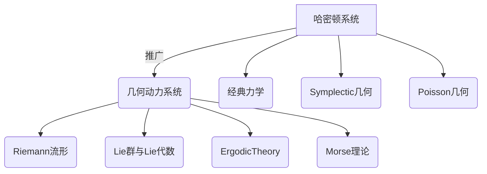

# 哈密顿系统与几何动力系统

## 1. 背景介绍

### 1.1 问题的由来

在物理学和数学领域中,动力系统是一个广泛研究的主题。动力系统描述了一个系统随时间的演化规律,通过研究动力系统的性质和行为,我们可以深入理解许多自然现象和工程问题。哈密顿系统是动力系统中的一个重要分支,它源于经典力学,描述了保守系统的运动。

哈密顿系统由哈密顿方程组成,这是一组耦合的一阶常微分方程,描述了系统的位置和动量随时间的变化。哈密顿方程的核心是哈密顿函数,它是系统的总能量,包括了系统的位能和动能。通过研究哈密顿函数的性质,我们可以深入了解系统的动力学行为。

然而,传统的哈密顿系统只考虑了欧几里得空间中的运动,而在许多实际问题中,我们需要研究更一般的流形上的动力系统。这就引出了几何动力系统的概念,它将哈密顿系统推广到了任意流形上,为研究更广泛的物理现象和数学问题提供了强有力的工具。

### 1.2 研究现状

哈密顿系统和几何动力系统是当代数学物理学的热点研究领域。许多著名学者,如Vladimir Arnold、Jürgen Moser和Mikhail Gromov等,都做出了重要贡献。他们的研究成果不仅深化了我们对动力系统的理解,也推动了相关数学分支的发展,如微分几何、SymplecticGeometry和ErgodicTheory等。

近年来,随着计算能力的提高和数值算法的进步,人们能够更精确地模拟和分析复杂的动力系统。同时,新兴的应用领域,如天体动力学、分子动力学、量子计算等,也为哈密顿系统和几何动力系统提供了新的挑战和动力。

### 1.3 研究意义

研究哈密顿系统和几何动力系统对于我们理解自然界的运行规律至关重要。它们不仅是经典力学和量子力学的基础,也广泛应用于天文学、化学、生物学、工程等领域。通过对这些系统的深入研究,我们可以预测行星运动、模拟分子动力学、设计更高效的能量转换系统等。

此外,哈密顿系统和几何动力系统也是纯数学研究的重要对象。它们与微分几何、Lie代数、Symplectic Geometry等数学分支密切相关,对于发展新的数学理论和方法具有重要意义。

### 1.4 本文结构

本文将全面介绍哈密顿系统与几何动力系统的理论基础、核心算法、数学模型、实际应用等内容。我们将从经典力学的角度出发,逐步推广到更一般的几何动力系统,并探讨其在各个领域的应用。文章的主要结构如下:

1. 背景介绍
2. 核心概念与联系
3. 核心算法原理与具体操作步骤
4. 数学模型和公式详细讲解与举例说明
5. 项目实践:代码实例和详细解释说明
6. 实际应用场景
7. 工具和资源推荐
8. 总结:未来发展趋势与挑战
9. 附录:常见问题与解答

## 2. 核心概念与联系

哈密顿系统和几何动力系统涉及了多个数学物理学领域的核心概念,它们之间存在着内在的联系。下面我们将介绍这些核心概念及其相互关系。

1. **哈密顿系统(HamiltonianSystems)**: 描述保守系统运动的一组微分方程,由哈密顿函数和哈密顿方程组成。它源于经典力学,是研究保守系统动力学的基础。

2. **几何动力系统(GeometricDynamicalSystems)**: 将哈密顿系统推广到任意流形上的动力系统,是研究更一般情况下系统动力学行为的强有力工具。

3. **经典力学(ClassicalMechanics)**: 研究宏观粒子和刚体运动的理论体系,哈密顿系统是其中的核心部分。

4. **Symplectic几何(SymplecticGeometry)**: 研究Symplectic流形的数学分支,与哈密顿系统密切相关,是研究其几何结构的基础。

5. **Poisson几何(PoissonGeometry)**: 研究Poisson流形的数学理论,与哈密顿系统的Poisson括号密切相关。

6. **Riemann流形(RiemannianManifolds)**: 研究曲面和高维流形的基础理论,是几何动力系统所建立的基础。

7. **Lie群与Lie代数(LieGroupsandLieAlgebras)**: 研究连续变换群及其无穷小生成元的数学理论,与哈密顿系统和几何动力系统的对称性密切相关。

8. **ErgodicTheory(ErgodicTheory)**: 研究动力系统的统计性质和混沌行为的数学理论,对于分析哈密顿系统和几何动力系统的长期行为至关重要。

9. **Morse理论(MorseTheory)**: 研究流形上的临界点和不动点的拓扑不变量,在分析哈密顿系统和几何动力系统的平衡态和周期轨道中发挥重要作用。

这些概念之间存在着紧密的联系,相互渗透、相互促进。掌握它们有助于我们全面深入地理解哈密顿系统和几何动力系统的本质。

## 3. 核心算法原理与具体操作步骤

### 3.1 算法原理概述

哈密顿系统和几何动力系统的核心算法是求解哈密顿方程组,即一组耦合的一阶常微分方程。哈密顿方程描述了系统的广义位置和广义动量随时间的变化规律,它们由哈密顿函数(系统的总能量)决定。

具体来说,对于n个自由度的系统,设广义坐标为$q_i(i=1,2,...,n)$,广义动量为$p_i(i=1,2,...,n)$,哈密顿函数为$H(q,p,t)$,则哈密顿方程组为:

$$
\begin{aligned}
\frac{dq_i}{dt} &= \frac{\partial H}{\partial p_i} \
\frac{dp_i}{dt} &= -\frac{\partial H}{\partial q_i}
\end{aligned}
$$

这是一个2n阶的常微分方程组,描述了系统在相空间中的运动轨迹。求解这个方程组就可以获得系统在任意时刻的状态,从而揭示其动力学行为。

在几何动力系统中,我们将这个思想推广到任意流形上。设M是一个2n维的Symplectic流形,上面存在一个Symplectic结构$\omega$和一个Hamiltonian函数H。我们定义Hamiltonian矢量场$X_H$为:

$$X_H = \sum_{i=1}^n \left( \frac{\partial H}{\partial p_i} \frac{\partial}{\partial q_i} - \frac{\partial H}{\partial q_i} \frac{\partial}{\partial p_i} \right)$$

则系统在M上的运动由Hamilton方程描述:

$$\iota_{X_H}\omega = dH$$

其中$\iota$表示内积运算,d表示外微分。这个方程说明了矢量场$X_H$是如何沿着H的梯度方向流动的。

解这个方程的标准方法是将其写成一阶微分方程组的形式,然后使用数值积分算法(如Runge-Kutta方法)求解。对于特殊情况,也可以使用解析方法或近似方法获得解的解析表达式。

### 3.2 算法步骤详解

下面我们将详细介绍求解哈密顿系统和几何动力系统的算法步骤:

1. **建立哈密顿函数(HamiltonianFunction)**
    - 根据系统的物理模型,确定系统的总能量表达式,包括位能和动能
    - 将总能量表达式写成广义坐标和广义动量的函数形式H(q,p,t)
    - 对于几何动力系统,需要在流形M上构造Hamiltonian函数H

2. **导出哈密顿方程组(HamiltonianEquations)**
    - 对经典哈密顿系统:
        - 根据哈密顿函数H(q,p,t),利用哈密顿方程组的定义式,导出2n个一阶常微分方程
    - 对几何动力系统:
        - 在流形M上定义Symplectic结构$\omega$
        - 利用Hamiltonian矢量场$X_H$的定义,将Hamilton方程写成$\iota_{X_H}\omega = dH$的形式

3. **数值求解(NumericalSolution)**
    - 将哈密顿方程组写成一阶矩阵常微分方程组的形式: $\frac{dY}{dt} = F(Y,t)$
    - 选择合适的数值积分算法,如Runge-Kutta方法、Symplectic积分算法等
    - 给定初始条件Y(0),在给定的时间区间[0,T]上求解该方程组
    - 对于自治系统,可以使用保面积算法等特殊方法加速求解

4. **分析结果(ResultAnalysis)**
    - 绘制系统在相空间或流形上的轨迹,分析其运动规律
    - 研究轨迹的拓扑性质,如是否有闭轨道、混沌现象等
    - 对于保守系统,可以利用能量等理论积分的不变性检验解的正确性
    - 对于非自治系统,可以研究系统的渐近行为

5. **可视化(Visualization)**
    - 使用计算机图形学技术,对系统的运动轨迹进行可视化
    - 对于低维系统,可以直接绘制相空间或流形上的轨迹
    - 对于高维系统,可以使用降维技术,绘制投影轨迹或Poincare切面等

通过以上步骤,我们就可以求解哈密顿系统和几何动力系统,揭示其内在的动力学行为。这些算法广泛应用于天体运动、分子动力学、量子计算等诸多领域。

### 3.3 算法优缺点

哈密顿系统和几何动力系统的求解算法具有以下优缺点:

**优点:**

1. **理论基础坚实**:建立在经典力学和微分几何等数学物理学的坚实理论基础之上,具有严谨的数学描述。

2. **能量等理论量守恒**:对于保守系统,能量等理论量守恒,可以作为检验解的正确性的依据。

3. **可以揭示系统的拓扑和几何结构**:通过研究系统在相空间或流形上的轨迹,可以揭示其内在的拓扑和几何结构。

4. **适用于多种物理模型**:哈密顿系统和几何动力系统可以描述广泛的物理现象,如天体运动、分子动力学、量子计算等。

5. **高效的数值算法**:目前已经发展出许多高效稳定的数值积分算法,如Symplectic算法、Split算法等,能够高精度求解哈密顿系统。

**缺点:**

1. **求解复杂度高**:对于高维系统或强非线性系统,求解哈密顿方程组可能非常困难,需要消耗大量计算资源。

2. **初值敏感性**:一些哈密顿系统存在强烈的初值敏感性,微小的初值偏差可能导致解的剧烈变化。

3. **理论分析困难**:对于一般的非线性系统,很难从理论上对其解的性质(如周期性、混沌性等)进行全面分析。

4. **离散化误差**:对于几何动力系统,在数值计算时需要对流形进行离散化,这可能引入一定的误差。

5. **参数调整困难**:对于复杂系统,往往需要对众多参数进行调整,以获得令人满意的数值解,这是一个艰巨的工作。

总的来说,哈密顿系统和几何动力系统的求解