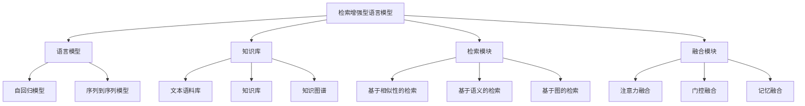

# 大语言模型原理基础与前沿 检索增强型语言模型

## 1. 背景介绍

### 1.1 问题的由来

在自然语言处理(NLP)领域,大型语言模型已经成为主流技术,展现出了令人印象深刻的能力。然而,传统的语言模型存在一些固有的局限性,例如:

1. **知识不足**: 语言模型主要依赖于训练数据中的模式,缺乏对外部世界知识的理解和推理能力。
2. **记忆力有限**: 模型难以捕捉长期依赖关系,在处理长文本时容易遗忘上下文信息。
3. **缺乏交互性**: 大多数模型是单向的,无法根据上下文动态地更新和调整输出。

为了解决这些挑战,研究人员提出了检索增强型语言模型(Retrieval-Augmented Language Model, RALM),旨在通过外部知识库来增强语言模型的能力。

### 1.2 研究现状

近年来,检索增强型语言模型已经取得了一些进展,例如:

- **基于检索的语言模型**: 将检索到的相关文档作为额外的上下文,与原始输入一起输入到语言模型中。
- **基于存储的语言模型**: 在训练过程中,模型学习如何从外部知识库中检索和存储相关信息。
- **基于记忆的语言模型**: 模型内部集成了一个可更新的记忆库,用于存储和检索相关知识。

然而,现有的方法仍然存在一些局限性,例如检索效率低下、知识利用率不高、缺乏有效的交互机制等。

### 1.3 研究意义

检索增强型语言模型的研究具有重要的理论和应用价值:

1. **理论意义**:有助于探索语言模型与外部知识的有效融合方式,推动自然语言处理领域的发展。
2. **应用价值**:可以提高语言模型在各种任务中的性能,如机器翻译、问答系统、对话系统等。

通过研究检索增强型语言模型,我们可以期望获得更加通用、智能和人性化的自然语言处理系统。

### 1.4 本文结构

本文将全面介绍检索增强型语言模型的原理和前沿技术,内容安排如下:

1. 背景介绍
2. 核心概念与联系
3. 核心算法原理与具体操作步骤
4. 数学模型和公式详细讲解与举例说明
5. 项目实践:代码实例和详细解释说明
6. 实际应用场景
7. 工具和资源推荐
8. 总结:未来发展趋势与挑战
9. 附录:常见问题与解答

## 2. 核心概念与联系

检索增强型语言模型(RALM)是一种将语言模型与外部知识库相结合的技术范式。它主要包括以下核心组成部分:

1. **语言模型**:用于生成或理解自然语言序列,可以是自回归模型(如GPT)或序列到序列模型(如Transformer)。
2. **知识库**:存储外部知识的数据源,可以是文本语料库、结构化知识库或知识图谱。
3. **检索模块**:根据输入查询从知识库中检索相关信息,可以基于相似性、语义或图结构进行检索。
4. **融合模块**:将检索到的知识与语言模型的输出进行融合,常用的方法包括注意力融合、门控融合和记忆融合。

这些组成部分相互协作,共同实现了检索增强型语言模型的功能。语言模型提供了基础的自然语言处理能力,知识库为模型提供了外部知识支持,检索模块负责从知识库中获取相关信息,而融合模块则将检索到的知识与语言模型的输出进行有效融合。

## 3. 核心算法原理与具体操作步骤

### 3.1 算法原理概述

检索增强型语言模型的核心算法原理可以概括为以下三个主要步骤:

1. **检索相关知识**:根据输入查询从知识库中检索相关的信息片段。
2. **融合知识与语言模型**:将检索到的知识与语言模型的输出进行融合,以增强模型的理解和生成能力。
3. **迭代更新**:根据融合后的输出,重新检索相关知识,并进行多轮迭代,直到达到预期的结果或达到最大迭代次数。

这种算法框架允许语言模型动态地利用外部知识,从而提高了模型的性能和泛化能力。

### 3.2 算法步骤详解

1. **检索相关知识**

   - 基于相似性的检索:计算输入查询与知识库中每个信息片段的相似度,选择最相关的片段。
   - 基于语义的检索:利用语义表示技术(如词嵌入、BERT等)捕捉输入查询和知识库信息的语义,并基于语义相似度进行检索。
   - 基于图的检索:将知识库建模为知识图谱,利用图算法(如随机游走、图卷积等)在图谱中检索相关信息。

2. **融合知识与语言模型**

   - 注意力融合:利用注意力机制,根据输入查询和上下文动态地为检索到的知识片段分配权重,并将加权知识与语言模型的输出进行融合。
   - 门控融合:使用门控机制控制知识与语言模型输出的融合程度,实现更精细的融合。
   - 记忆融合:将检索到的知识存储在模型内部的记忆库中,并在生成过程中动态地读取和更新记忆库。

3. **迭代更新**

   - 根据融合后的输出,重新检索相关知识,进行多轮迭代。
   - 每一轮迭代都可以提高模型对输入的理解和生成质量。
   - 迭代次数可以根据任务要求或性能指标进行动态调整。

### 3.3 算法优缺点

**优点**:

- 利用外部知识库,提高了语言模型的理解和生成能力。
- 通过迭代更新,可以动态地利用相关知识,提高了模型的泛化能力。
- 融合模块提供了灵活的知识融合方式,可以根据任务需求进行调整。

**缺点**:

- 检索效率可能较低,尤其是在大型知识库中进行检索时。
- 知识融合过程可能会引入噪声,影响模型的性能。
- 迭代次数的选择需要权衡计算成本和性能提升。

### 3.4 算法应用领域

检索增强型语言模型可以应用于多个自然语言处理任务,包括但不限于:

- **问答系统**:利用知识库提供准确的答案。
- **对话系统**:根据上下文动态地检索和利用相关知识,提高对话质量。
- **机器翻译**:利用外部知识库提高翻译质量,特别是在处理专业领域术语时。
- **文本摘要**:利用知识库提取关键信息,生成高质量的文本摘要。
- **事实验证**:验证给定陈述是否与知识库中的事实相符。

## 4. 数学模型和公式详细讲解与举例说明

### 4.1 数学模型构建

检索增强型语言模型的数学模型可以表示为:

$$P(Y|X, K) = \sum_{z \in Z} P(Y|X, z, K)P(z|X, K)$$

其中:

- $X$表示输入查询
- $Y$表示目标输出序列
- $K$表示知识库
- $Z$表示从知识库中检索到的相关信息片段的集合
- $P(Y|X, z, K)$表示给定输入查询$X$、相关知识片段$z$和知识库$K$时,生成目标输出序列$Y$的概率
- $P(z|X, K)$表示给定输入查询$X$和知识库$K$时,检索到相关知识片段$z$的概率

该模型通过对所有可能的相关知识片段$z$进行求和,捕捉了语言模型与知识库之间的交互关系。

### 4.2 公式推导过程

我们可以将上述模型进一步分解,得到:

$$P(Y|X, K) = \sum_{z \in Z} P(Y|X, z, K)P(z|X, q(X, K))$$

其中,我们引入了一个检索函数$q(X, K)$,用于从知识库$K$中检索与输入查询$X$相关的信息片段。

进一步,我们可以将$P(Y|X, z, K)$建模为一个序列生成模型,例如使用Transformer:

$$P(Y|X, z, K) = \prod_{t=1}^{|Y|} P(y_t|y_{<t}, X, z, K; \theta)$$

其中$\theta$表示模型参数,$y_{<t}$表示目标序列的前$t-1$个token。

最终,我们可以将检索增强型语言模型的目标函数表示为:

$$\mathcal{L} = -\log P(Y|X, K) = -\log \sum_{z \in Z} \prod_{t=1}^{|Y|} P(y_t|y_{<t}, X, z, K; \theta)P(z|X, q(X, K))$$

在训练过程中,我们需要最小化这个目标函数,以学习模型参数$\theta$和检索函数$q(X, K)$。

### 4.3 案例分析与讲解

考虑一个问答任务的例子,输入查询为"什么是量子计算机?",目标输出为"量子计算机是利用量子力学原理构建的一种新型计算机,它能够同时处理多种状态,具有巨大的并行计算能力。"

在检索增强型语言模型中,我们可以从知识库(如维基百科)中检索与"量子计算机"相关的信息片段,例如:

- $z_1$: "量子计算机是一种全新的计算范式,它利用量子力学原理进行计算..."
- $z_2$: "量子计算机的工作原理是基于量子叠加和量子纠缠..."
- $z_3$: "量子计算机具有巨大的并行计算能力,可以同时处理多种状态..."

然后,模型需要根据输入查询$X$、检索到的知识片段$z_1, z_2, z_3$以及知识库$K$,生成目标输出序列$Y$。

在生成过程中,模型可以通过注意力机制动态地融合相关知识片段,例如:

- 对于"什么是量子计算机"这一部分,模型可以更多地关注$z_1$,了解量子计算机的基本概念。
- 对于"利用量子力学原理"这一部分,模型可以更多地关注$z_2$,了解量子计算机的工作原理。
- 对于"具有巨大的并行计算能力"这一部分,模型可以更多地关注$z_3$,了解量子计算机的优势。

通过这种方式,模型可以生成一个准确、全面的答案,同时利用了知识库中的相关信息。

### 4.4 常见问题解答

**Q: 如何确定检索到的知识片段的相关性?**

A: 通常可以使用相似度度量(如余弦相似度、BM25等)或语义相似度模型(如BERT)来评估知识片段与输入查询的相关性。另外,也可以根据任务需求设计特定的相关性评分函数。

**Q: 如何处理检索到的知识片段之间的冲突或噪声?**

A: 一种常见的方法是在融合模块中引入注意力机制或门控机制,动态地分配不同知识片段的权重,从而减小噪声的影响。另外,也可以在检索阶段就过滤掉低质量或不相关的知识片段。

**Q: 迭代更新的次数如何确定?**

A:迭代次数