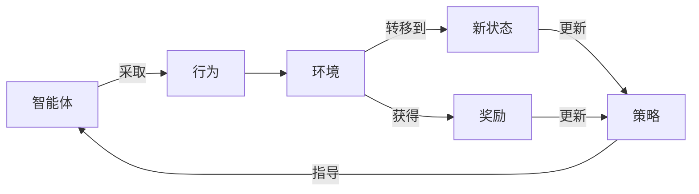

# 强化学习：在快递派送中的应用

## 1. 背景介绍

### 1.1 问题的由来

在当今快节奏的生活方式中，快递服务已经成为不可或缺的一部分。随着电子商务的蓬勃发展和消费者对即时送货的需求不断增长,快递公司面临着如何高效优化派送路线的巨大挑战。传统的路线规划方法通常依赖于人工经验和简单的算法,难以充分考虑复杂的实际情况,如交通拥堵、天气条件、车辆状态等动态因素。因此,需要一种更加智能化的方法来解决这一问题。

### 1.2 研究现状

近年来,强化学习(Reinforcement Learning)作为一种有前景的机器学习范式,在解决序列决策问题方面取得了重大进展。强化学习旨在通过与环境的交互,学习一种策略,使智能体(Agent)在完成特定任务时获得最大的累积奖励。由于快递派送问题本质上是一个序列决策过程,因此强化学习在这一领域具有广阔的应用前景。

目前,已有多项研究尝试将强化学习应用于快递派送路线优化。例如,谷歌的研究人员提出了一种基于强化学习的车辆路由算法,能够根据实时交通数据动态调整路线。另一些研究则关注于考虑多种约束条件(如时间窗口、车辆载重等)的路线优化问题。

### 1.3 研究意义

通过将强化学习应用于快递派送路线优化,可以带来以下主要意义:

1. **提高运营效率**:智能路线规划可以减少车辆行驶距离和时间,从而降低运营成本,提高快递公司的利润率。

2. **提升用户体验**:更加准时高效的派送服务,能够显著提升客户满意度。

3. **降低环境影响**:减少车辆行驶距离有助于减少燃料消耗和碳排放,实现可持续发展。

4. **推动智能物流**:强化学习在快递派送领域的成功应用,将推动物流行业向智能化、自动化的方向发展。

### 1.4 本文结构

本文将首先介绍强化学习在快递派送中的核心概念和相关联系,然后深入探讨核心算法原理及具体操作步骤。接下来,我们将构建数学模型并推导公式,并通过案例分析加深理解。之后,将提供一个基于强化学习的快递派送项目实践,包括代码实现和结果分析。最后,我们将讨论实际应用场景、相关工具和资源,并总结未来发展趋势和面临的挑战。

## 2. 核心概念与联系

在强化学习应用于快递派送路线优化中,有几个核心概念需要理解:

1. **智能体(Agent)**: 指快递车辆,需要学习一种策略来完成派送任务。

2. **环境(Environment)**: 包括道路网络、交通状况、客户地址等,智能体需要与之交互。

3. **状态(State)**: 描述智能体当前所处的情况,如位置、剩余货物等。

4. **行为(Action)**: 智能体可以采取的行动,如前往下一个目的地或卸货。

5. **奖励(Reward)**: 对智能体采取行动后给予的反馈,如减少行驶距离获得正奖励。

6. **策略(Policy)**: 智能体在每个状态下选择行为的策略,目标是学习一种最优策略。

这些概念之间的关系如下所示:

智能体根据当前状态和策略选择行为,与环境交互后转移到新状态并获得奖励,基于这些信息更新策略,形成一个闭环过程。通过不断学习,智能体可以逐步优化策略,最终找到最优路线规划方案。

## 3. 核心算法原理 & 具体操作步骤

### 3.1 算法原理概述

在快递派送路线优化中,强化学习算法的核心思想是通过与环境的交互,学习一种策略,使车辆在完成派送任务时获得最大的累积奖励(如最短行驶距离)。常见的强化学习算法包括Q-Learning、深度Q网络(DQN)、策略梯度等。

以Q-Learning为例,算法的基本思路是:

1. 初始化一个Q表,用于存储每个状态-行为对的Q值(预期未来奖励)。

2. 对于每个状态,选择Q值最大的行为执行。

3. 观察执行该行为后的新状态和获得的即时奖励。

4. 根据新状态的最大Q值和即时奖励,更新原状态-行为对的Q值。

5. 重复上述过程,直到Q表收敛,得到最优策略。

### 3.2 算法步骤详解

以下是应用Q-Learning算法求解快递派送路线优化问题的详细步骤:

1. **定义状态空间**:状态可以包括车辆位置、剩余待派送点、时间等信息。

2. **定义行为空间**:行为可以是前往下一个目的地或卸货等。

3. **设计奖励函数**:如根据行驶距离、时间等指标给予奖励或惩罚。

4. **初始化Q表**:用一个表格存储每个状态-行为对的Q值,初始值可设为0或小的正数。

5. **选择行为策略**:如ε-贪婪策略,在探索(选择Q值最大的行为)和利用(随机选择行为)之间权衡。

6. **执行行为并观察结果**:执行选定的行为,观察到新状态和即时奖励。

7. **更新Q值**:根据下式更新Q表中原状态-行为对的Q值:

$$Q(s, a) \leftarrow Q(s, a) + \alpha \left[ r + \gamma \max_{a'} Q(s', a') - Q(s, a) \right]$$

其中:
- $\alpha$是学习率,控制新知识对旧知识的影响程度
- $\gamma$是折现因子,表示对未来奖励的衰减程度
- $r$是执行行为$a$后获得的即时奖励
- $\max_{a'} Q(s', a')$是新状态$s'$下所有可能行为的最大Q值

8. **重复上述过程**:不断执行行为、观察结果并更新Q表,直到Q表收敛。

9. **提取最优策略**:最终Q表中的最大Q值对应的行为序列,即为最优路线规划策略。

### 3.3 算法优缺点

**优点**:

- 无需事先了解环境的转移规律,可以通过试错学习获得最优策略。
- 算法相对简单,易于理解和实现。
- 可以处理连续和离散的状态空间。
- 具有一定的鲁棒性,能够适应动态变化的环境。

**缺点**:

- 在状态空间和行为空间很大时,Q表将变得庞大,导致计算和存储开销增加。
- 收敛速度较慢,需要大量的训练次数。
- 无法直接处理连续的行为空间,需要进行离散化近似。
- 算法性能很大程度上依赖于奖励函数的设计。

### 3.4 算法应用领域

除了快递派送路线优化,Q-Learning等强化学习算法还可以应用于其他序列决策问题,如:

- 机器人路径规划和控制
- 游戏AI(如AlphaGo)
- 自动驾驶决策系统
- 资源调度和作业排程
- 投资组合优化
- 对话系统
- ...

总的来说,任何需要根据环境状态做出一系列决策以达成目标的问题,都可以尝试使用强化学习算法求解。

## 4. 数学模型和公式 & 详细讲解 & 举例说明

### 4.1 数学模型构建

为了更好地描述和求解快递派送路线优化问题,我们可以将其建模为一个马尔可夫决策过程(Markov Decision Process, MDP)。

MDP通常定义为一个四元组$(S, A, P, R)$,其中:

- $S$是状态空间的集合
- $A$是行为空间的集合
- $P(s' \mid s, a)$是状态转移概率,表示在状态$s$执行行为$a$后,转移到状态$s'$的概率
- $R(s, a, s')$是奖励函数,表示在状态$s$执行行为$a$后,转移到状态$s'$时获得的即时奖励

在快递派送场景中,我们可以将MDP具体定义为:

- $S$: 包含车辆位置、剩余待派送点等信息的状态集合
- $A$: 前往下一个目的地或卸货等行为集合
- $P(s' \mid s, a)$: 根据道路网络、交通状况等因素计算的状态转移概率
- $R(s, a, s')$: 根据行驶距离、时间等指标设计的奖励函数

目标是找到一个最优策略$\pi^*(s)$,使得在任意初始状态$s_0$下,按该策略执行行为序列,可获得最大的期望累积奖励:

$$\max_\pi \mathbb{E}\left[ \sum_{t=0}^\infty \gamma^t R(s_t, \pi(s_t), s_{t+1}) \mid s_0 \right]$$

其中$\gamma \in [0, 1)$是折现因子,用于平衡即时奖励和长期奖励的权重。

### 4.2 公式推导过程

在Q-Learning算法中,我们定义Q函数$Q(s, a)$表示在状态$s$执行行为$a$后,可获得的期望累积奖励。根据贝尔曼最优方程,最优Q函数$Q^*(s, a)$应满足:

$$Q^*(s, a) = \mathbb{E}_{s' \sim P(\cdot \mid s, a)} \left[ R(s, a, s') + \gamma \max_{a'} Q^*(s', a') \right]$$

即执行行为$a$后获得的即时奖励,加上新状态$s'$下所有可能行为的最大期望累积奖励(经过折现)的期望值。

为了求解$Q^*(s, a)$,我们可以使用迭代方法,从任意初始Q函数$Q_0(s, a)$开始,不断应用下面的更新规则:

$$Q_{i+1}(s, a) \leftarrow Q_i(s, a) + \alpha \left[ R(s, a, s') + \gamma \max_{a'} Q_i(s', a') - Q_i(s, a) \right]$$

其中$\alpha$是学习率,控制新知识对旧知识的影响程度。

可以证明,在满足适当条件下,上述迭代过程将收敛到最优Q函数$Q^*(s, a)$。

### 4.3 案例分析与讲解

为了更好地理解上述数学模型和公式,我们来分析一个简单的快递派送案例。

假设有一辆快递车需要将货物分别送到A、B、C三个地点,已知各地点之间的距离如下:

- 出发点到A: 2公里
- A到B: 3公里
- B到C: 4公里
- C到出发点: 2公里

我们定义:

- 状态$s$为(当前位置, 剩余待派送点集合)
- 行为$a$为前往下一个目的地
- 奖励函数$R(s, a, s') = -d$,其中$d$是执行行为$a$后行驶的距离(目标是最小化总行驶距离)
- 折现因子$\gamma = 0.9$

那么,初始状态为$s_0 = ($出发点, \{A, B, C\})。我们来计算该状态下前往A的Q值:

$$\begin{aligned}
Q(s_0, \text{去A}) &= R(s_0, \text{去A}, s_1) + \gamma \max_{a'} Q(s_1, a') \
                   &= -2 + 0.9 \max \begin{cases}
                            Q((A, \{B, C\}), \text{去B}) \
                            Q((A, \{B, C\}), \text{去C})
                         \end{cases}
\end{aligned}$$

假设$Q((A, \{B, C\}), \text{去B}) = -6, Q((A, \{B, C\}), \text{去C}) = -5$