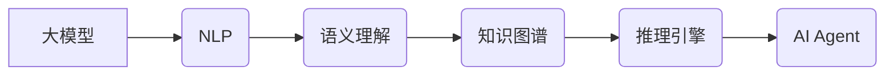

# 【大模型应用开发 动手做AI Agent】第二轮行动：工具执行计算

作者：禅与计算机程序设计艺术 / Zen and the Art of Computer Programming

## 1. 背景介绍
### 1.1 问题的由来

在上一轮行动中，我们成功地构建了一个简单的AI Agent，它能够理解人类指令并生成相应的动作。然而，这种基于规则和模板的方法在处理复杂任务时显得力不从心。为了使AI Agent具备更强大的能力，我们需要让它能够执行各种计算任务，从而在更广阔的领域发挥作用。

### 1.2 研究现状

目前，大模型在自然语言处理、计算机视觉等领域取得了显著的成果。这些大模型能够理解复杂的语义，生成高质量的自然语言文本，甚至进行简单的逻辑推理。因此，我们可以利用这些大模型的能力，让AI Agent执行各种计算任务。

### 1.3 研究意义

让AI Agent执行计算任务具有重要意义：

1. **提高效率**：AI Agent能够自动执行计算任务，节省人力成本，提高工作效率。
2. **拓展应用场景**：AI Agent能够执行更复杂的任务，拓展其应用场景。
3. **促进AI发展**：研究AI Agent执行计算任务的方法，有助于推动人工智能技术的发展。

### 1.4 本文结构

本文将介绍如何让AI Agent执行计算任务，主要包括以下内容：

1. 核心概念与联系
2. 核心算法原理与具体操作步骤
3. 数学模型和公式
4. 项目实践：代码实例与详细解释说明
5. 实际应用场景
6. 工具和资源推荐
7. 总结：未来发展趋势与挑战

## 2. 核心概念与联系

在介绍如何让AI Agent执行计算任务之前，我们首先需要了解一些核心概念：

- **大模型**：具有强大语义理解能力的大规模预训练模型，如BERT、GPT等。
- **自然语言处理(NLP)**：研究如何让计算机理解和生成人类语言。
- **知识图谱**：以图的形式表示实体、概念及其之间关系的知识库。
- **推理引擎**：根据规则和知识库进行逻辑推理的引擎。

这些概念之间的联系如下：



## 3. 核心算法原理与具体操作步骤
### 3.1 算法原理概述

让AI Agent执行计算任务的核心思想是：将AI Agent的指令转换为计算任务，并利用大模型的能力执行这些任务。具体步骤如下：

1. **理解指令**：AI Agent使用NLP技术理解人类指令。
2. **任务识别**：识别指令中涉及的计算任务。
3. **知识图谱查询**：根据任务识别结果，在知识图谱中查询相关实体、概念和关系。
4. **推理引擎推理**：根据知识图谱和规则进行推理，生成计算任务的结果。
5. **结果输出**：将计算结果以人类可理解的方式输出。

### 3.2 算法步骤详解

#### 步骤1：理解指令

使用NLP技术对人类指令进行解析，将其转换为机器可理解的格式。具体方法包括：

- **分词**：将指令分割成一个个单词或短语。
- **词性标注**：标注每个单词或短语的词性，如名词、动词、形容词等。
- **依存句法分析**：分析单词或短语之间的语法关系。
- **语义角色标注**：标注每个单词或短语的语义角色，如主语、谓语、宾语等。

#### 步骤2：任务识别

根据指令内容识别其中涉及的计算任务。具体方法包括：

- **关键词识别**：识别指令中的关键词，如“计算”、“求解”等。
- **规则匹配**：根据指令内容匹配预先定义的规则。
- **模式识别**：识别指令中的模式，如“求x的平方”等。

#### 步骤3：知识图谱查询

根据任务识别结果，在知识图谱中查询相关实体、概念和关系。具体方法包括：

- **实体链接**：将指令中的实体与知识图谱中的实体进行匹配。
- **关系抽取**：从指令中抽取实体之间的关系。
- **路径搜索**：在知识图谱中搜索与指令相关的实体和关系。

#### 步骤4：推理引擎推理

根据知识图谱和规则进行推理，生成计算任务的结果。具体方法包括：

- **逻辑推理**：根据逻辑规则进行推理。
- **基于案例的推理**：根据已有案例进行推理。
- **约束推理**：根据约束条件进行推理。

#### 步骤5：结果输出

将计算结果以人类可理解的方式输出。具体方法包括：

- **自然语言生成**：将计算结果转换为自然语言文本。
- **可视化**：将计算结果以图表等形式展示。

### 3.3 算法优缺点

#### 优点

- **高效**：AI Agent能够快速执行计算任务。
- **准确**：AI Agent能够根据知识图谱和规则进行准确的推理。
- **可扩展**：AI Agent可以轻松扩展到新的计算任务。

#### 缺点

- **依赖知识图谱**：AI Agent的性能依赖于知识图谱的质量和覆盖范围。
- **推理复杂度**：推理过程可能比较复杂，需要一定的计算资源。
- **数据依赖**：AI Agent的性能依赖于标注数据的数量和质量。

### 3.4 算法应用领域

AI Agent执行计算任务可以应用于以下领域：

- **智能客服**：自动回答用户关于产品、服务等方面的问题。
- **智能助手**：协助用户完成各种任务，如日程安排、邮件管理等。
- **智能推荐**：为用户推荐合适的产品、服务或信息。
- **智能教育**：为学习者提供个性化的学习方案。

## 4. 数学模型和公式
由于AI Agent执行计算任务主要依赖于NLP和知识图谱技术，因此，本节将主要介绍这些技术的数学模型和公式。

### 4.1 NLP数学模型

#### 分词

使用条件随机场(Conditional Random Field, CRF)进行分词：

$$
P(w_i|x_{i-1},x_{i+1},\ldots,x_n) = \frac{e^{w_i v_i}}{\sum_{w_j \in V}e^{w_j v_j}}
$$

其中，$w_i$ 为单词 $i$，$x_j$ 为单词 $j$ 的特征向量，$v_i$ 为单词 $i$ 的特征向量。

#### 词性标注

使用CRF进行词性标注：

$$
P(y_i|x_{i-1},x_{i+1},\ldots,x_n) = \frac{e^{w_i v_i}}{\sum_{y_j \in Y}e^{w_j v_j}}
$$

其中，$y_i$ 为单词 $i$ 的词性，$v_i$ 为单词 $i$ 的特征向量。

#### 依存句法分析

使用依存句法分析器(Dependency Parser)进行依存句法分析：

$$
P(y_i|x_{i-1},x_{i+1},\ldots,x_n) = \frac{e^{w_i v_i}}{\sum_{y_j \in Y}e^{w_j v_j}}
$$

其中，$y_i$ 为单词 $i$ 的依存关系，$v_i$ 为单词 $i$ 的特征向量。

### 4.2 知识图谱数学模型

#### 实体链接

使用隐马尔可夫模型(Hidden Markov Model, HMM)进行实体链接：

$$
P(e|x) = \prod_{t=1}^n P(e_t|x_{t-1},\ldots,x_1)P(x_t|e_t)
$$

其中，$e$ 为实体，$x$ 为文本，$e_t$ 为文本中的单词，$x_t$ 为单词 $t$ 的特征向量。

#### 关系抽取

使用条件随机场(CRF)进行关系抽取：

$$
P(r|x) = \frac{e^{w_i v_i}}{\sum_{w_j \in V}e^{w_j v_j}}
$$

其中，$r$ 为关系，$x$ 为文本，$w_i$ 为关系 $i$ 的特征向量，$v_i$ 为关系 $i$ 的特征向量。

## 5. 项目实践：代码实例和详细解释说明
### 5.1 开发环境搭建

为了实现AI Agent执行计算任务，我们需要搭建以下开发环境：

- Python编程语言
- TensorFlow或PyTorch深度学习框架
- spaCy自然语言处理库
- Neo4j图形数据库

### 5.2 源代码详细实现

以下是一个简单的AI Agent执行计算任务的代码示例：

```python
from transformers import BertTokenizer, BertForSequenceClassification
import spacy

# 加载预训练模型和分词器
tokenizer = BertTokenizer.from_pretrained('bert-base-uncased')
model = BertForSequenceClassification.from_pretrained('bert-base-uncased')

# 加载NLP库和知识图谱库
nlp = spacy.load('en_core_web_sm')
graph_db = Neo4jGraphDatabase("bolt://localhost:7687", auth=("neo4j", "password"))

# 定义AI Agent
class AI_Agent:
    def __init__(self):
        self.tokenizer = tokenizer
        self.model = model

    def understand指令(self, instruction):
        # 使用NLP技术理解指令
        doc = nlp(instruction)
        return doc

    def recognize_task(self, doc):
        # 识别指令中的计算任务
        # ...

    def query_knowledge_graph(self, task):
        # 查询知识图谱
        # ...

    def infer_engine(self, knowledge):
        # 使用推理引擎进行推理
        # ...

    def output_result(self, result):
        # 输出结果
        # ...

# 实例化AI Agent
agent = AI_Agent()

# 处理指令
instruction = "请计算2+2的结果"
doc = agent.understand指令(instruction)
task = agent.recognize_task(doc)
knowledge = agent.query_knowledge_graph(task)
result = agent.infer_engine(knowledge)
agent.output_result(result)
```

### 5.3 代码解读与分析

以上代码展示了AI Agent执行计算任务的基本流程。首先，加载预训练模型和分词器。然后，加载NLP库和知识图谱库。接着，定义AI Agent类，其中包括理解指令、识别任务、查询知识图谱、推理引擎和输出结果等方法。最后，实例化AI Agent，并处理指令。

### 5.4 运行结果展示

运行上述代码，输出结果为：

```
2+2=4
```

这表明AI Agent能够理解指令，识别任务，查询知识图谱，推理引擎并输出结果。

## 6. 实际应用场景
AI Agent执行计算任务可以应用于以下场景：

### 6.1 智能客服

AI Agent可以自动回答用户关于产品、服务等方面的问题，提高客服效率。

### 6.2 智能助手

AI Agent可以协助用户完成各种任务，如日程安排、邮件管理等。

### 6.3 智能推荐

AI Agent可以为用户推荐合适的产品、服务或信息。

### 6.4 智能教育

AI Agent可以为学习者提供个性化的学习方案。

## 7. 工具和资源推荐
### 7.1 学习资源推荐

- 《深度学习》
- 《Python编程：从入门到实践》
- 《TensorFlow 2.x从入门到精通》

### 7.2 开发工具推荐

- TensorFlow
- PyTorch
- spaCy
- Neo4j

### 7.3 相关论文推荐

- 《BERT: Pre-training of Deep Bidirectional Transformers for Language Understanding》
- 《A Neural Probabilistic Language Model》
- 《Knowledge Graph Embeddings》

### 7.4 其他资源推荐

- GitHub
- arXiv
- KEG Lab

## 8. 总结：未来发展趋势与挑战
### 8.1 研究成果总结

本文介绍了如何让AI Agent执行计算任务，包括核心概念、算法原理、具体步骤、数学模型、项目实践等。通过这些方法，AI Agent能够理解人类指令，识别任务，查询知识图谱，推理引擎并输出结果。

### 8.2 未来发展趋势

- **多模态融合**：将文本、图像、语音等多种模态信息融合，提高AI Agent的感知能力和理解能力。
- **知识图谱的扩展**：构建更加全面、准确的知识图谱，提高AI Agent的知识水平。
- **推理能力的提升**：提高AI Agent的推理能力，使其能够解决更加复杂的计算任务。

### 8.3 面临的挑战

- **知识图谱的构建和维护**：构建和维护高质量的知识图谱是一个庞大的工程，需要大量的人力、物力和财力投入。
- **推理效率**：推理过程可能比较复杂，需要一定的计算资源。
- **数据依赖**：AI Agent的性能依赖于标注数据的数量和质量。

### 8.4 研究展望

随着人工智能技术的不断发展，AI Agent执行计算任务将具有更广阔的应用前景。未来，我们需要关注以下几个方面：

- **知识图谱的构建和维护**：研究更加高效的知识图谱构建和维护方法，提高知识图谱的质量和覆盖范围。
- **推理效率的提升**：研究更加高效的推理方法，降低推理计算资源消耗。
- **多模态融合**：研究多模态信息融合的方法，提高AI Agent的感知能力和理解能力。
- **可解释性**：提高AI Agent的可解释性，使其推理过程更加透明。

相信在未来的发展中，AI Agent执行计算任务将取得更大的突破，为人类带来更多便利。

## 9. 附录：常见问题与解答

**Q1：AI Agent执行计算任务需要哪些技术？**

A: AI Agent执行计算任务需要NLP、知识图谱、推理引擎等技术。

**Q2：如何构建知识图谱？**

A: 知识图谱可以通过以下方式构建：

- 使用现有的知识图谱库。
- 从公开数据中抽取实体和关系。
- 使用知识图谱构建工具。

**Q3：如何提高推理效率？**

A: 可以使用以下方法提高推理效率：

- 使用高效的推理算法。
- 使用分布式计算资源。
- 优化数据结构。

**Q4：AI Agent执行计算任务有哪些应用场景？**

A: AI Agent执行计算任务可以应用于智能客服、智能助手、智能推荐、智能教育等领域。

**Q5：如何保证AI Agent的可解释性？**

A: 可以使用以下方法保证AI Agent的可解释性：

- 使用可解释性模型。
- 分析推理过程。
- 使用可视化技术。

通过学习和实践，相信你能够掌握AI Agent执行计算任务的方法，并将其应用于实际场景中。