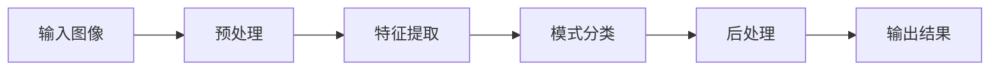

好的,我会尽力按照您的要求,撰写一篇高质量的技术博客文章。让我们开始吧!

# 基于OpenCV的手写字识别系统详细设计与具体代码实现

## 1. 背景介绍

### 1.1 问题的由来

在当今信息时代,人机交互已经成为不可或缺的一部分。随着智能手机、平板电脑等移动设备的普及,人们对于更自然、更人性化的交互方式有了更高的期望。传统的键盘输入方式已经无法满足用户的需求,因此手写识别技术应运而生。

手写识别技术可以让用户直接在屏幕上书写文字、数字或符号,系统会自动识别并转换为数字信号,从而实现人机交互。这种交互方式更加自然、直观,可以极大地提高用户体验。

### 1.2 研究现状

手写识别技术经过多年的发展,已经取得了长足的进步。目前,主流的手写识别技术可以分为两大类:基于模板匹配和基于机器学习的方法。

- **基于模板匹配**的方法是将输入的手写字符与预先存储的模板进行对比,找到最相似的模板,从而识别出字符。这种方法简单直观,但受限于模板库的大小和质量。

- **基于机器学习**的方法则是利用大量的训练数据,通过机器学习算法自动提取特征,建立识别模型。这种方法具有更强的泛化能力,可以适应更复杂的情况,但需要大量的计算资源和训练数据。

目前,基于机器学习的方法已经成为手写识别领域的主流方向,尤其是深度学习技术的应用,使得手写识别的准确率有了质的飞跃。

### 1.3 研究意义

手写识别技术在多个领域都有广泛的应用前景:

1. **移动设备**: 手写输入可以为移动设备提供更自然、更人性化的交互方式,提高用户体验。

2. **电子笔记本**: 用户可以直接在电子设备上书写笔记,系统会自动识别并存储,大大提高了工作效率。

3. **邮件分拣**: 在邮政系统中,手写识别技术可以自动识别邮件地址,实现自动分拣。

4. **银行支票处理**: 银行可以利用手写识别技统自动识别支票金额,提高工作效率。

5. **教育领域**: 手写识别技术可以辅助学生学习书写,纠正错误笔画,提高书写水平。

综上所述,手写识别技术具有重要的理论意义和应用价值,值得我们深入研究和探索。

### 1.4 本文结构

本文将详细介绍基于OpenCV的手写字识别系统的设计与实现。文章主要分为以下几个部分:

- 核心概念与联系
- 核心算法原理与具体操作步骤
- 数学模型和公式详细讲解与案例分析
- 项目实践:代码实例和详细解释说明
- 实际应用场景
- 工具和资源推荐
- 总结:未来发展趋势与挑战
- 附录:常见问题与解答

## 2. 核心概念与联系

在手写字识别系统中,有几个核心概念是我们需要重点关注的:

1. **预处理(Preprocessing)**: 对原始输入图像进行处理,如去噪、二值化、归一化等,以提高后续处理的效果。

2. **特征提取(Feature Extraction)**: 从预处理后的图像中提取出能够很好地描述和区分字符的特征,如投影特征、结构特征、统计特征等。

3. **模式分类(Pattern Classification)**: 将提取出的特征输入分类器,对字符进行识别和分类,常用的分类器有K最近邻(KNN)、支持向量机(SVM)、神经网络等。

4. **后处理(Postprocessing)**: 对识别结果进行进一步处理,如消除错误、上下文分析等,以提高识别准确率。

这些核心概念相互关联、环环相扣,共同构建了完整的手写字识别系统。其中,**特征提取**和**模式分类**是系统的核心部分,直接决定了识别的准确性和效率。

## 3. 核心算法原理与具体操作步骤

### 3.1 算法原理概述

在手写字识别系统中,核心算法主要包括以下几个部分:

1. **预处理算法**: 常用的预处理算法有中值滤波、高斯滤波(用于去噪)、Otsu二值化算法(用于二值化)、归一化等。

2. **特征提取算法**: 常用的特征提取算法有投影特征、结构特征(如方向梯度直方图)、统计特征(如矩不变特征)等。

3. **模式分类算法**: 常用的模式分类算法有K最近邻(KNN)、支持向量机(SVM)、人工神经网络等。

这些算法相互配合,共同完成手写字符的识别任务。

### 3.2 算法步骤详解

1. **预处理**
   - 去噪: 使用中值滤波或高斯滤波等算法去除图像中的噪声。
   - 二值化: 使用Otsu算法或其他自适应阈值算法将图像二值化。
   - 归一化: 将图像缩放到固定大小,以方便后续处理。

2. **特征提取**
   - 投影特征: 计算图像的水平和垂直投影,作为特征向量的一部分。
   - 结构特征: 计算图像的梯度直方图,作为结构特征。
   - 统计特征: 计算图像的矩不变特征,作为统计特征。
   - 特征融合: 将上述多种特征融合,构建最终的特征向量。

3. **模式分类**
   - KNN分类器: 使用K最近邻算法进行分类。
   - SVM分类器: 使用支持向量机算法进行分类。
   - 神经网络: 使用人工神经网络(如卷积神经网络)进行分类。

4. **后处理(可选)**
   - 上下文分析: 利用上下文信息(如单词、语法等)纠正识别错误。
   - 拼写检查: 对识别结果进行拼写检查,纠正常见拼写错误。

这就是手写字识别系统的核心算法流程,每一步都至关重要,决定了最终的识别准确率和效率。

### 3.3 算法优缺点

上述算法具有以下优缺点:

**优点**:

- 算法思路清晰,模块化设计,易于理解和实现。
- 融合了多种特征,可以提高识别的鲁棒性。
- 支持多种分类器,可根据具体情况选择合适的分类器。
- 后处理环节可以进一步提高准确率。

**缺点**:

- 传统特征提取方法受限于手工设计,难以充分挖掘数据潜力。
- 分类器的性能受训练数据的限制,可能难以很好地泛化。
- 整个流程相对复杂,需要大量的调参工作。
- 对噪声和扭曲等情况的鲁棒性仍有待提高。

### 3.4 算法应用领域

手写字识别算法在多个领域都有广泛的应用,包括但不限于:

- 移动设备输入
- 电子笔记本
- 邮件分拣系统
- 银行支票处理
- 教育辅助系统
- 车牌识别系统
- 表单自动化处理
- 历史文献数字化
- ...

随着技术的不断进步,手写字识别算法的应用领域将会越来越广泛。

## 4. 数学模型和公式详细讲解与举例说明

在手写字识别系统中,有许多数学模型和公式被广泛使用,下面我们将详细讲解其中的几个核心模型和公式。

### 4.1 数学模型构建

#### 4.1.1 KNN(K-Nearest Neighbor)分类器

KNN是一种基于实例的学习算法,其核心思想是:如果一个样本在特征空间中的k个最相似(即特征向量最邻近)的训练样本中的大多数属于某一个类别,则该样本也属于这个类别。

给定一个待分类样本 $x$,其nearest neighbor定义为:

$$
NN(x) = \min_{x_i \in D}\|x - x_i\|
$$

其中 $D$ 为训练数据集, $\|x - x_i\|$ 表示 $x$ 与 $x_i$ 之间的距离。常用的距离度量有欧氏距离、曼哈顿距离等。

KNN算法可以总结为以下步骤:

1. 计算测试数据与各个训练数据之间的距离
2. 按距离递增次序排序
3. 选取前K个最近邻训练数据
4. 统计前K个最近邻中各类别的数量
5. 返回数量最多的类别作为测试数据的预测分类

KNN算法的优点是简单、直观,无需估计参数,可以对局部区域进行学习。缺点是计算量大、空间复杂度高、对噪声数据敏感。

#### 4.1.2 SVM(Support Vector Machine)分类器

SVM是一种基于统计学习理论的分类器,其基本思想是:在特征空间中构建一个最大边界的超平面,将不同类别的数据分开,使得边界两侧的数据到超平面的距离最大。

对于线性可分的二分类问题,我们希望找到一个超平面 $w^Tx + b = 0$,使得:

$$
\begin{cases}
w^Tx_i + b \ge 1, & y_i = 1\
w^Tx_i + b \le -1, & y_i = -1
\end{cases}
$$

其中 $x_i$ 为训练样本, $y_i \in \{-1, 1\}$ 为其类别标记。

我们需要最大化边界距离 $\gamma = \frac{2}{\|w\|}$,这可以转化为以下优化问题:

$$
\begin{align}
\min_{w,b} & \frac{1}{2}\|w\|^2\
\text{s.t.} & y_i(w^Tx_i + b) \ge 1, i = 1, 2, \dots, n
\end{align}
$$

对于非线性问题,我们可以使用核技巧,将数据映射到高维空间,从而使其线性可分。常用的核函数有多项式核、高斯核等。

SVM的优点是泛化能力强,可以有效处理高维数据。缺点是对缺失数据和噪声数据敏感,计算开销大,对核函数的选择敏感。

### 4.2 公式推导过程

这里我们以矩不变特征的推导为例,详细展示公式推导的过程。

矩不变特征是一种常用的统计特征,它具有平移、旋转、缩放不变性,可以很好地描述图像的几何特征。二维(p+q)阶矩可以定义为:

$$
m_{pq} = \sum_{x}\sum_{y}x^py^qf(x,y)
$$

其中 $f(x,y)$ 表示图像在 $(x,y)$ 处的像素值。

为了获得尺度不变性,我们引入归一化中心矩:

$$
\mu_{pq} = \sum_{x}\sum_{y}(x - \bar{x})^p(y - \bar{y})^qf(x,y)
$$

其中 $\bar{x}$ 和 $\bar{y}$ 分别为 $x$ 和 $y$ 的均值:

$$
\bar{x} = \frac{m_{10}}{m_{00}}, \quad \bar{y} = \frac{m_{01}}{m_{00}}
$$

中心矩消除了平移不变性,但仍然存在旋转不变性的问题。为此我们构造组合矩:

$$
\eta_{pq} = \sum_{x}\sum_{y}(x - \bar{x})^p(y - \bar{y})^qf(x,y)
$$

其中 $p+q \ge 2$。

通过组合矩,我们可以构造出七个独立的矩不变量,它们对平移、旋转和缩放都是不变的,可以作为图像的特征描述子。这七个矩不变量的具体表达式如下:

$$
\begin{aligned}
\phi_1 &= \eta_{20} + \eta_{02}\