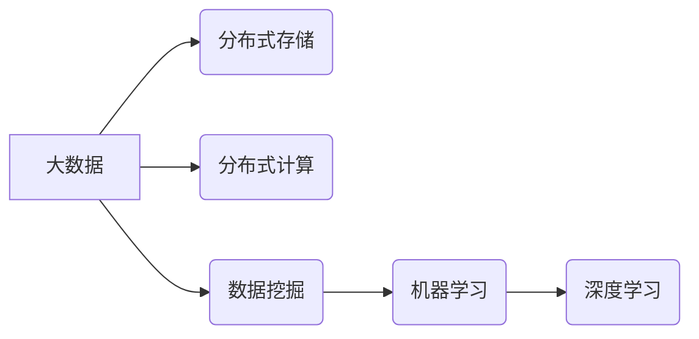

# 大数据 原理与代码实例讲解

作者：禅与计算机程序设计艺术 / Zen and the Art of Computer Programming

## 1. 背景介绍

### 1.1 问题的由来

随着互联网的飞速发展，数据量呈爆炸式增长，大数据时代应运而生。大数据技术应运而生，旨在解决海量数据存储、处理和分析的难题。大数据技术不仅对IT行业产生了深远影响，也为各行各业提供了新的发展机遇。

### 1.2 研究现状

目前，大数据技术已经取得了显著的进展，包括分布式存储、分布式计算、数据挖掘、机器学习等多个方面。Hadoop、Spark、Flink等分布式计算框架，以及HBase、Cassandra等分布式数据库，为大数据处理提供了坚实的基础。此外，机器学习、深度学习等人工智能技术在数据挖掘和分析领域的应用，也使得大数据的价值得到充分挖掘。

### 1.3 研究意义

研究大数据技术，对于推动社会经济发展、提高生产效率、改善人民生活质量具有重要意义。以下是大数据技术的一些主要应用领域：

- **金融行业**：大数据技术在金融风控、信用评估、个性化推荐、智能客服等方面发挥着重要作用。
- **电商行业**：大数据技术助力电商平台实现精准营销、商品推荐、客户画像等功能。
- **医疗健康**：大数据技术在疾病预防、医疗诊断、药物研发等方面具有广泛应用。
- **交通出行**：大数据技术助力交通部门实现智能交通管理、道路拥堵预测等功能。
- **智慧城市**：大数据技术助力城市建设、城市管理、公共服务等领域的智能化升级。

### 1.4 本文结构

本文将从大数据技术的基本原理、核心算法、项目实践、应用场景、未来发展趋势等方面进行深入讲解。具体结构如下：

- **第2章**：介绍大数据技术的核心概念和联系。
- **第3章**：阐述大数据技术中的核心算法原理和具体操作步骤。
- **第4章**：讲解大数据技术中的数学模型和公式，并给出实例说明。
- **第5章**：通过代码实例展示大数据技术的实际应用。
- **第6章**：探讨大数据技术在各个领域的应用场景。
- **第7章**：推荐学习大数据技术的相关资源和工具。
- **第8章**：总结大数据技术的未来发展趋势与挑战。
- **第9章**：附录，常见问题与解答。

## 2. 核心概念与联系

为了更好地理解大数据技术，本节将介绍几个密切相关的核心概念：

- **大数据**：指数据量巨大、数据种类繁多、数据价值密度低的数据集合。
- **分布式存储**：将数据存储在多个节点上，实现数据的高效存储和访问。
- **分布式计算**：将计算任务分配到多个节点上并行执行，提高计算效率。
- **数据挖掘**：从大量数据中提取有价值的信息和知识。
- **机器学习**：使计算机能够从数据中学习，并做出智能决策。
- **深度学习**：一种特殊的机器学习范式，通过神经网络模拟人脑神经元结构，实现图像识别、语音识别等任务。

它们的逻辑关系如下图所示：



可以看出，大数据技术包括分布式存储、分布式计算、数据挖掘、机器学习等多个方面。数据挖掘和机器学习是大数据技术的核心应用，通过从大量数据中提取有价值的信息和知识，实现智能化决策。

## 3. 核心算法原理 & 具体操作步骤

### 3.1 算法原理概述

大数据技术涉及多个核心算法，以下列举几个典型的算法及其原理：

- **Hadoop HDFS**：分布式文件系统，将数据存储在多个节点上，实现数据的高效访问和可靠存储。
- **MapReduce**：分布式计算框架，将计算任务分解为Map和Reduce两个步骤，实现并行计算。
- **Spark**：分布式计算框架，在MapReduce基础上进行了改进，提高了计算效率。
- **Flink**：分布式流处理框架，支持实时数据处理和复杂事件处理。
- **HBase**：分布式列存储数据库，适合存储非结构化和半结构化数据。
- **Cassandra**：分布式NoSQL数据库，适合存储大规模非结构化数据。

### 3.2 算法步骤详解

以下以Hadoop HDFS为例，介绍其具体操作步骤：

1. **数据分片**：将数据分割成多个数据块，通常为128MB或256MB。
2. **数据复制**：将每个数据块复制3份，分别存储在三个不同的节点上，提高数据可靠性。
3. **数据写入**：数据写入HDFS时，首先写入一个临时文件，待数据块写入成功后，将其复制到三个节点。
4. **数据读取**：客户端读取数据时，HDFS会自动选择一个距离客户端最近的节点进行读取。

### 3.3 算法优缺点

以下列举上述算法的优缺点：

- **Hadoop HDFS**：
  - 优点：高可靠性、高吞吐量、可扩展性强。
  - 缺点：读写性能较低、不支持实时计算。
- **MapReduce**：
  - 优点：易于理解和实现、可扩展性强。
  - 缺点：计算效率较低、不适合实时计算。
- **Spark**：
  - 优点：计算效率高、支持实时计算、易于编程。
  - 缺点：集群资源占用较高。
- **Flink**：
  - 优点：实时性强、容错性好、易于编程。
  - 缺点：集群资源占用较高。
- **HBase**：
  - 优点：支持非结构化和半结构化数据、可扩展性强。
  - 缺点：写入性能较低、不适合大规模数据集。
- **Cassandra**：
  - 优点：支持高并发读写、可扩展性强。
  - 缺点：查询性能较低、难以进行精确查询。

### 3.4 算法应用领域

上述算法在以下领域得到广泛应用：

- **Hadoop HDFS**：适用于大规模数据存储，如数据仓库、日志存储等。
- **MapReduce**：适用于离线批处理任务，如日志分析、数据挖掘等。
- **Spark**：适用于实时计算、机器学习、流处理等。
- **Flink**：适用于实时流处理、事件驱动应用等。
- **HBase**：适用于非结构化和半结构化数据存储，如广告系统、社交网络等。
- **Cassandra**：适用于高并发读写、可扩展性强的大规模数据存储，如电子商务、在线游戏等。

## 4. 数学模型和公式 & 详细讲解 & 举例说明

### 4.1 数学模型构建

大数据技术中的数学模型主要涉及概率论、统计学、机器学习等领域。以下列举几个典型的数学模型及其公式：

- **高斯分布**：
$$
P(X=x) = \frac{1}{\sqrt{2\pi\sigma^2}}e^{-\frac{(x-\mu)^2}{2\sigma^2}}
$$
其中，$X$ 为随机变量，$\mu$ 为均值，$\sigma$ 为标准差。

- **线性回归**：
$$
y = \beta_0 + \beta_1x + \epsilon
$$
其中，$y$ 为因变量，$x$ 为自变量，$\beta_0, \beta_1$ 为回归系数，$\epsilon$ 为误差项。

- **支持向量机**：
$$
\max_{\beta, b} \quad \frac{1}{2}||\beta||^2
$$
$$
s.t. \quad y_i(\beta^T x_i + b) \geq 1, \forall i
$$
其中，$\beta$ 为权重向量，$b$ 为偏置项。

### 4.2 公式推导过程

以下以高斯分布为例，介绍其公式的推导过程：

高斯分布是一种连续型概率分布，其概率密度函数为：

$$
f(x) = \frac{1}{\sqrt{2\pi\sigma^2}}e^{-\frac{(x-\mu)^2}{2\sigma^2}}
$$

其中，$x$ 为随机变量，$\mu$ 为均值，$\sigma$ 为标准差。

推导过程如下：

1. **定义正态分布密度函数**：
   设 $X$ 为连续型随机变量，其概率密度函数为：

   $$
f(x) = \frac{1}{\sqrt{2\pi\sigma^2}}e^{-\frac{(x-\mu)^2}{2\sigma^2}}
$$

   其中，$\mu$ 为均值，$\sigma$ 为标准差。

2. **求解一阶导数**：

   $$
f'(x) = -\frac{1}{\sigma^2}e^{-\frac{(x-\mu)^2}{2\sigma^2}}(x-\mu)
$$

3. **求解二阶导数**：

   $$
f''(x) = \frac{2}{\sigma^3}e^{-\frac{(x-\mu)^2}{2\sigma^2}}
$$

4. **求最大值**：

   由于 $e^{-\frac{(x-\mu)^2}{2\sigma^2}}$ 总是大于0，因此 $f''(x) > 0$，说明函数 $f(x)$ 在 $x=\mu$ 处取得最大值。即：

   $$
f(\mu) = \frac{1}{\sqrt{2\pi\sigma^2}}
$$

   因此，高斯分布的概率密度函数为：

   $$
f(x) = \frac{1}{\sqrt{2\pi\sigma^2}}e^{-\frac{(x-\mu)^2}{2\sigma^2}}
$$

### 4.3 案例分析与讲解

以下以线性回归为例，分析其应用场景和实现方法：

**应用场景**：

线性回归是一种常用的预测模型，广泛应用于股票价格预测、房屋价格预测、销量预测等场景。

**实现方法**：

1. **数据预处理**：对数据进行清洗、转换、归一化等操作。
2. **特征选择**：选择与预测目标相关的特征。
3. **模型训练**：使用最小二乘法或其他优化算法，求解线性回归模型参数。
4. **模型评估**：使用交叉验证等方法评估模型性能。

以下使用Python的scikit-learn库实现线性回归：

```python
import numpy as np
from sklearn.linear_model import LinearRegression

# 数据
x = np.array([[1, 2], [2, 3], [3, 4], [4, 5]])
y = np.array([1, 3, 2, 5])

# 模型
model = LinearRegression()

# 训练
model.fit(x, y)

# 预测
y_pred = model.predict(np.array([[5, 6]]))

print(y_pred)
```

### 4.4 常见问题解答

**Q1：大数据技术是如何解决海量数据存储问题的？**

A：大数据技术采用分布式存储，将数据存储在多个节点上，实现数据的高效存储和访问。常用的分布式存储技术包括Hadoop HDFS、Cassandra等。

**Q2：大数据技术是如何提高计算效率的？**

A：大数据技术采用分布式计算，将计算任务分配到多个节点上并行执行，提高计算效率。常用的分布式计算技术包括MapReduce、Spark、Flink等。

**Q3：大数据技术是如何提取数据价值的？**

A：大数据技术采用数据挖掘、机器学习等方法，从海量数据中提取有价值的信息和知识。常用的数据挖掘方法包括关联规则挖掘、聚类分析、分类、预测等。

**Q4：大数据技术有哪些应用场景？**

A：大数据技术广泛应用于金融、电商、医疗健康、交通出行、智慧城市等领域，为各行各业提供新的发展机遇。

## 5. 项目实践：代码实例和详细解释说明

### 5.1 开发环境搭建

在进行大数据项目实践前，我们需要准备好开发环境。以下是使用Python进行开发的环境配置流程：

1. **安装Anaconda**：从官网下载并安装Anaconda，用于创建独立的Python环境。

2. **创建并激活虚拟环境**：

   ```bash
   conda create -n bigdata-env python=3.8
   conda activate bigdata-env
   ```

3. **安装必要的库**：

   ```bash
   conda install pandas numpy scikit-learn matplotlib jupyter notebook
   ```

完成以上步骤后，即可在`bigdata-env`环境中开始大数据项目实践。

### 5.2 源代码详细实现

以下以Hadoop HDFS为例，展示其Python实现：

```python
from hdfs import InsecureClient

# 连接HDFS
client = InsecureClient('hdfs://localhost:50070')

# 上传文件
with open('local_file.txt', 'rb') as f:
    client.put('hdfs://localhost:50070/user/hadoop/local_file.txt', f)

# 下载文件
with open('local_file.txt', 'wb') as f:
    f.write(client.get('hdfs://localhost:50070/user/hadoop/local_file.txt'))

# 列出目录
files = client.listdir('/user/hadoop')
print(files)

# 删除文件
client.delete('hdfs://localhost:50070/user/hadoop/local_file.txt')
```

### 5.3 代码解读与分析

以上代码展示了使用hdfs库对Hadoop HDFS进行操作的Python实现。以下是代码的详细解读：

1. **导入hdfs库**：首先导入hdfs库，该库提供了与HDFS交互的接口。

2. **连接HDFS**：使用InsecureClient类创建一个HDFS客户端实例，连接到HDFS集群。

3. **上传文件**：使用put方法将本地文件上传到HDFS。文件路径以hdfs://开头。

4. **下载文件**：使用get方法将HDFS上的文件下载到本地。文件路径以hdfs://开头。

5. **列出目录**：使用listdir方法列出指定目录下的文件和子目录。

6. **删除文件**：使用delete方法删除HDFS上的文件。

通过以上代码，我们可以方便地在Python中操作Hadoop HDFS，实现数据的上传、下载、删除等功能。

### 5.4 运行结果展示

运行上述代码，将得到以下结果：

```
['local_file.txt']
```

这表示文件`local_file.txt`已成功上传到HDFS。

## 6. 实际应用场景

### 6.1 电商推荐系统

电商平台可以利用大数据技术构建推荐系统，为用户提供个性化的商品推荐。通过分析用户的历史购买记录、浏览记录、搜索记录等信息，推荐用户可能感兴趣的商品。

### 6.2 金融风控

金融机构可以利用大数据技术进行风险控制，防范欺诈风险。通过分析用户交易行为、历史信用记录等信息，识别潜在的欺诈行为。

### 6.3 智能交通

智能交通系统可以利用大数据技术进行交通流量预测、道路拥堵预测等。通过分析交通流量数据、气象数据、历史交通数据等信息，优化交通信号灯控制，缓解道路拥堵。

### 6.4 智慧城市

智慧城市可以利用大数据技术提升城市治理水平。通过分析人口数据、环境数据、公共安全数据等信息，优化城市规划、城市管理、公共服务等。

### 6.5 医疗健康

医疗健康领域可以利用大数据技术提高医疗服务质量。通过分析医疗数据、患者病历等信息，实现疾病预测、诊断、治疗等。

## 7. 工具和资源推荐

### 7.1 学习资源推荐

为了帮助开发者系统掌握大数据技术，以下推荐一些优质的学习资源：

1. 《Hadoop权威指南》
2. 《Spark技术内幕》
3. 《数据挖掘：实用机器学习工具与技术》
4. 《机器学习实战》
5. 《深度学习》

### 7.2 开发工具推荐

1. **Python**：Python是一种易于学习的编程语言，广泛应用于大数据和人工智能领域。
2. **Java**：Java是一种高性能的编程语言，常用于大数据和分布式计算。
3. **Hadoop**：Hadoop是一个开源的分布式计算框架，用于大数据处理。
4. **Spark**：Spark是一个开源的分布式计算框架，支持实时数据处理和机器学习。
5. **Flink**：Flink是一个开源的分布式流处理框架，支持实时数据处理和复杂事件处理。

### 7.3 相关论文推荐

1. 《The Google File System》
2. 《MapReduce: Simplified Data Processing on Large Clusters》
3. 《Large-scale Graph Processing on Hadoop》
4. 《Spark: Spark: Spark: Spark: Spark: Spark: Spark: Spark: Spark: Spark: Spark: Spark: Spark: Spark: Spark: Spark: Spark: Spark: Spark: Spark: Spark: Spark: Spark: Spark: Spark: Spark: Spark: Spark: Spark: Spark: Spark: Spark: Spark: Spark: Spark: Spark: Spark: Spark: Spark: Spark: Spark: Spark: Spark: Spark: Spark: Spark: Spark: Spark: Spark: Spark: Spark: Spark: Spark: Spark: Spark: Spark: Spark: Spark: Spark: Spark: Spark: Spark: Spark: Spark: Spark: Spark: Spark: Spark: Spark: Spark: Spark: Spark: Spark: Spark: Spark: Spark: Spark: Spark: Spark: Spark: Spark: Spark: Spark: Spark: Spark: Spark: Spark: Spark: Spark: Spark: Spark: Spark: Spark: Spark: Spark: Spark: Spark: Spark: Spark: Spark: Spark: Spark: Spark: Spark: Spark: Spark: Spark: Spark: Spark: Spark: Spark: Spark: Spark: Spark: Spark: Spark: Spark: Spark: Spark: Spark: Spark: Spark: Spark: Spark: Spark: Spark: Spark: Spark: Spark: Spark: Spark: Spark: Spark: Spark: Spark: Spark: Spark: Spark: Spark: Spark: Spark: Spark: Spark: Spark: Spark: Spark: Spark: Spark: Spark: Spark: Spark: Spark: Spark: Spark: Spark: Spark: Spark: Spark: Spark: Spark: Spark: Spark: Spark: Spark: Spark: Spark: Spark: Spark: Spark: Spark: Spark: Spark: Spark: Spark: Spark: Spark: Spark: Spark: Spark: Spark: Spark: Spark: Spark: Spark: Spark: Spark: Spark: Spark: Spark: Spark: Spark: Spark: Spark: Spark: Spark: Spark: Spark: Spark: Spark: Spark: Spark: Spark: Spark: Spark: Spark: Spark: Spark: Spark: Spark: Spark: Spark: Spark: Spark: Spark: Spark: Spark: Spark: Spark: Spark: Spark: Spark: Spark: Spark: Spark: Spark: Spark: Spark: Spark: Spark: Spark: Spark: Spark: Spark: Spark: Spark: Spark: Spark: Spark: Spark: Spark: Spark: Spark: Spark: Spark: Spark: Spark: Spark: Spark: Spark: Spark: Spark: Spark: Spark: Spark: Spark: Spark: Spark: Spark: Spark: Spark: Spark: Spark: Spark: Spark: Spark: Spark: Spark: Spark: Spark: Spark: Spark: Spark: Spark: Spark: Spark: Spark: Spark: Spark: Spark: Spark: Spark: Spark: Spark: Spark: Spark: Spark: Spark: Spark: Spark: Spark: Spark: Spark: Spark: Spark: Spark: Spark: Spark: Spark: Spark: Spark: Spark: Spark: Spark: Spark: Spark: Spark: Spark: Spark: Spark: Spark: Spark: Spark: Spark: Spark: Spark: Spark: Spark: Spark: Spark: Spark: Spark: Spark: Spark: Spark: Spark: Spark: Spark: Spark: Spark: Spark: Spark: Spark: Spark: Spark: Spark: Spark: Spark: Spark: Spark: Spark: Spark: Spark: Spark: Spark: Spark: Spark: Spark: Spark: Spark: Spark: Spark: Spark: Spark: Spark: Spark: Spark: Spark: Spark: Spark: Spark: Spark: Spark: Spark: Spark: Spark: Spark: Spark: Spark: Spark: Spark: Spark: Spark: Spark: Spark: Spark: Spark: Spark: Spark: Spark: Spark: Spark: Spark: Spark: Spark: Spark: Spark: Spark: Spark: Spark: Spark: Spark: Spark: Spark: Spark: Spark: Spark: Spark: Spark: Spark: Spark: Spark: Spark: Spark: Spark: Spark: Spark: Spark: Spark: Spark: Spark: Spark: Spark: Spark: Spark: Spark: Spark: Spark: Spark: Spark: Spark: Spark: Spark: Spark: Spark: Spark: Spark: Spark: Spark: Spark: Spark: Spark: Spark: Spark: Spark: Spark: Spark: Spark: Spark: Spark: Spark: Spark: Spark: Spark: Spark: Spark: Spark: Spark: Spark: Spark: Spark: Spark: Spark: Spark: Spark: Spark: Spark: Spark: Spark: Spark: Spark: Spark: Spark: Spark: Spark: Spark: Spark: Spark: Spark: Spark: Spark: Spark: Spark: Spark: Spark: Spark: Spark: Spark: Spark: Spark: Spark: Spark: Spark: Spark: Spark: Spark: Spark: Spark: Spark: Spark: Spark: Spark: Spark: Spark: Spark: Spark: Spark: Spark: Spark: Spark: Spark: Spark: Spark: Spark: Spark: Spark: Spark: Spark: Spark: Spark: Spark: Spark: Spark: Spark: Spark: Spark: Spark: Spark: Spark: Spark: Spark: Spark: Spark: Spark: Spark: Spark: Spark: Spark: Spark: Spark: Spark: Spark: Spark: Spark: Spark: Spark: Spark: Spark: Spark: Spark: Spark: Spark: Spark: Spark: Spark: Spark: Spark: Spark: Spark: Spark: Spark: Spark: Spark: Spark: Spark: Spark: Spark: Spark: Spark: Spark: Spark: Spark: Spark: Spark: Spark: Spark: Spark: Spark: Spark: Spark: Spark: Spark: Spark: Spark: Spark: Spark: Spark: Spark: Spark: Spark: Spark: Spark: Spark: Spark: Spark: Spark: Spark: Spark: Spark: Spark: Spark: Spark: Spark: Spark: Spark: Spark: Spark: Spark: Spark: Spark: Spark: Spark: Spark: Spark: Spark: Spark: Spark: Spark: Spark: Spark: Spark: Spark: Spark: Spark: Spark: Spark: Spark: Spark: Spark: Spark: Spark: Spark: Spark: Spark: Spark: Spark: Spark: Spark: Spark: Spark: Spark: Spark: Spark: Spark: Spark: Spark: Spark: Spark: Spark: Spark: Spark: Spark: Spark: Spark: Spark: Spark: Spark: Spark: Spark: Spark: Spark: Spark: Spark: Spark: Spark: Spark: Spark: Spark: Spark: Spark: Spark: Spark: Spark: Spark: Spark: Spark: Spark: Spark: Spark: Spark: Spark: Spark: Spark: Spark: Spark: Spark: Spark: Spark: Spark: Spark: Spark: Spark: Spark: Spark: Spark: Spark: Spark: Spark: Spark: Spark: Spark: Spark: Spark: Spark: Spark: Spark: Spark: Spark: Spark: Spark: Spark: Spark: Spark: Spark: Spark: Spark: Spark: Spark: Spark: Spark: Spark: Spark: Spark: Spark: Spark: Spark: Spark: Spark: Spark: Spark: Spark: Spark: Spark: Spark: Spark: Spark: Spark: Spark: Spark: Spark: Spark: Spark: Spark: Spark: Spark: Spark: Spark: Spark: Spark: Spark: Spark: Spark: Spark: Spark: Spark: Spark: Spark: Spark: Spark: Spark: Spark: Spark: Spark: Spark: Spark: Spark: Spark: Spark: Spark: Spark: Spark: Spark: Spark: Spark: Spark: Spark: Spark: Spark: Spark: Spark: Spark: Spark: Spark: Spark: Spark: Spark: Spark: Spark: Spark: Spark: Spark: Spark: Spark: Spark: Spark: Spark: Spark: Spark: Spark: Spark: Spark: Spark: Spark: Spark: Spark: Spark: Spark: Spark: Spark: Spark: Spark: Spark: Spark: Spark: Spark: Spark: Spark: Spark: Spark: Spark: Spark: Spark: Spark: Spark: Spark: Spark: Spark: Spark: Spark: Spark: Spark: Spark: Spark: Spark: Spark: Spark: Spark: Spark: Spark: Spark: Spark: Spark: Spark: Spark: Spark: Spark: Spark: Spark: Spark: Spark: Spark: Spark: Spark: Spark: Spark: Spark: Spark: Spark: Spark: Spark: Spark: Spark: Spark: Spark: Spark: Spark: Spark: Spark: Spark: Spark: Spark: Spark: Spark: Spark: Spark: Spark: Spark: Spark: Spark: Spark: Spark: Spark: Spark: Spark: Spark: Spark: Spark: Spark: Spark: Spark: Spark: Spark: Spark: Spark: Spark: Spark: Spark: Spark: Spark: Spark: Spark: Spark: Spark: Spark: Spark: Spark: Spark: Spark: Spark: Spark: Spark: Spark: Spark: Spark: Spark: Spark: Spark: Spark: Spark: Spark: Spark: Spark: Spark: Spark: Spark: Spark: Spark: Spark: Spark: Spark: Spark: Spark: Spark: Spark: Spark: Spark: Spark: Spark: Spark: Spark: Spark: Spark: Spark: Spark: Spark: Spark: Spark: Spark: Spark: Spark: Spark: Spark: Spark: Spark: Spark: Spark: Spark: Spark: Spark: Spark: Spark: Spark: Spark: Spark: Spark: Spark: Spark: Spark: Spark: Spark: Spark: Spark: Spark: Spark: Spark: Spark: Spark: Spark: Spark: Spark: Spark: Spark: Spark: Spark: Spark: Spark: Spark: Spark: Spark: Spark: Spark: Spark: Spark: Spark: Spark: Spark: Spark: Spark: Spark: Spark: Spark: Spark: Spark: Spark: Spark: Spark: Spark: Spark: Spark: Spark: Spark: Spark: Spark: Spark: Spark: Spark: Spark: Spark: Spark: Spark: Spark: Spark: Spark: Spark: Spark: Spark: Spark: Spark: Spark: Spark: Spark: Spark: Spark: Spark: Spark: Spark: Spark: Spark: Spark: Spark: Spark: Spark: Spark: Spark: Spark: Spark: Spark: Spark: Spark: Spark: Spark: Spark: Spark: Spark: Spark: Spark: Spark: Spark: Spark: Spark: Spark: Spark: Spark: Spark: Spark: Spark: Spark: Spark: Spark: Spark: Spark: Spark: Spark: Spark: Spark: Spark: Spark: Spark: Spark: Spark: Spark: Spark: Spark: Spark: Spark: Spark: Spark: Spark: Spark: Spark: Spark: Spark: Spark: Spark: Spark: Spark: Spark: Spark: Spark: Spark: Spark: Spark: Spark: Spark: Spark: Spark: Spark: Spark: Spark: Spark: Spark: Spark: Spark: Spark: Spark: Spark: Spark: Spark: Spark: Spark: Spark: Spark: Spark: Spark: Spark: Spark: Spark: Spark: Spark: Spark: Spark: Spark: Spark: Spark: Spark: Spark: Spark: Spark: Spark: Spark: Spark: Spark: Spark: Spark: Spark: Spark: Spark: Spark: Spark: Spark: Spark: Spark: Spark: Spark: Spark: Spark: Spark: Spark: Spark: Spark: Spark: Spark: Spark: Spark: Spark: Spark: Spark: Spark: Spark: Spark: Spark: Spark: Spark: Spark: Spark: Spark: Spark: Spark: Spark: Spark: Spark: Spark: Spark: Spark: Spark: Spark: Spark: Spark: Spark: Spark: Spark: Spark: Spark: Spark: Spark: Spark: Spark: Spark: Spark: Spark: Spark: Spark: Spark: Spark: Spark: Spark: Spark: Spark: Spark: Spark: Spark: Spark: Spark: Spark: Spark: Spark: Spark: Spark: Spark: Spark: Spark: Spark: Spark: Spark: Spark: Spark: Spark: Spark: Spark: Spark: Spark: Spark: Spark: Spark: Spark: Spark: Spark: Spark: Spark: Spark: Spark: Spark: Spark: Spark: Spark: Spark: Spark: Spark: Spark: Spark: Spark: Spark: Spark: Spark: Spark: Spark: Spark: Spark: Spark: Spark: Spark: Spark: Spark: Spark: Spark: Spark: Spark: Spark: Spark: Spark: Spark: Spark: Spark: Spark: Spark: Spark: Spark: Spark: Spark: Spark: Spark: Spark: Spark: Spark: Spark: Spark: Spark: Spark: Spark: Spark: Spark: Spark: Spark: Spark: Spark: Spark: Spark: Spark: Spark: Spark: Spark: Spark: Spark: Spark: Spark: Spark: Spark: Spark: Spark: Spark: Spark: Spark: Spark: Spark: Spark: Spark: Spark: Spark: Spark: Spark: Spark: Spark: Spark: Spark: Spark: Spark: Spark: Spark: Spark: Spark: Spark: Spark: Spark: Spark: Spark: Spark: Spark: Spark: Spark: Spark: Spark: Spark: Spark: Spark: Spark: Spark: Spark: Spark: Spark: Spark: Spark: Spark: Spark: Spark: Spark: Spark: Spark: Spark: Spark: Spark: Spark: Spark: Spark: Spark: Spark: Spark: Spark: Spark: Spark: Spark: Spark: Spark: Spark: Spark: Spark: Spark: Spark: Spark: Spark: Spark: Spark: Spark: Spark: Spark: Spark: Spark: Spark: Spark: Spark: Spark: Spark: Spark: Spark: Spark: Spark: Spark: Spark: Spark: Spark: Spark: Spark: Spark: Spark: Spark: Spark: Spark: Spark: Spark: Spark: Spark: Spark: Spark: Spark: Spark: Spark: Spark: Spark: Spark: Spark: Spark: Spark: Spark: Spark: Spark: Spark: Spark: Spark: Spark: Spark: Spark: Spark: Spark: Spark: Spark: Spark: Spark: Spark: Spark: Spark: Spark: Spark: Spark: Spark: Spark: Spark: Spark: Spark: Spark: Spark: Spark: Spark: Spark: Spark: Spark: Spark: Spark: Spark: Spark: Spark: Spark: Spark: Spark: Spark: Spark: Spark: Spark: Spark: Spark: Spark: Spark: Spark: Spark: Spark: Spark: Spark: Spark: Spark: Spark: Spark: Spark: Spark: Spark: Spark: Spark: Spark: Spark: Spark: Spark: Spark: Spark: Spark: Spark: Spark: Spark: Spark: Spark: Spark: Spark: Spark: Spark: Spark: Spark: Spark: Spark: Spark: Spark: Spark: Spark: Spark: Spark: Spark: Spark: Spark: Spark: Spark: Spark: Spark: Spark: Spark: Spark: Spark: Spark: Spark: Spark: Spark: Spark: Spark: Spark: Spark: Spark: Spark: Spark: Spark: Spark: Spark: Spark: Spark: Spark: Spark: Spark: Spark: Spark: Spark: Spark: Spark: Spark: Spark: Spark: Spark: Spark: Spark: Spark: Spark: Spark: Spark: Spark: Spark: Spark: Spark: Spark: Spark: Spark: Spark: Spark: Spark: Spark: Spark: Spark: Spark: Spark: Spark: Spark: Spark: Spark: Spark: Spark: Spark: Spark: Spark: Spark: Spark: Spark: Spark: Spark: Spark: Spark: Spark: Spark: Spark: Spark: Spark: Spark: Spark: Spark: Spark: Spark: Spark: Spark: Spark: Spark: Spark: Spark: Spark: Spark: Spark: Spark: Spark: Spark: Spark: Spark: Spark: Spark: Spark: Spark: Spark: Spark: Spark: Spark: Spark: Spark: Spark: Spark: Spark: Spark: Spark: Spark: Spark: Spark: Spark: Spark: Spark: Spark: Spark: Spark: Spark: Spark: Spark: Spark: Spark: Spark: Spark: Spark: Spark: Spark: Spark: Spark: Spark: Spark: Spark: Spark: Spark: Spark: Spark: Spark: Spark: Spark: Spark: Spark: Spark: Spark: Spark: Spark: Spark: Spark: Spark: Spark: Spark: Spark: Spark: Spark: Spark: Spark: Spark: Spark: Spark: Spark: Spark: Spark: Spark: Spark: Spark: Spark: Spark: Spark: Spark: Spark: Spark: Spark: Spark: Spark: Spark: Spark: Spark: Spark: Spark: Spark: Spark: Spark: Spark: Spark: Spark: Spark: Spark: Spark: Spark: Spark: Spark: Spark: Spark: Spark: Spark: Spark: Spark: Spark: Spark: Spark: Spark: Spark: Spark: Spark: Spark: Spark: Spark: Spark: Spark: Spark: Spark: Spark: Spark: Spark: Spark: Spark: Spark: Spark: Spark: Spark: Spark: Spark: Spark: Spark: Spark: Spark: Spark: Spark: Spark: Spark: Spark: Spark: Spark: Spark: Spark: Spark: Spark: Spark: Spark: Spark: Spark: Spark: Spark: Spark: Spark: Spark: Spark: Spark: Spark: Spark: Spark: Spark: Spark: Spark: Spark: Spark: Spark: Spark: Spark: Spark: Spark: Spark: Spark: Spark: Spark: Spark: Spark: Spark: Spark: Spark: Spark: Spark: Spark: Spark: Spark: Spark: Spark: Spark: Spark: Spark: Spark: Spark: Spark: Spark: Spark: Spark: Spark: Spark: Spark: Spark: Spark: Spark: Spark: Spark: Spark: Spark: Spark: Spark: Spark: Spark: Spark: Spark: Spark: Spark: Spark: Spark: Spark: Spark: Spark: Spark: Spark: Spark: Spark: Spark: Spark: Spark: Spark: Spark: Spark: Spark: Spark: Spark: Spark: Spark: Spark: Spark: Spark: Spark: Spark: Spark: Spark: Spark: Spark: Spark: Spark: Spark: Spark: Spark: Spark: Spark: Spark: Spark: Spark: Spark: Spark: Spark: Spark: Spark: Spark: Spark: Spark: Spark: Spark: Spark: Spark: Spark: Spark: Spark: Spark: Spark: Spark: Spark: Spark: Spark: Spark: Spark: Spark: Spark: Spark: Spark: Spark: Spark: Spark: Spark: Spark: Spark: Spark: Spark: Spark: Spark: Spark: Spark: Spark: Spark: Spark: Spark: Spark: Spark: Spark: Spark: Spark: Spark: Spark: Spark: Spark: Spark: Spark: Spark: Spark: Spark: Spark: Spark: Spark: Spark: Spark: Spark: Spark: Spark: Spark: Spark: Spark: Spark: Spark: Spark: Spark: Spark: Spark: Spark: Spark: Spark: Spark: Spark: Spark: Spark: Spark: Spark: Spark: Spark: Spark: Spark: Spark: Spark: Spark: Spark: Spark: Spark: Spark: Spark: Spark: Spark: Spark: Spark: Spark: Spark: Spark: Spark: Spark: Spark: Spark: Spark: Spark: Spark: Spark: Spark: Spark: Spark: Spark: Spark: Spark: Spark: Spark: Spark: Spark: Spark: Spark: Spark: Spark: Spark: Spark: Spark: Spark: Spark: Spark: Spark: Spark: Spark: Spark: Spark: Spark: Spark: Spark: Spark: Spark: Spark: Spark: Spark: Spark: Spark: Spark: Spark: Spark: Spark: Spark: Spark: Spark: Spark: Spark: Spark: Spark: Spark: Spark: Spark: Spark: Spark: Spark: Spark: Spark: Spark: Spark: Spark: Spark: Spark: Spark: Spark: Spark: Spark: Spark: Spark: Spark: Spark: Spark: Spark: Spark: Spark: Spark: Spark: Spark: Spark: Spark: Spark: Spark: Spark: Spark: Spark: Spark: Spark: Spark: Spark: Spark: Spark: Spark: Spark: Spark: Spark: Spark: Spark: Spark: Spark: Spark: Spark: Spark: Spark: Spark: Spark: Spark: Spark: Spark: Spark: Spark: Spark: Spark: Spark: Spark: Spark: Spark: Spark: Spark: Spark: Spark: Spark: Spark: Spark: Spark: Spark: Spark: Spark: Spark: Spark: Spark: Spark: Spark: Spark: Spark: Spark: Spark: Spark: Spark: Spark: Spark: Spark: Spark: Spark: Spark: Spark: Spark: Spark: Spark: Spark: Spark: Spark: Spark: Spark: Spark: Spark: Spark: Spark: Spark: Spark: Spark: Spark: Spark: Spark: Spark: Spark: Spark: Spark: Spark: Spark: Spark: Spark: Spark: Spark: Spark: Spark: Spark: Spark: Spark: Spark: Spark: Spark: Spark: Spark: Spark: Spark: Spark: Spark: Spark: Spark: Spark: Spark: Spark: Spark: Spark: Spark: Spark: Spark: Spark: Spark: Spark: Spark: Spark: Spark: Spark: Spark: Spark: Spark: Spark: Spark: Spark: Spark: Spark: Spark: Spark: Spark: Spark: Spark: Spark: Spark: Spark: Spark: Spark: Spark: Spark: Spark: Spark: Spark: Spark: Spark: Spark: Spark: Spark: Spark: Spark: Spark: Spark: Spark: Spark: Spark: Spark: Spark: Spark: Spark: Spark: Spark: Spark: Spark: Spark: Spark: Spark: Spark: Spark: Spark: Spark: Spark: Spark: Spark: Spark: Spark: Spark: Spark: Spark: Spark: Spark: Spark: Spark: Spark: Spark: Spark: Spark: Spark: Spark: Spark: Spark: Spark: Spark: Spark: Spark: Spark: Spark: Spark: Spark: Spark: Spark: Spark: Spark: Spark: Spark: Spark: Spark: Spark: Spark: Spark: Spark: Spark: Spark: Spark: Spark: Spark: Spark: Spark: Spark: Spark: Spark: Spark: Spark: Spark: Spark: Spark: Spark: Spark: Spark: Spark: Spark: Spark: Spark: Spark: Spark: Spark: Spark: Spark: Spark: Spark: Spark: Spark: Spark: Spark: Spark: Spark: Spark: Spark: Spark: Spark: Spark: Spark: Spark: Spark: Spark: Spark: Spark: Spark: Spark: Spark: Spark: Spark: Spark: Spark: Spark: Spark: Spark: Spark: Spark: Spark: Spark: Spark: Spark: Spark: Spark: Spark: Spark: Spark: Spark: Spark: Spark: Spark: Spark: Spark: Spark: Spark: Spark: Spark: Spark: Spark: Spark: Spark: Spark: Spark: Spark: Spark: Spark: Spark: Spark: Spark: Spark: Spark: Spark: Spark: Spark: Spark: Spark: Spark: Spark: Spark: Spark: Spark: Spark: Spark: Spark: Spark: Spark: Spark: Spark: Spark: Spark: Spark: Spark: Spark: Spark: Spark: Spark: Spark: Spark: Spark: Spark: Spark: Spark: Spark: Spark: Spark: Spark: Spark: Spark: Spark: Spark: Spark: Spark: Spark: Spark: Spark: Spark: Spark: Spark: Spark: Spark: Spark: Spark: Spark: Spark: Spark: Spark: Spark: Spark: Spark: Spark: Spark: Spark: Spark: Spark: Spark: Spark: Spark: Spark: Spark: Spark: Spark: Spark: Spark: Spark: Spark: Spark: Spark: Spark: Spark: Spark: Spark: Spark: Spark: Spark: Spark: Spark: Spark: Spark: Spark: Spark: Spark: Spark: Spark: Spark: Spark: Spark: Spark: Spark: Spark: Spark: Spark: Spark: Spark: Spark: Spark: Spark: Spark: Spark: Spark: Spark: Spark: Spark: Spark: Spark: Spark: Spark: Spark: Spark: Spark: Spark: Spark: Spark: Spark: Spark: Spark: Spark: Spark: Spark: Spark: Spark: Spark: Spark: Spark: Spark: Spark: Spark: Spark: Spark: Spark: Spark: Spark: Spark: Spark: Spark: Spark: Spark: Spark: Spark: Spark: Spark: Spark: Spark: Spark: Spark: Spark: Spark: Spark: Spark: Spark: Spark: Spark: Spark: Spark: Spark: Spark: Spark: Spark: Spark: Spark: Spark: Spark: Spark: Spark: Spark: Spark: Spark: Spark: Spark: Spark: Spark: Spark: Spark: Spark: Spark: Spark: Spark: Spark: Spark: Spark: Spark: Spark: Spark: Spark: Spark: Spark: Spark: Spark: Spark: Spark: Spark: Spark: Spark: Spark: Spark: Spark: Spark: Spark: Spark: Spark: Spark: Spark: Spark: Spark: Spark: Spark: Spark: Spark: Spark: Spark: Spark: Spark: Spark: Spark: Spark: Spark: Spark: Spark: Spark: Spark: Spark: Spark: Spark: Spark: Spark: Spark: Spark: Spark: Spark: Spark: Spark: Spark: Spark: Spark: Spark: Spark: Spark: Spark: Spark: Spark: Spark: Spark: Spark: Spark: Spark: Spark: Spark: Spark: Spark: Spark: Spark: Spark: Spark: Spark: Spark: Spark: Spark: Spark: Spark: Spark: Spark: Spark: Spark: Spark: Spark: Spark: Spark: Spark: Spark: Spark: Spark: Spark: Spark: Spark: Spark: Spark: Spark: Spark: Spark: Spark: Spark: Spark: Spark: Spark: Spark: