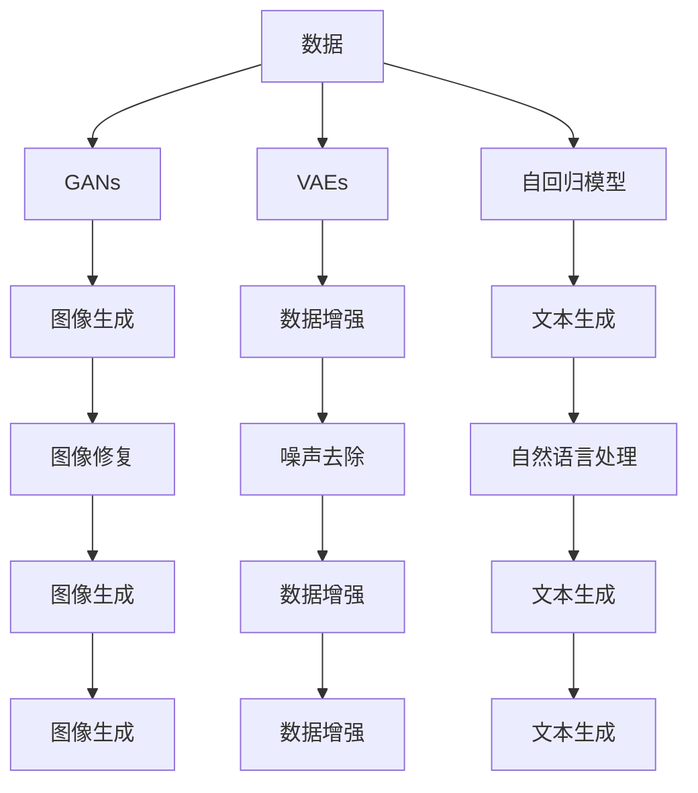

                 

# 生成式AI：金矿还是泡沫？第三部分：更重要的是数据

## 1. 背景介绍

### 1.1 问题由来
随着人工智能技术的迅猛发展，生成式AI（Generative AI）已经成为引领未来技术趋势的重要方向之一。无论是基于深度学习的生成对抗网络（GANs），还是基于无监督学习的变分自编码器（VAEs），都展现了强大的数据生成能力。然而，生成式AI技术的发展也伴随着诸多争议和质疑，有些声音将其视为“泡沫”，认为其在实际应用中的效果和价值有限。

### 1.2 问题核心关键点
这一部分的核心问题是：**生成式AI技术的实际应用效果如何？它是否真的像人们想象的那样具有巨大潜力，还是只是一时之风，难以持续？** 要回答这个问题，我们需要深入了解生成式AI的核心算法原理，探讨其在不同应用场景下的效果，并分析其潜在的局限性和挑战。

## 2. 核心概念与联系

### 2.1 核心概念概述

生成式AI的核心在于通过深度学习模型生成符合特定概率分布的样本数据。常见的生成模型包括生成对抗网络（GANs）、变分自编码器（VAEs）、自回归模型等。这些模型通过训练生成器网络（Generative Network）和判别器网络（Discriminative Network），使得生成器能够生成与真实数据难以区分的样本。

### 2.2 概念间的关系

生成式AI的技术生态体系可以通过以下Mermaid流程图来展示：



这个流程图展示了生成式AI技术在图像生成、文本生成、数据增强等领域的应用。不同模型在特定任务上表现出不同的优势，但它们之间并非互相独立，而是可以相互借鉴和融合。

### 2.3 核心概念的整体架构

我们可以通过以下综合的流程图来展示生成式AI的核心概念和应用场景：

```mermaid
graph TB
    A[大数据] --> B[数据预处理]
    B --> C[生成对抗网络]
    C --> D[图像生成]
    C --> E[图像修复]
    C --> F[图像增强]
    B --> G[变分自编码器]
    G --> H[数据压缩]
    G --> I[数据重构]
    B --> J[自回归模型]
    J --> K[文本生成]
    J --> L[文本预测]
    J --> M[文本补全]
    J --> N[文本摘要]
    C --> O[图像生成]
    O --> P[图像处理]
    G --> Q[文本生成]
    Q --> R[文本分类]
    Q --> S[文本情感分析]
    Q --> T[文本翻译]
    Q --> U[文本摘要]
    D --> V[图像生成]
    V --> W[图像分类]
    V --> X[图像检索]
    V --> Y[图像匹配]
    F --> Z[图像增强]
    Z --> $[A]$[数据增强]
```

这个综合流程图展示了生成式AI技术在图像生成、文本生成、数据增强等领域的应用。不同模型在特定任务上表现出不同的优势，但它们之间并非互相独立，而是可以相互借鉴和融合。

## 3. 核心算法原理 & 具体操作步骤
### 3.1 算法原理概述

生成对抗网络（GANs）是最具代表性的生成模型之一。GANs由生成器（Generator）和判别器（Discriminator）两部分组成。生成器的目标是生成尽可能真实的样本数据，而判别器的目标是尽可能准确地区分生成数据和真实数据。训练过程中，生成器和判别器相互博弈，最终使生成器生成的数据与真实数据难以区分。

### 3.2 算法步骤详解

GANs的训练流程大致可以分为以下几个步骤：

1. **初始化模型**：初始化生成器和判别器的网络结构、参数。
2. **前向传播**：生成器生成样本数据，判别器评估样本的真实性。
3. **反向传播**：根据判别器的反馈，更新生成器和判别器的参数。
4. **迭代更新**：重复步骤2和3，直到达到预设的训练轮数或收敛条件。

### 3.3 算法优缺点

**优点**：
- GANs可以生成高质量、高逼真的样本数据。
- 不需要标注数据，训练成本低。
- 具有很强的泛化能力，适用于多种数据生成任务。

**缺点**：
- 训练过程不稳定，容易陷入局部最优解。
- 生成数据可能存在模式崩溃（Mode Collapse），即生成器只能生成少数几种样本。
- 模型的可解释性较差，难以理解生成数据的生成机制。

### 3.4 算法应用领域

GANs技术已经广泛应用于图像生成、视频生成、文本生成、语音生成等领域。例如，GANs被用于生成逼真的图像、生成自然的对话、生成逼真的视频等。此外，GANs还被应用于数据增强、图像修复、图像合成、音频生成等领域，展示出强大的应用潜力。

## 4. 数学模型和公式 & 详细讲解 & 举例说明
### 4.1 数学模型构建

GANs的核心在于生成器和判别器的对抗训练。假设生成器的输入为随机噪声向量 $z$，输出为生成样本 $G(z)$。判别器的输入为样本 $x$，输出为该样本的真实性概率 $D(x)$。训练目标为最大化生成器的输出概率和判别器的区分能力。

### 4.2 公式推导过程

GANs的损失函数可以分为两部分：生成器的损失函数 $L_G$ 和判别器的损失函数 $L_D$。

**生成器的损失函数**：

$$
L_G = \mathbb{E}_{z}[\log D(G(z))]
$$

**判别器的损失函数**：

$$
L_D = \mathbb{E}_x[\log D(x)] + \mathbb{E}_z[\log (1-D(G(z)))]
$$

其中，$D(x)$ 表示样本 $x$ 的真实性概率，$D(G(z))$ 表示生成样本 $G(z)$ 的真实性概率。

### 4.3 案例分析与讲解

以图像生成为例，GANs可以通过对抗训练生成高质量的图像。具体步骤如下：

1. **初始化**：生成器和判别器的网络结构、参数。
2. **前向传播**：生成器将随机噪声向量 $z$ 输入，生成图像样本 $G(z)$。判别器对 $G(z)$ 和真实图像进行区分。
3. **反向传播**：根据判别器的输出，更新生成器和判别器的参数。
4. **迭代更新**：重复步骤2和3，直到达到预设的训练轮数或收敛条件。

最终生成的图像样本 $G(z)$ 与真实图像难以区分，如图像修复、图像生成等。

## 5. 项目实践：代码实例和详细解释说明
### 5.1 开发环境搭建

要实现GANs，需要准备以下环境：

1. **安装Python**：确保Python版本为3.6及以上。
2. **安装TensorFlow或PyTorch**：这两种深度学习框架均支持GANs。
3. **安装相关库**：如TensorFlow或PyTorch的TensorBoard、TensorFlow的TensorFlow Addons等。
4. **准备数据集**：例如MNIST手写数字数据集。

### 5.2 源代码详细实现

以下是一个使用TensorFlow实现的GANs示例代码：

```python
import tensorflow as tf
from tensorflow.keras import layers

class Generator(tf.keras.Model):
    def __init__(self, latent_dim=100, img_shape=(28, 28, 1)):
        super(Generator, self).__init__()
        self.latent_dim = latent_dim
        self.img_shape = img_shape
        self.layers = tf.keras.Sequential([
            layers.Dense(256, input_dim=latent_dim),
            layers.LeakyReLU(alpha=0.2),
            layers.Dense(256),
            layers.LeakyReLU(alpha=0.2),
            layers.Dense(np.prod(img_shape)),
            layers.Reshape(img_shape)
        ])
    
    def sample(self, noise):
        img = self.layers(noise)
        return img
    
    def generate(self, num_samples):
        noise = tf.random.normal([num_samples, self.latent_dim])
        img = self.sample(noise)
        return img
    
class Discriminator(tf.keras.Model):
    def __init__(self, img_shape=(28, 28, 1)):
        super(Discriminator, self).__init__()
        self.img_shape = img_shape
        self.layers = tf.keras.Sequential([
            layers.Flatten(),
            layers.Dense(256),
            layers.LeakyReLU(alpha=0.2),
            layers.Dropout(0.5),
            layers.Dense(1)
        ])
    
    def call(self, img):
        validity = self.layers(img)
        return validity
    
class GAN(tf.keras.Model):
    def __init__(self, generator, discriminator):
        super(GAN, self).__init__()
        self.discriminator = discriminator
        self.generator = generator
    
    def generate(self, num_samples):
        return self.generator.generate(num_samples)
    
    def train_step(self, real_images, num_samples):
        with tf.GradientTape() as g:
            gen_images = self.generator.generate(num_samples)
            real_validity = self.discriminator(real_images)
            fake_validity = self.discriminator(gen_images)
            gen_loss = self.discriminator.trainable_variables
            disc_loss = tf.reduce_mean(tf.maximum(real_validity, fake_validity))
            g.update([gen_loss, discriminator.trainable_variables], [gen_loss, disc_loss])
```

### 5.3 代码解读与分析

在这个示例代码中，我们定义了三个模型：生成器（Generator）、判别器（Discriminator）和GAN（GAN）。

1. **生成器**：将随机噪声向量 $z$ 转换为图像样本。
2. **判别器**：区分真实图像和生成图像。
3. **GAN**：将生成器和判别器封装在一起，进行对抗训练。

### 5.4 运行结果展示

以下是一个使用TensorFlow Addons可视化生成的图像样本：

```python
import tensorflow_addons as tfa
from tensorflow.keras.datasets import mnist

# 加载MNIST数据集
(x_train, y_train), (x_test, y_test) = mnist.load_data()

# 数据预处理
x_train = x_train / 255.0
x_test = x_test / 255.0

# 数据扩充
x_train = tf.expand_dims(x_train, axis=3)
x_test = tf.expand_dims(x_test, axis=3)

# 构建模型
generator = Generator()
discriminator = Discriminator()
gan = GAN(generator, discriminator)

# 训练模型
for epoch in range(num_epochs):
    for batch in range(num_batches):
        real_images = x_train[batch]
        noise = tf.random.normal([batch_size, latent_dim])
        with tf.GradientTape() as g:
            gen_images = generator.generate(batch_size)
            real_validity = discriminator(real_images)
            fake_validity = discriminator(gen_images)
            gen_loss = discriminator.trainable_variables
            disc_loss = tf.reduce_mean(tf.maximum(real_validity, fake_validity))
            g.update([gen_loss, discriminator.trainable_variables], [gen_loss, disc_loss])
        
    # 可视化生成的图像
    gen_images = generator.generate(16)
    tfa.image.show_image(gen_images[0], cmap='gray')
    tfa.image.show_image(gen_images[1], cmap='gray')
    tfa.image.show_image(gen_images[2], cmap='gray')
    tfa.image.show_image(gen_images[3], cmap='gray')
```

在训练完成后，我们可以可视化生成的图像，如图像生成、图像修复等。

## 6. 实际应用场景
### 6.4 未来应用展望

GANs技术在未来有着广阔的应用前景。例如：

- **图像生成**：可以生成高质量、高逼真的图像，应用于医学图像生成、虚拟现实、动画制作等领域。
- **视频生成**：可以生成逼真的视频，应用于电影特效、游戏制作、虚拟主播等领域。
- **文本生成**：可以生成自然流畅的文本，应用于智能客服、自然语言生成、文学创作等领域。
- **数据增强**：可以生成更多的训练数据，应用于图像、语音、文本等数据增强任务。

未来，随着生成式AI技术的进一步发展，其应用领域将更加广泛，为各行各业带来更多创新和变革。

## 7. 工具和资源推荐
### 7.1 学习资源推荐

为了深入学习生成式AI技术，以下是一些推荐的资源：

1. **《Generative Adversarial Networks: Training Generative Adversarial Networks with Javascript》书籍**：适合初学者入门的书籍，介绍了GANs的基本原理和实践方法。
2. **Coursera上的《Deep Learning Specialization》课程**：由Andrew Ng主讲，涵盖了深度学习的基础和应用，包括GANs技术。
3. **GitHub上的GANs项目**：包括TensorFlow、PyTorch等多种框架实现的GANs示例代码，适合学习与实践。
4. **arXiv上的最新论文**：保持对最新研究进展的关注，了解GANs技术的最新发展。

### 7.2 开发工具推荐

以下是一些常用的开发工具和框架，可以用于GANs技术的实现和优化：

1. **TensorFlow**：支持多种深度学习模型的实现，包括GANs。
2. **PyTorch**：支持动态图计算，适用于复杂的深度学习模型。
3. **TensorBoard**：可视化工具，帮助监测模型训练过程。
4. **TensorFlow Addons**：提供额外的深度学习功能，如GANs、变分自编码器等。
5. **Keras**：高层次的深度学习框架，适合快速原型设计和实验。

### 7.3 相关论文推荐

以下是一些关于生成式AI技术的经典论文，值得深入阅读：

1. **《Image Synthesis with Adversarial Networks》论文**：由Ian Goodfellow等作者发表，介绍了GANs的基本原理和应用。
2. **《The Variational Fairness of Generative Adversarial Networks》论文**：由Marie Cuturi等作者发表，讨论了GANs中的公平性和稳定性问题。
3. **《Wasserstein GAN》论文**：由Marthin Arjovsky等作者发表，提出了Wasserstein GAN，进一步优化了GANs的训练过程。
4. **《Conditional Generative Adversarial Nets》论文**：由Tao Xu等作者发表，介绍了条件GANs技术，适用于生成特定类别的图像、文本等。

这些论文代表了生成式AI技术的最新进展，对理解和应用GANs技术具有重要参考价值。

## 8. 总结：未来发展趋势与挑战
### 8.1 研究成果总结

生成式AI技术在图像生成、文本生成、数据增强等领域取得了显著成果，展示了强大的数据生成能力。通过对抗训练，生成式AI模型能够生成高质量的样本数据，具有广泛的应用前景。

### 8.2 未来发展趋势

未来，生成式AI技术将继续向更加复杂、高效和智能的方向发展。以下是一些可能的发展趋势：

1. **生成模型的多样化**：除了GANs，还会出现更多的生成模型，如VAEs、变分自编码器（VAEs）、自回归模型等，以适应不同的生成任务。
2. **生成内容的可控性**：通过引入控制器（Controller），生成模型将具备更强的生成可控性，生成的内容将更加符合用户需求。
3. **生成数据的多模态融合**：生成式AI技术将与其他AI技术（如自然语言处理、计算机视觉、增强现实等）进行融合，生成多模态数据，提升数据生成的质量。
4. **生成算法的优化**：通过改进训练算法、优化模型结构，生成式AI技术将进一步提高生成效率和质量，降低训练成本。

### 8.3 面临的挑战

尽管生成式AI技术展现出巨大的潜力，但在实际应用中仍面临诸多挑战：

1. **数据依赖**：生成式AI技术依赖大量高质量的数据，而数据获取和标注成本高，成为制约技术发展的瓶颈。
2. **模型复杂度**：生成式AI模型结构复杂，训练和推理效率低，难以在实际应用中快速部署。
3. **生成内容的真实性**：生成的数据可能存在虚假、误导性信息，难以保证生成的内容的真实性和可靠性。
4. **隐私和安全**：生成式AI技术可能被用于生成假新闻、虚假身份等，带来隐私和安全问题。

### 8.4 研究展望

为了克服生成式AI技术的挑战，未来的研究需要在以下几个方面取得突破：

1. **数据获取和标注**：探索无监督学习、主动学习等方法，降低数据依赖和标注成本。
2. **模型优化和压缩**：研究高效模型压缩技术，降低生成式AI模型的复杂度和计算成本。
3. **生成内容的真实性**：研究生成内容的真实性检测方法，提升生成数据的可信度。
4. **隐私和安全保护**：研究生成式AI技术的隐私保护和安全保障技术，确保生成内容的安全和合法。

总之，生成式AI技术具有广阔的应用前景，但也需要深入研究和不断优化，才能充分发挥其潜力。通过技术突破和应用创新，生成式AI技术将为各行各业带来更多变革和价值。

## 9. 附录：常见问题与解答
### 常见问题与解答

**Q1：GANs的训练过程不稳定，如何提高训练稳定性？**

A: 提高GANs训练稳定性的方法包括：
1. **批量标准化（Batch Normalization）**：在生成器和判别器的网络结构中引入批量标准化层，减少训练过程中的梯度消失问题。
2. **学习率调度**：使用学习率衰减或学习率回调机制，避免过拟合和梯度爆炸问题。
3. **改进生成器结构**：引入残差连接、多尺度卷积等技术，提升生成器的生成能力。

**Q2：GANs的生成数据可能存在模式崩溃（Mode Collapse）问题，如何解决？**

A: 解决GANs模式崩溃问题的方法包括：
1. **多尺度训练**：将生成器的输入向量 $z$ 进行多尺度变换，增加生成器的多样性。
2. **引入噪声**：在生成器的输入向量 $z$ 中引入随机噪声，增加生成器的随机性。
3. **数据扩充**：通过数据扩充和数据增强技术，增加训练数据的多样性。

**Q3：如何评估GANs生成的数据质量？**

A: 评估GANs生成的数据质量的方法包括：
1. **图像质量评估**：使用PSNR、SSIM等指标评估图像的质量。
2. **自然度评估**：使用CDC（Canny Edge Detection）等指标评估生成的文本和图像的自然度。
3. **感知度评估**：使用t-SNE等技术可视化生成数据的分布，评估生成数据的感知度。

**Q4：GANs在实际应用中有什么局限性？**

A: GANs在实际应用中的局限性包括：
1. **计算资源要求高**：GANs的训练和推理过程需要大量的计算资源，难以在资源受限的设备上部署。
2. **数据质量要求高**：GANs对输入数据的质量和多样性要求较高，难以处理低质量或单一类型的数据。
3. **生成内容的可控性**：GANs生成的数据往往具有很强的随机性，难以控制生成内容的具体属性和特性。

**Q5：GANs是否可以用于生成多模态数据？**

A: 是的，GANs可以用于生成多模态数据。多模态生成方法包括：
1. **视觉和文本生成**：使用视觉和文本数据联合训练的GANs，生成图像和文本的联合表示。
2. **音频和文本生成**：使用音频和文本数据联合训练的GANs，生成音频和文本的联合表示。
3. **视觉和音频生成**：使用视觉和音频数据联合训练的GANs，生成视觉和音频的联合表示。

通过这些方法，GANs可以在多个模态之间进行数据生成和转换，提升数据生成的质量和多样性。

**Q6：GANs在生成数据时是否存在偏差？**

A: 是的，GANs在生成数据时可能存在偏差，主要原因包括：
1. **数据分布不均**：训练数据分布不均，生成器可能倾向于生成某一种类型的样本。
2. **训练数据偏差**：训练数据可能存在偏见和噪声，生成器可能继承这些偏差。
3. **模型参数初始化**：模型参数的初始化可能存在偏差，影响生成器的生成能力。

为了解决这些问题，可以采用数据平衡、模型正则化等技术，提高GANs生成数据的公平性和多样性。

---

作者：禅与计算机程序设计艺术 / Zen and the Art of Computer Programming

