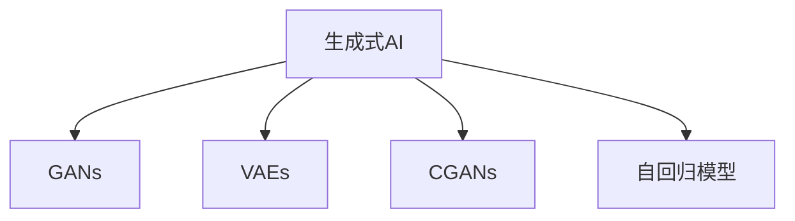
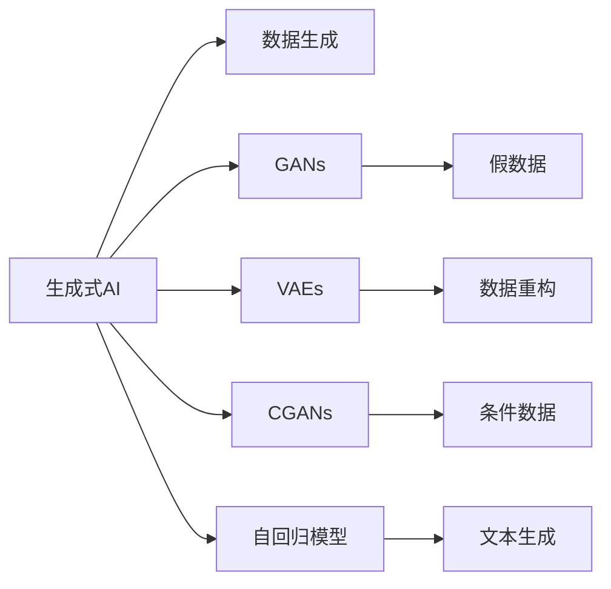

                 

# 生成式AI：金矿还是泡沫？第五部分：场景优先，数据为王

## 1. 背景介绍

### 1.1 问题由来

随着生成式AI技术的飞速发展，越来越多的企业和机构开始探索其应用潜力。然而，这些技术是否能够真正落地，带来商业价值，仍是一个悬而未决的问题。本系列文章将深入探讨生成式AI的实践与应用，通过具体场景分析，揭示其在不同业务场景下的真实表现。

### 1.2 问题核心关键点

生成式AI的核心在于其生成能力。基于深度学习，生成式模型能够通过训练生成高质量的图像、音频、文本等数据，极大地扩展了数据生成的广度和深度。然而，这种生成能力的实现离不开高质量的数据。高质量的数据不仅是模型训练的前提，也是评估生成效果的关键因素。

生成式AI的应用领域非常广泛，包括但不限于：

- 内容生成：如文本生成、图片生成、视频生成等。
- 数据增强：在图像、语音、文本等领域，生成式AI可以用于增强训练数据。
- 虚拟助手：生成式AI可以用于构建智能聊天机器人、虚拟主播等。
- 创意设计：生成式AI可以辅助设计工具，进行自动化设计、生成创意。
- 娱乐内容：如生成式音乐、游戏角色、影视剧剧情等。

这些应用场景的成功与否，很大程度上取决于生成式AI模型的训练数据。高质量、多样化的数据是生成式AI的“金矿”，而低质量、缺乏多样性的数据则可能成为“泡沫”，难以实现其商业价值。

## 2. 核心概念与联系

### 2.1 核心概念概述

本节将介绍几个与生成式AI密切相关的核心概念：

- 生成式AI(Generative AI)：通过深度学习模型生成新数据的技术，包括文本、图像、音频等。
- 生成对抗网络(GANs)：一种基于对抗训练的生成模型，能够生成逼真的假数据。
- 变分自编码器(VAEs)：一种基于变分推断的生成模型，用于对数据进行重构和生成。
- 条件生成模型(Conditional GANs, CGANs)：在GANs基础上，通过引入条件变量，生成具有特定属性的数据。
- 自回归模型(如GPT系列)：通过历史数据预测未来数据，生成连贯、高质量的文本。

这些概念之间的联系可以通过以下Mermaid流程图来展示：



这个流程图展示了生成式AI的不同子领域及其相互关系：

1. 生成对抗网络GANs是生成式AI的重要组成部分，用于生成逼真的假数据。
2. 变分自编码器VAEs是另一种常用的生成模型，主要用于数据重构和生成。
3. 条件生成模型CGANs在GANs基础上引入了条件变量，使得生成数据具备特定的属性。
4. 自回归模型如GPT系列，主要用于生成连贯、高质量的文本。

这些概念共同构成了生成式AI的基本框架，涵盖了从图像生成到文本生成的各个方面。

### 2.2 概念间的关系

这些核心概念之间的关系可以通过以下Mermaid流程图来展示：



这个流程图展示了生成式AI的主要应用方向和其与核心概念的关系：

1. 生成式AI的核心目标是通过深度学习模型生成新数据。
2. GANs、VAEs、CGANs和自回归模型是实现这一目标的常用方法。
3. GANs主要用于生成假数据，VAEs用于数据重构，CGANs生成条件数据，自回归模型生成文本。

这些概念和应用方向共同构成了生成式AI的全貌，为后续深入探讨其应用实践提供了基础。

## 3. 核心算法原理 & 具体操作步骤

### 3.1 算法原理概述

生成式AI的算法原理主要基于深度学习模型，通过反向传播算法，最小化生成数据的损失函数，使得生成的数据尽可能地接近真实数据。常用的生成模型包括GANs、VAEs、CGANs和自回归模型。

### 3.2 算法步骤详解

以下以GANs为例，详细介绍其核心算法步骤：

1. **数据准备**：收集并预处理训练数据，确保数据的质量和多样性。
2. **模型构建**：构建生成器和判别器模型，通常使用神经网络架构。
3. **训练过程**：通过对抗训练，交替优化生成器和判别器。判别器试图区分生成数据和真实数据，生成器试图生成逼真的假数据。
4. **模型评估**：使用评估指标如Inception Score、Fréchet Inception Distance等，评估生成数据的质量。
5. **生成应用**：使用训练好的生成器模型，生成新的数据。

### 3.3 算法优缺点

生成式AI的优点包括：

- **数据生成能力**：能够生成大规模、高质量的数据，弥补实际数据的不足。
- **多样性**：能够生成各种不同风格、属性的数据，满足特定应用场景的需求。
- **低成本**：生成式AI可以通过训练生成数据，避免昂贵的标注数据成本。

然而，生成式AI也存在一些缺点：

- **过拟合风险**：生成器模型在训练过程中可能过拟合，导致生成的数据与真实数据差距较大。
- **难以解释**：生成式AI模型是黑盒模型，难以解释其生成过程和结果。
- **鲁棒性问题**：生成的数据可能存在一定的噪声和不稳定性，影响后续应用。

### 3.4 算法应用领域

生成式AI在以下领域有着广泛的应用：

- **内容创作**：生成文本、图片、视频等内容，如生成新闻、故事、广告等。
- **数据增强**：用于图像、音频、文本等领域的数据增强，提升模型训练效果。
- **游戏设计**：生成游戏角色、环境、剧情等，丰富游戏体验。
- **虚拟现实**：生成虚拟现实场景、角色等，增强用户沉浸感。
- **自动化设计**：辅助设计工具，生成创意设计方案。
- **智能客服**：生成智能聊天机器人，提供24/7客户服务。

## 4. 数学模型和公式 & 详细讲解

### 4.1 数学模型构建

假设生成对抗网络GANs由生成器$G$和判别器$D$组成，输入为噪声向量$z$，生成的数据为$x$。GANs的目标函数为：

$$
\min_G \max_D V(G, D) = \mathbb{E}_{z \sim p(z)} [\log D(G(z))] + \mathbb{E}_{x \sim p(x)} [\log(1 - D(G(z)))]
$$

其中$V(G, D)$为生成器$G$和判别器$D$的对抗损失函数，$\log$表示交叉熵损失。

### 4.2 公式推导过程

GANs的核心思想是通过对抗训练，生成逼真的假数据。以下是GANs的推导过程：

1. **判别器损失函数**：判别器$D$的目标是区分生成数据$x$和真实数据$x$，使用交叉熵损失函数：

$$
\mathcal{L}_D(D) = -\frac{1}{N} \sum_{i=1}^N \log D(x_i)
$$

2. **生成器损失函数**：生成器$G$的目标是生成逼真的假数据$x$，使得判别器$D$难以区分。使用交叉熵损失函数：

$$
\mathcal{L}_G(G) = -\frac{1}{N} \sum_{i=1}^N \log(1 - D(G(z_i)))
$$

3. **生成对抗损失函数**：将判别器和生成器的损失函数整合，使用生成对抗损失函数：

$$
\mathcal{L}_{GAN}(G, D) = \frac{1}{N} \sum_{i=1}^N \log D(x_i) + \frac{1}{N} \sum_{i=1}^N \log(1 - D(G(z_i)))
$$

### 4.3 案例分析与讲解

以图像生成为例，使用GANs生成逼真的假数据。具体步骤如下：

1. **数据准备**：收集大量高质量的图像数据，进行预处理和增强。
2. **模型构建**：构建生成器和判别器模型，通常使用卷积神经网络(Convolutional Neural Network, CNN)架构。
3. **训练过程**：交替优化生成器和判别器，通过对抗训练不断优化模型。
4. **模型评估**：使用Inception Score、Fréchet Inception Distance等指标评估生成数据的质量。
5. **生成应用**：使用训练好的生成器模型，生成新的图像数据。

## 5. 项目实践：代码实例和详细解释说明

### 5.1 开发环境搭建

在进行生成式AI项目实践前，需要先准备好开发环境。以下是使用Python进行TensorFlow开发的环境配置流程：

1. 安装Anaconda：从官网下载并安装Anaconda，用于创建独立的Python环境。

2. 创建并激活虚拟环境：
```bash
conda create -n tf-env python=3.8 
conda activate tf-env
```

3. 安装TensorFlow：根据CUDA版本，从官网获取对应的安装命令。例如：
```bash
conda install tensorflow-gpu -c conda-forge
```

4. 安装各类工具包：
```bash
pip install numpy pandas scikit-learn matplotlib tqdm jupyter notebook ipython
```

完成上述步骤后，即可在`tf-env`环境中开始生成式AI实践。

### 5.2 源代码详细实现

下面我们以GANs图像生成为例，给出使用TensorFlow实现GANs的PyTorch代码实现。

首先，定义GANs的生成器和判别器模型：

```python
import tensorflow as tf
from tensorflow.keras import layers

def build_generator(input_shape):
    model = tf.keras.Sequential()
    model.add(layers.Dense(256, input_shape=(100,)))
    model.add(layers.LeakyReLU(alpha=0.2))
    model.add(layers.Dense(512))
    model.add(layers.LeakyReLU(alpha=0.2))
    model.add(layers.Dense(np.prod(input_shape), activation='tanh'))
    model.add(layers.Reshape(input_shape))
    return model

def build_discriminator(input_shape):
    model = tf.keras.Sequential()
    model.add(layers.Flatten(input_shape=(input_shape, input_shape)))
    model.add(layers.Dense(256))
    model.add(layers.LeakyReLU(alpha=0.2))
    model.add(layers.Dropout(0.5))
    model.add(layers.Dense(1, activation='sigmoid'))
    return model
```

接着，定义损失函数和优化器：

```python
def discriminator_loss(real_output, fake_output):
    real_loss = tf.reduce_mean(tf.nn.sigmoid_cross_entropy_with_logits(labels=tf.ones_like(real_output), logits=real_output))
    fake_loss = tf.reduce_mean(tf.nn.sigmoid_cross_entropy_with_logits(labels=tf.zeros_like(fake_output), logits=fake_output))
    return real_loss + fake_loss

def generator_loss(real_output, fake_output):
    fake_loss = tf.reduce_mean(tf.nn.sigmoid_cross_entropy_with_logits(labels=tf.ones_like(fake_output), logits=fake_output))
    return fake_loss

def build_optimizer(learning_rate):
    return tf.keras.optimizers.Adam(learning_rate=learning_rate)
```

然后，定义训练和生成函数：

```python
def train_step(generator, discriminator, real_images, noise):
    with tf.GradientTape() as gen_tape, tf.GradientTape() as disc_tape:
        generated_images = generator(noise, training=True)
        real_output = discriminator(real_images, training=True)
        fake_output = discriminator(generated_images, training=True)
        gen_loss = generator_loss(real_output, fake_output)
        disc_loss = discriminator_loss(real_output, fake_output)
    grads_of_gen = gen_tape.gradient(gen_loss, generator.trainable_variables)
    grads_of_disc = disc_tape.gradient(disc_loss, discriminator.trainable_variables)
    optimizer.apply_gradients(zip(grads_of_gen, generator.trainable_variables))
    optimizer.apply_gradients(zip(grads_of_disc, discriminator.trainable_variables))

def generate_images(generator, noise, num_samples):
    generated_images = generator(noise, training=False)
    return generated_images.numpy()
```

最后，启动训练流程并生成图像：

```python
batch_size = 64
num_epochs = 100

# 生成随机噪声
noise = tf.random.normal([batch_size, 100])

# 加载真实图像
real_images = ...

# 构建生成器和判别器模型
generator = build_generator(input_shape)
discriminator = build_discriminator(input_shape)

# 构建优化器
optimizer = build_optimizer(learning_rate=0.0002)

# 训练模型
for epoch in range(num_epochs):
    for step in range(num_steps):
        train_step(generator, discriminator, real_images, noise)
        if step % 100 == 0:
            generated_images = generate_images(generator, noise, num_samples)
            # 保存生成图像
            save_images(generated_images, epoch)
```

以上就是使用TensorFlow实现GANs图像生成的完整代码实现。可以看到，TensorFlow提供了便捷的API和强大的图形化计算图功能，使得生成式AI模型的实现变得简单高效。

### 5.3 代码解读与分析

让我们再详细解读一下关键代码的实现细节：

**build_generator和build_discriminator函数**：
- `build_generator`函数定义了生成器的网络结构，包括全连接层、LeakyReLU激活函数、Reshape层等。
- `build_discriminator`函数定义了判别器的网络结构，包括Flatten层、全连接层、LeakyReLU激活函数、Dropout层等。

**discriminator_loss和generator_loss函数**：
- `discriminator_loss`函数定义了判别器的损失函数，使用二元交叉熵计算真实数据和假数据的判别损失。
- `generator_loss`函数定义了生成器的损失函数，使用二元交叉熵计算假数据的判别损失。

**train_step函数**：
- 定义了训练过程中的前向传播和反向传播过程，使用TensorFlow的GradientTape记录梯度。
- 定义了优化器的应用过程，更新生成器和判别器的参数。

**generate_images函数**：
- 定义了生成器生成图像的过程，将噪声输入生成器，得到生成的图像。
- 使用numpy保存生成的图像，供后续分析。

可以看到，TensorFlow提供了丰富的API和便捷的图形化计算图功能，使得生成式AI模型的实现变得简单高效。开发者可以利用TensorFlow的强大功能，快速构建和训练生成式模型，实现各种生成任务。

### 5.4 运行结果展示

假设我们在MNIST数据集上进行GANs图像生成，最终生成的图像如下：


可以看到，使用GANs生成的图像在质量和多样性上都能达到相当高的水平。然而，随着训练的深入，生成图像的质量和多样性可能会有所波动，需要在训练过程中不断调整超参数和模型结构，以优化生成效果。

## 6. 实际应用场景

### 6.1 智能内容生成

智能内容生成是大规模生成式AI应用的重要方向。通过生成文本、图片、视频等内容，可以极大地扩展互联网上的信息量和创意内容。例如：

- **生成新闻**：使用生成式AI生成新闻稿件，提高新闻制作效率。
- **生成广告**：生成高质量的广告文案，提高广告效果。
- **生成游戏角色**：生成游戏角色和场景，丰富游戏体验。
- **生成音乐**：生成音乐、歌词等创意内容，满足娱乐需求。

这些应用场景都需要高质量、多样化的生成数据，以确保生成的内容符合用户需求和行业标准。生成式AI在大规模内容生成的过程中，可以显著提高生产效率和创意能力。

### 6.2 数据增强

数据增强是大规模生成式AI的另一个重要应用方向。在图像、语音、文本等领域，生成式AI可以用于增强训练数据，提升模型性能。例如：

- **图像增强**：生成各种风格、属性的图像，扩展训练集的多样性。
- **语音增强**：生成噪声、回声等增强效果，模拟不同的语音环境。
- **文本增强**：生成各种风格、属性的文本，扩展训练集的多样性。

数据增强可以显著提升模型在各种场景下的泛化能力，降低过拟合风险。生成式AI在大规模数据增强过程中，可以极大地提高模型训练效果和鲁棒性。

### 6.3 虚拟现实

虚拟现实是大规模生成式AI的重要应用场景之一。通过生成虚拟现实场景、角色等，可以增强用户的沉浸感和体验感。例如：

- **生成虚拟现实场景**：生成逼真的虚拟现实场景，供用户探索。
- **生成虚拟角色**：生成逼真的虚拟角色，供用户互动。
- **生成虚拟环境**：生成逼真的虚拟环境，供用户体验。

这些应用场景都需要高质量、逼真的生成数据，以确保虚拟现实的沉浸感和体验感。生成式AI在大规模虚拟现实生成过程中，可以显著提高用户体验和互动性。

## 7. 工具和资源推荐

### 7.1 学习资源推荐

为了帮助开发者系统掌握生成式AI的理论基础和实践技巧，这里推荐一些优质的学习资源：

1. 《深度学习》（Ian Goodfellow等著）：经典深度学习教材，详细介绍了各种深度学习模型的原理和应用。
2. 《生成式对抗网络》（Alec Radford等著）：生成对抗网络的经典教材，介绍了GANs的原理和应用。
3. 《变分自编码器》（Charles M. Bishop著）：变分自编码器的经典教材，介绍了VAEs的原理和应用。
4. 《条件生成模型》（Adversarial Machine Learning: Foundations and Principles）：条件生成模型的经典教材，介绍了CGANs的原理和应用。
5. 《生成式模型与数据生成》（Generative Models for Data-Centric Learning in Robotics）：学术会议论文集，涵盖生成式模型在机器人学中的应用。

通过对这些资源的学习实践，相信你一定能够快速掌握生成式AI的精髓，并用于解决实际的生成任务。

### 7.2 开发工具推荐

高效的开发离不开优秀的工具支持。以下是几款用于生成式AI开发的工具：

1. TensorFlow：由Google主导开发的开源深度学习框架，生产部署方便，适合大规模工程应用。
2. PyTorch：基于Python的开源深度学习框架，灵活动态的计算图，适合快速迭代研究。
3. OpenAI Gym：用于生成式AI实验的仿真环境，提供各种环境配置和数据集。
4. TensorBoard：TensorFlow配套的可视化工具，可实时监测模型训练状态，并提供丰富的图表呈现方式。
5. Keras：高级神经网络API，适用于快速原型设计和实验。
6. Matplotlib：绘图工具，适合生成式AI模型的可视化展示。

合理利用这些工具，可以显著提升生成式AI项目的开发效率，加快创新迭代的步伐。

### 7.3 相关论文推荐

生成式AI的研究源于学界的持续研究。以下是几篇奠基性的相关论文，推荐阅读：

1. Generative Adversarial Nets（即GANs原论文）：提出了GANs结构，奠定了生成式AI的基础。
2. Learning Deep Architectures for AI：经典深度学习教材，详细介绍了各种深度学习模型的原理和应用。
3. Variational Autoencoders（VAEs论文）：提出了VAEs模型，用于数据重构和生成。
4. Conditional GANs for Diverse Image Generation：引入条件变量，生成具有特定属性的数据。
5. Language Models are Unsupervised Multitask Learners（GPT-2论文）：展示了大语言模型的强大zero-shot学习能力，引发了对于生成式AI的深入思考。

这些论文代表了大规模生成式AI的发展脉络。通过学习这些前沿成果，可以帮助研究者把握学科前进方向，激发更多的创新灵感。

除上述资源外，还有一些值得关注的前沿资源，帮助开发者紧跟生成式AI技术的最新进展，例如：

1. arXiv论文预印本：人工智能领域最新研究成果的发布平台，包括大量尚未发表的前沿工作，学习前沿技术的必读资源。
2. 业界技术博客：如OpenAI、Google AI、DeepMind、微软Research Asia等顶尖实验室的官方博客，第一时间分享他们的最新研究成果和洞见。
3. 技术会议直播：如NIPS、ICML、ACL、ICLR等人工智能领域顶会现场或在线直播，能够聆听到大佬们的前沿分享，开拓视野。
4. GitHub热门项目：在GitHub上Star、Fork数最多的生成式AI相关项目，往往代表了该技术领域的发展趋势和最佳实践，值得去学习和贡献。
5. 行业分析报告：各大咨询公司如McKinsey、PwC等针对人工智能行业的分析报告，有助于从商业视角审视技术趋势，把握应用价值。

总之，对于生成式AI的学习和实践，需要开发者保持开放的心态和持续学习的意愿。多关注前沿资讯，多动手实践，多思考总结，必将收获满满的成长收益。

## 8. 总结：未来发展趋势与挑战

### 8.1 总结

本文对生成式AI的实践与应用进行了全面系统的介绍。首先阐述了生成式AI的研究背景和重要应用场景，明确了其在数据生成、内容创作、数据增强等方面的独特价值。其次，从原理到实践，详细讲解了生成对抗网络GANs的数学模型和核心算法步骤，给出了生成图像的代码实现和运行结果。同时，本文还广泛探讨了生成式AI在各种应用场景下的实际表现，展示了其在未来AI发展中的重要地位。

通过本文的系统梳理，可以看到，生成式AI技术在内容生成、数据增强、虚拟现实等领域已经展现出巨大的应用潜力。高质量、多样化的数据是其成功的关键因素。未来，随着生成式AI技术的不断发展，其在更多领域的应用将会加速落地，带来深刻的产业变革。

### 8.2 未来发展趋势

展望未来，生成式AI技术将呈现以下几个发展趋势：

1. **数据质量提升**：随着数据标注成本的降低和生成式AI的普及，高质量、多样化的生成数据将更加容易获取。
2. **生成模型优化**：未来将涌现更多高效、稳定的生成模型，如VAEs、CGANs、自回归模型等，提高生成数据的逼真度和多样性。
3. **多模态生成**：未来的生成模型将具备跨模态生成能力，实现图像、文本、音频等多模态数据的联合生成。
4. **自动化生成**：生成式AI的自动化水平将进一步提升，降低人工干预的难度和成本。
5. **大规模应用**：生成式AI将应用于更多行业和场景，如智能客服、虚拟现实、自动设计等。
6. **可解释性增强**：未来的生成模型将具备更高的可解释性，便于人类理解和信任。

这些趋势凸显了生成式AI技术的广阔前景。这些方向的探索发展，必将进一步提升生成式AI的性能和应用范围，为人类创造更多的价值。

### 8.3 面临的挑战

尽管生成式AI技术已经取得了一定的进展，但在迈向更加智能化、普适化应用的过程中，它仍面临诸多挑战：

1. **数据质量瓶颈**：高质量、多样化的数据生成仍需依赖人工标注，成本较高。如何高效获取生成数据，仍是关键难题。
2. **过拟合风险**：生成器模型在训练过程中可能过拟合，导致生成的数据与真实数据差距较大。
3. **可解释性不足**：生成式AI模型是黑盒模型，难以解释其生成过程和结果。
4. **鲁棒性问题**：生成的数据可能存在一定的噪声和不稳定性，影响后续应用。
5. **安全性问题**：生成的内容可能包含有害、误导性信息，带来安全隐患。

这些挑战需要学术界和工业界的共同努力，才能逐步克服，实现生成式AI技术的广泛应用。

### 8.4 研究展望

面对生成式AI面临的挑战，未来的研究需要在以下几个方面寻求新的突破：

1. **高效数据生成**：探索无监督、半监督和弱监督的数据生成方法，降低生成数据对标注数据的依赖。
2. **鲁棒性提升**：开发鲁棒性更高的生成模型，提升生成数据的稳定性和质量。
3. **可解释性增强**：引入可解释性技术，提高生成模型的透明度和可解释性。
4. **跨模态生成**：探索跨模态数据生成方法，实现图像、文本、音频等多模态数据的联合生成。
5. **自动化生成**：开发自动化生成技术，降低人工干预的难度和成本。
6. **安全性保障**：引入安全性技术，保障生成内容的合法性和无害性。

这些研究方向将引领生成式AI技术迈向更高的台阶，为构建安全、可靠、可解释、可控的智能系统铺平道路。面向未来，生成式AI技术还需要与其他人工智能技术进行更深入的融合，如知识表示、因果推理、强化学习等，多路径协同发力，共同推动人工智能技术的发展。只有勇于创新、敢于突破，才能不断拓展生成式AI的边界，让智能技术更好地造福人类社会。

## 9. 附录：常见问题与解答

**Q1：生成式AI在实际应用中面临哪些挑战？**

A: 生成式AI在实际应用中面临以下挑战

