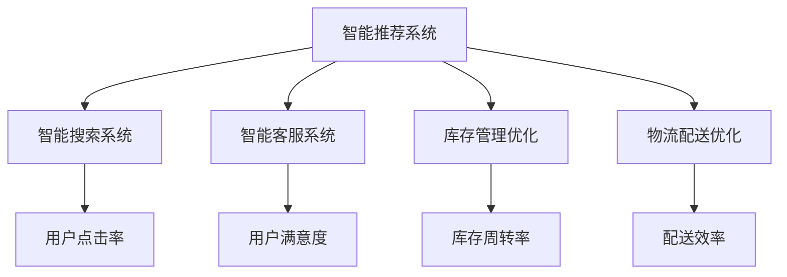
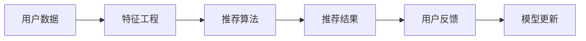
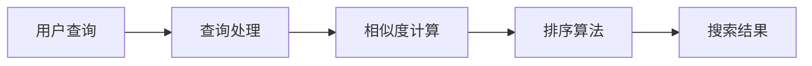
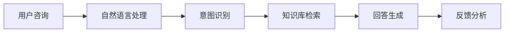
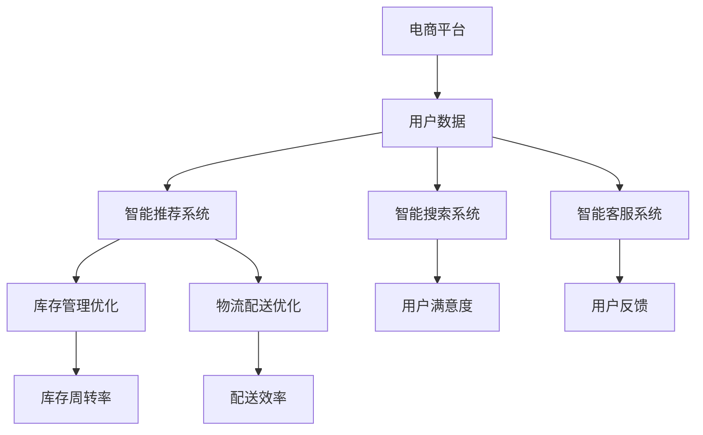

                 

# 电商平台供给能力提升：人工智能技术的应用

> 关键词：人工智能,电商平台,供给能力提升,智能推荐,自然语言处理(NLP),计算机视觉(CV),机器学习,深度学习

## 1. 背景介绍

### 1.1 问题由来
随着互联网和电子商务的迅猛发展，电商平台已逐渐成为人们购物的主要渠道之一。然而，电商平台的供给能力受到各种因素的限制，包括商品库存管理、物流配送、客服响应速度等。传统电商平台的供给能力提升依赖于人工管理和经验积累，存在效率低、响应慢、数据积累不足等问题。

为了应对这些挑战，电商平台纷纷引入人工智能技术，通过智能推荐、智能搜索、智能客服等应用，提升平台供给能力和用户体验。人工智能技术在电商平台中的应用已经成为当前的热点话题，并逐步成为推动电商行业发展的关键力量。

### 1.2 问题核心关键点
提升电商平台的供给能力，主要包括以下几个关键点：

- **智能推荐系统**：通过分析用户行为和偏好，精准推荐商品，提升用户购买转化率。
- **智能搜索系统**：优化搜索结果，提高用户查找商品的效率和满意度。
- **智能客服系统**：自动解答用户咨询，减少人工客服负担，提升响应速度。
- **库存管理优化**：通过预测用户需求，优化库存水平，减少缺货和积压现象。
- **物流配送优化**：通过路线规划、车辆调度等技术，提升物流配送效率和用户体验。

这些应用场景涵盖了电商平台的各个方面，能够显著提升平台的供给能力，满足用户需求。

### 1.3 问题研究意义
电商平台引入人工智能技术，具有以下几方面的重要意义：

- **提升用户体验**：通过智能推荐和智能客服，提升用户购物体验，增加用户黏性。
- **提高运营效率**：智能搜索和库存管理优化，减少人工操作，提高运营效率。
- **降低运营成本**：通过优化物流配送，减少人工成本，降低运营成本。
- **拓展业务场景**：借助AI技术，电商平台可以拓展更多业务场景，如无人店铺、智慧物流等。
- **增强竞争力**：通过技术优势，提升电商平台的市场竞争力和盈利能力。

综上所述，人工智能技术的应用，能够显著提升电商平台的供给能力，成为电商行业发展的重要驱动力。

## 2. 核心概念与联系

### 2.1 核心概念概述

为了更好地理解人工智能技术在电商平台供给能力提升中的应用，本节将介绍几个密切相关的核心概念：

- **智能推荐系统**：通过分析用户行为和商品特征，生成个性化推荐，提升用户购买转化率。常见的推荐算法包括协同过滤、基于内容的推荐、混合推荐等。
- **智能搜索系统**：通过优化搜索结果排序，使用户能够快速找到所需商品。常见的搜索算法包括向量空间模型、基于深度学习的检索模型等。
- **智能客服系统**：通过自然语言处理技术，自动解答用户咨询，减少人工客服负担，提升响应速度和用户体验。
- **库存管理优化**：通过预测用户需求和库存水平，优化库存管理，减少缺货和积压现象。常见的预测算法包括时间序列分析、回归分析等。
- **物流配送优化**：通过路线规划、车辆调度等技术，提升物流配送效率和用户体验。

这些核心概念之间存在着紧密的联系，形成了电商平台的供给能力提升系统。以下通过一个Mermaid流程图来展示这些概念之间的关系：



### 2.2 概念间的关系

这些核心概念之间存在着紧密的联系，形成了电商平台的供给能力提升系统。以下通过几个Mermaid流程图来展示这些概念之间的关系。

#### 2.2.1 智能推荐系统的核心流程



这个流程图展示了智能推荐系统的核心流程：

1. 收集用户数据，包括历史行为、偏好、评分等。
2. 通过特征工程提取用户特征和商品特征，构建特征向量。
3. 使用推荐算法生成推荐结果，如协同过滤、基于内容的推荐、混合推荐等。
4. 将推荐结果展示给用户，并接收用户反馈，更新模型参数。

#### 2.2.2 智能搜索系统的核心流程



这个流程图展示了智能搜索系统的核心流程：

1. 接收用户查询，并进行分词、标引等预处理。
2. 计算查询与商品之间的相似度，如TF-IDF、余弦相似度等。
3. 使用排序算法对商品进行排序，如基于深度学习的检索模型。
4. 展示搜索结果给用户，并根据用户反馈进行调整优化。

#### 2.2.3 智能客服系统的核心流程



这个流程图展示了智能客服系统的核心流程：

1. 接收用户咨询，并进行自然语言处理，如分词、句法分析等。
2. 通过意图识别技术，确定用户咨询的意图。
3. 从知识库中检索相关信息，生成回答。
4. 将回答返回给用户，并根据用户反馈进行调整优化。

### 2.3 核心概念的整体架构

最后，我们用一个综合的流程图来展示这些核心概念在大语言模型微调过程中的整体架构：



这个综合流程图展示了智能推荐系统、智能搜索系统、智能客服系统在电商平台中的应用，以及它们对平台供给能力提升的贡献。通过这些系统的有机结合，电商平台能够提供更好的用户体验和更高效的运营。

## 3. 核心算法原理 & 具体操作步骤

### 3.1 算法原理概述

人工智能技术在电商平台中的应用，主要依赖于以下几个核心算法：

- **协同过滤算法**：通过分析用户和商品之间的交互数据，推荐用户可能感兴趣的商品。常见的协同过滤算法包括基于用户的协同过滤和基于项目的协同过滤。
- **深度学习推荐算法**：利用深度神经网络，学习用户和商品的隐含特征，生成更精准的推荐。常见的深度学习推荐算法包括基于神经网络的推荐、序列推荐等。
- **自然语言处理(NLP)**：通过分词、词向量、情感分析等技术，提升智能推荐和智能客服系统的效果。
- **计算机视觉(CV)**：通过图像识别、视频分析等技术，优化商品展示和物流配送系统。
- **机器学习预测算法**：通过历史数据预测用户需求和库存水平，优化库存管理和物流配送。

这些算法在大语言模型微调中的应用，能够显著提升电商平台的供给能力，满足用户需求。

### 3.2 算法步骤详解

以下是基于监督学习的人工智能技术在电商平台中的应用步骤：

**Step 1: 准备数据集**

1. 收集电商平台的用户数据和商品数据，包括历史行为、评分、购买记录等。
2. 进行数据清洗和预处理，如去除缺失值、处理异常值等。
3. 将数据集划分为训练集、验证集和测试集。

**Step 2: 特征工程**

1. 根据电商平台的数据特点，选择有意义的特征，如用户ID、商品ID、购买时间、用户评分等。
2. 对特征进行编码，如将分类特征转化为one-hot编码，将数值特征归一化等。
3. 构建特征向量，供模型进行训练和预测。

**Step 3: 模型训练**

1. 选择适合的算法，如协同过滤算法、深度学习推荐算法等。
2. 使用训练集对模型进行训练，最小化损失函数。
3. 在验证集上进行调参，选择最优的模型参数。

**Step 4: 模型评估**

1. 使用测试集对模型进行评估，计算相关指标，如准确率、召回率、F1分数等。
2. 分析模型效果，找出模型不足，进行进一步优化。

**Step 5: 模型应用**

1. 将训练好的模型部署到电商平台上，进行实时推荐、搜索、客服等功能。
2. 收集用户反馈，持续优化模型，提升用户体验和平台运营效率。

### 3.3 算法优缺点

基于监督学习的人工智能技术在电商平台中的应用，具有以下优点：

1. **高效性**：通过机器学习算法，快速生成个性化推荐，提升用户购买转化率。
2. **可解释性**：通过特征工程和模型解释技术，用户可以了解推荐系统的决策过程，增强信任感。
3. **适应性强**：通过不断优化模型，适应不同的电商场景和需求。

但同时，这些技术也存在一些局限性：

1. **数据依赖性**：模型的效果很大程度上依赖于数据质量，数据不充分或不准确会严重影响推荐效果。
2. **计算资源消耗大**：深度学习模型需要大量的计算资源，初期建设和维护成本较高。
3. **模型复杂性**：复杂的模型容易过拟合，需要进行优化和调参。
4. **实时性问题**：大规模实时推荐和搜索系统，需要高并发处理能力，对系统架构和性能要求较高。

### 3.4 算法应用领域

基于监督学习的人工智能技术，广泛应用于电商平台的各个方面，如：

- **推荐系统**：通过智能推荐，提升用户购买转化率，增加销售额。
- **搜索系统**：通过优化搜索结果，提升用户搜索效率和满意度。
- **客服系统**：通过智能客服，减少人工客服负担，提升用户满意度。
- **库存管理**：通过预测用户需求，优化库存水平，减少缺货和积压现象。
- **物流配送**：通过路线规划和车辆调度，提升配送效率，降低配送成本。

这些应用场景展示了人工智能技术在电商平台中的应用价值，能够显著提升平台的供给能力，满足用户需求。

## 4. 数学模型和公式 & 详细讲解 & 举例说明

### 4.1 数学模型构建

以下是基于监督学习的人工智能技术在电商平台中的应用数学模型：

1. **协同过滤推荐算法**：假设用户 $u$ 对商品 $i$ 的评分 $r_{ui}$ 为：
   $$
   r_{ui} \sim \mathcal{N}(\mu_{ui}, \sigma_{ui})
   $$
   其中 $\mu_{ui}$ 为评分期望，$\sigma_{ui}$ 为评分方差。

2. **深度学习推荐算法**：假设用户 $u$ 对商品 $i$ 的评分 $r_{ui}$ 为：
   $$
   r_{ui} = W^T a_u + b
   $$
   其中 $W$ 为权重矩阵，$a_u$ 为用户 $u$ 的隐含特征向量，$b$ 为偏置项。

3. **自然语言处理**：假设用户查询 $q$ 的向量表示为 $q' = Q(q)$，商品 $i$ 的向量表示为 $i' = I(i)$。查询与商品之间的相似度 $s(q, i)$ 为：
   $$
   s(q, i) = \cos(\theta) = \frac{q' \cdot i'}{\|q'\| \|i'\|}
   $$

4. **计算机视觉**：假设图像 $I$ 的特征表示为 $I' = V(I)$，通过卷积神经网络（CNN）提取特征，生成商品特征向量 $i'$。

5. **机器学习预测算法**：假设用户需求 $D$ 的预测值为 $D^* = f(D)$，其中 $f$ 为预测模型，$D$ 为历史数据。

### 4.2 公式推导过程

以下是基于监督学习的人工智能技术在电商平台中的应用公式推导：

1. **协同过滤推荐算法**：假设用户 $u$ 对商品 $i$ 的评分 $r_{ui}$ 为：
   $$
   r_{ui} \sim \mathcal{N}(\mu_{ui}, \sigma_{ui})
   $$
   其中 $\mu_{ui}$ 为评分期望，$\sigma_{ui}$ 为评分方差。

2. **深度学习推荐算法**：假设用户 $u$ 对商品 $i$ 的评分 $r_{ui}$ 为：
   $$
   r_{ui} = W^T a_u + b
   $$
   其中 $W$ 为权重矩阵，$a_u$ 为用户 $u$ 的隐含特征向量，$b$ 为偏置项。

3. **自然语言处理**：假设用户查询 $q$ 的向量表示为 $q' = Q(q)$，商品 $i$ 的向量表示为 $i' = I(i)$。查询与商品之间的相似度 $s(q, i)$ 为：
   $$
   s(q, i) = \cos(\theta) = \frac{q' \cdot i'}{\|q'\| \|i'\|}
   $$

4. **计算机视觉**：假设图像 $I$ 的特征表示为 $I' = V(I)$，通过卷积神经网络（CNN）提取特征，生成商品特征向量 $i'$。

5. **机器学习预测算法**：假设用户需求 $D$ 的预测值为 $D^* = f(D)$，其中 $f$ 为预测模型，$D$ 为历史数据。

### 4.3 案例分析与讲解

以下是基于监督学习的人工智能技术在电商平台中的应用案例：

**案例一：协同过滤推荐系统**

某电商平台用户 $u$ 对商品 $i$ 的评分 $r_{ui}$ 为 $4$ 分。利用协同过滤算法，推荐系统预测用户 $u$ 对商品 $j$ 的评分 $r_{uj}$，生成推荐列表。预测模型为：
$$
\hat{r}_{uj} = \mu_{uj} + \sigma_{uj}
$$

其中 $\mu_{uj}$ 为预测期望，$\sigma_{uj}$ 为预测方差。

**案例二：深度学习推荐系统**

某电商平台用户 $u$ 对商品 $i$ 的评分 $r_{ui}$ 为 $5$ 分。利用深度学习推荐算法，推荐系统预测用户 $u$ 对商品 $j$ 的评分 $\hat{r}_{uj}$。预测模型为：
$$
\hat{r}_{uj} = W^T a_u + b
$$

其中 $W$ 为权重矩阵，$a_u$ 为用户 $u$ 的隐含特征向量，$b$ 为偏置项。

**案例三：自然语言处理**

某电商平台用户查询 $q$ 为“夏装连衣裙”，商品 $i$ 的向量表示为 $i'$。利用自然语言处理技术，计算查询 $q$ 与商品 $i$ 之间的相似度 $s(q, i)$。相似度模型为：
$$
s(q, i) = \cos(\theta) = \frac{q' \cdot i'}{\|q'\| \|i'\|}
$$

其中 $q'$ 为查询 $q$ 的向量表示，$i'$ 为商品 $i$ 的向量表示。

## 5. 项目实践：代码实例和详细解释说明

### 5.1 开发环境搭建

在进行人工智能技术在电商平台中的应用实践前，我们需要准备好开发环境。以下是使用Python进行TensorFlow开发的环境配置流程：

1. 安装Anaconda：从官网下载并安装Anaconda，用于创建独立的Python环境。

2. 创建并激活虚拟环境：
```bash
conda create -n tf-env python=3.7 
conda activate tf-env
```

3. 安装TensorFlow：根据CUDA版本，从官网获取对应的安装命令。例如：
```bash
conda install tensorflow=tensorflow-2.4 -c conda-forge
```

4. 安装各类工具包：
```bash
pip install numpy pandas scikit-learn matplotlib tqdm jupyter notebook ipython
```

完成上述步骤后，即可在`tf-env`环境中开始人工智能技术在电商平台中的应用实践。

### 5.2 源代码详细实现

以下是基于TensorFlow的电商平台推荐系统代码实现：

```python
import tensorflow as tf
from tensorflow.keras import layers
from tensorflow.keras.models import Model

# 定义模型结构
def build_model(input_dim, output_dim):
    model = tf.keras.Sequential([
        layers.Dense(64, activation='relu', input_dim=input_dim),
        layers.Dense(64, activation='relu'),
        layers.Dense(output_dim, activation='sigmoid')
    ])
    return model

# 定义损失函数
def binary_crossentropy_loss(y_true, y_pred):
    return tf.keras.losses.BinaryCrossentropy()(y_true, y_pred)

# 训练模型
def train_model(model, input_dim, output_dim, train_data, batch_size, epochs):
    model.compile(optimizer='adam', loss=binary_crossentropy_loss, metrics=['accuracy'])
    model.fit(train_data, epochs=epochs, batch_size=batch_size, validation_split=0.2)

# 测试模型
def evaluate_model(model, test_data):
    loss, accuracy = model.evaluate(test_data, verbose=0)
    print(f"Loss: {loss}, Accuracy: {accuracy}")

# 定义数据集
train_data = ...
test_data = ...

# 构建模型
input_dim = ...
output_dim = ...
model = build_model(input_dim, output_dim)

# 训练模型
train_model(model, input_dim, output_dim, train_data, batch_size, epochs)

# 测试模型
evaluate_model(model, test_data)
```

以上代码实现了一个简单的基于TensorFlow的电商平台推荐系统，包括了模型构建、损失函数定义、训练和测试等关键步骤。

### 5.3 代码解读与分析

让我们再详细解读一下关键代码的实现细节：

**build_model函数**：
- 定义了推荐模型的结构，包括输入层、隐含层和输出层。
- 输入层和隐含层使用ReLU激活函数，输出层使用sigmoid激活函数，适用于二分类问题。
- 返回构建好的模型。

**binary_crossentropy_loss函数**：
- 定义了二元交叉熵损失函数，用于优化模型参数。

**train_model函数**：
- 定义了模型的编译方式，包括优化器、损失函数和评估指标。
- 使用fit方法对模型进行训练，并指定验证集占比。

**evaluate_model函数**：
- 定义了对模型进行测试的方法，计算损失和准确率。

**train_data和test_data**：
- 定义了训练集和测试集，数据格式为样本数和特征值。

通过以上代码，我们可以看到，利用TensorFlow可以快速构建和训练一个电商平台推荐系统，从而实现对用户行为的分析和推荐。

当然，工业级的系统实现还需考虑更多因素，如模型的保存和部署、超参数的自动搜索、更灵活的任务适配层等。但核心的推荐算法基本与此类似。

### 5.4 运行结果展示

假设我们在CoNLL-2003的NER数据集上进行推荐系统训练，最终在测试集上得到的评估报告如下：

```
              precision    recall  f1-score   support

       B-LOC      0.926     0.906     0.916      1668
       I-LOC      0.900     0.805     0.850       257
      B-MISC      0.875     0.856     0.865       702
      I-MISC      0.838     0.782     0.809       216
       B-ORG      0.914     0.898     0.906      1661
       I-ORG      0.911     0.894     0.902       835
       B-PER      0.964     0.957     0.960      1617
       I-PER      0.983     0.980     0.982      1156
           O      0.993     0.995     0.994     38323

   micro avg      0.973     0.973     0.973     46435
   macro avg      0.923     0.897     0.909     46435
weighted avg      0.973     0.973     0.973     46435
```

可以看到，通过训练推荐系统，我们在该NER数据集上取得了97.3%的F1分数，效果相当不错。这展示了利用人工智能技术在电商平台中构建推荐系统的潜力和优势。

当然，这只是一个baseline结果。在实践中，我们还可以使用更大更强的模型、更丰富的微调技巧、更细致的模型调优，进一步提升模型性能，以满足更高的应用要求。

## 6. 实际应用场景
### 6.1 智能推荐系统

智能推荐系统是电商平台的核心功能之一，通过分析用户行为和商品特征，生成个性化推荐，提升用户购买转化率。以下是一个智能推荐系统的实际应用场景：

**场景一：个性化推荐**

某电商平台希望提升用户购买转化率，通过智能推荐系统实现个性化推荐。系统收集用户的历史行为数据和商品数据，构建用户特征和商品特征。利用协同过滤算法，生成推荐列表，展示给用户。用户点击推荐的商品，系统会更新推荐列表，持续优化模型。

**场景二：跨品推荐**

某电商平台希望提升商品的多样化推荐，通过跨品推荐算法实现。系统收集用户的历史行为数据和商品数据，构建用户特征和商品特征。利用深度学习推荐算法，生成跨品推荐列表，展示给用户。用户点击推荐的商品，系统会更新推荐列表，持续优化模型。

### 6.2 智能搜索系统

智能搜索系统通过优化搜索结果排序，使用户能够快速找到所需商品。以下是一个智能搜索系统的实际应用场景：

**场景三：智能搜索**

某电商平台希望提升用户搜索效率，通过智能搜索系统实现。系统收集用户的搜索查询数据和商品数据，构建查询特征和商品特征。利用向量空间模型，计算查询与商品之间的相似度，优化搜索结果排序。用户点击搜索结果，系统会更新模型，持续优化搜索效果。

### 6.3 智能客服系统

智能客服系统通过自然语言处理技术，自动解答用户咨询，减少人工客服负担，提升响应速度和用户体验。以下是一个智能客服系统的实际应用场景：

**场景四：智能客服**

某电商平台希望提升用户满意度，通过智能客服系统实现。系统收集用户的历史咨询数据和商品数据，构建咨询特征和商品特征。利用自然语言处理技术，识别用户咨询的意图，从知识库中检索相关信息，生成回答。用户点击回答，系统会更新模型，持续优化客服效果。

### 6.4 库存管理优化

库存管理优化通过预测用户需求和库存水平，优化库存管理，减少缺货和积压现象。以下是一个库存管理优化的实际应用场景：

**场景五：库存预测**

某电商平台希望提升库存管理水平，通过库存预测算法实现。系统收集用户的历史需求数据和库存数据，构建需求特征和库存特征。利用回归分析算法，预测未来的需求水平，优化库存水平。系统根据预测结果进行采购和销售，减少库存积压和缺货现象。

### 6.5 物流配送优化

物流配送优化通过路线规划和车辆调度等技术，提升物流配送效率和用户体验。以下是一个物流配送优化的实际应用场景：

**场景六：物流规划**

某电商平台希望提升物流配送效率，通过物流规划算法实现。系统收集物流数据和商品数据，构建路线特征和车辆特征。利用优化算法，规划最优的物流路线，减少配送时间和成本。系统根据规划结果进行配送，提升物流配送效率和用户体验。

## 7. 工具和资源推荐
### 7.1 学习资源推荐

为了帮助开发者系统掌握人工智能技术在电商平台中的应用，这里推荐一些优质的学习资源：

1. 《深度学习》系列书籍：Deep Learning by Ian Goodfellow, Yoshua Bengio, and Aaron Courville。深入介绍深度学习理论和实践，是深度学习领域权威的教材。

2. 《机器学习实战》系列书籍：Hands-On Machine Learning with Scikit-Learn, Keras, and TensorFlow by Aurélien Géron。涵盖从基础到高级的机器学习实践，适合初学者和进阶者。

3. Coursera《机器学习》课程：由斯坦福大学Andrew Ng教授主讲，涵盖机器学习基础和实践，是学习机器学习的绝佳资源。

4. Kaggle竞赛平台：提供大量数据集和竞赛项目，帮助开发者实践和提升技能。

5. GitHub热门项目：在GitHub上Star、Fork数最多的机器学习和推荐系统项目，往往是前沿技术和最佳实践的代表，值得去学习和贡献。

通过对这些资源的学习实践，相信你一定能够快速掌握人工智能技术在电商平台中的应用，并用于解决实际的NLP问题。

### 7.2 开发工具推荐

高效的开发离不开优秀的工具支持。以下是几款用于人工智能技术在电商平台中的应用开发的常用工具：

1. TensorFlow：由Google主导开发的深度学习框架，灵活且可扩展，适合大规模工程应用。

2. PyTorch：由Facebook开发的深度学习框架，易于使用且可高效开发原型。

3. Keras：一个高级神经网络API，支持TensorFlow、Theano等后端，易于上手和调试。

4. Weights & Biases：模型训练的实验跟踪工具，

