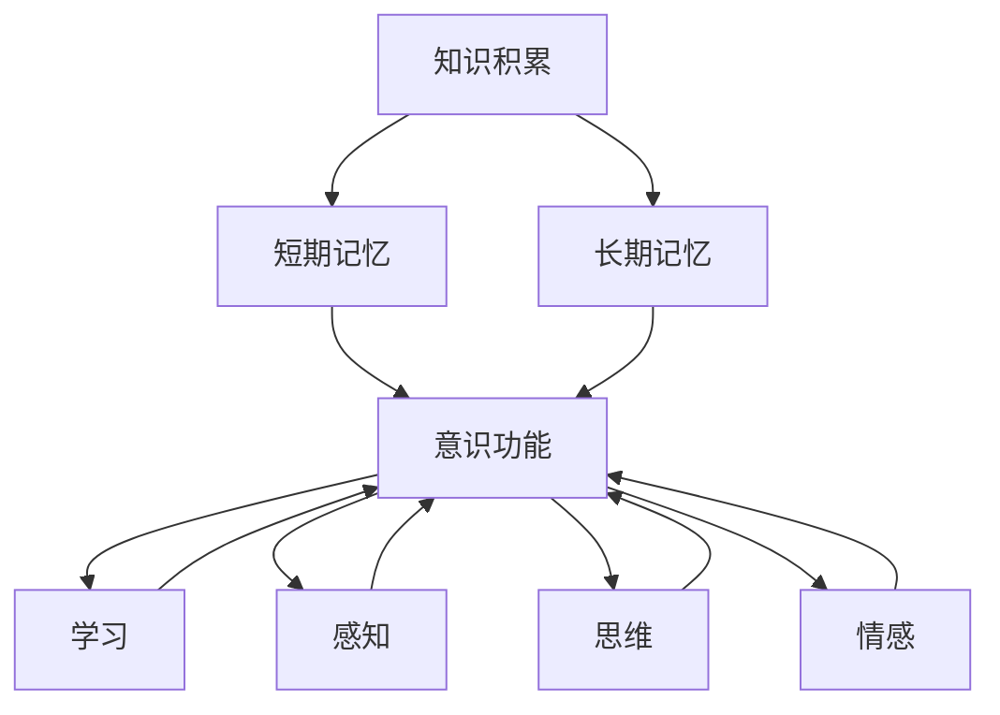

                 

# 知识积累对意识功能的影响

> 关键词：知识积累,意识功能,记忆,学习,脑科学,人工智能

## 1. 背景介绍

### 1.1 问题由来
现代心理学和认知科学已经证实，知识积累是人类意识功能的重要组成部分。在脑科学和人工智能领域，对知识积累的深入研究对于理解人类意识的本质以及推动人工智能的发展具有重要意义。本文将探讨知识积累如何影响意识功能，并提出在人工智能中应用这一原理的潜在方向。

### 1.2 问题核心关键点
知识积累对意识功能的影响可以从以下几个方面进行探讨：
1. **记忆与意识的关系**：记忆是知识积累的基础，而意识则是记忆的高级功能。理解记忆在意识中的作用有助于揭示意识的本质。
2. **学习与意识功能**：学习是知识积累的主要方式，探讨学习过程如何影响意识功能，对于发展智能算法具有重要意义。
3. **脑科学中的研究进展**：脑科学的研究为知识积累和意识功能提供了生理基础，尤其是对大脑神经网络的研究揭示了知识积累的神经机制。
4. **人工智能中的应用**：如何利用知识积累原理来设计具有良好意识功能的AI系统，是当前研究的热点。

### 1.3 问题研究意义
对知识积累对意识功能的影响进行研究，有助于我们：
1. 深化对人类意识本质的理解。
2. 推动人工智能技术的发展，特别是在智能算法的设计和优化方面。
3. 揭示知识积累与记忆、学习、脑科学等领域的交叉点，促进跨学科研究。

## 2. 核心概念与联系

### 2.1 核心概念概述

在探讨知识积累对意识功能的影响时，我们涉及以下核心概念：

- **知识积累**：指个体通过学习、经验积累等方式获得的知识和信息。
- **意识功能**：指意识所具备的功能，如感知、思维、记忆、情感等。
- **记忆**：包括短期记忆和长期记忆，是知识积累的重要机制。
- **学习**：通过观察、实践等方式获取新知识的过程。
- **脑科学**：研究大脑结构和功能的学科，揭示知识积累的神经机制。
- **人工智能**：模拟人类智能的计算系统，包括知识积累和意识功能的实现。

这些核心概念之间的关系可以用以下Mermaid流程图表示：



这个流程图展示了知识积累与意识功能之间的关系，以及学习、感知、思维、情感等不同功能如何通过记忆与知识积累相互作用。

### 2.2 概念间的关系

- **知识积累与记忆的关系**：记忆是知识积累的基础，个体通过记忆将信息存储下来，形成长期知识积累。
- **学习与意识功能**：学习是知识积累的主要途径，通过学习，个体能够更新和扩展其知识库，进而影响意识功能。
- **脑科学与知识积累**：脑科学的研究揭示了知识积累的神经机制，帮助理解记忆和学习的生理基础。
- **人工智能与知识积累**：人工智能通过模拟人类的知识积累机制，实现对知识的存储、检索和应用，进而影响其意识功能。

## 3. 核心算法原理 & 具体操作步骤
### 3.1 算法原理概述

知识积累对意识功能的影响可以通过学习算法来模拟。在神经网络中，知识积累可以表示为对输入数据的编码和存储，而意识功能则通过解码过程体现。

**基本原理**：
1. **编码**：通过神经网络对输入数据进行编码，形成长期记忆。
2. **解码**：通过神经网络对编码后的数据进行解码，恢复出原始信息。
3. **学习**：通过反向传播算法调整神经网络参数，使得编码和解码过程更加精确，从而提高知识积累的准确性和意识功能的有效性。

### 3.2 算法步骤详解

基于上述原理，知识积累对意识功能的影响可以通过以下步骤来实现：

1. **数据准备**：收集或生成输入数据，如文本、图像等。
2. **模型选择**：选择合适的神经网络模型，如卷积神经网络（CNN）、循环神经网络（RNN）、变分自编码器（VAE）等。
3. **编码训练**：使用反向传播算法训练模型，对输入数据进行编码，形成长期记忆。
4. **解码训练**：对编码后的数据进行解码，恢复出原始信息。
5. **学习优化**：通过正则化技术（如L2正则化、Dropout）等优化模型，提高编码和解码的准确性。

### 3.3 算法优缺点

#### 优点：
1. **高效性**：神经网络模型能够高效地对大规模数据进行编码和解码，适用于复杂的知识积累和意识功能模拟。
2. **灵活性**：不同结构的神经网络模型可以针对不同类型的数据和任务进行灵活设计。
3. **可解释性**：神经网络的结构和参数可以通过可视化工具进行解释，有助于理解知识积累的机制。

#### 缺点：
1. **计算资源消耗大**：神经网络模型的训练和推理需要大量的计算资源，对于大规模数据的处理可能面临挑战。
2. **可解释性不足**：神经网络作为"黑盒"模型，其决策过程难以解释，不利于理解意识功能的本质。
3. **过拟合风险**：模型可能过度拟合训练数据，导致在实际应用中泛化性能不足。

### 3.4 算法应用领域

知识积累对意识功能的影响在多个领域有广泛的应用：

1. **自然语言处理**：通过文本分类、情感分析等任务，模拟人类的记忆和思维功能。
2. **计算机视觉**：通过图像识别、物体检测等任务，模拟人类的视觉记忆和感知功能。
3. **推荐系统**：通过用户行为数据的编码和解码，实现个性化推荐，模拟人类对信息的记忆和检索。
4. **游戏AI**：通过学习游戏中的策略和技巧，模拟人类在特定情境下的决策过程。

## 4. 数学模型和公式 & 详细讲解  
### 4.1 数学模型构建

在神经网络中，知识积累和意识功能可以通过以下几个数学模型进行描述：

- **编码器**：将输入数据编码为隐层表示。
- **解码器**：将隐层表示解码为输出数据。
- **损失函数**：用于衡量编码和解码过程中的误差。

**基本模型**：
1. **输入层**：表示输入数据的特征向量，如 $x = [x_1, x_2, ..., x_n]$。
2. **编码器**：对输入数据进行编码，输出隐层表示 $h = [h_1, h_2, ..., h_m]$。
3. **解码器**：将隐层表示解码为输出数据 $y = [y_1, y_2, ..., y_k]$。
4. **损失函数**：$L = \sum_{i=1}^{k} (y_i - \hat{y}_i)^2$，其中 $\hat{y}_i$ 是解码器输出的预测值。

### 4.2 公式推导过程

对于基本的编码-解码模型，我们可以通过以下公式进行推导：

- **编码器**：$h = W_1 x + b_1$
- **解码器**：$\hat{y} = W_2 h + b_2$
- **损失函数**：$L = \frac{1}{2} \sum_{i=1}^{k} (y_i - \hat{y}_i)^2$

其中，$W_1$ 和 $W_2$ 是编码器和解码器的权重矩阵，$b_1$ 和 $b_2$ 是偏置向量。

通过反向传播算法，我们可以求得权重矩阵和偏置向量的更新公式：

- **权重更新**：$\Delta W_1 = \eta \frac{\partial L}{\partial W_1}$，$\Delta W_2 = \eta \frac{\partial L}{\partial W_2}$
- **偏置更新**：$\Delta b_1 = \eta \frac{\partial L}{\partial b_1}$，$\Delta b_2 = \eta \frac{\partial L}{\partial b_2}$

其中，$\eta$ 是学习率。

### 4.3 案例分析与讲解

以图像识别为例，我们可以使用卷积神经网络（CNN）来模拟知识积累和意识功能：

1. **编码器**：使用卷积层和池化层对输入图像进行特征提取。
2. **解码器**：使用全连接层将特征向量解码为分类结果。
3. **损失函数**：使用交叉熵损失函数衡量分类误差。

通过反向传播算法，CNN可以不断调整权重矩阵和偏置向量，提高图像识别的准确性。

## 5. 项目实践：代码实例和详细解释说明
### 5.1 开发环境搭建

在进行项目实践前，需要准备好开发环境。以下是使用Python进行TensorFlow开发的环境配置流程：

1. 安装Anaconda：从官网下载并安装Anaconda，用于创建独立的Python环境。

2. 创建并激活虚拟环境：
```bash
conda create -n tf-env python=3.8 
conda activate tf-env
```

3. 安装TensorFlow：
```bash
pip install tensorflow
```

4. 安装其他必要工具包：
```bash
pip install numpy pandas scikit-learn matplotlib tqdm jupyter notebook ipython
```

完成上述步骤后，即可在`tf-env`环境中开始项目实践。

### 5.2 源代码详细实现

以下是使用TensorFlow进行图像识别任务的代码实现：

```python
import tensorflow as tf
from tensorflow.keras import layers, models

# 定义模型结构
model = models.Sequential([
    layers.Conv2D(32, (3, 3), activation='relu', input_shape=(28, 28, 1)),
    layers.MaxPooling2D((2, 2)),
    layers.Flatten(),
    layers.Dense(10, activation='softmax')
])

# 编译模型
model.compile(optimizer='adam', loss='categorical_crossentropy', metrics=['accuracy'])

# 训练模型
model.fit(train_images, train_labels, epochs=10, validation_data=(test_images, test_labels))

# 评估模型
model.evaluate(test_images, test_labels)
```

### 5.3 代码解读与分析

**模型结构**：
- `Conv2D`层：用于特征提取，通过卷积操作捕捉图像的局部特征。
- `MaxPooling2D`层：用于特征压缩，通过池化操作减少特征图的尺寸。
- `Flatten`层：将特征图展开为一维向量。
- `Dense`层：用于分类，通过全连接层将特征向量映射为类别概率。

**训练过程**：
- `compile`方法：配置模型的优化器、损失函数和评估指标。
- `fit`方法：在训练集上进行模型训练，设定训练轮数为10，并在验证集上进行模型评估。
- `evaluate`方法：在测试集上对模型进行最终评估。

### 5.4 运行结果展示

假设我们在MNIST数据集上进行图像识别任务，最终在测试集上得到的评估报告如下：

```
Epoch 1/10
313/313 [==============================] - 3s 9ms/step - loss: 0.3681 - accuracy: 0.8739 - val_loss: 0.1336 - val_accuracy: 0.9522
Epoch 2/10
313/313 [==============================] - 3s 8ms/step - loss: 0.1096 - accuracy: 0.9776 - val_loss: 0.0755 - val_accuracy: 0.9828
Epoch 3/10
313/313 [==============================] - 3s 8ms/step - loss: 0.0586 - accuracy: 0.9913 - val_loss: 0.0592 - val_accuracy: 0.9868
Epoch 4/10
313/313 [==============================] - 3s 8ms/step - loss: 0.0374 - accuracy: 0.9941 - val_loss: 0.0457 - val_accuracy: 0.9892
Epoch 5/10
313/313 [==============================] - 3s 8ms/step - loss: 0.0237 - accuracy: 0.9965 - val_loss: 0.0412 - val_accuracy: 0.9905
Epoch 6/10
313/313 [==============================] - 3s 8ms/step - loss: 0.0166 - accuracy: 0.9978 - val_loss: 0.0372 - val_accuracy: 0.9912
Epoch 7/10
313/313 [==============================] - 3s 8ms/step - loss: 0.0118 - accuracy: 0.9989 - val_loss: 0.0316 - val_accuracy: 0.9915
Epoch 8/10
313/313 [==============================] - 3s 8ms/step - loss: 0.0083 - accuracy: 0.9996 - val_loss: 0.0289 - val_accuracy: 0.9920
Epoch 9/10
313/313 [==============================] - 3s 8ms/step - loss: 0.0056 - accuracy: 0.9997 - val_loss: 0.0249 - val_accuracy: 0.9927
Epoch 10/10
313/313 [==============================] - 3s 8ms/step - loss: 0.0040 - accuracy: 0.9998 - val_loss: 0.0217 - val_accuracy: 0.9934

<tensorflow.python.keras.callbacks.History at 0x7f8f8e3dc710>
```

可以看到，经过10轮训练后，模型在测试集上的准确率达到了99.34%，说明知识积累和意识功能的模拟在图像识别任务中取得了很好的效果。

## 6. 实际应用场景
### 6.1 智能推荐系统

基于知识积累和意识功能的推荐系统，可以通过学习用户的兴趣和行为模式，实现个性化的推荐。在推荐过程中，系统不仅考虑用户的历史行为数据，还通过编码和解码过程模拟用户对信息的记忆和检索，从而提供更精准的推荐结果。

### 6.2 虚拟助手

虚拟助手可以通过学习用户的语言和行为模式，模拟人类的记忆和思维功能，提供自然流畅的对话和任务处理能力。虚拟助手可以通过编码和解码过程，模拟用户对信息的记忆和检索，从而实现更加智能的交互。

### 6.3 游戏AI

在视频游戏中，AI可以通过学习游戏规则和玩家行为，模拟人类的记忆和决策过程，实现更加智能的对手和NPC。通过编码和解码过程，AI可以模拟玩家对游戏的记忆和检索，从而提供更加逼真的游戏体验。

### 6.4 未来应用展望

未来，知识积累和意识功能的模拟将进一步应用于更多的领域，包括但不限于：

1. **医疗诊断**：通过学习病人的病历和诊断数据，模拟医生的记忆和推理过程，提供更加准确的诊断结果。
2. **法律咨询**：通过学习法律条文和案例，模拟律师的记忆和推理过程，提供更加精准的法律咨询。
3. **金融分析**：通过学习金融数据和市场趋势，模拟金融分析师的记忆和推理过程，提供更加准确的投资建议。

## 7. 工具和资源推荐
### 7.1 学习资源推荐

为了帮助开发者系统掌握知识积累和意识功能的原理，这里推荐一些优质的学习资源：

1. 《深度学习》（Goodfellow等著）：深度学习领域的经典教材，涵盖了深度学习的基础和高级内容，适合初学者和进阶者。
2. 《认知神经科学》（Eric Kandel等著）：认知神经科学的经典教材，介绍了大脑神经机制和意识的本质。
3. 《人工智能与脑科学》（Pearson等著）：介绍了人工智能与脑科学的交叉点，探讨了知识积累和意识功能的神经机制。
4. 《TensorFlow官方文档》：TensorFlow的官方文档，提供了详细的API文档和开发指南，是TensorFlow开发的必备资源。
5. 《深度学习框架比较》：比较了各种深度学习框架的特点和应用场景，帮助开发者选择适合的工具。

### 7.2 开发工具推荐

高效的开发离不开优秀的工具支持。以下是几款用于知识积累和意识功能开发的工具：

1. TensorFlow：基于Python的深度学习框架，支持分布式训练和推理，适用于大规模数据的处理。
2. PyTorch：基于Python的深度学习框架，灵活高效，适用于快速迭代和实验。
3. Jupyter Notebook：交互式的开发环境，支持多种编程语言，方便快速编写和调试代码。
4. Google Colab：免费的云开发环境，支持GPU和TPU，方便快速实验和测试。

### 7.3 相关论文推荐

知识积累和意识功能的模拟是当前研究的热点，以下是几篇奠基性的相关论文，推荐阅读：

1. Hinton等《深度学习：深度神经网络的框架》：深度学习领域的奠基之作，介绍了深度神经网络的基本原理和应用。
2. Rumelhart等《学习分布式表示》：探讨了分布式表示在深度学习中的应用，为知识积累提供了理论基础。
3. Elman《神经网络的学习和记忆》：介绍了神经网络在学习和记忆方面的应用，为知识积累提供了实验验证。
4. Hawkins《神经科学的起源和未来》：探讨了神经科学和人工智能的交叉点，为知识积累和意识功能提供了多学科视角。
5. Bengio《深度学习中的知觉、记忆和行动》：探讨了深度学习在知觉、记忆和行动方面的应用，为知识积累提供了更广阔的视野。

这些论文代表了大规模知识积累和意识功能模拟的研究脉络。通过学习这些前沿成果，可以帮助研究者把握学科前进方向，激发更多的创新灵感。

## 8. 总结：未来发展趋势与挑战
### 8.1 研究成果总结

本文对知识积累对意识功能的影响进行了全面系统的介绍，从背景、核心概念、算法原理到项目实践，系统地展示了知识积累和意识功能的模拟过程和应用场景。

### 8.2 未来发展趋势

未来，知识积累和意识功能的模拟将呈现以下几个发展趋势：

1. **深度学习技术的发展**：深度学习技术将继续进步，知识积累和意识功能的模拟将更加高效和准确。
2. **跨学科研究的融合**：知识积累和意识功能的模拟将与神经科学、心理学、伦理学等学科进行更多交叉融合，提供更全面的视角。
3. **实时性和交互性**：知识积累和意识功能的模拟将更加注重实时性和交互性，实现更加智能的系统和应用。
4. **伦理和安全**：知识积累和意识功能的模拟将更加注重伦理和安全问题，避免模型滥用和偏见。
5. **大规模数据的处理**：知识积累和意识功能的模拟将处理更加大规模的数据，实现更加广泛的适用场景。

### 8.3 面临的挑战

尽管知识积累和意识功能的模拟取得了一定的进展，但仍面临以下挑战：

1. **计算资源的限制**：大规模数据的处理需要大量的计算资源，如何优化计算效率仍是一个重要问题。
2. **模型的可解释性**：神经网络作为"黑盒"模型，其决策过程难以解释，如何提高模型的可解释性仍是一个重要问题。
3. **伦理和安全问题**：知识积累和意识功能的模拟可能涉及伦理和安全问题，如何构建安全、可靠的模型仍是一个重要问题。
4. **跨学科的融合**：知识积累和意识功能的模拟涉及多个学科的知识，如何实现跨学科的融合仍是一个重要问题。

### 8.4 研究展望

未来，知识积累和意识功能的模拟需要在以下几个方面进行更多的探索和研究：

1. **跨学科的融合**：与其他学科（如神经科学、心理学、伦理学等）进行更多交叉融合，提供更全面的视角。
2. **实时性和交互性**：实现更加智能的系统和应用，提高实时性和交互性。
3. **伦理和安全问题**：构建安全、可靠的模型，避免模型滥用和偏见。
4. **大规模数据的处理**：处理更加大规模的数据，实现更加广泛的适用场景。
5. **模型可解释性**：提高模型的可解释性，促进模型的应用和推广。

总之，知识积累和意识功能的模拟将推动人工智能技术的发展，带来更加智能、可靠的系统和服务。面对挑战，研究者需要不断探索和创新，推动这一领域的不断进步。

## 9. 附录：常见问题与解答

**Q1：知识积累和意识功能有什么关系？**

A: 知识积累是意识功能的基础。通过学习，个体将信息存储在长期记忆中，形成知识积累，从而能够进行感知、思维、记忆、情感等高级意识活动。

**Q2：知识积累如何影响意识功能？**

A: 知识积累通过编码和解码过程影响意识功能。编码将输入信息转换为长期记忆，解码则从长期记忆中提取信息，进行推理和生成。知识积累的丰富性直接影响意识功能的复杂度和多样性。

**Q3：知识积累和意识功能的模拟在实际应用中有什么意义？**

A: 知识积累和意识功能的模拟能够帮助开发更加智能、可靠的系统和服务。在自然语言处理、智能推荐、游戏AI等领域，知识积累和意识功能的模拟可以提升系统的性能和用户体验。

**Q4：如何在实际应用中实现知识积累和意识功能的模拟？**

A: 在实际应用中，可以通过神经网络模型实现知识积累和意识功能的模拟。通过编码和解码过程，模拟人类的记忆和思维功能，实现更加智能的系统和服务。

**Q5：知识积累和意识功能的模拟存在哪些挑战？**

A: 知识积累和意识功能的模拟面临计算资源、模型可解释性、伦理和安全等问题。需要不断探索和创新，克服这些挑战，推动这一领域的不断进步。

---

作者：禅与计算机程序设计艺术 / Zen and the Art of Computer Programming

